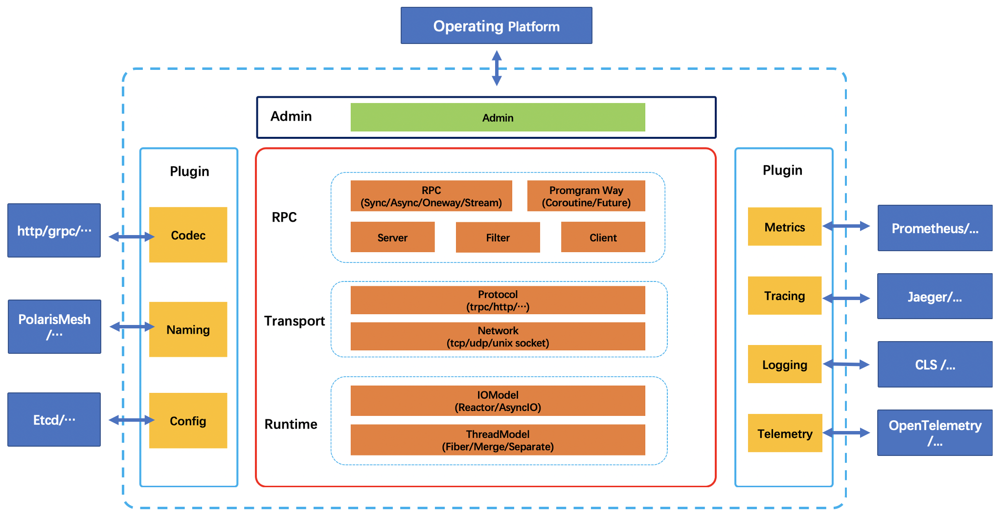
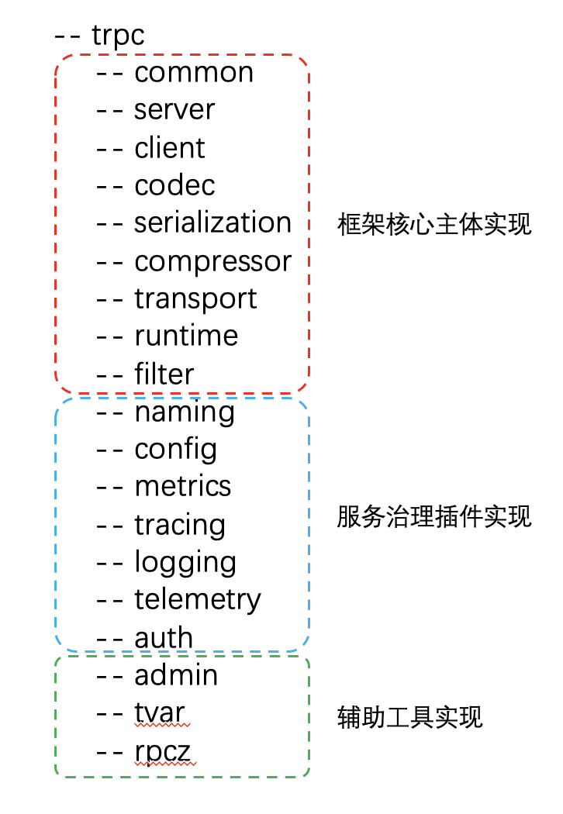
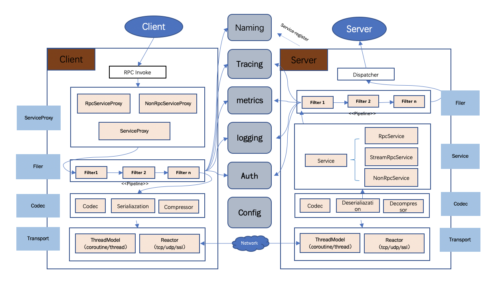
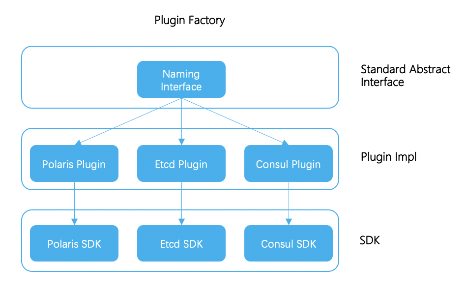
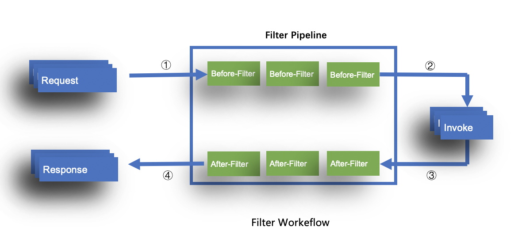

[中文](../zh/architecture_design.md)

# Overview

This article mainly introduces the specific architecture design of tRPC-Cpp, which is written based on the framework v1.0.0.

The main content is divided into two parts:

- Introduce the overall architecture design and code directory structure of tRPC-Cpp, so that everyone can have a general understanding;
- Introduce the server and client workflow of tRPC-Cpp, so that everyone can understand the working principle of server and client;
- Introduce the pluggable design of tRPC-Cpp, so that everyone can understand the specific implementation mechanism of plugin;

# Architecture design

The overall architecture of tRPC-Cpp is designed as follows:

The overall architecture consists of two parts: "**framework core**" and "**plugins**". As shown in the figure above, the dotted box is tRPC. The red solid line box in the middle is the framework core, and the blue box is the plugin part.

The framework core can be divided into three layers:

- **Runtime**: It consists of thread model and io model, responsible for scheduling of framework cpu tasks and io operations. thread model currently supports: ordinary thread model (io/handle separated or merged thread model), M:N coroutine model (fiber thread model). io model currently supports: reactor model for network IO and asyncIO model for disk io(based on io-uring, currently only supported in the merged thread model);

- **Transport**: Responsible for data transmission and protocol encoding and decoding. The framework currently supports tcp/udp/unix-socket and uses the tRPC protocol to carry RPC messages, and also supports other protocol through codec plugin;

- **RPC**: Encapsulates services and service proxy entities, provides RPC interfaces and support synchronous, asynchronous, one-way, and streaming calls;

In addition, the framework also provides an admin management interface, which is convenient for users or operating platforms to manage services. The management interface includes functions such as updating configuration, viewing version, modifying log level, viewing framework runtime information, and the framework also supports user  interface to meet the customized needs.

The main directory structure of the tRPC-Cpp framework is designed as follows:

It is mainly composed of three parts: "**Framework Core Implementation**", "**Service Governance Plugin Implementation**", "**Auxiliary Tool Implementation**".

The implementation of framework core mainly includes the following modules:

- server: provides a service implementation that supports multi-service, registration, unregistration, smooth exit, etc.;
- client: provides a concurrent and safe general-purpose client implementation, which is mainly responsible for operations related to rpc calls, service discovery, load balancing, circuit breaker, encoding and decoding, and custom filter. All parts support plugin extensions;
- codec: provides codec-related interfaces, allowing the framework to expand multi protocols, serialization methods, data compression methods, etc.;
- transport: provides the ability of network transmission, supports transmission methods such as tcp/udp/ssl/unix-socket;
- runtime: provides the implementation of the framework runtime environment, encapsulates the thread model and io model, supports m:n coroutine (fiber) model, io and handle separation, and model thread model;
- filter: provides the definition of a custom filter, implements the extension capability, such as tracing, metrics, logreplay, etc.;

The service governance plugin implementation mainly includes the following modules:

- naming: provides service registration (registry), service discovery (selector), load balancing (loadbalance), circuit breaker (circuitbreaker) and other capability packaging, used to connect to various name service systems;
- config: provides an interface related to configuration reading, supports reading local configuration files, remote configuration center configuration, etc., allows plugin extensions to support configuration files in different formats, different configuration centers, and supports reload and watch configuration updates;
- metrics: Provides the ability to collect and report monitoring data, supports common single-dimensional reporting, such as counter, gauge, etc., and also supports multi-dimensional reporting, allowing different monitoring systems to be connected by extending the Sink interface;
- logging: provides a general log collection interface, allowing the log implementation to be extended through plugins, allowing the log to be output to the remote;
- tracing: provides distributed tracing capabilities, allowing reporting to the tracing system through plugins;

## Interaction process

The overall interaction process of tRPC-Cpp is as follows:

## Server

### Start up

The server startup process roughly includes the following processes:

1. Instantiate and start the business subclass inheriting `TrpcApp`;
2. Read the framework configuration file (specified by --config), the configuration here includes the configuration information of global, server, service, client, plugin, etc.;
     1. Read global configuration information, initialize and start the runtime environment of the framework, runtime includes threading model and network model, etc.;
     2. Read server/service, client configuration, initialize TrpcServer and TrpcClient;
     3. Read the plugin configuration to complete the initialization logic of various plugins;
3. Run the `Initilize` method of the `TrpcApp` business subclass to complete the initialization of the business code;
     1. Various initialization logics of the business itself;
     2. Call `RegisterService` to complete service registration and start monitoring network requests;
4. The service has started normally at this time, and then waits for the client to establish a connection request.

### Process request

The request processing generally includes the following processes:

1. The server transport calls the Acceptor to wait for the client to establish a connection;
2. The client initiates a connection establishment request, and the server transport Accept returns a tcp connection;
3. The server transport determines to dispatch the connection according to the current runtime environment (whether it is fiber runtime);
     1. If it is a fiber runtime, then select a fiber scheduling group, which will be processed by the Fiber Reactor on the specific fiber scheduling group;
     2. If not, then select an io thread to be handled by the Reactor of the specific io thread;
4. Start the logic of receiving packets. The server transport reads the request continuously according to the codec protocol, compression method, and serialization method. Each request will create a msg, which includes the ServerContext of the request, and requests the msg to be handed over to the upper service deal with;
5. The service will find the corresponding registered processing function according to the rpc name of the msg, and call the corresponding processing function;
6. Before calling the corresponding processing function, the filterchain must be executed first, and the end of the filterchain execution is the processing function of the rpc we registered;
7. Serialize, compress, encode and decode the result of the response, and then return the packet to the client. The return method is divided into synchronous and asynchronous;
     1. The synchronization method is that after the rpc processing function is executed, the result is directly processed and returned to the client, the default method;
     2. The asynchronous method is that after the rpc processing function is executed, the package is not returned to the client, but the business itself is asynchronously processed, and the package can be returned by actively calling the framework's return package;

### Exit

The service exit process generally includes the following processes:

1. Stop the monitoring and reading events of the server network connection;
2. Wait for all requests received by the server to be processed;
3. Close the server network connection;
4. Call the `Destroy` method of the `TrpcApp` business subclass to stop the dynamic resources created by the business (for example: started threads);
5. Stop the dynamic resources created by the plugins (for example: threads started inside the plugins);
6. Stop the framework runtime environment runtime;
7. Release the resources inside the runtime environment of the framework;
8. Release the internal resources of the framework operating environment TrpcServer;
9. Release the internal resources of the framework operating environment TrpcClient;
10. The program exits;

## Client

1. When sending a request, first assemble various call parameters;
2. Execute the pre-logic of client filter;
3. Find a set of ip:port lists corresponding to the called service name through the service discovery plugin;
4. Through the load balancing algorithm and circuit breaker policy, find a suitable ip:port;
5. Serialize, compress, and encode request data;
6. Then prepare to establish a connection to ip:port. At this time, it will first check whether there is a corresponding available connection in ClientTransport, and create it if not;
7. After obtaining the connection, start request data and wait for receiving the response (if it is connection multiplexing mode, multiple requests may be sent concurrently on the same connection, and the request response is associated through seqno);
8. Receive the reponse data, decode, decompress, and deserialize, and submit it to the upper layer for processing;
9. Execute the post-logic of client filter;

## Pluggable design

The pluggable architecture design of tRPC is based on "**plugin factory based on interface mechanism**" and "**filter based on AOP**".

### Plugin factory

The tRPC core framework adopts the idea of interface-based programming, by abstracting the framework functions into a series of plugins, registering them in the plugin factory. The tRPC framework is responsible for connecting these plugins to assemble complete functions. The plugin model can be divided into the following three parts:

1. Framework: the framework only defines the standard interface, without any plugin implementation, decoupled from the specific implementation;
2. Plugin implementation: the plugin can be realized by encapsulating the plugin according to the framework standard interface;
3. User: business developer only needs to use the plugins you need;

The plugin implementation of a typical framework connecting name service system is as follows:

### Filter

In order to make the framework more extensible, the framework supports the interceptor filter, which draws on the programming idea of java AOP.

The specific implementation method is to set the logic of buried points in the framework request processing process, and then insert a series of filters in the buried points to realize some business custom functions, such as metrics monitoring, log collection, tracing, custom logic such as overload protection and parameter preprocessing.

The workflow of the interceptor filter is as follows:

The ultimate purpose of the interceptor is to allow business logic and framework
Decoupling and allowing cohesive development of each. You can add or replace different plugin implementations through configuration without modifying the source code.
