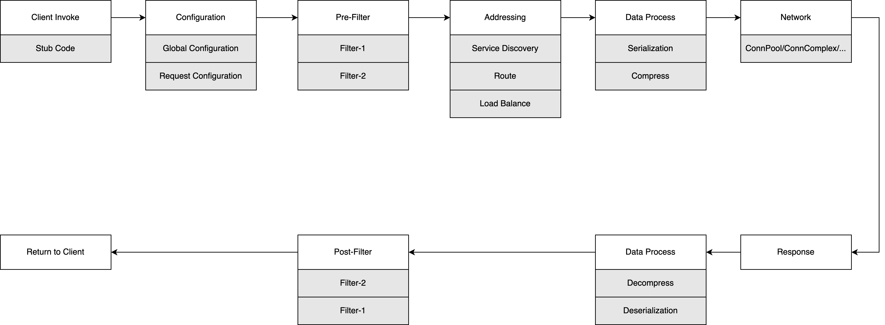

[中文版](../zh/client_guide.md)

# Overview

Based on tRPC-Cpp's client interface, users can access downstream services as if they were calling local functions, without having to worry about the underlying implementation details.

This article first outlines the entire process of service invocation to introduce the capabilities provided by the framework for users to access downstream services. It then elaborates on key aspects of client development, such as service invocation, configuration, addressing, filters, and protocol selection.

# Framework capabilities

## Runtime

`runtime` refers to the abstraction of the thread model in the tRPC-Cpp framework, which supports three different runtimes.

- fiber: similar to goroutines in the Go language, coroutines can be scheduled between different threads, meaning that `m` coroutines can run on `n` threads.
- separate: The I/O and handle are separated, with network packet sending/receiving and user business code processing running on different threads. Inter-thread communication is achieved through queues.
- merge: The I/O and handle are merged, with network packet sending/receiving and user business code processing both handled within the same thread. However, caution must be exercised when choosing this model, as any blocking calls within the business code can block the entire thread.

runtime selection and configuration refers to [How to choose and configure the runtime](runtime.md#how-to-choose-and-configure-the-runtime)

There are two common invocation methods:

- coroutine mode: the programming style is synchronous, corresponding to the fiber runtime.
- future/promise mode: the programming style is asynchronous, corresponding to separate runtime and merge runtime.

## Types of invocation

Based on the invocation protocol, there are several types of invocation:

- [trpc unary](./trpc_unary_client_guide.md)
- [trpc stream](./trpc_stream_client_guide.md)
- [http](./http_protocol_client.md)
- [https](./https_client_guide.md)
- [grpc unary](./grpc_unary_client_guide.md)
- [grpc stream](./grpc_stream_client_guide.md)
- [flatbuffers](./flatbuffers_client_guide.md)

## Invocation routine

The following diagram illustrates the complete client invocation routine. The first row, from left to right, represents the process of the client sending a request. The second row, from right to left, represents the process of the client handling the server response.



The framework provides a service invocation proxy (ServiceProxy) for each service. It encapsulates the interface functions (stub functions) for service invocation, including input parameters, output parameters, and error return codes. From the user's perspective, there is no difference between invoking the stub functions and invoking local functions.

The framework adopts the concept of interface-based programming, where it only provides standard interfaces, and the specific functionalities are implemented by plugins. As seen from the flowchart, the core process of service invocation includes filter execution, service addressing, protocol handling, and network I/O. Each of these components is implemented through plugins, and users need to select and configure the plugins to connect the entire invocation flow.

When users invoke GetProxy() to obtain a service invocation proxy, they can specify the information of the target service through two methods: configuring the framework's configuration file or setting the Option parameter.

The framework also supports users to develop their own plugins to customize the behavior of service invocation. Filters are a typical use case, for example, custom filters can be used to implement authentication and authorization for service invocation, monitoring and reporting of invocation quality, and so on.

Service addressing is a crucial aspect of the service invocation process, and the addressing plugin (selector) provides strategies for routing selection, load balancing, and circuit-breaking capabilities for service instances. It is an important part that requires special attention in client development.

# Development modes

Before starting client development, users need to determine their development mode, which can be divided into two types: proxy mode and pure client mode.

## Proxy mode

> (Server A) --proxy invoke 1--> (Server B) --proxy invoke 2--> (Server C)

In this case, the service functions as both a server and a client.

## Pure client mode

> (Client) --direct invoke--> (Server)

In this case, the service functions solely as a client.

## Difference

| development mode | init plugins manually | init fiber runtime manually | init queue report manually |
|------------------|-----------------------|-----------------------------|----------------------------|
| proxy mode       | no need | no need | no need |
| pure client mode | need    | need    | need    |

# Constraints

## Default size of rpc request packet

For example, in the tRPC protocol, the framework imposes a limit on the package size, with a default threshold of 10MB.

This limitation is at the service level, and users can override the default value by modifying the "max_packet_size" configuration option, as shown below.

```yaml
client:
  service:                                # The user can provide multiple services.
    - name: trpc.test.helloworld.Greeter  # The service name needs to be filled in according to the format provided here. The first field is default as "trpc", the second and third fields are the app and server configurations mentioned above, and the fourth field is the user-defined service name.
      max_packet_size: 10000000           # Request package size limitation.
```

### Idle connection timeout

The default connection timeout for the client is 50 seconds. If the caller does not send any data packets within 50 seconds, the connection will be disconnected. This limitation is at the service level, and you can override the default value by modifying the "idle_time" configuration option, as shown below.

```yaml
client:
  service:                                # The user can provide multiple services.
    - name: trpc.test.helloworld.Greeter  # The service name needs to be filled in according to the format provided here. The first field is default as "trpc", the second and third fields are the app and server configurations mentioned above, and the fourth field is the user-defined service name.
      idle_time: 50000                    # Idle connection timeout, in milliseconds.
```

### Connection complex and Connection pool

#### Connection complex

It depends on the design of the application layer protocol, such as the trpc protocol, which includes a request ID field in its header. In the case where the client has not received a response for the previous request, it can continue reusing the current connection to send the next request.

#### Connection pool

For application layer protocols that do not support connection reuse, such as the HTTP protocol, when sending a request, an idle connection is selected from the connection pool to be used for transmission.

#### Max connection number

| connection mode | max connection number |
|-----------------|-----------------------|
| connection complex | 1 |
| connection pool  | 64 |

The maximum number of connections is specific to the connection pool mode, and users can override the default value by modifying the "max_conn_num" configuration option, as shown below.

```yaml
client:
  service:                                # The user can provide multiple services.
    - name: trpc.test.helloworld.Greeter  # The service name needs to be filled in according to the format provided here. The first field is default as "trpc", the second and third fields are the app and server configurations mentioned above, and the fourth field is the user-defined service name.
      max_conn_num: 64                    # The maximum number of connections in the connection pool mode. Do not modify it easily when using connection reuse mode.
```

### Key data structures

| data structure | effect | note |
|----------------|--------|------|
| TrpcClient | to get ServiceProxy | Globally unique, obtained using the trpc::GetTrpcClient() interface |
| ServiceProxy  | proxy for calling downstream | one downstream service corresponds to one instance, which is thread-safe, do not obtain a new instance for each call |
| ClientContext | context for calling downstream | create a new instance for each call and do not reuse it |

Frequently Asked Questions (FAQs):

- Creating a TrpcClient instance for each call leads to resource release issues when the TrpcClient exits. Please avoid this approach and use trpc::TrpcClient() globally to obtain the instance.
- Creating a ServiceProxy instance for each call results in performance degradation when there are a large number of service proxies, as frequent map lookups are required. It is recommended to save the ServiceProxy and avoid calling GetProxy every time.
- When making downstream calls, avoid reusing the ClientContext. The ClientContext is stateful and should not be reused. Use a new ClientContext for each call.

# Client development

Below are the steps for client development using the trpc protocol as an example.

## Obtain IDL file

Some protocols require an IDL (Interface Definition Language) file for interoperation. For example, the trpc protocol relies on protobuf (pb) files, so obtaining the IDL file is necessary.

## Determine addressing method

Retrieve the addressing method from the callee service to resolve and obtain the server's IP and port for initiating the request.

There are currently three supported addressing methods.

### MeshPolaris

The callee service provides the following information: namespace, env, and service. These can be set for the ServiceProxy either through configuration files or programmatically.

### Direct

Directly obtain the IP and port of the callee service and set them for the ServiceProxy through configuration files or programmatically.

### Domain

The callee service provides the domain name and port, which can be set for the ServiceProxy through configuration files or programmatically.

## Configure callee

### By framework configuration

```yaml
client: # client configuration
  service:
    - name: trpc.test.helloworld.client            # The ServiceProxy is configured with a unique identifier, and the framework searches for the corresponding configuration in the configuration file based on the name
      target: 127.0.0.1:80                         # Name of callee
      namespace: Development                       # The namespace to which the service routing name belongs
      protocol: trpc                               # Protocol
      timeout: 1000                                # Request timeout，in milliseconds
      network: tcp                                 # Network type
      conn_type: long                              # Connection type, long/short
      selector_name: direct                        # The name service used for route selection, which is "direct" when using direct connection.
```

### By Code

```cpp
// Create and set options.
::trpc::ServiceProxyOption option;

// Set options.
option.name = "trpc.test.helloworld.Greeter";
option.codec_name = "trpc";
option.callee_name = "trpc.test.helloworld.Greeter";
option.caller_name = "trpc.test.helloworld.hello_future_client";
option.selector_name = "direct";
option.target = "127.0.0.1:80";

// Create proxy by options.
auto proxy = ::trpc::GetTrpcClient()->GetProxy<::trpc::test::helloworld::GreeterServiceProxy>(option.name, option);
```

### By function

By specifying through a callback function, it combines the advantages of both framework configuration and code specification. Fixed plaintext information can be solidified in the configuration file, while sensitive and dynamic information, such as database account passwords, can be set through callback functions.

```cpp
auto func = [](ServiceProxyOption* option) {
  option->redis_conf.user_name = "test";
  option->redis_conf.password = "123456";
};

// Building upon the framework configuration, it further invokes the user's callback function to supplement the ServiceProxyOption settings. This approach combines the advantages of both framework configuration and code specification.
auto proxy = ::trpc::GetTrpcClient()->GetProxy<::trpc::test::helloworld::GreeterServiceProxy>("trpc.test.helloworld.Greeter", func);
```

## Framework configuration

Refers to [framework configuration](framework_config_lite.md)

## Invoke backend service

### Init

Only in **pure client-side invocation mode**, users need to obtain the configuration file and initialize the relevant parameters themselves. To obtain the `TrpcClient` by `trpc::GetTrpcClient()` interface, the code is as follows:

```cpp
int main(int argc, char** argv) {
  google::ParseCommandLineFlags(&argc, &argv, true);

  // Using the fiber client requires a configuration file and the correct fiber environment configuration (coroutine enable: true, and a fiber thread model configuration).
  int ret = ::trpc::TrpcConfig::GetInstance()->Init(FLAGS_config);
  assert(ret == 0 && "fiber client need config and need valid fiber config");

  // The Run function is the callback function for the business logic. It runs the business logic and includes the logic to obtain the ServiceProxy object.
  return ::trpc::RunInTrpcRuntime([]() { return Run(); });
}
```

### Obtain ServiceProxy

- **Proxy mode**

  ```cpp
  int RouteServer::Initialize() {
    std::string service_name("trpc.");
    service_name += ::trpc::TrpcConfig::GetInstance()->GetServerConfig().app;
    service_name += ".";
    service_name += ::trpc::TrpcConfig::GetInstance()->GetServerConfig().server;
    service_name += ".Forward";
  
    TRPC_LOG_INFO("service name:" << service_name);
    RegisterService(service_name, std::make_shared<ForwardServiceImpl>());
  
    // trpc::test::helloworld::GreeterServiceProxy are defined by the protobuf files of the called service.
    // "trpc.test.helloworld.Greeter" resides in configuration file.
    auto proxy = ::trpc::GetTrpcClient()->GetProxy<::trpc::test::helloworld::GreeterServiceProxy>(
        "trpc.test.helloworld.Greeter");
  
    return 0;
  }
  ```

- **Pure client mode**

  ```cpp
  int Run() {
    trpc::ServiceProxyOption option;
  
    // proxy configuration.
    option.name = FLAGS_target;
    option.codec_name = "trpc";
    option.network = "tcp";
    option.conn_type = "long";
    option.timeout = 1000;
    option.selector_name = "direct";
    option.target = FLAGS_addr;
  
    auto prx = trpc::GetTrpcClient()->GetProxy<::trpc::test::route::ForwardServiceProxy>(FLAGS_target, option);
    // Ignore other logic.
  }
  ```

### Trigger rpc invoke

- **Fiber invoke synchronously**

  ```cpp
  trpc::Status status = proxy->SayHello(client_context, route_request, &route_reply);
  ```

- **Future invoke asynchronously**

  ```cpp
    auto fut =
        proxy->AsyncSayHello(client_ctx, hello_req)
            .Then([client_ctx, context](::trpc::Future<::trpc::test::helloworld::HelloReply>&& fut) mutable {
              ::trpc::Status status;
              ::trpc::test::routeserver::RouteReply reply;
  
              if (fut.IsReady()) {
                reply.set_msg(fmt::format("{}  {}", fut.GetValue0().msg(), "Nice to meet you."));
  
                // Handle attachment data.
                ::trpc::NoncontiguousBuffer rsp_atta = client_ctx->GetResponseAttachment();
                context->SetResponseAttachment(std::move(rsp_atta));
              } else {
                std::string exception_msg = fut.GetException().what();
                status.SetErrorMessage(exception_msg);
                status.SetFuncRetCode(kErrorCodeFuture);
                TRPC_FMT_ERROR("future route service failed: {}", exception_msg);
                reply.set_msg(exception_msg);
              }
  
              context->SendUnaryResponse(status, reply);
              return ::trpc::MakeReadyFuture<>();
            });
  ```
