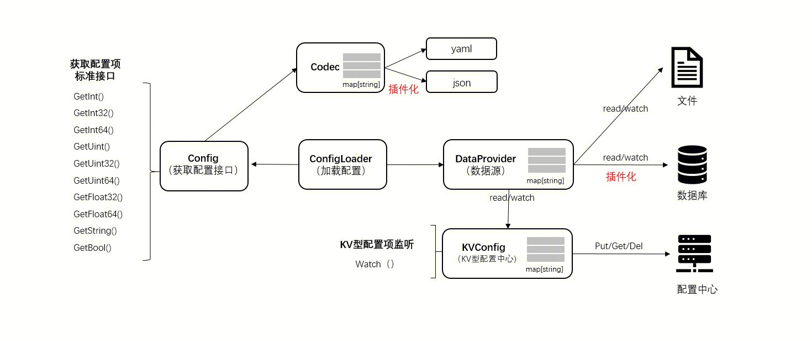

[中文](../zh/custom_config.md)

[TOC]

# Overview

The tRPC-Cpp framework configuration system provides a default key-value (KV) configuration plugin (DefaultConfig) to meet most configuration management needs. To allow developers to handle configuration data more flexibly, the configuration system adopts a plugin-based design, allowing developers to implement custom data source Provider plugins and encoder/decoder Codec plugins based on the DefaultConfig plugin.

The design architecture of the configuration system is shown in the following figure:

-  `Provider` Data Source Plugin: Responsible for reading raw configuration data from different types of data sources (such as files, databases).
-  `Codec` Encoder/Decoder Plugin: Responsible for decoding raw configuration data into key-value pairs.
-  `DefaultConfig` Configuration Plugin: Provides a unified interface for accessing decoded configuration data.

Data-driven process:
1. The user calls the Load function.
2. The `Load` function reads raw configuration data from the specified `Provider` plugin.
3. The `Load` function passes the raw configuration data to the specified `Codec` plugin for decoding.
4. Decoded configuration data is stored in the `DefaultConfig` configuration plugin for user access.

tRPC-Cpp configuration system feature overview:
1. **Provide default loader Load and default KV configuration plugin (DefaultConfig)**: Users can call the `Load` function to load the configuration file according to the specified data source path, data source name, and decoder. The Load function returns a `DefaultConfigPtr`, through which users can access configuration data.
2. **Built-in data source plugins**: The tRPC-Cpp framework provides the `LocalFileProvider` data source plugin by default, which supports reading configuration files from the local file system. Plugin developers can implement the `trpc::config::Provider` interface to create custom data source plugins.
3. **Built-in codec plugins**: The tRPC-Cpp framework provides YAML, JSON, and TOML codec plugins by default. Plugin developers can implement the `trpc::config::Codec` interface to create custom codec plugins.

Users can use the data source plugins and codec plugins provided by the `tRPC-Cpp` framework by default or develop custom plugins as needed.

This document will guide developers on how to develop and register custom data source `Provider` plugins and `Codec` plugins.


## 2. Develop Custom Data Source Provider Plugin

To implement a custom data source Provider plugin, you need to complete the following steps:

### 2.1 Implement the Provider Base Class Interface

First, plugin developers need to create a class that inherits from the `trpc::config::Provider` interface and implement the following methods in the interface:
| Method Name | Return Type | Description |
|-------------|-------------|-------------|
| std::string Name() const | std::string | Returns the name of the data source plugin. |
| std::string Read(const std::string&) | std::string | Reads the configuration file content from the data source. |
| void Watch(trpc::config::ProviderCallback callback) | void | Listens for changes in the configuration files in the data source and calls the callback function when changes occur. |Here is an example of a custom data source `Provider` plugin:

**custom_provider.h**

```cpp
#pragma once

#include <string>
#include <mutex>

#include "trpc/config/provider.h"

namespace trpc::config::custom_provider {

class CustomProvider : public trpc::config::Provider {
 public:
  CustomProvider(); // Constructor, you can add parameters as needed

  std::string Name() const override;

  std::string Read(const std::string& name) override;

  void Watch(trpc::config::ProviderCallback callback) override;

 private:
  std::string name_; // // Name of the data source plugin
  std::mutex callback_mutex_; // A mutex for protecting the list of callback functions
  std::vector<trpc::config::ProviderCallback> callbacks_; // List of callback functions
};

}  // namespace trpc::config::custom_provider
```

**custom_provider.cc**

```cpp 
#include "custom_provider.h"

namespace trpc::config::custom_provider {

CustomProvider::CustomProvider() {
  // Initialize operations such as connecting to remote servers, reading configuration files, and so on
}

std::string CustomProvider::Name() const {
  return name_;
}

std::string CustomProvider::Read(const std::string& name) {
  // Reads the configuration file contents from the data source and returns them
  // Here, it can be implemented according to the actual situation, such as getting data from the remote server, querying from the database, etc
}

void CustomProvider::Watch(trpc::config::ProviderCallback callback) {
  std::unique_lock callback_lock(callback_mutex_);
  callbacks_.emplace_back(callback);
  // Listen for changes to configuration files in the data source
  // When the configuration file changes, all the callbacks in the callback list are called
}

}  // namespace trpc::config::custom_provider
```
In this example, the `CustomProvider` class inherits from the `trpc::config::Provider` interface and implements the `Name()`, `Read()`, and `Watch()` methods. Developers can modify this example according to their actual needs to implement support for custom data sources.

### 2.2 Register Custom Provider Plugin

After creating the custom `Provider` plugin, you also need to provide an initialization interface, such as `Init()`. It is recommended to define the interface in `custom_provider_api.h` and implement it in `custom_provider_api.cc`. For example:

**custom_provider_api.h**

```cpp
#pragma once

namespace trpc::config::custom_provider {

int Init();

}  // namespace trpc::config::custom_provider
```

**custom_provider_api.cc**

```cpp
#include "trpc/common/trpc_plugin.h"
#include "custom_provider_api.h"
#include "custom_provider.h"

namespace trpc::config::custom_provider {

int Init() {
  auto custom_provider = MakeRefCounted<CustomProvider>();
  TrpcPlugin::GetInstance()->RegisterConfigProvider(custom_provider);
  return 0;
}

}  // namespace trpc::config::custom_provider
```

## 3. Develop Custom Codec Plugin

To implement a custom encoder/decoder Codec plugin, you need to complete the following steps:

### 3.1 Implement the Codec Base Class Interface

First, plugin developers need to create a class that inherits from the `trpc::config::Codec` interface and implement the following methods in the interface:

|方法名称 |返回类型 |描述 |
|:--|
|std::string Name() const |std::string |Returns the name of the codec plugin |
|std::unordered_map<std::string, std::string> Decode(const std::string& content) |std::unordered_map<std::string, std::string> |Decode the contents of the configuration file read from the data source into a std::unordered_map of key/value pairs  |
Here's an example of a custom Codec plugin：
**custom_codec.h**

```cpp 
#pragma once

#include <string>
#include <unordered_map>

#include "trpc/config/codec.h"

namespace trpc::config::custom_codec {

class CustomCodec : public trpc::config::Codec {
 public:
  CustomCodec() {
    // Constructor to add arguments as needed
    // Initialize actions like loading decoder libraries etc
  }

  std::string Name() const override {
    return name_;
  }

  std::unordered_map<std::string, std::string> Decode(const std::string& content) override {
    // Decode the config file from the data source into a std::unordered_map of key/value pairs
    // This can be implemented according to the actual situation, such as calling third-party libraries for decoding, etc
  }

 private:
  std::string name_; // codec plugin name
};

}  // namespace trpc::config::custom_codec
```

**custom_codec_api.cc**

```cpp 
#include "trpc/common/trpc_plugin.h"
#include "custom_codec_api.h"
#include "custom_codec.h"

namespace trpc::config::custom_codec {

int Init() {
  auto custom_codec = MakeRefCounted<CustomCodec>();
  TrpcPlugin::GetInstance()->RegisterConfigCodec(custom_codec);
  return 0;
}

}  // namespace trpc::config::custom_codec
```
In the above example, `CustomCodec` is the implemented custom encoder/decoder plugin class. Users need to explicitly call the Init() function to complete the plugin registration.

### 3.2 Register Codec Plugin

After creating the custom `Codec` plugin, plugin developers need to provide an initialization interface, such as `Init()`. It is recommended to define the interface in `custom_codec_api.h` and implement it in `custom_codec_api.cc`. For example:

**custom_codec_api.h**

```cpp 
#pragma once

namespace trpc::config::custom_codec {

int Init();

}  // namespace trpc::config::custom_codec
```

**custom_codec_api.cc**

```cpp
#include "trpc/common/trpc_plugin.h"
#include "custom_codec_api.h"
#include "custom_codec.h"

namespace trpc::config::custom_codec {

int Init() {
  auto custom_codec = MakeRefCounted<CustomCodec>();
  TrpcPlugin::GetInstance()->RegisterConfigCodec(custom_codec);
  return 0;
}

}  // namespace trpc::config::custom_codec
```

## 4. User Usage of Custom Plugins

After developing and registering custom data source `Provider` plugins and encoder/decoder `Codec` plugins, users need to call the corresponding Init() function to complete the plugin registration after the framework initialization is complete. Users can specify the use of custom plugins when calling the `trpc::config::Load` function.
|参数名称 |类型 |描述 |
|:--|
|path |std::string |The path of the configuration file in the data source. |
|WithCodec |LoadOptions |The decoder used. Users need to specify the decoder name through the trpc::config::WithCodec function, such as "custom_codec". |
|WithProvider |LoadOptions |Data source name. Users need to specify the data source name through the trpc::config::WithProvider function, such as "custom_provider". |
For example, users can use the following code to load a configuration file in a custom format:

```cpp
#include "custom_provider_api.h"
#include "custom_codec_api.h"

// Initialize the custom plugin
trpc::config::custom_provider::Init();
trpc::config::custom_codec::Init();

// Load the config file with the custom plugin
DefaultConfigPtr config = trpc::config::Load("./test_load.custom", trpc::config::WithCodec("custom_codec"), trpc::config::WithProvider("custom_provider"));

// Get configuration
int32 value = config->GetInt32("integer", 0);
std::string str = config->GetString("string", "");
```

In this example, the user specifies the configuration file path as `./test_load.custom`, the decoder used as `custom_codec`, and the data source name as `custom_provider`. The `Load` function will return a `DefaultConfigPtr`, through which users can access the configuration data.
