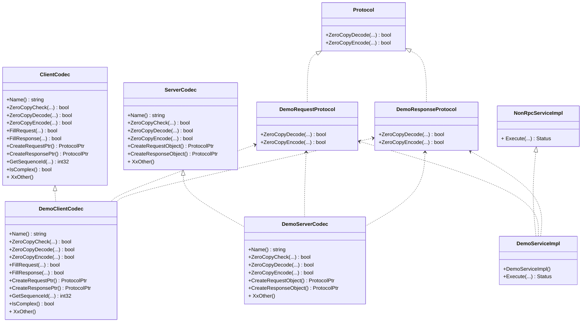

[中文](../zh/custom_protocol.md)


# Overview

This article introduces how to develop custom protocol based on tRPC-Cpp (referred to as tRPC below). Developers can
learn the following:

* How to quickly set up a service with custom protocol.
* FAQ.

# How to quickly set up a custom with protocol service

The tRPC framework supports extending new protocol, and we can support custom protocols by implementing the `codec`
plugin.

## Quick start

### Experience a service with custom protocol

Example: [thirdparty_protocol](../../examples/features/thirdparty_protocol)

Go to the main directory of the tRPC code repository and run the following command.

```shell
sh examples/features/thirdparty_protocol/run.sh
```

The content of the output from the client program is as follows:

``` text
response: hello world
```

### Basic steps

In the Client-Server model, a communication protocol (Protocol) needs to be determined first, which includes the format
of Request-Response messages and the way messages are packaged and unpacked.

Client-Server communicates based on the determined protocol, as follows:

1. The client packages the request object into a request message and sends it to the server via the network.
2. The server reads the request message from the network and unpacks it into a request object.
3. The unpacked request object is submitted to the service logic for processing and then replied with the corresponding
   response.
4. The server packages the response object into a response message and sends it to the client via the network.
5. The client reads the response message from the network and unpacks it into a response object.
6. The unpacked response object is submitted to the request initiator.

The tRPC abstracts the above process and encapsulates it into the `codec` plugin. We only need to implement the
corresponding interface to use a custom protocol to complete the above communication process.


We need to pay attention to the following aspects of the `codec` plugin:

1. Conversion of protocol messages: request -> RequestProtocol + response -> ResponseProtocol.
2. Encoding and decoding of protocol messages: Encode + Decode.
3. Parsing of protocol messages.

Process 1 is to convert the user's request and response data structure into a protocol object (Protocol) that the
framework can recognize.

Basic steps are as follows:

* Define protocol message objects and implement message encoding and decoding.
* Implement the `codec` plugin interface to convert and parse protocol messages, generally including `ClientCodec`
  and `ServerCodec`.
* Register the `codec` plugin.
* Develop a service to use the custom protocol.

### Implementing process

We will use sample code for demonstration purposes.

#### 1. Defining the protocol objects

The network message format for the custom protocol in the example is as follows:

```text
┌────────────────┬───────────────┬────────────────┐
│  Packet Size   │   Packet ID   │  Body          │
│                │               │                │
│  4 bytes       │   4 bytes     │  Variable size │
└────────────────┴───────────────┴────────────────┘
```

We need to define the `RequestProtocol` and `ResponseProtocol` objects and implement the `Encode/Decode` interfaces.

```cpp
// @file: demo_protocol.h/cc

class DemoRequestProtocol : public ::trpc::Protocol {
 public:
  bool ZeroCopyDecode(::trpc::NoncontiguousBuffer& buff) override;
  bool ZeroCopyEncode(::trpc::NoncontiguousBuffer& buff) override;

  bool GetRequestId(uint32_t& req_id) const override; 
  bool SetRequestId(uint32_t req_id) override; 
};

class DemoResponseProtocol : public ::trpc::Protocol {
 public:
  bool ZeroCopyDecode(::trpc::NoncontiguousBuffer& buff) override;
  bool ZeroCopyEncode(::trpc::NoncontiguousBuffer& buff) override;

  bool GetRequestId(uint32_t& req_id) const override;
  bool SetRequestId(uint32_t req_id) override;
};
```

*Decode* packs the message.

*Encode* unpacks the message.

Here, we would like to emphasize "RequestId". It can be used to identify different request and response messages. In
scenarios where the connection is reused, multiple request and response messages can be transmitted concurrently on the
same connection.
If the protocol does not have message identification, the `GetRequest/SetRequest` interfaces do not need to be
implemented, and the client will send request messages using a connection pool.

#### 2. Implementing the interfaces of codec

`ClientCodec` looks like as follows :

```cpp
// @file: demo_client_codec.h/cc

class DemoClientCodec : public ::trpc::ClientCodec {
 public:
  std::string Name() const override; 
  int ZeroCopyCheck(const ::trpc::ConnectionPtr& conn, ::trpc::NoncontiguousBuffer& in, std::deque<std::any>& out) override;
  bool ZeroCopyEncode(const ::trpc::ClientContextPtr& ctx, const ::trpc::ProtocolPtr& in, ::trpc::NoncontiguousBuffer& out) override;
  bool ZeroCopyDecode(const ::trpc::ClientContextPtr& ctx, std::any&& in, ::trpc::ProtocolPtr& out) override;
  bool FillRequest(const ::trpc::ClientContextPtr& ctx, const ::trpc::ProtocolPtr& in, void* body) override;
  bool FillResponse(const ::trpc::ClientContextPtr& ctx, const ::trpc::ProtocolPtr& in, void* body) override;
  ::trpc::ProtocolPtr CreateRequestPtr() override;
  ::trpc::ProtocolPtr CreateResponsePtr() override;
  uint32_t GetSequenceId(const ::trpc::ProtocolPtr& rsp) const override;
  bool IsComplex() const override; 
};
```

`ServerCodec` looks like as follows :

```cpp
// @file: demo_server_codec.h/cc

class DemoServerCodec : public ::trpc::ServerCodec {
 public:
  std::string Name() const override; 
  int ZeroCopyCheck(const ::trpc::ConnectionPtr& conn, ::trpc::NoncontiguousBuffer& in, std::deque<std::any>& out) override;
  bool ZeroCopyDecode(const ::trpc::ServerContextPtr& ctx, std::any&& in, ::trpc::ProtocolPtr& out) override;
  bool ZeroCopyEncode(const ::trpc::ServerContextPtr& ctx, ::trpc::ProtocolPtr& in, ::trpc::NoncontiguousBuffer& out) override;
  ::trpc::ProtocolPtr CreateRequestObject() override;
  ::trpc::ProtocolPtr CreateResponseObject() override;
};
```

*Name* returns the protocol name, such as "trpc", "http".
In the current example, the interface will return "thirdpary_protocol" when it was called. This value is generally set
to the value of the configuration item `protocol`.

```yaml
# ...
service:
  - name: trpc.test.helloworld.demo_service
    protocol: thirdpary_protocol
    network: tcp
    ip: 0.0.0.0
    port: 12347
# ...
```

*ZeroCopyCheck* cuts the message from the binary buffer |in| according to the protocol format and puts it into the queue
|out|. The data in this queue will be used as the input parameter of the `ZeroDecode` interface. This interface has
three types of return values:

* PacketChecker::PACKET_FULL, successfully parsed one or more messages.
* PacketChecker::PACKET_LESS, the message meets the requirements of the protocol format so far, but is not enough to
  parse a complete message. More message data is needed later.
* PacketChecker::PACKET_ERR, an error occurred, such as the message not meeting the requirements of the protocol format.
  Returning this error will cause the connection to close.

*ZeroCopyDecode* unpacks the parsed network message and then assembles it into the
corresponding `RequestProtocol/ResponseProtocol` object of the protocol. For example, setting the key-value pairs in the
request header and setting the message content.

*ZeroCopyEncode* packages the `RequestProtocol/ResponseProtocol` object into a network message.

*FillRequest* generally fills in the request header and request message content. Common message content serialization
type and compression type information will be set in this step. This interface is specific to `ClientCodec`.

*FillResponse* generally fills in the response header and response message content. Common message content serialization
type and compression type information will be set in this step. This interface is specific to `ClientCodec`.

*GetSequenceId* gets the message sequence number. In general, this value is consistent with the value of `RequestId`.
This interface is specific to `ClientCodec`.

*IsComplex* reports whether the protocol supports connection reuse. In the sample code, this interface returns true,
indicating that connection reuse is supported because the protocol has `PacketID` to identify different messages on the
same connection. This interface is specific to `ClientCodec`.

*CreateRequestPtr* creates and returns the `RequestProtocol` object. In the sample code, a `DemoRequestProtocolPtr`
object is returned.

*CreateResponsePtr* creates and returns the `ResponseProtocol` object. In the sample code, a `DemoResponseProtocolPtr`
object is returned.

*CreateRequestObject* creates and returns the `RequestProtocol` object. In the sample code, a `DemoRequestProtocolPtr`
object is returned.

*CreateResponseObject* creates and returns the `ResponseProtocol` object. In the sample code,
a `DemoResponseProtocolPtr` object is returned.

#### 3. Registering a plugin of codec

For example, on the server side, the custom protocol `codec` plugin can be registered in the `RegisterPlugins`
interface, so that the registered service can use this `codec` plugin.

```cpp
class DemoServer : public ::trpc::TrpcApp {
 public:
  int RegisterPlugins() override {
    ::trpc::TrpcPlugin::GetInstance()->RegisterServerCodec(std::make_shared<DemoServerCodec>());
    return 0;
  }
};
```

#### 4. Developing a service to use the custom protocol

The tRPC framework provides services to the outside world through the registration of services. Therefore, to use a
custom protocol, an instance of `ServiceImpl` needs to be developed to handle custom protocol requests and respond to
them.

The tRPC framework provides the `NonRpcServiceImpl` interface. We only need to do two things:

1. Implement the `Execute` interface and add the specific request processing process here.
2. Register the request route, which is generally done in the constructor.

```cpp
class DemoServiceImpl : public ::trpc::NonRpcServiceImpl {
 public:
  DemoServiceImpl() {
    auto handler = new ::trpc::NonRpcMethodHandler<DemoRequestProtocol, DemoResponseProtocol>(
        std::bind(&DemoServiceImpl::Execute, this, std::placeholders::_1, std::placeholders::_2,
                  std::placeholders::_3));
    AddNonRpcServiceMethod(
        new ::trpc::NonRpcServiceMethod(::trpc::kNonRpcName, ::trpc::MethodType::UNARY, handler));
  }

  ::trpc::Status Execute(const ::trpc::ServerContextPtr& context,
                         const DemoRequestProtocol* in,
                         DemoResponseProtocol* out) {
    TRPC_FMT_INFO("request data: {}", in->req_data);
    out->rsp_data = in->req_data;
    return ::trpc::kSuccStatus;
  }
};
```

Registering `DemoServiceImpl` is the same as registering a tRPC service. After registration is complete, a custom
protocol service can run successfully.

```cpp
class DemoServer : public ::trpc::TrpcApp {
 public:
  int RegisterPlugins() override {
    ::trpc::TrpcPlugin::GetInstance()->RegisterServerCodec(std::make_shared<DemoServerCodec>());
    return 0;
  }

  int Initialize() override {
    const auto& config = ::trpc::TrpcConfig::GetInstance()->GetServerConfig();
    // Set the service name, which must be the same as the value of the `server:service:name` configuration item
    // in the framework configuration file, otherwise the framework cannot receive requests normally
    std::string service_name = fmt::format("{}.{}.{}.{}", "trpc", config.app, config.server, "demo_service");

    TRPC_FMT_INFO("service name:{}", service_name);

    RegisterService(service_name, std::make_shared<DemoServiceImpl>());

    return 0;
  }

  void Destroy() override {}
};
```

The configuration of service is as follows:

```yaml
# @file: trpc_cpp.yaml
#...
server:
  app: test
  server: helloworld
  admin_port: 18888
  admin_ip: 0.0.0.0
  service:
    - name: trpc.test.helloworld.demo_service
      protocol: thirdpary_protocol
      network: tcp
      ip: 0.0.0.0
      port: 12347

#...
```

Accessing `DemoServiceImpl` using a tRPC client is also simple, just like accessing a tRPC service.

First, we need to register the `ClientCodec` plugin.

```cpp
::trpc::TrpcPlugin::GetInstance()->RegisterClientCodec(std::make_shared<DemoClientCodec>());
```

Then, we need to create a `NonRpcServiceProxy` object `proxy` and call the `UnaryInvoke` or `AsyncUnaryInvoke` method.

```cpp
int Call() {
  ::trpc::ServiceProxyOption option;
  option.codec_name = "thirdpary_protocol";
  option.network = "tcp";
  option.conn_type = "long";
  // ...

  auto proxy = ::trpc::GetTrpcClient()->GetProxy<::trpc::NonRpcServiceProxy>(FLAGS_target, option);

  DemoRequestProtocolPtr req_ptr = std::make_shared<DemoRequestProtocol>();
  req_ptr->req_data = "hello world";
  DemoResponseProtocolPtr rsp_ptr = std::make_shared<DemoResponseProtocol>();
  
  ::trpc::ClientContextPtr context = ::trpc::MakeClientContext(proxy, req_ptr, rsp_ptr);
  context->SetTimeout(1000);

  ::trpc::Status status = proxy->UnaryInvoke<DemoRequestProtocolPtr, DemoResponseProtocolPtr>(context, req_ptr, rsp_ptr);
  if (!status.OK()) {
    TRPC_FMT_ERROR("invoke error: {}", status.ErrorMessage());
    return -1;
  }
  TRPC_FMT_INFO("response: {}", rsp_ptr->rsp_data);
  return 0;
}
```

## Class diagram of interfaces



# FAQ

## 1. After implementing the `codec` plugin, does the user need to handle the network message reception and transmission logic?

No, the user does not need to handle network-related operations. Just implement the `codec` related interfaces. The
logic of the entire Client-Server process is driven by the framework, and message serialization, compression, network
message reception, and transmission are all handled by the framework.
