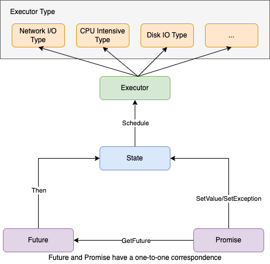
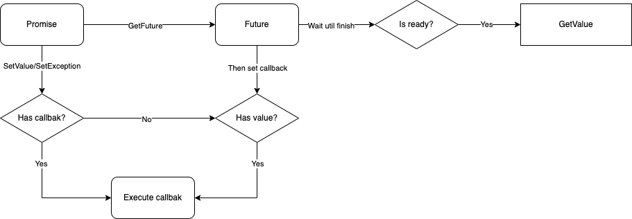

[中文版](../zh/future_promise_guide.md)

[TOC]

# tRPC-Cpp future/promise user guide

## Preface

Future/promise is an asynchronous programming model that allows users to break free from traditional callback traps and enables them to perform asynchronous programming in a more elegant and clear manner. Although C++11 has started supporting std::future/std::promise, the latter is considered too simplistic. Therefore, the tRPC-Cpp framework provides its own implementation of future/promise. In addition to supporting chained callbacks, it offers a rich set of tools to support concurrent and sequential invocations.

## Design

### Principle

In order to write correct, efficient, and reliable code, users need to understand the following principles,

- Both Future and Promise support move semantics but prohibit copying, which ensures a one-to-one relationship between Promise and Future.
- Due to the implementation using right-value moves, the GetValue and GetException interfaces can only be called once, and repeated calls are prohibited.
- Future/Promise supports a variable number of parameters. The result returned by Future is of type std::tuple, and to obtain the specific value, user needs to call std::get<N> to retrieve the value of the Nth parameter.
- Error handling in Future/Promise is done by returning an Exception object instead of throwing an exception. If a Future call fails, it returns an Exception to the user, who can retrieve the error information using GetException.
- Support is provided for registering callbacks to capture both Future and Value. However, it is recommended to use callbacks that capture Future because capturing Value callbacks cannot detect errors.
- The underlying scheduler of Future is implemented based on the [Continuation](https://en.wikipedia.org/wiki/Continuation) principle.

### Structure diagram



### State transition diagram



## User guide

### Basic usage

#### Set result (SetValue/SetException)

Set value using `SetValue`, as shown below,

```cpp
trpc::Promise<std::string> pr;
// Obtain the future corresponding to the promise.
auto fut = pr.GetFuture();

// Set callback of fut, other operations.

// Set value to future.
pr.SetValue("hello,world");
```

Set exception using `SetException`, as shown below,

```cpp
trpc::Promise<std::string> pr;
// Obtain the future corresponding to the promise.
auto fut = pr.GetFuture();

// Set callback of fut, other operations.

// Set exception to future.
pr.SetException(CommonException("system error"));
```

#### Get result (GetValue0/GetValue/GetException)

When a future object is in ready state, its value is set. When a future object is in exceptional state, its exception is set. Users need to determine whether to retrieve the corresponding value or exception based on the state of the future when using it.

For Future/Promise with single parameter, the value can be directly obtained using the `GetValue0` interface, as shown below,

```cpp
// Promise with single parameter.
trpc::Promise<std::string> pr;
auto fut = pr.GetFuture();

// Set value to future.
pr.SetValue("hello,world");

// Determine whether to retrieve the value or the exception based on the state of the future object.
if (fut.IsReady()) {
  // Retrieve value when ready.
  auto value = fut.GetValue0();
  // Other operations.
}
```

For Future/Promise with multiple parameters, the values can be obtained using the `GetValue` interface, and then the value of the Nth parameter can be retrieved using std::get<N>, as shown below.

```cpp
// Promise with multiple parameter.
trpc::Promise<std::string, int> pr;
auto fut = pr.GetFuture();

// Set value to future.
pr.SetValue("hello,world", 1);

// Determine whether to retrieve the value or the exception based on the state of the future object.
if (fut.IsReady()) {
  // Retrieve valuse when ready.
  auto res = fut.GetValue();
  // Then use std::get<N> to retrieve the value of the Nth parameter.
  auto str_value = std::get<0>(res);
  auto int_value = std::get<1>(res);
  // Other operations.
}
```

To retrieve the exception, use the `GetException` interface, as shown below,

```cpp
// Here is an example using a promise object with single parameter. The same syntax applies to promise objects with multiple parameters.
trpc::Promise<std::string> pr;
auto fut = pr.get_future();

// Set exception to future.
pr.SetException(CommonException("system error"));

// Determine whether to retrieve the value or the exception based on the state of the future object.
if (fut.IsFailed()) {
  // Retrieve exception when exceptional.
  auto exception = fut.GetException();
  // Other operations.
}
```

#### Set future callback (Then)

The Future class provides the Then interface to set callbacks for a Future. The framework supports capturing callbacks of the Future and capturing value callbacks.

Capturing callbacks of the Future is `recommended`. Users can determine the success or failure of the request within the callback, as shown below,

```cpp
fut.Then([](Future<T>&& fut) {
  // Request success.
  if (fut.IsReady()) {
    auto res = fut.GetValue0();
    // Handle response.
  // Request failed.
  } else {
    auto exception = fut.GetException();
    // Handle error and report etc.
  }

  // The callback function can return a Future object or nothing at all.
});
```

Capturing value callbacks is `not recommended`. It only executes the callback when the invocation is successful, making it inconvenient to handle scenarios where the invocation fails, as shown below.

```cpp
fut.Then([](T&& val) {
  // At this point, the request is successful, and we can process the response.

  // The callback function can return a Future object or nothing at all.
});
```

#### Create ready or exceptional Future（MakeReadyFuture/MakeExceptionFuture）

Create a ready Future, as shown below,

```cpp
auto fut = MakeReadyFuture<std::string>("hello, world");
```

Create a exceptional Future, as shown below,

```cpp
auto fut = MakeExceptionFuture<std::string>(CommonException("system error"));
```

#### Blocking get Future (BlockingGet)

The BlockingGet interface will wait indefinitely until the future is ready or an exception occurs.

```cpp
auto res_fut = future::BlockingGet(std::move(fut));

// Future ready.
if (res_fut.IsReady()) {
  // Handle result.
// future exceptional.
} else {
  // Handle exception.
}
```

### Advanced usage

#### Serial tasks, waiting for the last callback to complete (Then)

The example code is as follows,

```cpp
  fut.Then([](Future<T>&& fut) {
	  auto value = fut.GetValue0();
    // Handle result of first future.

    // Return future by first callback.
    // return ...
  })
  .Then([](Future<T>&& fut) {
	  auto value = fut.GetValue0();
    // Handle result of second future.

    // Return future by second callback.
    // return ...
  })
  .Then([](Future<T>&& fut) {
	  auto value = fut.GetValue0();
    // Handle result of third future.

    // Return future by third callback.
    // return ...
  });
```

#### Serial tasks, continuing until the conditional function returns true or the Future function returns an exception (DoUntil)

This is the first usage of DoUntil, where users can specify a conditional function and a Future function. There are two conditions that can terminate the execution of the Future function.

- When this conditional function returns true, it terminates the execution of subsequent Future functions.
- When the Future function returns an exception, it terminates the execution of subsequent Future functions.

In other cases, the subsequent Future functions will be executed in a serial manner continuously.

If the conditional function returns true, it terminates the execution of subsequent Future functions, as shown below,

```cpp
auto flag = std::make_shared<bool>(false);
auto counter = std::make_shared<uint32_t>(0);

// In the conditional function, the execution of subsequent Future functions is terminated when the flag is true.
DoUntil([flag]() { return *flag; },
        [flag, counter]() {
          (*counter)++;
          // Execute 12 times.
          if (*counter == 12) {
            *flag = true;
          }
          // Each execution returns a ready Future object, so the callbacks will be executed synchronously 12 times. There is no asynchronous invocation.
          return MakeReadyFuture<>();
        });
```

Note: The Future functions may not be executed at all if the conditional function returns true right from the beginning.

When the Future function returns an exception, it terminates the execution of subsequent Future functions, as shown below.

```cpp
auto flag = std::make_shared<bool>(false);
auto counter = std::make_shared<uint32_t>(false);

DoUntil([flag]() { return *flag; },
        [flag, counter]() {
          (*counter)++;
          if (*counter == 12) {
            *flag = true;
          }
          // Here, it will trigger first when the Future function reaches the 7th execution and returns an exception Future object, terminating the execution of subsequent Future functions.
          if (*counter == 7) {
            return MakeExceptionFuture<>(TestWhenAllException());
          }
          return MakeReadyFuture<>();
        });
```

#### Serial tasks, continuing until the Future function returns a ready value of false (DoUntil)

This is the second usage pattern of DoUntil, where the user only needs to specify a Future function that returns a Future<bool>. When a Future function returns a ready value of false, the execution of subsequent Future functions is terminated. Otherwise, it continues executing. Here is an example,

```cpp
int counter = 0;
int sum = 0;

DoUntil([&counter, &sum](){
  // No conditional function is provided, but when the ready value of the Future function is equal to false, the execution of subsequent Future functions is terminated. Therefore, the current Future function will be executed sequentially a total of 10 times.
  if (counter++ == 10) return MakeReadyFuture<bool>(false);
  ++sum;
  return MakeReadyFuture<bool>(true);
});
```

#### Serial tasks, continuing until the conditional function returns false or the Future function returns an exception (DoWhile)

DoWhile is a variation of DoUntil, with the only difference being that when the conditional function returns false, DoWhile terminates the execution of subsequent Future functions. Here is an example,

```cpp
int counter = 0;
int sum = 0;
// The Future function is executed sequentially a total of 10 times.
DoWhile([&counter]() { return counter++ < 10; },
        [&sum]() {
          ++sum;
          return MakeReadyFuture<>();
        });
```

#### Serial tasks, continuing until the Future function returns an exception (Repeat)

In comparison to DoWhile, Repeat relies on the Future function itself returning an exception to terminate the execution of subsequent Future functions. Here is an example,

```cpp
int counter = 0;
// The Future function is executed sequentially a total of 10 times.
Repeat([&counter]() {
         if (++counter == 10) return MakeExceptionFuture<>(CommonException("10"));
         else return MakeReadyFuture<>();
      });
```

#### Serial tasks, continuing until the iterator has finished traversing (DoForEach)

Using DoForEach, the number of times the Future function is executed sequentially depends on the size of the iterator. In practice, there are four different syntaxes to distinguish,

- Specifying the start and end iterators, the Future function without parameters.
- Specifying the start and end iterators, the Future function with parameters where the parameter is the value of the iterator's element.
- Specifying the iterator itself, the Future function without parameters.
- Specifying the iterator itself, the Future function with parameters where the parameter is the value of the iterator's element.

Specifying the start and end iterators, the Future function without parameters, as shown below.

```cpp
std::vector<int> c(10, 1);
int counter = 0;

DoForEach(c.begin(), c.end(), [&counter]() {
           ++counter;
           return MakeReadyFuture<>();
          });
```

Specifying the start and end iterators, the Future function with parameters where the parameter is the value of the iterator's element, as shown below.

```cpp
std::vector<int> c(10, 1);
int counter = 0;

DoForEach(c.begin(), c.end(), [&counter](auto e) {
           counter -= e;
           return MakeReadyFuture<>();
          });
```

Specifying the iterator itself, the Future function without parameters, as shown below.

```cpp
std::vector<int> c(10, 1);
int counter = 0;

DoForEach(c, [&counter]() {
           ++counter;
           return MakeReadyFuture<>();
          });
```

Specifying the iterator itself, the Future function with parameters where the parameter is the value of the iterator's element, as shown below.

```cpp
std::vector<int> c(10, 1);
int counter = 0;

DoForEach(c, [&counter](auto e) {
           counter -= e;
           return MakeReadyFuture<>();
          });
```

#### Serial tasks, specifying the total number of times the Future function is executed (DoFor)

Using DoFor, distinguishing between two syntaxes.

- The Future function without parameters, the actual execution count is equal to the size of the total count.
- The Future function with parameters, where the parameter is a variable representing the total count. The actual execution count depends on the state of the total parameter variable.

The Future function without parameters, the actual execution count is equal to the size of the total count, as shown below.

```cpp
int counter = 0;
DoFor(10, [&counter]() {
       ++counter;
       return MakeReadyFuture<>();
     });
```

The Future function with parameters, where the parameter is a variable representing the total count. The actual execution count depends on the state of the total parameter variable, as shown below.

```cpp
DoFor(counter, [&counter](std::size_t i) {
       --counter;
       return MakeReadyFuture<>();
     });
```

#### Parallel tasks, waiting for all responses (WhenAll)

If user wants to make 3 concurrent requests and then initiate another request only after all 3 requests are completed, `WhenAll` with two syntaxes can be used.

- Specify the iterator itself.
- Specify Future objects one by one.

Specify the iterator itself, as shown below.

```cpp
std::vector<Future<bool>> futs;
futs.emplace_back(AsyncOperation1());
futs.emplace_back(AsyncOperation2());
futs.emplace_back(AsyncOperation3());
auto fut = WhenAll(futs.begin(), futs.end()).Then([](std::vector<trpc::Future<bool>>&& vec_futs ) {
  // Determine and retrieve the results of each operation.
  auto& fut0 = vec_futs[0];
  auto& fut1 = vec_futs[1];
  auto& fut2 = vec_futs[2];
  // Other operations.
  return AsyncOperation4();
});
```

Specify Future objects one by one, as shown below.

```cpp
auto fut1 = AsyncOperation1();
auto fut2 = AsyncOperation2();
auto fut3 = AsyncOperation3();
auto fut = WhenAll(fut1, fut2, fut3).Then([](std::tuple<Future<uint32_t>, Future<uint32_t>, Future<uint32_t>>&& results) {
  // Determine and retrieve the results of each operation.
  auto& fut0 = std::move(std::get<0>(results));
  auto& fut1 = std::move(std::get<1>(results));
  auto& fut2 = std::move(std::get<2>(results));
  // Other operations.
  return AsyncOperation4();
});
```

#### Parallel tasks, waiting for any one response (WhenAny)

If you want to send 3 requests concurrently and perform a specific operation when any one of the requests is completed (either successfully or unsuccessfully), you can use WhenAny. Here is an example code,

```cpp
std::vector<Future<bool>> futs;
futs.emplace_back(AsyncOperation1());
futs.emplace_back(AsyncOperation2());
futs.emplace_back(AsyncOperation3());
auto fut = WhenAny(vecs.begin(), vecs.end()).Then([](Future<size_t, std::tuple<bool>>&& fut) {
  if (fut.IsReady()) {
    auto res = fut.GetValue();
    // Index of the successful request.
    auto success_index = std::get<0>(res);
    // The obtained type is std::tuple, and further use of std::get is required to retrieve the corresponding element value.
    auto value = std::get<1>(res);
    ...
  }
}
```

If you need to wait for either one request to succeed or all requests to fail before returning, you can use WhenAnyWithoutException. Its usage is the same as WhenAny.

#### Asynchronous read-write lock

Asynchronous read-write lock based on Future, only supported for use in tRPC framework's Worker thread, and does not support cross-thread locking and unlocking, i.e., it is not thread-safe.

```cpp
// Initialize the lock object, paying attention to the lock's lifecycle and the associated worker thread.
auto lock = std::make_shared<RWLock>();
lock->WriteLock().Then([lock] (Future<>&& fut) {
  if (fut.IsFailed()) {
    // Locking failed, possibly due to attempting to lock the lock from a different thread than the one in which the lock object was initialized. In other words, attempting to perform lock operations across threads.
  }
  // Perform some tasks after acquiring the write lock.

  // Unlock the lock, and optionally check if the unlock operation was successful.
  lock->WriteUnlock();
});
lock->ReadLock().Then([lock] (Future<>&& fut) {
  if (fut.IsFailed()) {
    // Locking failed, possibly due to attempting to lock the lock from a different thread than the one in which the lock object was initialized. In other words, attempting to perform lock operations across threads.
  }
  // Perform some tasks after acquiring the read lock.

  // Unlock the lock, and optionally check if the unlock operation was successful.
  lock->ReadUnlock();
});
```

In addition to the aforementioned usage, there is also a `WithLock` method available that provides automatic unlocking. It takes the read or write lock object and a user lambda function as parameters.

```cpp
// Initialize the lock object, paying attention to the lock's lifecycle and the associated worker thread.
auto lock = std::make_shared<RWLock>();
WithLock(lock->ForWrite(), [lock] {
  // Perform some tasks after acquiring the write lock.
  return MakeReadyFuture<int>(1);
// The WithLock method can return the result of the user lambda function.
}).Then([] (Future<int>&& fut) {
  // Handle result 1.
  // std::get<0>(fut.GetValue())
});

WithLock(lock->ForRead(), [lock] {
  // Perform some tasks after acquiring the read lock.
// The user lambda does not have a return value or returns void.
}).Then([] (Future<>&& fut) {
  // WithLock return Future<>
});
```

### Customize the Executor

#### Network IO type Executor (default framework-provided)

First, inherit the trpc::Executor class (located in trpc/common/future/executor.h) and implement the concrete ReactorExecutor.

```cpp
class ReactorExecutor : public Executor {
 public:
  static inline Executor* ThreadLocal() {
    // Call a global function to initialize the executor by passing the current thread's reactor.
    static thread_local ReactorExecutor executor(runtime::GetThreadLocalReactor());
    return &executor;
  }

 private:
  explicit ReactorExecutor(Reactor* reactor) : reactor_(reactor) { TRPC_ASSERT(reactor_); }

  /// @brief Submit task.
  void SubmitTask(Task&& task) override { reactor_->SubmitTask(std::move(task)); }

 private:
  Reactor* reactor_ = nullptr;
};
```

Finally, when setting the Then callback for a Future, support passing a specified executor to execute this callback.

```cpp
for (int i = 0; i < reactor_num; ++i) {
  runtime::GetReactor(i)->SubmitTask([]() {
  auto exe = ReactorExecutor::ThreadLocal();
    MakeReadyFuture<>().Then(exe, []() { return MakeReadyFuture<>(); });
  });
}
```

#### Cpu intense type Executor

First, user needs to inherit the trpc::Executor class (located in trpc/common/future/executor.h) and implement a concrete ThreadPoolExecutor.

```cpp
class ThreadPoolExecutor : public trpc::Executor {
 public:
  ThreadPoolExecutor() {
    // Initialize the thread pool configuration and start it.
    trpc::ThreadPoolOption thread_pool_option;
    thread_pool_option.thread_num = 2;
    thread_pool_ = std::make_unique<trpc::MQThreadPool>(std::move(thread_pool_option));
    thread_pool_->Start();
  }

  ~ThreadPoolExecutor() override {
    thread_pool_->Stop();
    thread_pool_->Join();
  }

  /// @brief Submit task.
  void SubmitTask(Task&& task) override { thread_pool_->AddTask(std::move(task)); }

  static trpc::Executor* GetExecutor() {
    static ThreadPoolExecutor executor;
    return &executor;
  }

 private:
  std::unique_ptr<trpc::MQThreadPool> thread_pool_;
};
```

Finally, use the Then callback with an Executor parameter to set the desired executor to be used.

```cpp
auto executor = ThreadPoolExecutor::GetExecutor();
future.Then(executor, [](Future<T>&& fut) {
  // Request success.
  if (fut.IsReady()) {
    auto res = fut.GetValue0();
    // Handle response.
  // Request failed.
  } else {
    auto exception = fut.GetException();
    // Print error, report error etc.
  }

  // A future is returned by callback.
  // return ...
});
```
