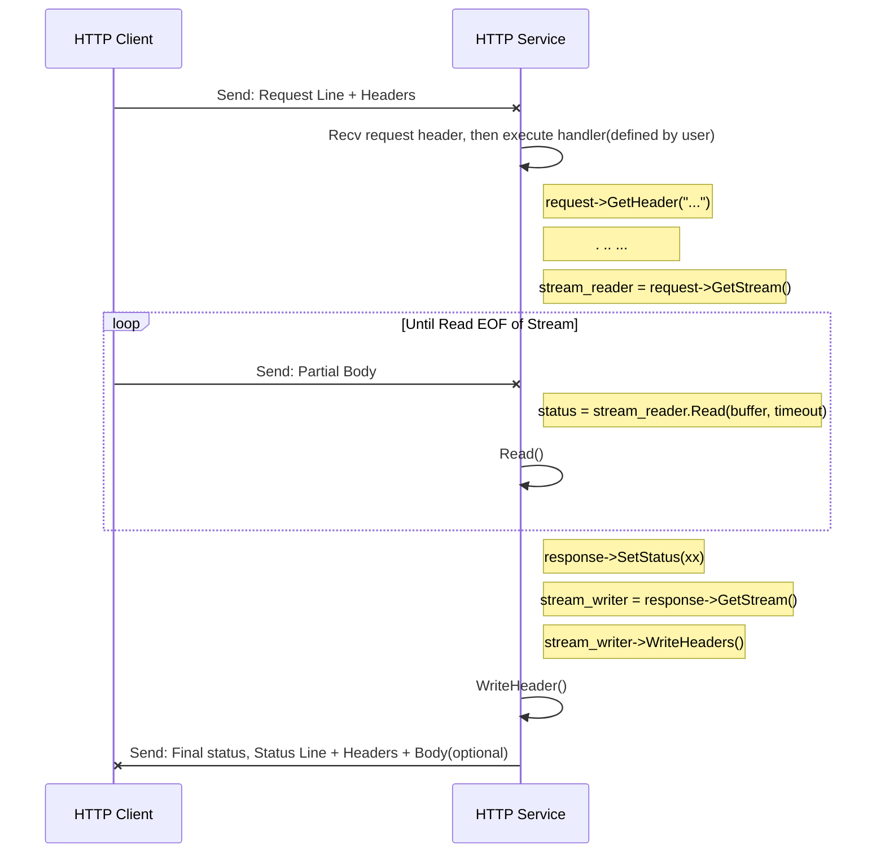
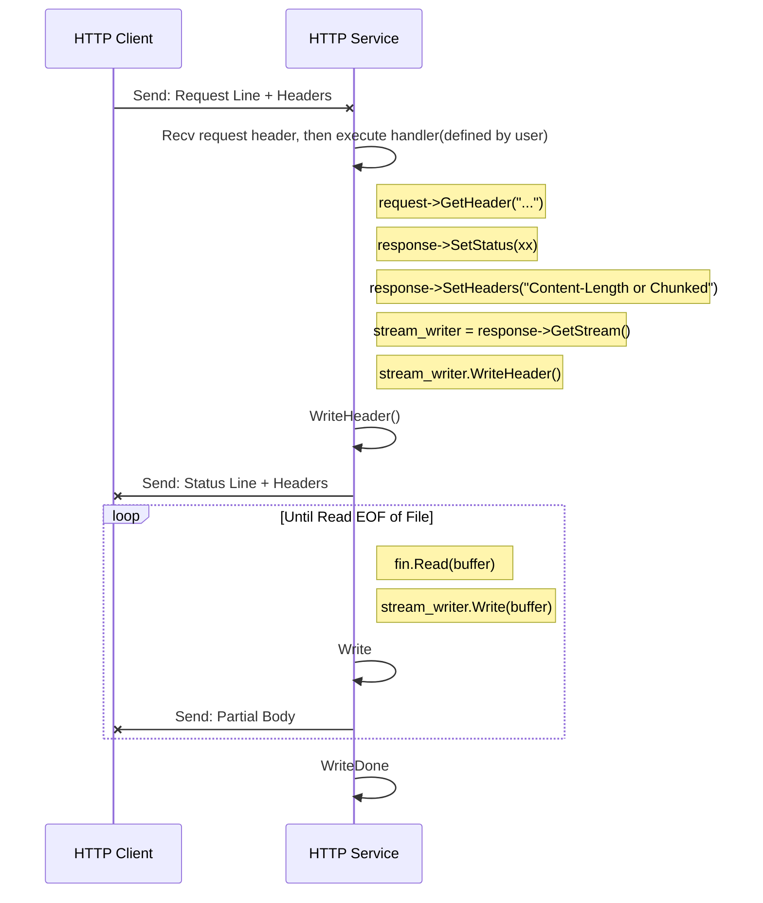

[中文](../en/http_protocol_upload_download_service.md)

[TOC]

# Developing an HTTP File Upload-Download Service

Topic: How to develop an HTTP file upload-download service based on tRPC-Cpp.

In HTTP services, there are scenarios where large files need to be read or sent. Reading the entire file into memory is
inefficient and puts a lot of pressure on the memory, making it difficult to upload large files. tRPC-Cpp provides a set
of HTTP streaming read and write data chunking interfaces, which can receive and send large files in chunks.

- For large files with a known length, send them in chunks after setting `Content-Length: $length` (of course, we can
  also use chunked if the other end supports it).
- For large files with an unknown length, send them in chunks after setting `Transfer-Encoding: chunked`.

At the same time, it supports both HTTP synchronous streaming programming interface and asynchronous programming
interface. Different types of programming interfaces depend on different `tRPC runtimes`, and there are significant
differences in programming methods, as well as some limitations, which will be explained in detail in the specific
chapters. Before reading this article, readers can first learn about tRPC-Cpp's `fiber coroutine` and `future/promise`.

This article introduces how to develop an HTTP file upload-download service based on tRPC-Cpp (referred to as tRPC
below), and developers can learn the following:

* How to use the synchronous streaming interface to implement file upload-download.
    * Running process.
    * Programming interface.
    * Implementing upload-download service.
* How to use the asynchronous streaming interface to implement file upload-download.
    * Running process.
    * Programming interface.
    * Code examples.
* FAQ.

# How to use the synchronous streaming interface to implement file upload-download

The HTTP synchronous streaming service is developed based on the `HttpService` and `SetHttpRoutes` methods. When
transferring data, you can specify the length with `Content-Length: $length`, or use chunked transfer
with `Transfer-Encoding: chunked`.

Note: The synchronous streaming interface needs to run in a `fiber` coroutine environment.

## Experience an HTTP file upload-download service

Example: [http_upload_download](../../examples/features/http_upload_download)

Go to the main directory of the tRPC code repository and run the following command.

```shell
sh examples/features/http_upload_download/run.sh
```

The content of the output from the client program is as follows:

``` text
// Downlaods a file from the server:
finish downloading, read size: 10485760
name: download a file from the server, ok: 1
final result of http calling: 1

// Uploads a file to the server:
upload a file with chunked
finish uploading, write size: 10485760
name: upload a file to server, ok: 1
final result of http calling: 1

upload a file with content-length
finish uploading, write size: 10485760
name: upload a file to server, ok: 1
final result of http calling: 1
```

## Execution flow

First, let's take a look at the process of server-side HTTP streaming data upload and download, and then design our own
data upload and download services based on these processes.

After receiving a user request, the framework will start a coroutine to run the `HttpHandler` logic set and implemented
by the
user.

The logic of the file upload scenario is roughly as follows:

1. Read the request header.
2. Read the request message body in chunks until `EOF` is reached, process the data block after reading successfully.
3. After the reading is complete, send a response message to inform the client of the processing result.



The logic of file downloading scene is roughly as follows:

1. Set the response code and response headers, and set `Content-Length or Chunked` as needed.
2. Send the response message header.
3. Write the response message body in chunks until it is fully written.



## Streaming programming interface

### Server-side stream reader and stream writer

* Use the `GetStream()` method of `HttpRequest` to obtain `stream_reader`, whose object type is `HttpReadStream`.
* Use the `GetStream()` method of `HttpResponse` to obtain `stream_writer`, whose object type is `HttpWriteStream`.

| Object Type     | Interface Signature                                                                                                 | Function                                                                                                                                                                    | Parameters                                                                                                                                                                                                       | Return Value |
|-----------------|---------------------------------------------------------------------------------------------------------------------|-----------------------------------------------------------------------------------------------------------------------------------------------------------------------------|------------------------------------------------------------------------------------------------------------------------------------------------------------------------------------------------------------------|--------------|
| HttpReadStream  | Status Read(NoncontiguousBuffer&amp; item, size_t max_bytes)                                                        | Read the specified length of content, blocking this operation until the timeout+now configured in the service is reached as the timeout for the entire read stream process. | max_bytes, if the remaining content after receiving the complete package is less than the specified length, the remaining content will be returned immediately, and EOF will be marked through the return value. | Status       |
| HttpReadStream  | Status Read(NoncontiguousBuffer&amp; item, size_t max_bytes, const std::chrono::time_point<Clock, Dur>&amp; expiry) | Read the specified length of content, blocking this operation until the specified time point is reached.                                                                    | expiry, e.g.: trpc::ReadSteadyClock() + std::chrono::milliseconds(3)                                                                                                                                             | Status       |
| HttpReadStream  | Status Read(NoncontiguousBuffer&amp; item, size_t max_bytes, const std::chrono::duration<Rep, Period>&amp; expiry)  | Read the specified length of content, blocking this operation until the specified time interval is reached.                                                                 | expiry, e.g.: std::chrono::milliseconds(3)                                                                                                                                                                       | Status       |
| HttpReadStream  | Status ReadAll(NoncontiguousBuffer&amp; item)                                                                       | Read the complete package content, blocking this operation until the timeout configured in the service is reached as the timeout for the entire read stream process.        | -                                                                                                                                                                                                                | Status       |
| HttpReadStream  | Status ReadAll(NoncontiguousBuffer&amp; item, const std::chrono::time_point<Clock, Dur>&amp; expiry)                | Read the complete package content, blocking this operation until the specified time point is reached.                                                                       | expiry, e.g.: trpc::ReadSteadyClock() + std::chrono::milliseconds(3)                                                                                                                                             | Status       |
| HttpReadStream  | Status ReadAll(NoncontiguousBuffer&amp; item, const std::chrono::duration<Rep, Period>&amp; expiry)                 | Read the complete package content, blocking this operation until the specified time interval is reached.                                                                    | expiry, e.g.: std::chrono::milliseconds(3)                                                                                                                                                                       | Status       |
| HttpReadStream  | void SetDefaultDeadline(std::chrono::steady_clock::time_point default_deadline)                                     | Set the default timeout, which will override the timeout+now configured in the service.                                                                                     | -                                                                                                                                                                                                                | -            |
| HttpWriteStream | Status WriteHeader()                                                                                                | Send the response header.                                                                                                                                                   | You can set the specified response line through Response's SetStatus, which defaults to 200; you can set the specified header through Response's SetHeader.                                                      | Status       |
| HttpWriteStream | Status Write(NoncontiguousBuffer&amp;&amp; item)                                                                    | Send content.                                                                                                                                                               | -                                                                                                                                                                                                                | Status       |
| HttpWriteStream | Status WriteDone()                                                                                                  | Send end.                                                                                                                                                                   | -                                                                                                                                                                                                                | Status       |

### Common return codes for server-side stream interfaces

For timeout errors, the business logic can try to retry, but for network errors, it is not recommended to retry as it
indicates an abnormality in the connection where the stream reader or writer is located.

| Return Code                                | Value | Meaning                                                                     |
|--------------------------------------------|-------|-----------------------------------------------------------------------------|
| kSuccStatus                                | 0     | Operation executed successfully                                             |
| kStreamStatusReadEof                       | -99   | All content has been read                                                   |
| kStreamStatusServerReadTimeout             | 254   | Server-side read timeout                                                    |
| kStreamStatusServerWriteTimeout            | 234   | Server-side write timeout                                                   |
| kStreamStatusServerNetworkError            | 201   | Server-side network error (such as connection disconnected or idle timeout) |
| kStreamStatusServerWriteContentLengthError | 232   | The length of the written data does not match the Content-Length setting    |

### Timeout explanation for read-related interfaces

Read-related interfaces: Read, ReadAll.
Taking the Read interface as an example, tRPC provides two types of specific interface forms:

- Read(item, max_bytes) without a custom timeout.
  The timeout for this type of interface is a fixed value that is determined when the reader/writer is created (
  calculated by the service configuration or specified by the SetDefaultDeadline method).

> For example, if the timeout is configured as 60000ms and the user obtains the reader/writer at time "now", then no
> matter how many times the user calls Read(item, max_bytes), the timeout point will always be "now + 1min", which can
> be
> understood as the timeout for the entire read stream process.

- Read(item, max_bytes, timeout) with a custom timeout.
  If the user's data is very large, such as a 10GB file, and the network conditions are uncertain, it is recommended to
  use the Read(item, max_bytes, timeout) interface in this scenario.

> The "timeout" parameter here only applies to the Read operation. The "timeout" type can be a time interval, such as
> 10s, which means that the Read operation will be blocked for 10s from the trigger start. It can also be a specific
> time
> point, which means that the Read operation will be blocked until the specified time point.

# Implementing upload-download service

Example: [file_storage_handler.cc](../../examples/features/http_upload_download/server/file_storage_handler.cc)

## Implementing a file upload service

According to the file upload process, the data upload process needs to go through the following steps: receiving the
request, reading the request headers, reading the request message body data, completing the read, and sending the
response.

- **Receiving the request**
  After receiving an HTTP request, the framework will start the user's preset handler process based on the URL.
- **Reading the request headers**
  The HttpRequest object provides interfaces to obtain request header information: HasHeader/GetHeader, which allows the
  user to obtain request header content information. For example, look for `Content-Length` or `Transfer-Encoding` to
  determine whether the other end is sending data in length form or chunked form. Of course, the framework will
  automatically help the user decode chunked-form data into data fragments.
- **Reading data**
  Using the Read(item, max_bytes) interface, if the server's response data has not ended, this Read operation will block
  until it reads data of length max_bytes. If the server's response data has already ended, this Read operation will
  immediately return after reading data of length max_bytes or reading the end of the data.
- **Completing the read**
  When the end of the data is read, the Read interface will return the kStreamStatusReadEof return code to inform the
  user that the server data has been completely read.
- **Sending the response**
  In a normal interaction process, the user should call HttpResponse's SetStatus to set the status code (default 200)
  based on the other end's request and call HttpWriteStream's WriteHeader to send the response headers. If the user does
  not actively call WriteHeader, the framework will automatically call WriteHeader to complete the response process (
  default 200) after the user's processing logic ends.

Example code:

```cpp
// Store a file received from the client.
::trpc::Status FileStorageHandler::Post(const ::trpc::ServerContextPtr& ctx, const ::trpc::http::RequestPtr& req, ::trpc::http::Response* rsp) {
  // Open a file and prepare to save the uploaded file content
  auto fout = std::ofstream("/to/path/upload_dst_xx", std::ios::binary);
  if (!fout.is_open()) {
    rsp->SetStatus(::trpc::http::ResponseStatus::kInternalServerError);
    return ::trpc::kSuccStatus;
  }

  // Get stream reader. 
  auto& reader = req->GetStream();
  ::trpc::Status status;
  // Read at most 1MB each time. 
  constexpr std::size_t kBufferSize{1024 * 1024};
  std::size_t nread{0};
  
  // Start receiving the file content.
  for (;;) {
    ::trpc::NoncontiguousBuffer buffer;
    // Read the data.
    status = reader.Read(buffer, kBufferSize);
    if (status.OK()) {
      nread += buffer.ByteSize();
      // Write the data to the file.
      for (const auto& block : buffer) {
        fout.write(block.data(), block.size());
      }
      continue;
    } else if (status.StreamEof()) {
      // File reading is complete.
      break;
    }
    // If an error occurs, return an error code. the framework will recognize the RST return code and close the stream.
    return ::trpc::kStreamRstStatus;
  }

  // After receiving is complete, send a response to the client.
  rsp->SetStatus(::trpc::http::ResponseStatus::kOk);
  auto& writer = rsp->GetStream();
  status = writer.WriteHeader();
  if (!status.OK()) {
    return ::trpc::kStreamRstStatus;
  }
  return ::trpc::kSuccStatus;
}
```

## Implementing a file download service

Following the file download process, the data download process needs to go through the following steps: read request
headers, set length format or chunked format, send response headers, write data, and complete writing.

- **Receive request**
  After receiving an HTTP request, the user's preset handler process will be started based on the URL.
- **Read request headers**
  HttpRequest provides interfaces to obtain request headers: HasHeader/GetHeader.
- **Set length format or chunked format**
  Call HttpResponse's SetHeader method to set the length format or chunked format. If the complete data length is
  already known, the length format "Content-Length: 104857600" can be used. If the complete data length is unknown, the
  chunked format "Transfer-Encoding: chunked" can be used.
- **Send response headers**
  In the normal interaction process, the user should proactively call HttpResponse's SetStatus to set the status code (
  default 200) based on the request from the other end, and call HttpWriteStream's WriteHeader to send the response
  headers. If the user does not actively call WriteHeader, the framework will automatically call WriteHeader to complete
  the
  response process after the user processing logic is finished (default 200).
- **Write data**
  Through the Write interface, the user can continuously send data fragments to the server. If the user is using the
  chunked format, the user does not need to do chunked encoding for the transmitted data, as the framework will handle
  it
  automatically. If the user is using the length format, if the data sent by the user exceeds the set length, the Write
  interface will report kStreamStatusServerWriteContentLengthError error.
- **Complete writing**
  Through the WriteDone interface, the user informs the reader-writer that all data has been sent. If the user is using
  the chunked format, the framework will send the chunked end tag to the other end. If the user is using the length
  format, the framework
  will check whether the length of the data sent by the user and the set length are consistent. If they are
  inconsistent, it will report kStreamStatusServerWriteContentLengthError error. Once the WriteDone interface is called,
  the user should not try to use the Write interface again.

Example code:

```cpp
// Send a file to the client. 
::trpc::Status FileStorageHandler::Get(const ::trpc::ServerContextPtr& ctx, const ::trpc::http::RequestPtr& req,
                                       ::trpc::http::Response* rsp) {
  // Open the file to be downloaded.
  auto fin = std::ifstream("/to/path/download_src_xx", std::ios::binary);
  if (!fin.is_open()) {
    rsp->SetStatus(::trpc::http::ResponseStatus::kInternalServerError);
    return ::trpc::kSuccStatus;
  }

  // Send data in chunked.
  rsp->SetHeader(::trpc::http::kHeaderTransferEncoding, ::trpc::http::kTransferEncodingChunked);
  // Get the stream reader, then send response header.
  auto& writer = rsp->GetStream();
  ::trpc::Status status = writer.WriteHeader();
  if (!status.OK()) {
    // If an error occurs, return an error code. the framework will recognize the RST return code and close the stream.
    return ::trpc::kStreamRstStatus;
  }

  std::size_t nwrite{0};
  ::trpc::BufferBuilder buffer_builder;
  // Send the response body.
  for (;;) {
    fin.read(buffer_builder.data(), buffer_builder.SizeAvailable());
    std::size_t n = fin.gcount();
    if (n > 0) {
      ::trpc::NoncontiguousBuffer buffer;
      buffer.Append(buffer_builder.Seal(n));
      // Write data chunk.
      status = writer.Write(std::move(buffer));
      if (status.OK()) {
        nwrite += n;
        continue;
      }
      return ::trpc::kStreamRstStatus;
    } else if (fin.eof()) {
      // File writing is complete.
      status = writer.WriteDone();
      if (status.OK()) break;
      return ::trpc::kStreamRstStatus;
    }
    return ::trpc::kStreamRstStatus;
  }
  return ::trpc::kSuccStatus;
}
```

# How to use the asynchronous streaming interface to implement file upload-download.

The HTTP asynchronous streaming service is developed based on `HttpAsyncStreamFuncHandler` and registered with the route
through `HttpAsyncStreamService` and `RegisterAsyncStreamMethod`.

```cpp
// The signature of the streaming method that the user needs to implement:
using BidiStreamFunction = std::function<Future<>(const ServerContextPtr&, HttpServerAsyncStreamReaderWriterPtr)>;
```

When transmitting data, you can specify the length `Content-Length: $length`, or use chunked
transfer `Transfer-Encoding: chunked`.

Requirements:

- The asynchronous streaming interface needs to run in the `merge` thread model environment. The `merge` thread model is
  a runtime of tRPC , and the thread role does both `IO` and business logic `Handle`.
- Currently, only the asynchronous streaming interface called within tRPC 's internal thread is supported, and it is not
  supported to use it in user-defined external threads (the program will crash).
- Use `future/promise` programming model.
- HTTP message reading and writing comply with the HTTP protocol specification, that is, the writing order for requests
  and responses is as follows:
    - Write start_line/status_line + headers first.
    - Then write the body.

## Experience an HTTP file upload-download service

Example: [http_async_upload_download](../../examples/features/http_async_upload_download)

Go to the main directory of the tRPC code repository and run the following command.

```shell
sh examples/features/http_async_upload_download/run.sh
```

The content of the output from the client program is as follows:

``` text
// Downlaods a file from the server:
finish downloading, read size: 10485760
name: download a file from the server, ok: 1
final result of http calling: 1

// Uploads a file to the server:
upload a file with chunked
finish uploading, write size: 10485760
name: upload a file to server, ok: 1
final result of http calling: 1
```

## Execution flow

The basic process for file upload and download scenarios is similar to synchronous streaming. After the framework
receives a user request, it uses an asynchronous callback to run the user's set and implemented `HttpAsyncStreamFuncHandler` logic.

## Streaming programming interface

### Server-side stream reader and stream writer

| Object Type                          | Interface Signature                                                                                   | Function                                                                                                                                                                                                                                                                                                                                                                                                                                                                                                                                                | Parameters                                         |
|--------------------------------------|-------------------------------------------------------------------------------------------------------|---------------------------------------------------------------------------------------------------------------------------------------------------------------------------------------------------------------------------------------------------------------------------------------------------------------------------------------------------------------------------------------------------------------------------------------------------------------------------------------------------------------------------------------------------------|----------------------------------------------------|
| HttpServerAsyncStreamReaderWriterPtr | const HttpRequestLine& GetRequestLine()                                                               | Get the request start line (it must obtain the request_uri in the start line to distribute to the business method registered, so this operation does not need to be asynchronous)                                                                                                                                                                                                                                                                                                                                                                       | -                                                  |
| HttpServerAsyncStreamReaderWriterPtr | Future&lt;HttpHeader> ReadHeader(int timeout = max)                                                   | Read the header from the stream                                                                                                                                                                                                                                                                                                                                                                                                                                                                                                                         | Timeout (ms)                                       |
| HttpServerAsyncStreamReaderWriterPtr | Future&lt;NoncontiguousBuffer> ReadChunk(int timeout = max)                                           | Read the chunk from the stream. This interface can only be called after confirming the chunked mode (judged from the header). Otherwise, it will fail.                                                                                                                                                                                                                                                                                                                                                                                                  | Timeout (ms)                                       |
| HttpServerAsyncStreamReaderWriterPtr | Future&lt;NoncontiguousBuffer> ReadAtMost(uint64_t len, int timeout = max)                            | Both length and chunked modes can be called to obtain data with a maximum length of len. </br>If the size of the data obtained from the network is smaller than len, return the data of size length. </br>If the size of the data obtained from the network is larger than len, return the data of length len. </br>If the buffer is empty, it means EOF. </br>Scenario 1: Used in memory-limited scenarios, the maximum length of each read is limited. </br>Scenario 2: In transit mode, it can timely obtain partial data and send it to downstream. | len (bytes), timeout (ms)                          |
| HttpServerAsyncStreamReaderWriterPtr | Future&lt;NoncontiguousBuffer> ReadExactly(uint64_t len, int timeout = max)                           | Both length and chunked modes can be called to obtain data with a fixed length of len. If EOF is read, return as much data as there is in the network. </br>If the size of the buffer read is less than len, it means EOF. </br>Special scenario 1: The request data is compressed in fixed sizes and needs to be read in fixed sizes for decompression.                                                                                                                                                                                                | len (bytes), timeout (ms)                          |
| HttpServerAsyncStreamReaderWriterPtr | Future<> WriteStatusLine(HttpStatusLine&& rsp_line)                                                   | Write the response status line                                                                                                                                                                                                                                                                                                                                                                                                                                                                                                                          | Response status line                               |
| HttpServerAsyncStreamReaderWriterPtr | Future<> WriteHeader(HttpHeader&& header)                                                             | Write the header                                                                                                                                                                                                                                                                                                                                                                                                                                                                                                                                        | header                                             |
| HttpServerAsyncStreamReaderWriterPtr | Future<> WriteData(NoncontiguousBuffer&& data)                                                        | Write the data. It will recognize the information in the header. If the header indicates chunked, it will organize the data into chunked format and then send it.                                                                                                                                                                                                                                                                                                                                                                                       | Data                                               |
| HttpServerAsyncStreamReaderWriterPtr | Future<> WriteDone()                                                                                  | Finish writing the data. If it is in chunked mode, it will write the chunked termination mark.                                                                                                                                                                                                                                                                                                                                                                                                                                                          | -                                                  |
| -                                    | Future&lt;HttpRequestPtr> ReadFullRequest(HttpServerAsyncStreamReaderWriterPtr rw, int timeout = max) | Read the complete request from the stream with a timeout (ms)                                                                                                                                                                                                                                                                                                                                                                                                                                                                                           | Server-side stream reader and writer, timeout (ms) |
| -                                    | Future<> WriteFullResponse(HttpServerAsyncStreamReaderWriterPtr rw, HttpResponse&& rsp)               | Write the complete response to the stream                                                                                                                                                                                                                                                                                                                                                                                                                                                                                                               | HTTP response                                      |

## Code example

The overall process logic is similar to synchronous streaming services, but asynchronous interfaces are used to
implement it. We can refer to the
example [http_server.cc](../../examples/features/http_async_upload_download/server/http_server.cc)

# FAQ

## 1. How does synchronous streaming respond to `100 Continue`?

Some clients will carry `Expect: 100-continue` in the header when sending large file POST/PUT requests and wait for the
server to return `100 continue` or `4xx/5xx rejection` error code.

The framework supports custom reply to `100 Continue` status code. You can add the following code before the `WriteHeader` call:

```cpp
if (req->GetHeader("Expect") == "100-continue") {  
  // Check if the upload is allowed, if not, set the 4xx/5xx error code using `SetStatus` and return.
  resp->SetStatus(trpc::http::HttpResponse::kContinue);
  resp->GetStream().WriteHeader();  // It is recommended to check if the returned status is normal.
  // After writing 100 Continue, the status code will be automatically set to the default value (200 OK). 
  // The business can call SetStatus (and WriteHeader) again to send the actual status code.
}
```

## 2. Is the synchronous streaming HttpResponse::SetContent() not working?

Users can use SetContent() to simply respond without using WriteHeader (non-1xx status codes) or Write. The framework will
automatically reply to the response in a non-streaming scenario after the user function ends.

