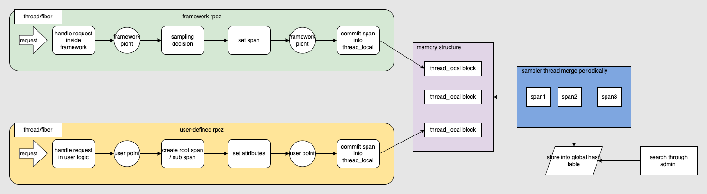
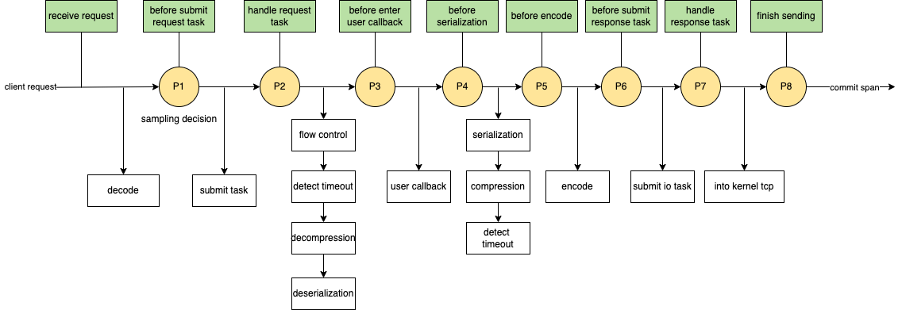
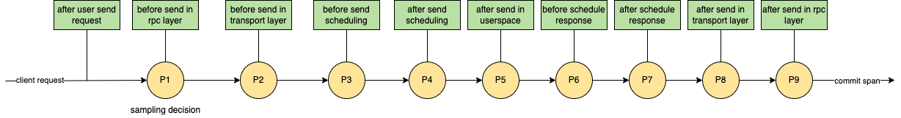
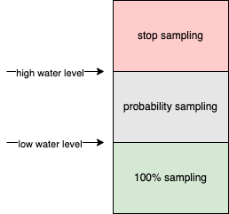
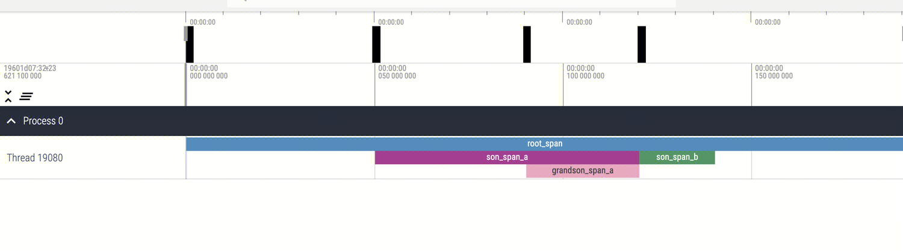

[中文版](../zh/rpcz.md)

[TOC]

# tRPC-Cpp rpcz user guide

## Preface

When users are troubleshooting performance or latency issues, they often need to add a significant amount of logging in the framework or user code logic, which can be inefficient. As a debugging tool, rpcz can provide detailed information about a request at different sampling points on the server or client, enabling users to quickly pinpoint issues.

## Design approach

### Basic concept

#### Span

A span is an information carrier that records basic details of an RPC (Remote Procedure Call) request process, such as the request source, packet size, time information at different sampling points, user-defined attributes, etc. The information presented to the user ultimately comes from the span.

#### Framework rpcz

The rpcz framework is primarily used for analyzing the critical path of the framework itself during the processing of RPC requests. It can be further divided into three scenarios.

- Pure server processing of received requests and sent responses.
- Pure client processing of sent requests and received responses.
- Processing of requests and sending of responses as an proxy service.

#### User-defined rpcz

User-defined rpcz is primarily used for analyzing the critical path of business code during the processing of rpcz requests. It only records information from various custom sampling points in the business logic layer, decoupled from the framework.

### Design



As shown in the diagram above, framework rpcz is implemented based on filter mechanism. At the first framework filter point, it checks whether the current request needs to be sampled. At subsequent framework filter points, span information is set, and at the last framework filter point, the span information is stored in a thread-local variable. For user-defined rpcz, the filter mechanism is bypassed. In the business code, users define their own instrumentation points. At these points, a root span object and child span objects are created, and corresponding attributes are set. At the last business instrumentation point, the root span object is written into the thread-local variable. Subsequently, a dedicated auxiliary thread aggregates the thread-local span information and writes it into a global hash table, facilitating business queries through admin commands.

### Instrumentation design

The instrumentation design for user-defined rpcz differs from that of the framework rpcz. Additionally, the filter piont design for pure server, pure client, and proxy scenarios in the framework rpcz also differ. These will be discussed separately in the following sections.

#### Pure server

Pure server is a specific scenario within the framework rpcz, and its instrumentation design aka filter piont is illustrated in the diagram below.



The meanings of the filter points P1 to P8 in the above diagram are as follows:

| label | name |         action       |       illustration       |
|-------|------|----------------------|--------------------------|
| P1 | SERVER_PRE_SCHED_RECV_MSG | sampling decision, set basic infos | the first filter point after receiving and completing the decoding of the request, and before entering the receiving queue |
| P2 | SERVER_POST_SCHED_RECV_MSG | set timestamp | after leaving the scheduling queue, before starting to process the request |
| P3 | SERVER_PRE_RPC_INVOKE | set timestamp | after decompression and deserialization, before invoking the user-implemented business function |
| P4 | SERVER_POST_RPC_INVOKE | set timestamp | after the completion of invoking the user-implemented business function |
| P5 | SERVER_PRE_SEND_MSG | set timestamp | the filter point after serialization and compression |
| P6 | SERVER_PRE_SCHED_SEND_MSG | set timestamp | before placing the response into the send scheduling queue, and after encoding |
| P7 | SERVER_POST_SCHED_SEND_MSG | set timestamp | after retrieving the response from the send scheduling queue |
| P8 | SERVER_POST_IO_SEND_MSG | set timestamp, write span into thread-local variable | after invoking writev to write the response into the kernel |

#### Pure client

Pure client is also a specific scenario within the framework rpcz, and its instrumentation design aka filter point is shown in the following diagram.



The meanings of the filter points P1 to P9 in the above diagram are as follows:

| label | name |         action       |       illustration       |
|-------|------|----------------------|--------------------------|
| P1 | CLIENT_PRE_RPC_INVOKE | sampling decision, set basic infos | the first filter point for client-side RPC invocation |
| P2 | CLIENT_PRE_SEND_MSG | set timestamp and ip/port | filter point for RPC invocation in transport layer |
| P3 | CLIENT_PRE_SCHED_SEND_MSG | set timestamp and request size | filter point after encoding, before into sending queue |
| P4 | CLIENT_POST_SCHED_SEND_MSG | set timestamp | after leaving sending queue |
| P5 | CLIENT_POST_IO_SEND_MSG | set timestamp | writev request into kernel |
| P6 | CLIENT_PRE_SCHED_RECV_MSG | set timestamp | after decoding response, before into receiving queue |
| P7 | CLIENT_POST_SCHED_RECV_MSG | set timestamp | after leaving receiving queue |
| P8 | CLIENT_POST_RECV_MSG | set timestamp | finish RPC invocation in transport layer |
| P9 | CLIENT_POST_RPC_INVOKE | set timestamp, write span into thread-local variable | finish RPC invocation in rpc layer |

#### Proxy

Proxy is also a specific scenario within the framework rpcz, and its instrumentation design aka filter point incorporates the pure client instrumentation design within the pure server instrumentation design.

#### User-defined

It is completely decoupled from the framework's filter mechanism, and the specific instrumentation points are controlled by the users themselves at the business logic layer. Unlike the framework rpcz, the concept of instrumentation here is virtual, without fixed macro names, and the business can add instrumentation points wherever needed at any time.

### Sample design

To control the memory footprint of spans, sampling rates are controlled through high and low water level sampling. It is important to note that the high and low water level sampling does not apply to user-defined rpcz.



As shown in the above diagram, high and low water level sampling has three core parameters.

- lower_water_level：low water
- high_water_level：high water
- sample_rate：sample rate

Within a 1-second time window, if the number of samples is less than the lower_water_level, it will be sampled 100% of the time. If the number of samples is greater than or equal to the lower_water_level, sampling will be performed probabilistically, with a sampling rate of one sample per sample_rate requests. If the number of samples exceeds the high_water_level, sampling will be stopped.

### Memory reclaimed

To control the memory footprint of spans, the framework also uses expiration duration to determine how long spans are stored in memory. There is only one key parameter for this.

- cache_expire_interval：how long does span stored in memory

When a span exceeds the cache_expire_interval in terms of storage duration in memory, it will be deleted, and the corresponding memory space will be reclaimed.

### External Interfaces

#### Framework rpcz

In the framework rpcz scenario, the majority of functionalities are built-in within the framework's filter mechanism, transparent to the users. However, users can still set custom sampling logic to bypass the framework's default high and low water level sampling. They can also use TRPC_RPCZ_PRINT to print logs.

```cpp
/// @brief The function provided to users allows them to control the sampling logic themselves.
/// @param sample_function Sampling function set by user.
/// @note  Applied to pure server or proxy scenarios.
void SetServerSampleFunction(const CustomerServerRpczSampleFunction& sample_function);

/// @brief The function provided to users allows them to control the sampling logic themselves.
/// @param sample_function Sampling function set by user.
/// @note  Applied to pure client scenarios.
void SetClientSampleFunction(const CustomerClientRpczSampleFunction& sample_function);
```

```cpp
// Users can use TRPC_RPCZ_PRINT to store log information in spans, which helps in measuring the execution time of specific business logic and facilitates issue identification.
#define TRPC_RPCZ_PRINT(context, formats, args...)                                    \
  do {                                                                                \
    trpc::rpcz::RpczPrint(context, __FILE__, __LINE__, fmt::format(formats, ##args)); \
  } while (0)
```

#### User-defined rpcz

Compared to the framework rpcz, user-defined rpcz provides a richer set of external interfaces, allowing users to have control over when to create spans, when to mark points, and when to submit spans.

```cpp
/// @brief For the kSpanTypeUser type of span object, users are provided with the ability to create a root span object without context.
/// @param viewer_name The name of the root span object, used for external display.
/// @return If the creation fails, nullptr is returned. If successful, a pointer to the root span object is returned.
/// @note Since there is no place to store the root span object, users need to pass the root span object themselves during usage.
///       Users can manipulate the root span object but should not actively release it. The framework is responsible for releasing the root span object uniformly.
Span* CreateUserRpczSpan(const std::string& viewer_name);

/// @brief For the kSpanTypeUser type of span object, users are provided with the ability to create a root span object with context.
/// @param viewer_name The name of the root span object, used for external display.
/// @param context Context used to store the pointer of the root span object.
/// @return If the creation fails, nullptr is returned. If successful, a pointer to the root span object is returned.
/// @note Users can obtain the root span object through the GetUserRpczSpan interface.
///       Users can manipulate the root span object but should not actively release it. The framework is responsible for releasing the root span object uniformly.
Span* CreateUserRpczSpan(const std::string& viewer_name, trpc::ServerContextPtr& context);

/// @brief For span objects of type kSpanTypeUser, extract the root span object from the context.
/// @param context Context used to store the pointer of the root span object.
/// @return If not exist, nullptr is returned; otherwise, a pointer to the root span object is returned.
Span* GetUserRpczSpan(const trpc::ServerContextPtr& context);

/// @brief For span objects of type kSpanTypeUser, submit the root span object to the framework.
/// @note The interface provided to users can only be called on the root span object. After calling this interface, users cannot manipulate the root span object anymore.
///       Ideally, this interface should be designed as a member function of the Span class. However, to avoid a circular dependency between Span and RpczCollector in Bazel, it is implemented differently.
void SubmitUserRpczSpan(Span* root_span_ptr);
```

```cpp
class Span : public LinkNode<Span> {
  /// @brief For span objects of type kSpanTypeUser, add business key-value information to the current Span object without a timestamp attribute.
  /// @note The interface provided for user usage.
  void AddAttribute(std::string key, std::string value) {
    viewer_attributes_[std::move(key)] = std::move(value);
  }

  /// @brief For span objects of type kSpanTypeUser, end the span object.
  /// @note The interface provided for user usage. Users must call this interface on the child span object.
  ///       Users can simply call the SubmitUserRpczSpan interface on the root span object.
  void End();

  /// @brief For span objects of type kSpanTypeUser, add a child span object to the current Span object.
  ///        And return the newly generated child span object to the user.
  /// @return Return nullptr if creation fails, otherwise return a pointer to the child span object.
  /// @note The interface provided for user usage. The framework is responsible for releasing the child span object.
  Span* CreateSubSpan(const std::string& viewer_name);

  /// @brief For span objects of type kSpanTypeUser, format and output the information.
  std::string UserSpanToString();
};
```

## User guide

### Compilation

#### Compilation options for bazel

```bash
bazel build --define trpc_include_rpcz=true
```

#### Compilation options for cmake

```bash
cmake .. -DTRPC_BUILD_WITH_RPCZ=ON
```

### Configuration

#### Global configuration

```yaml
global:
  rpcz:
    lower_water_level: 500     # Low water level, effective for the framework rpcz but not for user-defined rpcz.
    high_water_level: 1000     # High water level, effective for the framework rpcz but not for user-defined rpcz.
    sample_rate: 50            # Sample rate, effective for the framework rpcz but not for user-defined rpcz.
    cache_expire_interval: 10  # Duration of span information storage, with a resolution of 10 seconds.
    collect_interval_ms: 500   # Interval for collecting thread-local spans periodically.
    remove_interval_ms: 5000   # Interval for deleting thread-local spans periodically.
    print_spans_num: 10        # Number of spans to print summary information.
```

#### Filter configuration

```yaml
# Server configuration, required to be enabled for both pure server and proxy scenarios.
server:
  # Server-level filter, shared by all server services.
  filter:
    - rpcz
  service:
    - name: server_service
      # Service-level filter.
      filter:
        - rpcz

# Client configuration, required to be enabled for both pure client and proxy scenarios.
client:
  # Client-level filter, shared by all client services.
  filter:
    - rpcz
  service:
    - name: client_service
      # Service-level filter.
      filter:
        - rpcz
```

It is worth noting that in the user-defined rpcz scenario, there is no need to configure filters.

#### Admin configuration

```yaml
# Server configuration.
server:
  admin_port: 21111  # The port number can be modified by the user, this is just an example.
  admin_ip: 0.0.0.0  # The ip address can be modified by the user, this is just an example.
```

### Set custom sampling function

The custom sampling function only takes effect for the framework rpcz, not for user-defined rpcz.

#### Set custom sampling function for server

In pure server and proxy scenarios, it is possible to set a custom sampling function for the server.

```cpp
// Header file.
#include "trpc/rpcz/trpc_rpcz.h"

// Business initialization.
int xxxServer::Initialize() {
  // Set a custom sampling function for rpcz.
  auto rpcz_sample_func = [](const trpc::ServerContextPtr& ctx) {
    const auto req_trans_info = context->GetPbReqTransInfo();
    auto itr_1 = req_trans_info.find("key1");
    if (itr_1 != req_trans_info.end()) {
      return true;
    }
    return false;
  };

  trpc::rpcz::SetServerSampleFunction(rpcz_sample_func);
  // Other initialization logic.
}
```

#### Set custom sampling function for client

In pure client scenarios, it is possible to set a custom sampling function for the client. No need to set it for other scenarios.

```cpp
// Header file.
#include "trpc/rpcz/trpc_rpcz.h"

// Business initialization.
int xxx() {
  // Set a custom sampling function for rpcz.
  auto rpcz_sample_func = [](const trpc::ClientContextPtr& ctx) { return true; };
  trpc::rpcz::SetClientSampleFunction(rpcz_sample_func);
  // Other initialization logic.
}
```

### Use TRPC_RPCZ_PRINT to print logs

```cpp
// Header file.
#include "trpc/rpcz/trpc_rpcz.h"

int Test(const trpc::ServerContextPtr& context) {
 TRPC_RPCZ_PRINT(context, "start invoke A")
 A();
 TRPC_RPCZ_PRINT(context, "start invoke B")
 B();
 TRPC_RPCZ_PRINT(context, "end invoke B")
}
```

### Handle user-defined rpcz

```cpp
#include "trpc/rpcz/trpc_rpcz.h"

// This is the implementation of the rpc callback interface for the business. It contains the implementation of the business logic and can make use of user-defined rpcz calls within it.
::trpc::Status BobServiceImpl::SayHello(::trpc::ServerContextPtr context, HelloRequest* request, HelloReply* reply) {
  // Create the root span object manually. Here, without using ServerContext, users need to manually save and control the passing of the span object.
  auto* root_span_ptr = trpc::rpcz::CreateUserRpczSpan("root_span");
  // Create the root span object manually. Here, with ServerContext, users can obtain the root span object through the GetUserRpczSpan interface.
  // auto* root_span_ptr = trpc::rpcz::CreateUserRpczSpan("root_span", context);

  // Add user-defined attributes to the root span object. It is optional to add attributes, and multiple attributes can be added if desired.
  root_span_ptr->AddAttribute("name", "root");
  root_span_ptr->AddAttribute("city", "shenzhen");

  // Other business logic...

  // Create a sub span object.
  auto* son_span_a_ptr = root_span_ptr->CreateSubSpan("son_span_a");
  // Similarly, you can add user-defined attributes to the child span object. It is optional to add attributes, and multiple attributes can be added if desired.
  son_span_a_ptr->AddAttribute("name", "son_a");

  // Other business logic...

  // Continue creating a sub span object's sub span object.
  auto* grandson_span_a_ptr = son_span_a_ptr->CreateSubSpan("grandson_span_a");
  // Similarly, you can add user-defined attributes to the child span object. It is optional to add attributes, and multiple attributes can be added if desired.
  grandson_span_a_ptr->AddAttribute("name", "grandson_a");

  // Other business logic...

  // Users must actively call the End interface to conclude the processing of the current sub span object.
  grandson_span_a_ptr->End();

  // Users must actively call the End interface to conclude the processing of the current sub span object.
  son_span_a_ptr->End();

  // Create another sub span object.
  auto* son_span_b_ptr = root_span_ptr->CreateSubSpan("son_span_b");

  // Similarly, you can add user-defined attributes to the child span object. It is optional to add attributes, and multiple attributes can be added if desired.
  son_span_b_ptr->AddAttribute("name", "son_b");

  // Other business logic...

  // Users must actively call the End interface to conclude the processing of the current sub span object.
  son_span_b_ptr->End();

  // Other business logic...

  // Submit the entire root span object to the framework for storage, making it easy for users to query the span information through the admin interface later on.
  trpc::rpcz::SubmitUserRpczSpan(root_span_ptr);

  // Finish business logic.
  return trpc::kSuccStatus;
}
```

### Admin query

#### Query general info

```bash
curl http://127.0.0.1:21111/cmds/rpcz
```

The output obtained from the query is as follows, where 127.0.0.1 is the admin_ip configured and 21111 is the admin_port configured.

```bash
2023-09-05 16:04:45:159729   cost=190322(us) span_type=U span_id=11  request=0 response=0 [ok]
2023-09-05 16:04:45:159701   cost=190400(us) span_type=S span_id=10 trpc.test.helloworld.Greeter/SayHello request=109 response=33
2023-09-05 16:04:44:968186   cost=190341(us) span_type=U span_id=9  request=0 response=0 [ok]
2023-09-05 16:04:44:968151   cost=190434(us) span_type=S span_id=8 trpc.test.helloworld.Greeter/SayHello request=105 response=31 [ok]
```

The meanings of each part are shown in the following table,

| name | example | meanings |
|-----|------|-----|
| time| 2023-09-05 16:04:45:159729 | The timestamp of the first instrumentation point, accurate to microseconds. |
| cost | cost=190322(us) | The total duration of an rpc request. |
| span type | span_type=U | The options are as follows: (S/C/U); S represents sampling on the pure server or proxy mode; C represents pure client sampling; U represents user-defined sampling. |
| span id | span_id=11 | The unique identifier for each rpcz span, which can be used to query specific detailed information about a span. |
| interface name | trpc.test.helloworld.Greeter/SayHello | The service name and interface name of the peer. In the case of user-defined rpcz scenarios, it is empty. |
| request size | request=109 | The size of the request packet in bytes. In user-defined rpcz scenarios, it is 0. |
| response size | response=33 | The size of the response packet in bytes. In user-defined rpcz scenarios, it is 0. |
| returned code | [ok] | The success of the request is determined based on the framework's return code. "ok" indicates a successful request, while "failed" indicates a failure. In user-defined rpcz scenarios, it is always "ok". |

#### Query specific span

```bash
curl http://127.0.0.1:21111/cmds/rpcz?span_id=11
```

##### Framework rpcz

For the framework rpcz, taking the proxy scenario as an example, the output of the query is as follows,

```bash
2023-09-05 17:04:10:695773   Received request(119) from trpc..(9.218.34.103:43376) protocal=trpc span_id=0
2023-09-05 17:04:10:695957   184(us) enter recv queue
2023-09-05 17:04:10:695992   35(us) leave recv queue
2023-09-05 17:04:10:696009   17(us) enter customer func
2023-09-05 17:04:10:696038   ------------------------start----------------------------->
2023-09-05 17:04:10:696038   29(us) start send request(146) to trpc.test.helloworld.Greeter(9.218.35.124:10001) protocal=trpc span_id=0
2023-09-05 17:04:10:696049   11(us) start transport invoke
2023-09-05 17:04:10:696063   14(us) enter send queue
2023-09-05 17:04:10:696081   18(us) leave send queue
2023-09-05 17:04:10:696245   164(us) io send done
2023-09-05 17:04:10:886674   190429(us) enter recv queue
2023-09-05 17:04:10:886706   32(us) leave recv func
2023-09-05 17:04:10:886709   3(us) finish transport invoke
2023-09-05 17:04:10:886717   8(us) finish rpc invoke
2023-09-05 17:04:10:886717   0(us)Received response(31) from trpc.test.helloworld.Greeter(9.218.35.124:10001)
2023-09-05 17:04:10:886717   <------------------------end-------------------------------
2023-09-05 17:04:10:886725   8(us) leave customer func
2023-09-05 17:04:10:886730   5(us) start encode
2023-09-05 17:04:10:886736   6(us) enter send queue
2023-09-05 17:04:10:886750   14(us) leave send queue
2023-09-05 17:04:10:886765   15(us) io send done
2023-09-05 17:04:10:886765   Send response(48) to trpc..(9.218.34.103:43376)
```

Among which,

- Received request, this line represents the server receiving the request data.
- enter recv queue, this line represents the time taken for decoding operations before submitting the request task.
- leave recv queue, this line represents the dequeueing of the request task, mainly indicating the time spent by the request task in the queue.
- enter customer func, this line represents the time taken for operations such as flow control, timeout detection, decompression, and deserialization before the request enters the user function.
- start send request, this line represents the time taken by the business logic before sending the rpc request, primarily indicating the time spent before the rpc request in the business logic.
- start transport invoke, this line represents the time taken by the request in the rpc layer before the invocation at the transport layer begins, primarily indicating the time spent in handling the request at the rpc layer, such as addressing latency.
- enter send queue, this line represents the time taken for encoding operations before preparing to insert the request into the send queue.
- leave send queue, this line represents the time taken for the request to leave the send queue, primarily indicating the time spent by the request task in the send queue.
- io send done, this line represents the time taken for the request to be written into the kernel, primarily indicating the time spent in user-space queuing and the writev operation.
- enter recv queue, this line represents the time taken to receive the downstream response, primarily indicating the time spent in downstream processing along with the network transmission time.
- leave recv func, this line represents the time taken for the response to leave the receive queue, primarily indicating the time spent by the response in the receive queue.
- finish transport invoke, this line represents the time taken for the response to return to the transport layer, primarily indicating the time spent in triggering the callback.
- finish rpc invoke, this line represents the time taken for the response to return to the rpc layer, primarily indicating the time spent in the transport layer for the response.
- leave customer func, this line represents the time taken to complete the business callback, primarily indicating the remaining time spent on business logic after the downstream rpc call.
- start encode, this line represents the time taken before the client response starts encoding, primarily indicating the preparation time before encoding.
- enter send queue, this line represents the time taken by the client response before entering the send queue for serialization, primarily indicating the time spent on encoding the client response.
- leave send queue, this line represents the time taken for the client response to leave the send queue, primarily indicating the time spent by the client response in the send queue.
- io send done, this line represents the time taken for the client response to be sent to the kernel, primarily indicating the time spent on user-space queuing and the writev operation.

##### User-defined rpcz

For the user-defined rpcz query, the output obtained is as follows, in the form of a formatted json string.

```json
[
  {
    "args" :
    {
      "city" : "shenzhen",
      "name" : "root"
    },
    "name" : "root_span",
    "ph" : "B",
    "pid" : 0,
    "tid" : 19081,
    "ts" : 1693813531703780
  },
  {
    "args" :
    {
      "city" : "shenzhen",
      "name" : "root"
    },
    "name" : "root_span",
    "ph" : "E",
    "pid" : 0,
    "tid" : 19081,
    "ts" : 1693813531894114
  },
  {
    "args" :
    {
      "name" : "son_a"
    },
    "name" : "son_span_a",
    "ph" : "B",
    "pid" : 0,
    "tid" : 19081,
    "ts" : 1693813531753846
  },
  {
    "args" :
    {
      "name" : "son_a"
    },
    "name" : "son_span_a",
    "ph" : "E",
    "pid" : 0,
    "tid" : 19081,
    "ts" : 1693813531823976
  },
  {
    "args" :
    {
      "name" : "grandson_a"
    },
    "name" : "grandson_span_a",
    "ph" : "B",
    "pid" : 0,
    "tid" : 19081,
    "ts" : 1693813531793910
  },
  {
    "args" :
    {
      "name" : "grandson_a"
    },
    "name" : "grandson_span_a",
    "ph" : "E",
    "pid" : 0,
    "tid" : 19081,
    "ts" : 1693813531823976
  },
  {
    "args" :
    {
      "name" : "son_b"
    },
    "name" : "son_span_b",
    "ph" : "B",
    "pid" : 0,
    "tid" : 19081,
    "ts" : 1693813531823989
  },
  {
    "args" :
    {
      "name" : "son_b"
    },
    "name" : "son_span_b",
    "ph" : "E",
    "pid" : 0,
    "tid" : 19081,
    "ts" : 1693813531844052
  }
]
```

Users do not need to understand the meaning of json fields. By writing the obtained json string into a file and uploading it to the website https://ui.perfetto.dev/, they can obtain visualized span information, as shown in the following image.


