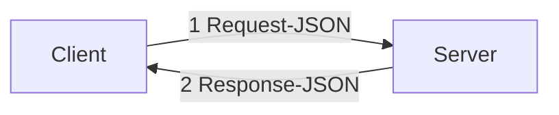
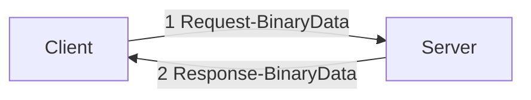

[中文](../zh/serialization.md)

[TOC]

# Serialization-Deserialization

# Overview

This article introduces the tRPC-Cpp (referred to as tRPC below) message serialization feature, and developers can learn
the following:

* How to use JSON as a message type.
* How to use binary data as a message type.

The tPRC framework uses Protocol Buffers Message as the request and response message types by default. It also
supports using tRPC protocol to transmit JSON and binary data messages.
In other worlds, JSON and binary data can be used as request and response message types.

# How to use JSON as a message type

Example: [trpc_json](../../examples/features/trpc_json)

## Basic steps



The framework currently supports using `rapidjson::Document` as the request and response message types.
In the figure above, the Client and Server use JSON as the request and response messages, and we
use `rapidjson::Document` as the request and response message types in programming.

We need to focus on the following aspects:

1. Develop a new service on the server to handle request messages of type `rapidjson::Document` and reply with response
   messages of type `rapidjson::Document`.
2. When accessing the service in 1 on the client, use `rapidjson::Document` as the request and response message types.

The basic steps are:

1. Develop a service to handle messages of type `rapidjson::Document`.
2. Register the service using the `trpc` protocol.

## Implementation

**1. Develop a new service on the server to handle request messages of type `rapidjson::Document`.**

The framework provides services to the outside world by registering services. Therefore, we need to develop a
ServiceImpl to handle messages of type `rapidjson::Document` and then reply with a response.

The framework provides the `RpcServiceImpl` interface. We only need to do two things:

1. Implement a method to handle a `rapidjson::Document` message.
2. Register the request routing, which is generally placed in the constructor.

```cpp
class DemoServiceImpl : public ::trpc::RpcServiceImpl {
 public:
  DemoServiceImpl() {
    auto handler = new ::trpc::RpcMethodHandler<rapidjson::Document, rapidjson::Document>(
        std::bind(&DemoServiceImpl::JsonSayHello, this, std::placeholders::_1, std::placeholders::_2, std::placeholders::_3));
    AddRpcServiceMethod(new ::trpc::RpcServiceMethod("JsonSayHello", ::trpc::MethodType::UNARY, handler));
  }

  ::trpc::Status JsonSayHello(const ::trpc::ServerContextPtr& context, const rapidjson::Document* request, rapidjson::Document* reply) {
    for (rapidjson::Value::ConstMemberIterator iter = request->MemberBegin(); iter != request->MemberEnd(); ++iter) {
      TRPC_FMT_INFO("json name: {}, value: {}", iter->name.GetString(), iter->value.GetInt());
    }
    reply->CopyFrom(*request, const_cast<rapidjson::Document*>(request)->GetAllocator());
    return ::trpc::kSuccStatus;
  }
};
```

**2. Register the service using the `trpc` protocol.**

Registering `DemoServiceImpl` is exactly the same as registering an tRPC service.

**Note: Use the `trpc` protocol for the `protocol` configuration item in the configuration file.**

```cpp
class DemoServer : public ::trpc::TrpcApp {
 public:
  int Initialize() override {
    const auto& config = ::trpc::TrpcConfig::GetInstance()->GetServerConfig();
    // Set the service name, which must be the same as the value of the `server:service:name` configuration item
    // in the framework configuration file, otherwise the framework cannot receive requests normally
    std::string service_name = fmt::format("{}.{}.{}.{}", "trpc", config.app, config.server, "demo_service");

    TRPC_FMT_INFO("service name:{}", service_name);

    RegisterService(service_name, std::make_shared<DemoServiceImpl>());

    return 0;
  }

  void Destroy() override {}
};
```

```yaml
# @file: trpc_cpp.yaml
#...
server:
  app: test
  server: helloworld
  admin_port: 18888
  admin_ip: 0.0.0.0
  service:
    - name: trpc.test.helloworld.demo_service
      protocol: trpc
      network: tcp
      ip: 0.0.0.0
      port: 12349
#...
```

Using an tRPC client to access `DemoServiceImpl` is also simple, just like accessing an tRPC service.

Create an `RpcServiceProxy` object `proxy` and call the `UnaryInvoke` or `AsyncUnaryInvoke` method.

```cpp
int Call() {
  ::trpc::ServiceProxyOption option;

  option.name = FLAGS_target;
  option.codec_name = "trpc";
  option.network = "tcp";
  option.conn_type = "long";
  // ...
  
  auto proxy = ::trpc::GetTrpcClient()->GetProxy<::trpc::RpcServiceProxy>(FLAGS_target, option);

  std::string req_json_str = "{\"age\":18,\"height\":180}";
  rapidjson::Document hello_req;
  hello_req.Parse(req_json_str.c_str());

  if (hello_req.HasParseError()) {
    std::cout << "json parse error: " << hello_req.GetParseError()
              << ", msg: " << rapidjson::GetParseError_En(hello_req.GetParseError()) << std::endl;
    return -1;
  }

  ::trpc::ClientContextPtr context = ::trpc::MakeClientContext(proxy);
  context->SetTimeout(1000);
  context->SetFuncName("JsonSayHello");

  rapidjson::Document hello_rsp;
  ::trpc::Status status = proxy->UnaryInvoke<rapidjson::Document, rapidjson::Document>(context, hello_req, &hello_rsp);

  if (!status.OK()) {
    std::cout << "invoke error: " << status.ErrorMessage() << std::endl;
    return -1;
  }

  for (rapidjson::Value::ConstMemberIterator iter = hello_rsp.MemberBegin(); iter != hello_rsp.MemberEnd(); ++iter) {
    std::cout << "json name: " << iter->name.GetString() << ", value: " << iter->value.GetInt() << std::endl;
  }

  return 0;
}
```

# How to use binary data as a message type

Example: [trpc_binary_data](../../examples/features/trpc_noop)



The framework currently supports using `std::string` or `::trpc::NoncontiguousBuffer` as the request and response message
types.
In the figure above, the Client and Server use binary data as the request and response messages, and we
use `std::string` or `::trpc::NoncontiguousBuffer` as the request and response message types in programming.

The specific steps are the same as the implementation process of using `rapidjson::Document` as the request
and response message types.
Let's take a look at the key fragments of the sample code. For specific details, please refer to the sample code.

```cpp
class DemoServiceImpl : public ::trpc::RpcServiceImpl {
 public:
  DemoServiceImpl() {
    auto handler1 = new ::trpc::RpcMethodHandler<std::string, std::string>(
        std::bind(&DemoServiceImpl::NoopSayHello1, this, std::placeholders::_1, std::placeholders::_2,
                  std::placeholders::_3));
    AddRpcServiceMethod(new ::trpc::RpcServiceMethod("NoopSayHello1", ::trpc::MethodType::UNARY, handler1));

    auto handler2 = new ::trpc::RpcMethodHandler<::trpc::NoncontiguousBuffer, ::trpc::NoncontiguousBuffer>(
        std::bind(&DemoServiceImpl::NoopSayHello2, this, std::placeholders::_1, std::placeholders::_2,
                  std::placeholders::_3));
    AddRpcServiceMethod(new ::trpc::RpcServiceMethod("NoopSayHello2", ::trpc::MethodType::UNARY, handler2));
  }

  // std::string is used as the request and the response.
  ::trpc::Status NoopSayHello1(const ::trpc::ServerContextPtr& context, const std::string* request, std::string* reply) {
    *reply = *request;
    return ::trpc::kSuccStatus;
  }

  // ::trpc::NoncontiguousBuffer is used as the request and the response.
  ::trpc::Status NoopSayHello2(const ::trpc::ServerContextPtr& context, const ::trpc::NoncontiguousBuffer* request, ::trpc::NoncontiguousBuffer* reply) {
    *reply = *request;
    return ::trpc::kSuccStatus;
  }
};
```
