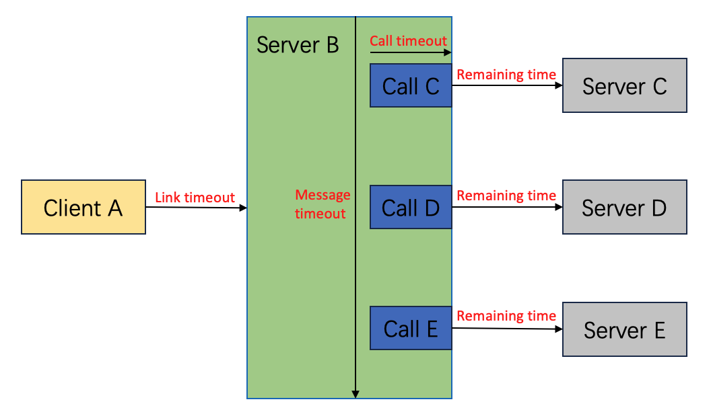

[中文](../zh/timeout_control.md)

# Overview

Timeout control is a fundamental capability of an RPC framework, enabling service calls to execute within a predefined time. It helps prevent getting stuck in endless waiting, thereby improving system availability and stability, optimizing resource utilization, and reducing inconsistent behavior between clients and servers.

This document will introduce the timeout control mechanism of tRPC-Cpp.

# Mechanism

## Overall introduction

The schematic diagram of the tRPC-Cpp timeout control mechanism is as follows.



From the diagram, we can see that timeout control is mainly influenced by the following three factors:

* **Link timeout**: The upstream caller passes its allowed timeout duration to the current service through a protocol field, indicating that the upstream only allows this time for the response. It means that within this timeout duration, the data must be returned. For example, client A calls service B with a specified link timeout.
* **Message timeout**: The maximum message processing time from receiving the request message to returning the response data is configured for the current service. This is a means for the current service to control its resource utilization. For example, the overall message timeout for requests within service B.
* **Call timeout**: The current service sets the timeout duration for each RPC request made to the downstream service, such as the individual call timeout for B calling C. A single request may involve multiple consecutive RPC calls, such as B calling C first, then sequentially calling D and E. The timeout control for these calls is independent for each RPC, ensuring individual timeout durations.

When making an actual RPC call request, **the effective timeout duration is determined as the minimum value calculated in real-time based on the three factors mentioned above**. The calculation process is as follows:

* **First, the server calculates the minimum value between the link timeout and the message timeout as the maximum processing time for the current request**. For example, if the link timeout is 2 seconds and the message timeout is 1 second, the maximum processing time for the current request would be 1 second.
* **When the server further initiates an RPC call, it calculates the minimum value between the maximum processing time for the current request and the call timeout.** For example, if the maximum processing time for the current request is 1 second and B sets a call timeout of 5 seconds when calling C, the actual effective timeout duration would be 1 second. However, if B sets a call timeout of 500ms when calling C, the actual effective timeout duration would be 500ms. This value of 500ms will also be passed to C through a protocol field, and from the perspective of server C, it will be considered as its link timeout duration. **The link timeout will be continuously propagated throughout the entire RPC call chain, gradually decreasing until it reaches 0. This ensures that the issue of infinite loop calls never occurs.**
* **Since each RPC call consumes a certain amount of time, the maximum processing time for the current request needs to be calculated in real-time, taking into account the remaining available time.** For example, if B calling C actually takes 200ms, then after the call ends, the maximum processing time will be reduced to 800ms. When initiating the second RPC call, it is necessary to calculate the minimum value between the remaining request timeout duration and the call timeout. For example, if B calling D has a call timeout of 1 second, the effective timeout duration will also be 800ms.

Note:

1. The communication protocol needs to support carrying link timeout to enable the server to be aware of the client's timeout duration. For example, the `trpc` protocol.
2. When the server further initiates an RPC call, it needs to use the `MakeClientContext` interface to construct a ClientContext based on the ServerContext, automatically calculating the remaining call time.

## Configuration

### Link timeout

The link timeout is by default propagated through protocol fields from the originating service to downstream services. The server can configure whether to enable the full link timeout mechanism using the `'disable_request_timeout'` option under `'server'`. The default value is `false`, which means it will inherit the upstream link timeout. Setting it to `true` disables the mechanism, indicating that the link timeout passed through the protocol from upstream calls to the current service will be ignored.

```yaml
server:
  service:
    - name: trpc.app.server.service
      disable_request_timeout: false
```

### Message timeout

Each service can configure the maximum processing timeout for all its requests using the `'timeout'` option under `'server'`. If not set, the default value is UINT32_MAX.

```yaml
server:
  service:
    - name: trpc.app.server.service
      timeout: 1000  # unit: ms
```

### Call timeout

Each client can configure the call timeout by using the `'timeout'` option under `'client'`. If not set, the default value is UINT32_MAX.

```yaml
client:
  service:
    - name: trpc.app.server.service
      timeout: 500  # unit: ms
```

In addition to this configuration option, there are other ways to set the call timeout in the framework.

1. When obtaining a proxy through `GetProxy`, if the timeout is explicitly specified in the options, the code-defined timeout will take precedence over the one specified in the configuration file. However, we recommend using the configuration file approach as it is more flexible and intuitive.
2. Clients can individually set the timeout for each call in the code by using the `SetTimeout` interface of the ClientContext.

    ```cpp
    void SetTimeout(uint32_t value, bool ignore_proxy_timeout = false);
    ```

    In this case, the final call timeout is determined by both the timeout configuration of the proxy and the value set by SetTimeout:
    * When ignore_proxy_timeout is set to false, the framework will take the smaller value between the two as the call timeout.
    * When ignore_proxy_timeout is set to true, the timeout configuration of the proxy is ignored, and the value set by SetTimeout is used instead.

## Extension feature

### Custom timeout handling function

The framework provides a callback interface for handling requests in case of timeouts, allowing users to perform additional actions such as printing more logs or reporting metrics data to facilitate issue identification.

#### Server-side timeout handling function

The types of server-side timeout handling function are as follows:

```cpp
using ServiceTimeoutHandleFunction = std::function<void(const ServerContextPtr& context)>;
```

Users need to set a custom timeout handling function for the service during service initialization.

```cpp
// custom timeout handling function
void UserServiceTimeoutFunc(const trpc::ServerContextPtr& context) {
  TRPC_LOG_ERROR("server status:" << context->GetStatus().ToString());
}

int RouteServer::Initialize() {
  ...
  trpc::ServicePtr route_service(std::make_shared<RouteService>());
  // set timeout handling function
  route_service->SetServiceTimeoutHandleFunction(UserServiceTimeoutFunc);
  RegisterService(service_name, route_service);
  return 0;
}
```

#### Client-side timeout handling function

The types of client-side timeout handling function are as follows:

```cpp
using ClientTimeoutHandleFunction = std::function<void(const ClientContextPtr&)>;
```

Users need to set a custom client timeout handling function when initializing the proxy.

```cpp
// custom timeout handling function
void UserClientTimeoutFunc(const trpc::ClientContextPtr& context) {
  TRPC_LOG_ERROR("client status:" << context->GetStatus().ToString());
}

{
  // ...
  // set timeout handling function
  trpc::ServiceProxyOption option;
  option.proxy_callback.client_timeout_handle_function = UserClientTimeoutFunc;
  GreeterProxyPtr proxy =
        trpc::GetTrpcClient()->GetProxy<trpc::test::helloworld::GreeterServiceProxy>(service_name, &option);
 // ...
}
```

# FAQ

## Why does it show a timeout failure even though I set a very large timeout value and the actual execution time is very short?

The framework imposes a maximum processing time limit for each received request. The timeout for each backend RPC call is dynamically calculated based on the remaining maximum processing time and the call timeout. In this case, it is highly likely that the previous serial RPC calls have already consumed a significant amount of time, leaving insufficient time for the current RPC call.

## Why is the timeout duration 5 seconds even though the client did not configure a timeout?

In the case where neither the client proxy nor the ClientContext has a timeout set, the framework will set the actual timeout duration to 5 seconds instead of an infinite value.
