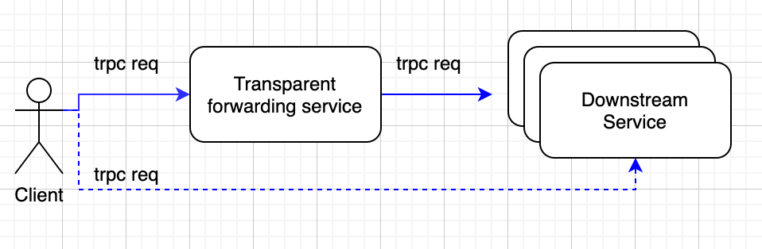

[中文](../zh/transparent_service.md)

[TOC]

# Overview

In certain special scenarios, such as in the access layer service, users expect to transparently forward business data to downstream services to avoid performance loss caused by data serialization. The request processing flow is as follows:

From the above diagram, it can be seen that the client request (`trpc req`) is forwarded to the downstream service (as shown by solid lines) without any changes after passing through the transparent forwarding service. The effect of this process is the same as directly accessing the downstream service (as shown by dashed lines). For the client, the transparent forwarding service is completely transparent and imperceptible.
**Currently, only transparent forwarding of the trpc protocol is supported**。

# Principle

To improve the performance of the transparent forwarding service, the design principle is as follows:

- When the transparent forwarding service receives the request binary data, it only parses the protocol header to obtain the verification information. The body data (i.e., business data) is not parsed and is directly stored in its binary format.
- When the transparent forwarding service sends a request to the downstream, it only encodes the protocol header. The body data is retrieved from the previously stored binary format, eliminating the need for encoding.
- The process of the downstream reply returning to the upstream client through the transparent forwarding service is the same as the request. Therefore, the serialization and deserialization of the body data are reduced by one each in the entire process, thereby improving performance.

# Implementation

Since the transparent forwarding service does not rely on Protobuf files, it cannot generate stub code. Therefore, users need to define the transparent forwarding service themselves. As it supports both synchronous and asynchronous operations, I will provide two separate sections.

## Synchronous code for the transparent forwarding relay service

Here, we will use [transparent_service](../../examples/features/trpc_transparent/proxy/transparent_service.cc) as an example to explain some of the core logic.

```c++
TransparentServiceImpl::TransparentServiceImpl() {
  // register transparent service method handler
  // method name must be ::trpc::kTransparentRpcName
  AddRpcServiceMethod(new ::trpc::RpcServiceMethod(
      ::trpc::kTransparentRpcName, ::trpc::MethodType::UNARY,
      new ::trpc::ForwardRpcMethodHandler(std::bind(&TransparentServiceImpl::Forward, this, std::placeholders::_1,
                                                    std::placeholders::_2, std::placeholders::_3))));

  proxy_ptr_ =
      ::trpc::GetTrpcClient()->GetProxy<::trpc::RpcServiceProxy>("trpc.test.helloworld.Greeter");
}

::trpc::Status TransparentServiceImpl::Forward(::trpc::ServerContextPtr context, ::trpc::NoncontiguousBuffer&& request,
                                               ::trpc::NoncontiguousBuffer& response) {
  TRPC_FMT_INFO("remote addr: {}:{}", context->GetIp(), context->GetPort());

  if (::trpc::IsRunningInFiberWorker()) {
    return FiberForward(context, std::move(request), response);
  }

  return FutureForward(context, std::move(request), response);
}

::trpc::Status TransparentServiceImpl::FiberForward(::trpc::ServerContextPtr context,
                                                    ::trpc::NoncontiguousBuffer&& request,
                                                    ::trpc::NoncontiguousBuffer& response) {
  ::trpc::ClientContextPtr client_context = ::trpc::MakeTransparentClientContext(context, proxy_ptr_);
  client_context->SetTimeout(3000);

  ::trpc::Status status = proxy_ptr_->UnaryInvoke(client_context, request, &response);

  if (!status.OK()) {
    TRPC_FMT_ERROR("ret code: {}, func codec: {}, error msg: {}", status.GetFrameworkRetCode(),
                   status.GetFuncRetCode(), status.ErrorMessage());
  } else {
    TRPC_FMT_INFO("response size: {}", response.ByteSize());
  }

  return status;
}
```

The important points to note in the above transparent forwarding relay service are as follows:

- The function name for registering service methods: Since transparent forwarding cannot generate stub code, there is no corresponding function name. To address this issue, the framework defines **::trpc::kTransparentRpcName** (line 7) to indicate the default function name for transparent forwarding. Since the function name and the corresponding function handler have a hash mapping relationship, when the function name is specified, the corresponding function handler is unique. This also means that **only one transparent forwarding function can exist in a service**. For example, in the `TransparentService`, there can only be one `Forward` method to handle transparent forwarding. If another transparent forwarding method is added, **::trpc::kTransparentRpcName** will be mapped to the new method during registration, resulting in the inability to find the `Forward` method.
- Client and server context conversion: In the transparent forwarding relay service, the client's context must be generated using **MakeTransparentClientContext**.
- Setting up the client `ServiceProxy`: Since transparent forwarding cannot generate stub code, it cannot generate its own `ServiceProxy`. Therefore, the framework's **trpc::RpcServiceProxy** must be used.

## Asynchronous code for the transparent forwarding relay service

In the previous section, we introduced synchronous code writing using `FiberForward`. Now, we will introduce asynchronous code writing using `FutureForward`. The code is as follows:

```c++
::trpc::Status TransparentServiceImpl::FutureForward(::trpc::ServerContextPtr context,
                                                     ::trpc::NoncontiguousBuffer&& request,
                                                     ::trpc::NoncontiguousBuffer& response) {
  context->SetResponse(false);

  ::trpc::ClientContextPtr client_context = ::trpc::MakeTransparentClientContext(context, proxy_ptr_);
  client_context->SetTimeout(3000);

  proxy_ptr_->AsyncUnaryInvoke<::trpc::NoncontiguousBuffer, ::trpc::NoncontiguousBuffer>(client_context, request)
      .Then([context, this](::trpc::Future<::trpc::NoncontiguousBuffer>&& fut) mutable {
        trpc::Status status;
        trpc::NoncontiguousBuffer reply;

        if (fut.IsFailed()) {
          status.SetErrorMessage(fut.GetException().what());
          status.SetFuncRetCode(-1);
          TRPC_FMT_ERROR("error msg: {}", fut.GetException().what());

          std::string str(fut.GetException().what());
          reply = trpc::CreateBufferSlow(str.c_str());
        } else {
          reply = fut.GetValue0();

          TRPC_FMT_INFO("response size: {}", reply.ByteSize());
        }

        context->SendTransparentResponse(status, std::move(reply));
        return trpc::MakeReadyFuture<>();
      });

  return trpc::kSuccStatus;
}
```

The asynchronous interface uses [Future](../../trpc/common/future/future.h) to achieve asynchronous behavior. When the `AsyncUnaryInvoke` interface is executed, the `FutureForward` function stack will be exited directly. The callback function in `Then` will be scheduled by the framework to be executed in another thread, achieving the asynchronous effect. Therefore, when using the asynchronous interface, the following points should be noted:

- In `Then`, stack variables captured by `FutureForward` should not be referenced, otherwise it may result in a coredump.
- Since `FutureForward` will return first, and the response will be obtained asynchronously in `Then`. Therefore, it is necessary to set **context->SetResponse(false)**, where **false** indicates that the framework should not immediately return the response.
- After obtaining the response asynchronously, it needs to be returned to the upstream. This must be done through **context->SendTransparentResponse(status, std::move(reply))**
