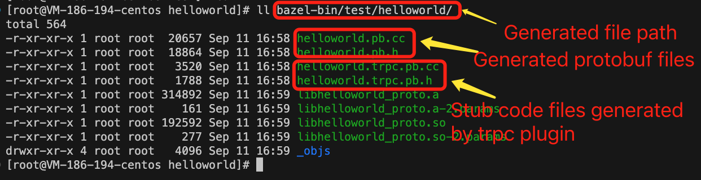

[中文](../zh/trpc_protocol_service.md)

# Overview

Compared to the [quick_start](./quick_start.md)t, this document focuses more on server-side development using the tRPC protocol and provides more comprehensive and detailed content. Developers can learn from this article about

- The way to generate tRPC stub code using Protobuf IDL files.
- The basic process of tRPC protocol server-side development
- To enable the use of server-side plugins.
- Some features of the framework, such as setting callbacks during service initialization.

Therefore, using the tRPC protocol as an example, this document connects the complete server-side program development process. Other protocol server development documents follow a parallel relationship in terms of format, but focus on introducing the specific features of each corresponding protocol.

For a more comprehensive tRPC protocol reference, please refer to [trpc_protocol_design](https://github.com/trpc-group/trpc/blob/main/docs/en/trpc_protocol_design.md). The tRPC protocol is the default protocol and is also recommended for practical use.

# Generate service stub code based on Protobuf

This chapter introduces the process of generating stub code based on Protobuf files. If the user does not need Protobuf files, they can ignore this section.

## Write Protobuf IDL file

Here, [helloworld.proto](../../examples/helloworld/helloworld.proto) is used as an example.

```pb
syntax = "proto3";

package trpc.test.helloworld;

service Greeter {
  rpc SayHello (HelloRequest) returns (HelloReply) {}
}

message HelloRequest {
   string msg = 1;
}

message HelloReply {
   string msg = 1;
}
```

This file defines a `Service` called `Greeter`, which contains an `rpc Method` called `SayHello`. The `SayHello` method takes a request of type `HelloRequest` and returns a response of type `HelloReply`. Both `HelloRequest` and `HelloReply` have a field called msg of type string (it is not required for the field names in the request and response to be the same).

In addition, there are a few other points to note:

- The `syntax` is recommended to be set as `proto3`. tRPC is default based on proto3, but it also supports proto2.
- The recommended format for the `package` content is `trpc.{app}.{server}`, where `app` is your application name and `server` is your service process name. The scaffolding generation tool will parse Protobuf the `app` and `server` from the Protobuf file to generate the project. It is suggested to define your own `app` and `server` names for the `helloworld.proto` file to facilitate service deployment.
- When defining `rpc` methods, a `server` (service process) can have multiple services (grouping of `rpc` logic). Typically, there is one `service` per `server`, and a `service` can have multiple `rpc` calls.
- When writing Protobuf, it is necessary to adhere to [the official Google specification](https://protobuf.dev/programming-guides/style/).

The above defines a standard Protobuf IDL file. Next, we will build the project code.

## Build the project code based on the Protobuf IDL file

If the user has already built the project, this section can be skipped, and you can proceed to the next section.
To facilitate project building, the framework provides the trpc-cmdline tool for quickly building projects based on Protobuf IDL files. In this case, execute the following command:
```sh
#Here, 'trpc' is the trpc-cmdline tool installed during your environment setup. '-l' specifies the language as C++, 'protofile' is the proto file used for generating stub code.
trpc create -l cpp --protofile=helloworld.proto
```

After executing the command, a `helloworld` project will be generated in the current directory with the following directory structure.

```txt
.
├── build.sh
├── clean.sh
├── client
│   ├── BUILD
│   ├── conf
│   │   ├── trpc_cpp_fiber.yaml
│   │   └── trpc_cpp_future.yaml
│   ├── fiber_client.cc
│   └── future_client.cc
├── proto
│   ├── BUILD
│   ├── helloworld.proto
│   └── WORKSPACE
├── README.md
├── run_client.sh
├── run_server.sh
├── server
│   ├── BUILD
│   ├── conf
│   │   ├── trpc_cpp_fiber.yaml
│   │   └── trpc_cpp.yaml
│   ├── server.cc
│   ├── server.h
│   ├── service.cc
│   └── service.h
└── WORKSPACE
```

Introducing the project directory:

- build.sh and clean.sh are used for building and cleaning the project, respectively. run_client.sh and run_server.sh are used to start the client and server tests.
- The code in the server directory is related to the implementation of this service, while the code in the client directory is used for testing the service locally.
- `WORKSPACE` is used for configuring the workspace required for `bazel` compilation. Its contents are as follows:

  ```bzl
  load('@bazel_tools//tools/build_defs/repo:git.bzl', 'git_repository')
  git_repository(
      name = "trpc_cpp",
      tag = "{trpc_ver}", # Specify the version, usually recommending the latest tag.
      remote = "{trpc_cpp_addr}", # Specify the git address for trpc-cpp.
      # for example
      # tag = "v1.0.0",
      # remote = "https://github.com/trpc-group/trpc-cpp.git",
  )
  load("@trpc_cpp//trpc:workspace.bzl", "trpc_workspace")

  trpc_workspace()
  ```

  Here, you must execute `trpc_workspace` to load the `tRPC-Cpp` framework and load all the necessary third-party libraries.

## Generate tRPC stub code corresponding to the IDL file

The framework supports two compilation methods: `bazel` and `cmake`. It is recommended to use the `bazel` compilation method. `bazel` compilation requires a `BUILD` file to be present in each directory to set the compilation rules.

### Write the BUILD file

For the convenience of explanation, let's take the `BUILD` file under the `test/helloworld` directory in the generated project as an example (if you are creating your own project, you also need to write the `BUILD` file in the following way), as follows:

```bzl
load("@trpc_cpp//trpc:trpc.bzl", "trpc_proto_library")

# ...

trpc_proto_library(
    name = "helloworld_proto",
    srcs = ["helloworld.proto"],
    use_trpc_plugin=True,
    rootpath="@trpc_cpp",
    # Depend on other protobufs. If there are no dependencies, you can omit the deps section.
    deps = [
        ":deps_proto",
    ],
)

# The compilation rules for the protobuf being depended on. If srcs is empty, it can be omitted. It is written here for better understanding and does not affect usage.
trpc_proto_library(
    name = "deps_proto",
    srcs = [], 
)

# Service compilation rules, depending on the above helloworld_proto.
cc_library(
    name = "greeter_service",
    srcs = ["greeter_service.cc"],
    hdrs = ["greeter_service.h"],
    deps = [ 
        "//test/helloworld:helloworld_proto",
        # ...
    ],
)
# ...
```

Points to note are as follows:

- The load function (line 1) loads the rule which is **trpc_proto_library** for generating stub code. Here, `@trpc_cpp` represents the remote dependency on the trpc-cpp repository in the current project. For more details, refer to [bazel build](https://bazel.build/)

- The `trpc_proto_library` parameters:
    `use_trpc_plugin` must be **True**, indicating the generation of service stub code, which will result in files with the **.trpc.h/.trpc.cc** suffix.
    `rootpath` represents **remote dependency on the trpc-cpp repository** in the project, which is the name of the repository pulled in the `WORKSPACE` file.
    `deps` represents the dependencies on other protobuf files, which can be omitted if there are none.

### Compile and generate stub code

```sh
# bazel build your_trpc_pb_target
bazel build test/helloworld:helloworld_proto
```

The corresponding stub code will be automatically generated in the **bazel-bin/test/helloworld/** directory. The generated files are as follows:

If users are interested, they can take a look at the server-side implementation of the generated stub code (`helloworld.trpc.pb.h/helloworld.trpc.pb.cc` files). However, since stub code generation is made easy, the focus can now be shifted to the business logic that needs to be implemented.

# Write service code

The basic process of writing server-side code in the framework is as follows:

**step 1 Implement the Service for the specific protocol**
**step 2 Implement the main program class Server**
**step 3 Create and start the main program class Server**
**step 4 Provide configuration and start**

During `step 1`, when implementing the specific protocol `Service`, and `step 4`, when providing corresponding configurations, the entire process will be specialized based on the actual protocol. Below, we will introduce the process of writing a service using the generated stub code project helloworld as an example (If the user does not require Protobuf and cannot generate stub code, they can refer to the example: [trpc_noop](../../examples/features/trpc_noop/server/demo_server.cc) to write the server).

## Implement the Service for the specific protocol

The above will generate two types of server APIs, namely synchronous and asynchronous forms, which are `trpc::test::helloworld::Greeter` and `trpc::test::helloworld::AsyncGreeter`, respectively. Below, we will introduce these two approaches separately, as well as the usage of the context `::trpc::ServerContextPtr` in their interface implementations.

### Synchronous API

First, include the required `helloworld.trpc.pb.h` header file (as seen in line 1), and inherit the `Greeter` class generated by the stub code. Then, declare the `SayHello` function to be overridden using the `override` keyword.

```c++
#include "test/helloworld/helloworld.trpc.pb.h"

// ... omit code
class GreeterServiceImpl : public ::trpc::test::helloworld::Greeter {
public:
  ::trpc::Status SayHello(::trpc::ServerContextPtr context,
                          const ::trpc::test::helloworld::HelloRequest* request,
                          ::trpc::test::helloworld::HelloReply* reply) override {
    // Implement business logic here
    TRPC_FMT_INFO("got req");
    std::string hello("hello");
    reply->set_msg(hello + request->msg());
    // Implement business logic end

    return ::trpc::kSuccStatus;
  }
};
```

The `SayHello` method is the name of the RPC method defined in the Protobuf file. If there are multiple methods, multiple methods will be generated here, and the user can rewrite each method according to their business needs. From the inheritance, it can be seen that the parent class is `::trpc::test::helloworld::Greeter` (defined in **bazel-bin/test/helloworld/helloworld.trpc.pb.h**), which inherits from `::trpc::RpcServiceImpl` (refer to: [rpc_service_impl](../../trpc/server/rpc/rpc_service_impl.h)). Therefore, it can be traced that `GreeterServiceImpl` is a subclass of `::trpc::Service` (refer to: [service](../../trpc/server/service.h)).

In the above example, the value of `reply` is directly set in the `SayHello` method, which is a synchronous response. If the user wants to reply to the client later on their own, they can use asynchronous response. Please refer to: [Asynchronous response](./server_guide.md#Asynchronous-response) for more details.

### Asynchronous API

Similar to the synchronous API, you need to include the `helloworld.trpc.pb.h` header file first (as seen in line 1).

```c++
#include "test/helloworld/helloworld.trpc.pb.h"

// ... omit code
class AsyncGreeterServiceImpl : public ::trpc::test::helloworld::AsyncGreeter {
public:
  ::trpc::Future<::trpc::test::helloworld::HelloReply> SayHello(const ::trpc::ServerContextPtr& context, 
                                                                const ::trpc::test::helloworld::HelloRequest* request) override {
    // Implement business logic here
    TRPC_FMT_INFO("got req");
    trpc::test::helloworld::HelloReply rsp;
    rsp.msg("FutureResponse");
    // Implement business logic end

    return ::trpc::MakeReadyFuture<HelloReply>(std::move(rsp));
  }
};
```

### The use of context in a service interface

Different from the synchronous interface, the asynchronous `SayHello` interface returns a `::trpc::Future` template class. The ultimate parent class of `::trpc::test::helloworld::AsyncGreeter` is also `::trpc::Service`.

#### Retrieve information through the ServerContext

Retrieve various information through the `context` (caller's IP address, port, request ID, etc.). Refer to: [ServerContext](../../trpc/server/server_context.h). Pseudocode example:

```c++
class GreeterServiceImpl : public ::trpc::test::helloworld::Greeter {
public:
  ::trpc::Status SayHello(::trpc::ServerContextPtr context,
                          const ::trpc::test::helloworld::HelloRequest* request,
                          ::trpc::test::helloworld::HelloReply* reply) override {
    // Retrieve information through ServerContext
    TRPC_LOG_INFO("remote address:" << context->GetIp() << ":" << context->GetPort());
    TRPC_LOG_INFO("request id:" << context->GetRequestId());
    // ...
    return ::trpc::kSuccStatus;
  }
 // ... omit some code
};
```

#### Server-side data transmission

If the user wants to pass data that needs to be transmitted to the client in `SayHello`, they can refer to the following pseudocode:

```c++
class GreeterServiceImpl : public ::trpc::test::helloworld::Greeter {
public:
  ::trpc::Status SayHello(::trpc::ServerContextPtr context,
                          const ::trpc::test::helloworld::HelloRequest* request,
                          ::trpc::test::helloworld::HelloReply* reply) override {
  // Set the transmission data to ServerContext
  context->AddRspTransInfo("key3", "value3");
  // ...
  return ::trpc::kSuccStatus;
}
```

#### Handling a server that listens to both TCP and UDP on a single port

If this feature is needed, you can use `context->GetNetType()` in `SayHello` to obtain the network type. Here is the pseudocode:

```c++
class GreeterServiceImpl : public ::trpc::test::helloworld::Greeter {
public:
  ::trpc::Status SayHello(::trpc::ServerContextPtr context,
                          const ::trpc::test::helloworld::HelloRequest* request,
                          ::trpc::test::helloworld::HelloReply* reply) override {
    if (context->GetNetType() == ::trpc::ServerContext::NetType::kUdp) {
      TRPC_LOG_INFO("udp request");
    } else if (context->GetNetType() == ::trpc::ServerContext::NetType::kTcp) {
      TRPC_LOG_INFO("tcp request");
    }
    reply->set_rsp_msg("receive");
    // ...
    return ::trpc::kSuccStatus;
  }
 // ... omit some code
};
```

## Implementing the main program class Server

The main program class inherits from `trpc::TrpcApp` and overrides the required methods such as `Initialize`, `Destroy`, `RegisterPlugins`, etc. (refer to: [trpc_app](../../trpc/common/trpc_app.h)). The basic usage involves overriding the `Initialize` method and implementing the registration of specific `Service`. Here is the code:

```c++
// ... omit code
int HelloworldServer::Initialize() override {
  const auto& config = ::trpc::TrpcConfig::GetInstance()->GetServerConfig();
  // Set the service name, which must be the same as the value of the `/server/service/name` configuration item
  // in the configuration file, otherwise the framework cannot receive requests normally.
  std::string service_name1 = fmt::format("{}.{}.{}.{}", "trpc", config.app, config.server, "Greeter");

  TRPC_FMT_INFO("service name1:{}", service_name1);

  ::trpc::ServicePtr my_service1(std::make_shared<GreeterServiceImpl>());
  RegisterService(service_name1, my_service1);

  return 0;
}
```

Registering a service using the interface `RegisterService(service_name1, my_service1)`, where **service_name1** is the name of the `::trpc::Service`, and **my_service1** is an instance of the specific `::trpc::Service`. In most scenarios, it is sufficient to override `Initialize` and implement the registration of specific `Service` there. In addition to that, you can also initialize some special scenario-specific logic.

### Fetching business configuration in the Initialize method

If users want to fetch remote configurations, they can refer to the following pseudocode:

``` c++
// initialize
int HelloworldServer::Initialize() override {
    // Fetching remote configuration.
    LoadRemoteConfig(...); // This interface is pseudocode and not available in the framework.
    
    // Registry service
    RegistryService(service_name, greeter_service);
    
    return 0;
}
```

### Implementing pre-warming logic in the Initialize method

If users want to perform some pre-warming before registering the `Service`, they can handle the pre-warming logic in the `Initialize` phase. Here is the pseudocode:

```c++
int HelloworldServer::Initialize() override {
    // Execute the code for business pre-warming first, such as loading large data, etc.
    DoPreHotWork(); // This interface is pseudocode and not available in the framework.
    
    // After completing the pre-warming tasks mentioned above, proceed to register the service.
    RegistryService(service_name, greeter_service);
    
    return 0;
}
```

### Register custom callbacks in the Initialize method

The framework provides custom callback features, such as:

- Dispatch method for routing user-registered requests to processing threads.
- Custom callback for receiving connections.
- Custom callback for handshake connection establishment.
- ...

The settings for these callbacks can also be done in the `Initialize` phase. Here is an example pseudocode for setting a specific request to be handled by a dedicated thread (reference: [request_dispatcher](../../examples/features/request_dispatch/server/demo_server.cc)):

```c++
int Initialize() override {
  const auto& config = ::trpc::TrpcConfig::GetInstance()->GetServerConfig();
  // Set the service name, which must be the same as the value of the `/server/service/name` configuration item
  // in the configuration file, otherwise the framework cannot receive requests normally.
  std::string service_name = fmt::format("{}.{}.{}.{}", "trpc", config.app, config.server, "Greeter");
  TRPC_FMT_INFO("service name:{}", service_name);

  trpc::ServicePtr service(std::make_shared<GreeterServiceImpl>());

  service->SetHandleRequestDispatcherFunction(DispatchRequest);

  RegisterService(service_name, service);

  return 0;
}

```

### Register custom management commands in the Initialize method

You can also customize management commands in the `Initialize` phase. Here is an example pseudocode:

```c++
// MyAdminHandler impl
class MyAdminHandler : public trpc::AdminHandlerBase {
 public:
  MyAdminHandler() { description_ = "This is my own command"; }
  void CommandHandle(trpc::http::HttpRequestPtr req, rapidjson::Value& result,
                     rapidjson::Document::AllocatorType& alloc) override {
    result.AddMember("message", "this is just a test handler", alloc);
  }
};

int Initialize() override {
    RegisterCmd(trpc::http::OperationType::GET, "/myhandler", new MyAdminHandler);
    
    // other code，such as: RegistryService
    return 0;
}

```

## Create and start the main program class Server

 ```c++
// ... omit code
int main(int argc, char** argv) {
   test::helloworld::HelloworldServer helloworld_server;
   helloworld_server.Main(argc, argv);
   helloworld_server.Wait();

   return 0;
 }
 ```

In the `main` function, instantiate the `HelloWorldServer` object to start the server. Once the server-side code is written, compile it to generate the server program. You can use the `build.sh` script to compile the entire project, or you can directly run it.

 ```sh
bazel build ...
 ```

## Start the server by configuration

You can run the server using the `run_server.sh` script or by directly executing the server program.

 ```sh
bazel-bin/test/helloworld/helloworld --config=test/helloworld/conf/trpc_cpp_fiber.yaml
 ```

Two types of configurations are provided in the `test/helloworld/conf` directory of the stub code project `helloworld`. You can choose either one to use. Here, we have selected `trpc_cpp_fiber.yaml`. Below is a brief introduction of the important points to note in the configuration.

### Service configuration

```yaml
server:
  app: test
  server: helloworld
  admin_port: 6666
  admin_ip: 0.0.0.0
  service:
    - name: trpc.test.helloworld.Greeter
      protocol: trpc
      network: tcp 
      ip: 0.0.0.0
      port: 54321
```

The `service_name` parameter in the `RegisterService(service_name, service)` interface for service registration needs to be consistent with the **server-service-name** here (i.e., `trpc.test.helloworld.Greeter`). The first field is by default `trpc`, the second and third fields are based on the `app` (line 2) and `server` (line 3) configurations mentioned above, and the fourth field is the user-defined service name (i.e., `Greeter`) mentioned in this text.

### Plugin configuration

The framework integrates with various service governance platforms, such as metrics, log, telemetry, etc., through plugins. Framework plugins are often used in conjunction with [filter](./filter.md), so it is necessary to configure the `filter` in the `server` configuration (each interceptor itself will have a certain degree of performance loss, so it is recommended to only configure the interceptors that are needed). An example of the configuration is as follows:

```yaml
server:
  app: test
  server: helloworld
  service:
    - name: trpc.test.helloworld.Greeter
      protocol: trpc
      network: tcp 
      ip: 0.0.0.0
      port: 54321
      filter:
        - prometheus
        - tpstelemetry
plugins:
  log:
    default:
      - name: default
        sinks:
          local_file:
            filename: trpc_fiber_server.log
  metrics:
    prometheus:
      histogram_module_cfg:
        - 1
        - 5
        - 10
      const_labels:
        const_key1: const_value1
        const_key2: const_value2
  telemetry:
    tpstelemetry:
      addr: 127.0.0.1:20001
      protocol: http
      tenant_id: default
      report_req_rsp: true
      sampler:
        fraction: 0
      metrics:
        enabled: true
        registry_endpoints: ["127.0.0.1:20002"]
      logs:
        enabled: true
        level: "info"
```

From the configuration, it can be seen that different types of plugins can exist under the same category. For example, the `metrics` plugin mentioned above is `prometheus`, and if there are other types of monitoring plugins, they can also be configured under the `metrics` field. Additionally, for a plugin to take effect, the corresponding plugin name must be configured in the `filter` field (line 10) under the `service`. It is worth noting that the log plugin is a bit special and is not configured in the `filter`. This is mainly because logging is actively called by the user and does not work passively through the `filter`. For more information on configuration, please refer to [framework_config_full](./framework_config_full.md)

# FAQ

## If the RegistryService is not configured correctly in the configuration file, it can lead to an Aborted error during startup

If the service fails to start and is aborted, you may find the following log printout in the log file:

```txt
[2021-02-27 15:14:51.398] [thread 23865] [error] [trpc/server/trpc_server.cc:168] service_name:trpc.test.helloworld.Greeter not found.
[2021-02-27 15:14:51.398] [thread 23865] [critical] [trpc/server/trpc_server.cc:169] assertion failed: service_adapter_it != service_adapters_.end()
```

Currently, the server requires the registered service to be correctly configured in the configuration file. Otherwise, it will prompt a startup failure.
