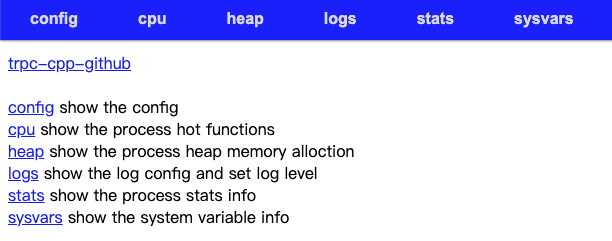

[English](../en/admin_service.md)

# 前言

tRPC-Cpp内置了一个基于HTTP协议的管理服务，提供一组运维管理的接口，方便用户查看和修改服务的状态。用户可以通过浏览器或自行构造HTTP请求来调用这些管理命令。

这篇文档介绍管理服务的使用，开发者可以了解到如下内容：

* 如何开启管理服务
* 管理服务提供的基础功能：
  * 查看框架版本、配置
  * 查看、修改框架的日志级别
  * 查看服务端的统计信息，如连接数、请求数、延时信息等
  * 查看框架和用户定义的tvar变量
  * 采集CPU和内存等资源的使用情况，用于查看和分析系统
  * 查看rpcz信息
  * 获取Prometheus监控数据
* 如何自定义管理命令

# 开启管理服务

tRPC-Cpp 默认是不启动管理服务的。若要开启，用户需要在框架配置文件中显式对`“server”`的`“admin_ip”`和`“admin_port”`进行配置，同时保证admin_port不为0。例如：

```yaml
global:
  ...
server:
  ...
  admin_ip: 0.0.0.0
  admin_port: 8889
```

# 内置管理命令

框架内置了一组方便用户查看和修改服务状态的管理命令。

## 访问方式

框架内置的管理命令有两种调用方式：

### 通过浏览器访问

用户可以在浏览器中输入：`http://admin_ip:admin_port`，访问tRPC-Cpp管理服务的web主页。然后在主页上点击各个模块对应的链接来完成操作。



主页上各个模块对应的功能如下：

| 模块 | 作用 |
| ------ | ------ |
| config | 查看框架的配置 |
| cpu | 查看CPU使用情况 |
| heap | 查看内存使用情况 |
| logs | 查看和修改日志级别 |
| stats | 查看服务端统计信息，如连接数、请求数、延时等 |
| sysvars | 查看系统资源信息，如CPU配置、负载、当前进程的IO和内存使用情况等 |

### 自行构造HTTP请求调用

用户可以自行构造HTTP请求来调用框架提供的管理命令，例如通过curl工具来调用。可调用的管理命令列表如下：

| 命令 | HTTP方法 | 参数 | 作用 |
| ------ | ------ | ------ | ------ |
| /cmds | GET | 无 | 查看管理命令列表，包括框架内置的和用户自定义的全部命令 |
| /version | GET | 无 | 查看框架版本信息 |
| [/cmds/loglevel](#查看日志级别) | GET | [logger](#查看日志级别) | 查看日志级别 |
| [/cmds/loglevel](#修改日志级别) | PUT | [logger, value](#修改日志级别) | 修改日志级别 |
| [/cmds/reload-config](#重新加载框架配置) | POST | 无 | 重新加载框架配置 |
| [/cmds/stats](#查看服务端统计信息) | GET | 无 | 查看服务端统计信息，如连接数、请求数、延时等 |
| [/cmds/var](#查看框架和用户自定义的tvar变量) | GET | 无 | 查看框架和用户自定义的tvar变量 |
| [/cmds/profile/cpu](#cpu使用情况信息采集) | POST | [enable](#cpu使用情况信息采集) | 采集CPU使用情况 |
| [/cmds/profile/heap](#内存使用情况信息采集) | POST | [enable](#内存使用情况信息采集) | 采集内存使用情况 |
| [/cmds/rpcz](#查看 rpcz 信息) | GET | 详见[rpcz 使用文档](./rpcz.md) | 查看rpcz信息 |
| [/metrics](#获取prometheus监控数据) | GET | 无 | 获取Prometheus监控数据 |
| [/client_detach](#断开与某个客户端地址的连接) | POST | [service_name, remote_ip](#断开与某个客户端地址的连接) | 断开与某个客户端地址的连接 |

## 使用介绍

本节对内置管理命令主要功能的使用方法进行介绍。由于管理页面上能完成的操作，基本上都可以通过自行构造HTTP请求来访问，所以我们只详细介绍构造HTTP请求的访问方式（以curl工具为例进行展示），对应的浏览器使用方式在页面上找到对应的模块点击操作即可。

### 查看/修改日志级别

#### 查看日志级别

对应接口：`GET /cmds/loglevel`

参数：

| 参数名 | 类型 | 描述 | 是否必填 |
| ------ | ------ | ------ | ------ |
| logger | string | 要查询的logger名 | 否，不设置则默认为”default“ |

使用例子：

```shell
# 查询 default logger 的日志级别，返回结果中的“level”即为日志级别
$ curl http://admin_ip:admin_port/cmds/loglevel?logger=default
{"errorcode":0,"message":"","level":"INFO"}
# 查询一个不存在的logger，返回错误信息
$ curl http://admin_ip:admin_port/cmds/loglevel?logger=not_exist
{"errorcode":-5,"message":"get level failed, does logger exist?"}
```

#### 修改日志级别

对应接口：`PUT /cmds/loglevel`

参数：

| 参数名 | 类型 | 描述 | 是否必填 |
| ------ | ------ | ------ | ------ |
| logger | string | 要查询的logger名 | 否，不设置则默认为”default“ |
| value | string | 新的日志级别，取值范围：TRACE，DEBUG，INFO，WARNING，ERROR，CRITICAL | 是 |

使用例子：

```shell
# 修改 default logger 的日志级别，返回结果中的“level”为修改后的日志级别
curl http://admin_ip:admin_port/cmds/loglevel?logger=default -X PUT -d 'value=ERROR'
{"errorcode":0,"message":"","level":"ERROR"}
# value取值非法，返回错误信息
curl http://admin_ip:admin_port/cmds/loglevel?logger=default -X PUT -d 'value=ERR'
{"errorcode":-3,"message":"wrong level, please use TRACE,DEBUG,INFO,WARNING,ERROR,CRITICAL"}
# 修改一个不存在的logger，返回错误信息
curl http://admin_ip:admin_port/cmds/loglevel?logger=not_exist -X PUT -d 'value=ERROR'
{"errorcode":-4,"message":"set level failed, does logger exist?"}
```

### 重新加载框架配置

对应接口：`POST /cmds/reload-config`

参数：无

接口说明：**该接口只用于用户自定义配置跟框架配置在同一个文件中，并且需要动态更新自定义配置的场景。由于框架内部的资源在启动时就已经固定，所以框架自身的配置不支持动态更新。**

使用方法：

1. 在框架配置文件中加上自定义配置，如加上“custom”配置：

   ```yaml
   global:
     ...

   server:
     ...

   custom:
     value: 10
   ```

2. 注册配置更新回调函数

    回调函数类型：

    ```cpp
    void(const YAML::Node&)
    ```

    注册接口：

    ```cpp
    class TrpcApp {
    public:
      /// @brief Register configuration update callback function
      /// @param name configuration item
      /// @param cb callback
      void RegisterConfigUpdateNotifier(const std::string& name,
                                        const std::function<void(const  YAML::Node&)>& cb);
    };
    ```

    注册方式：

    ```cpp
    class HelloworldServer : public ::trpc::TrpcApp {
    public:
      // 在业务初始化时进行注册
      int Initialize() override {
        RegisterConfigUpdateNotifier("notify", [](const YAML::Node& root) {
          ...
        });
      }
    };
    ```

    回调函数的参数“root”是整个yaml文件解析后的根结点，可以使用框架提供的“ConfigHelper”工具类找到业务配置对应的节点，获取新配置数据。具体使用例子可参考 [admin example](../../examples/features/admin/proxy/)。

3. 下发命令

    ```shell
    $ curl http://admin_ip:admin_port/cmds/reload-config -X POST
    {"errorcode":0,"message":"reload config ok"}
    ```

### 查看服务端统计信息

对应接口：`GET /cmds/stats`

参数：无

接口说明：**必须在框架配置文件中打开统计开关，将`“server”`的`“enable_server_stats”`配置为`true`。另外可以通过`“server_stats_interval”`配置统计周期。**

```yaml
server:
  ...
  admin_ip: 0.0.0.0
  admin_port: 8889
  enable_server_stats: true
  server_stats_interval: 60000     # 指标统计的周期（单位ms，不配置默认为60s）
```

使用例子：

```shell
$ curl http://dmin_ip:admin_port/cmds/stats
{"errorcode":0,"message":"","stats":{"conn_count":1,"total_req_count":11,"req_concurrency":1,"now_req_count":3,"last_req_count":4,"total_failed_req_count":0,"now_failed_req_count":0,"last_failed_req_count":0,"total_avg_delay":0.18181818181818183,"now_avg_delay":0.3333333333333333,"last_avg_delay":0.25,"max_delay":1,"last_max_delay":1}}
```

返回结果：

| 字段 | 含义 |
| ------ | ------ |
| conn_count | 当前连接数 |
| total_req_count | 总请求数（包括成功和失败） |
| req_concurrency | 当前时刻的并发请求数 |
| now_req_count | 当前周期请求数 |
| last_req_count | 上周期请求数 |
| total_failed_req_count | 总失败请求数 |
| now_failed_req_count | 当前周期失败请求数 |
| last_failed_req_count | 上一周期失败请求数 |
| total_avg_delay | 总请求延时 |
| now_avg_delay | 当前周期请求延时 |
| last_avg_delay | 上一周期请求延时 |
| max_delay | 当前周期的最大延时 |
| last_max_delay | 上一周期的最大延时 |

### 查看框架和用户自定义的tvar变量

对应接口：`GET /cmds/var`

参数：无

接口说明：直接访问“/cmds/var”可以查看框架和用户自定义的全部tvar变量。在路径后面加上更具体的变量路径可以访问特定的变量，例如“/cmds/var/trpc”访问框架内部的变量，“/cmds/var/user”访问用户自定义的变量。更详细的tvar变量使用方式请参考 [tvar 使用文档](./tvar.md)。

使用例子：

```shell
$ curl http://127.0.0.1:8889/cmds/var
{
  "trpc" : 
  {
    "client" : 
    {
      "trpc.test.helloworld.Greeter" : 
      {
        "backup_request" : 0,
        "backup_request_success" : 0
      }
    }
  },
  "user" : 
  {
    "my_count" : 10
  }
}
```

框架内部目前提供的统计变量包括：

| 变量名 | 含义 |
| ------ | ------ |
| trpc/client/service_name/backup_request | 某个service客户端触发 backup request 的次数 |
| trpc/client/service_name/backup_request_success | 某个service客户端通过 backup request 请求成功的次数 |

### CPU和内存使用情况采集

#### 启用方式

**tRPC-Cpp 默认不允许通过管理命令来采集CPU和内存使用情况。若需要采集相关信息，需要在程序编译时加上 `“TRPC_ENABLE_PROFILER”` 宏定义并链接 `“tcmalloc_and_profiler”`。**

下面分别介绍Bazel和CMake启用该功能的方式：

##### Bazel启用方式

1. 使用框架提供的`“trpc_enable_profiler”`编译选项

    该编译选项会自动定义“TRPC_ENABLE_PROFILER”宏并链接“/usr/lib64/libtcmalloc_and_profiler.so”。需要确保tcmalloc正确安装，“/usr/lib64/libtcmalloc_and_profiler.so”存在。

    例如在.bazelrc文件中加上编译选项开启：

    ```sh
    # .bazelrc文件
    build --define trpc_enable_profiler=true
    ```

2. 使用框架提供的`”trpc_enable_profiler_v2“`编译选项

    该编译选项会自动定义“TRPC_ENABLE_PROFILER”，但需要用户自行链接“libtcmalloc_and_profiler”。

    例如用户的“libtcmalloc_and_profiler.so”在“/user-path/lib”路径下，则可以在.bazelrc文件中加上编译选项：

    ```sh
    # .bazelrc文件
    build --define trpc_enable_profiler_v2=true
    ```

    并在服务的BUILD文件中链接“libtcmalloc_and_profiler”：

    ```bzl
    cc_binary(
        name = "helloworld_server",
        srcs = ["helloworld_server.cc"],
        linkopts = ["/user-path/lib/libtcmalloc_and_profiler.so"],
        deps = [
            "//trpc/common:trpc_app",
        ],
    )
    ```

3. 自行定义“TRPC_ENABLE_PROFILER”和链接“tcmalloc_and_profiler”

    例如在.bazelrc文件中加上编译宏：

    ```sh
    # .bazelrc文件
    build --copt='-DTRPC_ENABLE_PROFILER'
    ```

    并在服务的BUILD文件中链接“libtcmalloc_and_profiler”：

    ```bzl
    cc_binary(
        name = "helloworld_server",
        srcs = ["helloworld_server.cc"],
        linkopts = ["/user-path/lib/libtcmalloc_and_profiler.so"],
        deps = [
            "//trpc/common:trpc_app",
        ],
    )
    ```

##### CMake启用方式

需要在CMakeLists.txt文件中定义“TRPC_ENABLE_PROFILER”和链接“tcmalloc_and_profiler”：

```cmake
# 定义“TRPC_ENABLE_PROFILER”
add_definitions(-DTRPC_ENABLE_PROFILER)

...

# 链接“tcmalloc_and_profiler”
set(TCMALLOC_LIBRARY "/usr/lib64/libtcmalloc_and_profiler.so")
target_link_libraries(${TARGET_SERVER} ${TCMALLOC_LIBRARY})
```

#### CPU使用情况信息采集

对应接口：`POST /cmds/profile/cpu`

参数：

| 参数名 | 类型 | 描述 | 是否必填 |
| ------ | ------ | ------ | ------ |
| enable | string | 是否采集CPU使用情况。设置为“y”开始采样，设置为“n”停止采样 | 是 |

使用方式：

1. 开始采样

    ```shell
    curl http://admin_ip:admin_port/cmds/profile/cpu?enable=y -X POST
    {"errorcode":0,"message":"OK"}
    ```

2. 停止采样

    ```shell
    curl http://admin_ip:admin_port/cmds/profile/cpu?enable=n -X POST
    {"errorcode":0,"message":"OK"}
    ```

    成功停止后会在命令执行路径生成文件 `cpu.prof`。

3. 解析输出文件

    可以使用gperftools的自带工具pprof进行解析：

    ```shell
    pprof 二进制可执行程序 ./cpu.prof --pdf > cpu.pdf
    ```

#### 内存使用情况信息采集

对应接口：`POST /cmds/profile/heap`

参数：

| 参数名 | 类型 | 描述 | 是否必填 |
| ------ | ------ | ------ | ------ |
| enable | string | 是否采集内存使用情况。设置为“y”开始采样，设置为“n”停止采样 | 是 |

使用方式：

1. 开始采样

    ```shell
    curl http://admin_ip:admin_port/cmds/profile/heap?enable=y -X POST
    {"errorcode":0,"message":"OK"}
    ```

2. 停止采样

    ```shell
    curl http://admin_ip:admin_port/cmds/profile/heap?enable=n -X POST
    {"errorcode":0,"message":"OK"}
    ```

    成功停止后会在命令执行路径生成文件“heap.prof”。

3. 解析输出文件

    可以使用gperftools的自带工具pprof进行解析：

    ```shell
    pprof 二进制可执行程序 ./heap.prof --pdf > heap.pdf
    ```

### 查看 rpcz 信息

对应接口：`GET /cmds/rpcz`

rpcz使用方式请参考 [rpcz 使用文档](./rpcz.md)。

### 获取Prometheus监控数据

对应接口：`GET /metrics`

Prometheus使用方式请参考[Prometheus 使用文档](./prometheus_metrics.md)。

### 断开与某个客户端地址的连接

对应接口：`POST /client_detach`

参数：

| 参数名 | 类型 | 描述 | 是否必填 |
| ------ | ------ | ------ | ------ |
| service_name | string | 要断开的目标service | 是 |
| remote_ip | string | 要断开的目标地址，格式“ip:port” | 是 |

接口说明：**该接口目前只在default线程模型下生效。**

使用例子：

```shell
# 断开与“trpc.app.server.service”服务的“ip:port”的全部连接
curl http://admin_ip:admin_port/client_detach -X POST -d 'service_name=trpc.app.server.service' -d 'remote_ip=ip:port'
# service不存在，返回错误信息
curl http://admin_ip:admin_port/client_detach -X POST -d 'service_name=trpc.app.server.not_exist' -d 'remote_ip=ip:port'
{"message":"service is not exist"}
```

# 自定义管理命令

tRPC-Cpp允许用户自定义并注册管理命令，完成用户需要的其他管理操作。
具体的使用例子参考[admin example](../../examples/features/admin/proxy/)。

使用步骤：

1. 自定义命令

    用户需要继承 `trpc::AdminHandlerBase` 实现自定义管理命令的逻辑。其定义如下：

    ```cpp
    class AdminHandlerBase : public http::HandlerBase {
    public:
      /// @brief Handles commands input by user.
      virtual void CommandHandle(http::HttpRequestPtr req, rapidjson::Value& result,
                                rapidjson::Document::AllocatorType& alloc) = 0;

      /// @brief Serves HTTP requests (implements the "Handle" interface of HTTP handler).
      trpc::Status Handle(const std::string& path, trpc::ServerContextPtr context, http::HttpRequestPtr req,
                          http::HttpResponse* rsp) override;

      /// @brief Gets description of the handler.
      const std::string& Description() const { return description_; }

    protected:
      std::string description_;
    };
    ```

    可以选择重写`CommandHandle`接口或`Handle`接口来编写控制逻辑：

    * CommandHandle：可以便捷返回json格式的数据，适用于通过命令行访问的命令。
    * Handle：可以对返回结果的格式进行灵活地控制，例如返回html格式的数据。

    示例：

    ```cpp
    #include "trpc/admin/admin_handler.h"

    class MyAdminHandler : public ::trpc::AdminHandlerBase {
    public:
      MyAdminHandler() { description_ = "This is my admin command"; }

      void CommandHandle(::trpc::http::HttpRequestPtr req, ::rapidjson::Value& result,
                        ::rapidjson::Document::AllocatorType& alloc) override {
        // add your processing logic here
        TRPC_LOG_INFO("execute the admin command");

        // set the return result
        result.AddMember("errorcode", 0, alloc);
        result.AddMember("message", "success", alloc);
      }
    };
    ```

2. 注册命令

    注册接口：

    ```cpp
    class TrpcApp {
    public:
      /// @brief Register custom admin command
      /// @param type operation type
      /// @param url path
      /// @param handler admin handler
      void RegisterCmd(trpc::http::OperationType type, const std::string& url,
                       const std::shared_ptr<trpc::AdminHandlerBase>& handler);
    };
    ```

    注册方式：

    ```cpp
    class HelloworldServer : public ::trpc::TrpcApp {
    public:
      // 在业务初始化时进行注册
      int Initialize() override {
        RegisterCmd(::trpc::http::OperationType::GET, "/myhandler", std::make_shared<MyAdminHandler>());
      }
    };
    ```

    上面的例子中，注册了一个路径为“/myhandler”，访问类型为“GET”的管理命令。

3. 调用命令

    服务启动后，可以通过访问 `http://admin_ip:admin_port/myhandler` 来触发自定义的管理命令：

    ```shell
    curl http://admin_ip:admin_port/myhandler
    {"errorcode":0,"message":"success"}
    ```
