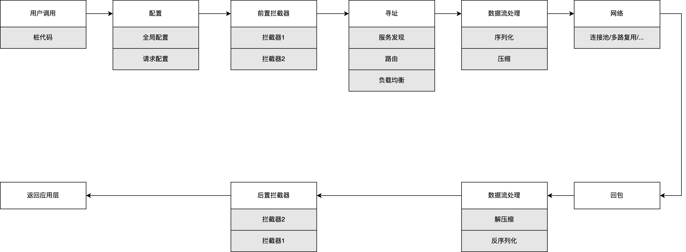

[English](../en/client_guide.md)

[TOC]

# tRPC-Cpp客户端开发向导

## 前言

基于tRPC-Cpp的客户端接口，用户可以像调用本地函数一样去访问下游服务，并且不用关心底层实现的细节。

本文先梳理服务调用的整个流程，来介绍框架为用户访问下游服务提供了哪些能力。接着会从服务调用，配置，寻址，拦截器，协议选择等关键环节来阐述如何进行客户端开发。

## 框架能力

### runtime

runtime是tRPC-Cpp框架对线程模型的抽象，支持的runtime有三种：

- fiber：类似go语言的协程，协程可以在不同线程之间调度，即m个协程可以运行在n个线程上
- separate：io和handle分离，网络收发包和用户业务代码的处理分别跑在不同的线程，通过队列来进行线程间交互
- merge：io和handle合并，网络收发包和用户业务代码的处理都在同一个线程，选择这种模型要格外小心，如果业务代码里有阻塞调用，会卡死整个线程

runtime的选择及配置参考[如何选择及配置runtime](runtime.md#how-to-choose-and-configure-the-runtime)

常见的调用方式有两种：

- 协程模式：编程风格为同步，对应到fiber runtime
- future/promise模式：编程风格为异步，对应到separate runtime和merge runtime

### 调用类型

根据调用协议划分，调用类型分为如下几种：

- [trpc一应一答](./trpc_unary_client_guide.md)
- [trpc流式](./trpc_stream_client_guide.md)
- [http](./http_protocol_client.md)
- [https](./https_client_guide.md)
- [grpc一应一答](./grpc_unary_client_guide.md)
- [grpc流式](./grpc_stream_client_guide.md)
- [flatbuffers](./flatbuffers_client_guide.md)

### 调用流程

下图展示了完整的客户端调用流程，第一行从左到右代表客户端发送请求的流程，第二行从右到左代表客户端处理服务端响应的流程。



框架为每个服务提供了一个服务调用代理（ServiceProxy），它封装了服务调用的接口函数（桩函数），包括接口的入参，出参和错误返回码，站在用户的角度，桩函数的调用和本地函数调用没有区别。

框架采用了基于接口编程的思想，框架只提供了标准接口，由插件来实现具体功能。从流程图中可见，服务调用的核心流程包括拦截器的执行，服务寻址，协议处理和网络IO四大部分，而每个部分都是通过插件来实现的，用户需要选择和配置插件，来串联整个调用流程。

用户调用GetProxy() 获取服务调用代理时，可以通过框架配置文件或者设置Option选项两种方式来指定被调服务的信息。

框架也支持用户自行开发插件来定制服务调用的行为。拦截器是典型的使用场景，例如自定义拦截器来实现服务调用的认证和授权，调用质量的监控和上报等。

服务寻址是服务调用流程中非常重要的一个环节，寻址插件（selector）提供服务实例的策略路由选择，负载均衡和熔断处理能力，是客户端开发中需要特别关注的部分。

## 开发模式

用户在进行客户端开发前，需要明确自己的开发模式，开发模式分两种，中转模式和纯客户端模式。

### 中转模式

(Server A) --中转调用1--> (Server B) --中转调用2--> (Server C)

此时服务既作为服务端，也作为客户端。

### 纯客户端模式

(Client) --调用--> (Server)

此时服务仅仅只是作为客户端。

### 区别

| 开发模式 | 手动初始化插件 | 手动初始化协程运行环境 | 手动初始化队列上报 |
|---------|-------------|---------------------|-----------------|
| 中转模式 | 不需要 | 不需要 | 不需要 |
| 纯客户端模式 | 需要 | 需要 | 需要 |

## 约束

### rpc请求包默认大小

比如tRPC协议，框架限制包大小，这个默认阈值是10M。

这个限制是Service级别的，用户通过修改max_packet_size配置项来覆盖默认值，如下所示，

```yaml
client:
  service:                                # 业务服务提供的service，可以有多个
    - name: trpc.test.helloworld.Greeter  # service名称，需要按照这里的格式填写，第一个字段默认为trpc，第二、三个字段为上边的app和server配置，第四个字段为用户定义的service_name
      max_packet_size: 10000000           # 请求包大小限制
```

### 空闲连接超时

客户端的连接超时时间默认是50秒，如果调用方连接50秒没有发送数据包则会被断开，这个限制是Service级别的，可以通过修改配置项idle_time来覆盖默认值，如下所示，

```yaml
client:
  service:                                # 业务服务提供的service，可以有多个
    - name: trpc.test.helloworld.Greeter  # service名称，需要按照这里的格式填写，第一个字段默认为trpc，第二、三个字段为上边的app和server配置，第四个字段为用户定义的service_name
      idle_time: 50000                    # 连接空闲超时时间，单位毫秒
```

### 连接复用和连接池

#### 连接复用

取决于应用层协议的设计，比如trpc协议，在其头部带有请求id字段，在上一个请求还没收到响应的情况下，客户端可以继续复用当前连接，发送下一个请求。

#### 连接池

不支持连接复用的应用层协议，比如http协议，在发送请求的时候，从连接池中选取一个空闲连接用于发送。

#### 最大连接数

| 连接模式 | 最大连接数 |
|---------|----------|
| 连接复用 | 1 |
| 连接池  | 64 |

最大连接数是针对连接池模式而言的，用户可以通过修改配置项max_conn_num来覆盖默认值，如下所示，

```yaml
client:
  service:                                # 业务服务提供的service，可以有多个
    - name: trpc.test.helloworld.Greeter  # service名称，需要按照这里的格式填写，第一个字段默认为trpc，第二、三个字段为上边的app和server配置，第四个字段为用户定义的service_name
      max_conn_num: 64                    # 连接池模式下的最大连接个数，连接复用模式时不要轻易修改
```

### 关键数据结构

| 数据结构 | 作用 | 注意事项 |
|---------|-----|---------|
| TrpcClient | 用于获取ServiceProxy | 全局唯一，使用trpc::GetTrpcClient()接口获取 |
| ServiceProxy  | 调用下游的代理 | 一个下游Service对应一个，它是线程安全的，不要每次调用都获取一个 |
| ClientContext | 调用的上下文 | 每次调用创建一个，不能重复使用 |

常见问题：

- 每次调用都去创建TrpcClient。 这样导致TrpcClient退出时会有一些资源释放的问题，请不要这要使用，全局使用trpc::TrpcClient()获取即可
- 每次调用都去创建ServiceProxy。 这样当服务代理个数比较多的话，频繁查找map会有点性能损失。建议还是保存下ServiceProxy，不用每次都GetProxy
- 调用下游时重复使用ClientContext。 ClientContext是有状态的，每次调用都需要使用新的，禁止重复使用

## 客户端开发

下文以trpc协议为例，分解客户端开发的步骤。

### 获取IDL文件

有些协议需要IDL文件才能互相调用，比如说trpc协议依赖pb文件，那么就需要先获取IDL文件。

### 确定寻址方式

需要从被调服务处获取寻址方式，用于解析获取服务端ip和端口，进而发起请求。

目前支持的寻址方式有三种。

#### 北极星

被调服务提供：namespace、env、service，可以通过配置文件或者代码设置给ServiceProxy。

#### 直连

直接获取被调服务的ip和端口，通过配置文件或者代码设置给ServiceProxy。


#### 域名

被调服务提供域名和端口，通过配置文件或者代码设置给ServiceProxy。

### 配置被调服务

#### 通过框架配置

```yaml
client: # client配置
  service:
    - name: trpc.test.helloworld.client            # service_proxy配置唯一标识，框架根据name到配置文件中寻找对应配置
      target: 127.0.0.1:80                         # 被调service名称
      namespace: Development                       # service路由名称所属的命名空间
      protocol: trpc                               # 协议
      timeout: 1000                                # 调用超时时间，ms
      network: tcp                                 # 网络类型
      conn_type: long                              # 连接类型，长连接/短连接
      selector_name: direct                        # 路由选择使用的名字服务,直连时为direct
```

#### 通过代码指定

```cpp
// 创建并设置可选参数
::trpc::ServiceProxyOption option;

// 设置参数值
option.name = "trpc.test.helloworld.Greeter";
option.codec_name = "trpc";
option.callee_name = "trpc.test.helloworld.Greeter";
option.caller_name = "trpc.test.helloworld.hello_future_client";
option.selector_name = "direct";
option.target = "127.0.0.1:80";

// 使用指定的option参数初始化一个proxy
auto proxy = ::trpc::GetTrpcClient()->GetProxy<::trpc::test::helloworld::GreeterServiceProxy>(option.name, option);
```

#### 通过回调函数指定

通过回调函数指定的方式，融合了框架配置和代码指定两种方式的优点，对于一些明文的固定的信息可以固化到配置文件里，而对于一些敏感的动态的信息，比如说数据库账号密码，则可以通过回调函数的方式去设置，

```cpp
auto func = [](ServiceProxyOption* option) {
  option->redis_conf.user_name = "test";
  option->redis_conf.password = "123456";
};

// 在框架配置的基础上，继续调用用户的回调函数，补充设置ServiceProxyOption，融合了框架配置和代码指定两种方式的优点
auto proxy = ::trpc::GetTrpcClient()->GetProxy<::trpc::test::helloworld::GreeterServiceProxy>("trpc.test.helloworld.Greeter", func);
```

### 框架配置

参考[框架配置](framework_config_lite.md)

### fiber同步方式调用下游

#### 初始化

只有纯客户端调用模式下需要用户自己获取配置文件并初始化相关参数。获取TrpcClient统一使用trpc::GetTrpcClient()接口。

以纯客户端模式为例，代码如下，

```cpp
int main(int argc, char** argv) {
  google::ParseCommandLineFlags(&argc, &argv, true);

  // 使用fiber client需要配置文件，且fiber环境配置正确(coroutine enable: true，且有一个fiber的threadmodel配置)
  int ret = ::trpc::TrpcConfig::GetInstance()->Init(FLAGS_config);
  assert(ret == 0 && "fiber client need config and need valid fiber config");

  // 其中Run函数为业务的回调函数，运行业务逻辑，获取ServiceProxy对象的逻辑也在里面
  return ::trpc::RunInTrpcRuntime([]() { return Run(); });
}
```

#### 获取ServiceProxy对象

##### 中转模式

```cpp
int RouteServer::Initialize() {
  std::string service_name("trpc.");
  service_name += ::trpc::TrpcConfig::GetInstance()->GetServerConfig().app;
  service_name += ".";
  service_name += ::trpc::TrpcConfig::GetInstance()->GetServerConfig().server;
  service_name += ".Forward";

  TRPC_LOG_INFO("service name:" << service_name);
  RegisterService(service_name, std::make_shared<ForwardServiceImpl>());

  // trpc::test::helloworld::GreeterServiceProxy类型由被调服务的pb文件定义
  // "trpc.test.helloworld.Greeter"在配置文件
  auto proxy = ::trpc::GetTrpcClient()->GetProxy<::trpc::test::helloworld::GreeterServiceProxy>(
      "trpc.test.helloworld.Greeter");

  return 0;
}
```

##### 纯客户端模式

```cpp
int Run() {
  trpc::ServiceProxyOption option;

  // proxy配置
  option.name = FLAGS_target;
  option.codec_name = "trpc";
  option.network = "tcp";
  option.conn_type = "long";
  option.timeout = 1000;
  option.selector_name = "direct";
  option.target = FLAGS_addr;

  auto prx = trpc::GetTrpcClient()->GetProxy<::trpc::test::route::ForwardServiceProxy>(FLAGS_target, option);
  // 其他逻辑省略
}
```

#### 发起rpc调用

```cpp
trpc::Status status = proxy->SayHello(client_context, route_request, &route_reply);
```

### future异步方式调用下游

#### 初始化

```cpp
int main(int argc, char** argv) {
  google::ParseCommandLineFlags(&argc, &argv, true);

  // 读取配置文件
  int ret = trpc::TrpcConfig::GetInstance()->Init(FLAGS_config);
  assert(ret == 0 && "future client need config and need valid future config");

  // 其中Run函数为业务的回调函数，跑业务逻辑，获取ServiceProxy对象的逻辑也在里面
  return ::trpc::RunInTrpcRuntime([]() { return Run(); });
}
```

#### 获取ServiceProxy对象

##### 中转模式

```cpp
RouteService::RouteService() {
  proxy_ = ::trpc::GetTrpcClient()->GetProxy<::trpc::test::helloworld::GreeterServiceProxy>(
      "trpc.test.helloworld.Greeter");
}
```

##### 纯客户端模式

```cpp
int main(int argc, char* argv[]) {
  auto proxy = ::trpc::GetTrpcClient()->GetProxy<::trpc::test::routeserver::RouteServiceProxy>(FLAGS_service);
  // 省略逻辑
  return 0;
}
```

#### 发起rpc调用

```cpp
  auto fut =
      proxy->AsyncSayHello(client_ctx, hello_req)
          .Then([client_ctx, context](::trpc::Future<::trpc::test::helloworld::HelloReply>&& fut) mutable {
            ::trpc::Status status;
            ::trpc::test::routeserver::RouteReply reply;

            if (fut.IsReady()) {
              reply.set_msg(fmt::format("{}  {}", fut.GetValue0().msg(), "Nice to meet you."));

              // 处理附件数据
              ::trpc::NoncontiguousBuffer rsp_atta = client_ctx->GetResponseAttachment();
              context->SetResponseAttachment(std::move(rsp_atta));
            } else {
              std::string exception_msg = fut.GetException().what();
              status.SetErrorMessage(exception_msg);
              status.SetFuncRetCode(kErrorCodeFuture);
              TRPC_FMT_ERROR("future route service failed: {}", exception_msg);
              reply.set_msg(exception_msg);
            }

            context->SendUnaryResponse(status, reply);
            return ::trpc::MakeReadyFuture<>();
          });
```
