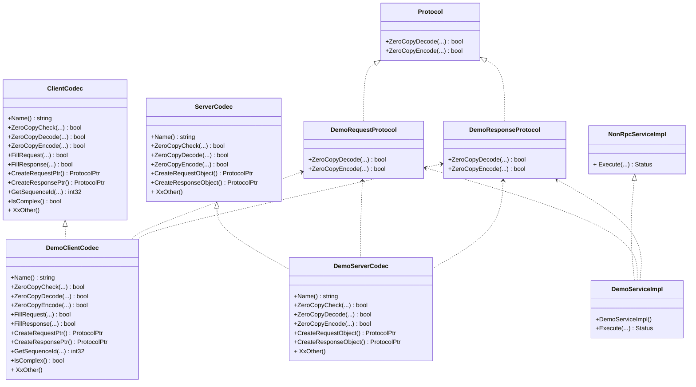

[English](../en/custom_protocol.md)

# 前言

本文介绍如何基于 tRPC-Cpp （下面简称 tRPC）开发用户自定义协议，开发者可以了解到如下内容：

* 如何快速搭建一个自定义协议服务。
* FAQ。

# 如何快速搭建一个自定义协议服务

tRPC 框架支持扩展新协议，用户通过实现 `codec` 插件来支持自定义的协议。

## 快速上手

### 体验自定义协议服务

在正式开始之前，可以先尝试运行自定义协议服务示例。

示例：[thirdparty_protocol](../../examples/features/thirdparty_protocol)

方法：进入 tRPC 代码仓库主目录，然后运行下面的命令。

```shell
sh examples/features/thirdparty_protocol/run.sh
```

示例程序输出：

``` text
response: hello world
```

### 基本步骤

在 Client-Server 模型中，需要先确定一种通信协议（Protocol），协议包括请求-响应消息格式（Request-Response）和消息的打包、解包方式。
Client-Server 基于确定好的协议进行通信，过程如下：

1. 客户端将请求对象打包成请求消息，然后经过网络发送给服务端；
2. 服务端从网络读取请求消息，然后解包成请求对象；
3. 将解包就绪的请求对象递交给服务逻辑处理，然后回复对应的响应；
4. 服务端将响应对象打包成响应消息，然后经过网络发送客户端；
5. 客户端从网络读取响应响消息，然后解包成响应对象；
6. 将解包就绪的响应对象递交给请求发起者。

tRPC 框架将上述过程进行了抽象，并封装成了 `codec` 插件，我们只需要实现相应的接口，就可以使用自定义的协议完成上述通信过程。


我们需要关注 codec 插件这些环节：

1. 协议消息的转换：request -> RequestProtocol + response -> ResponseProtocol。
2. 协议消息的编码、解码：Encode + Decode。
3. 协议消息的解析：Check。

过程 1 是将用户的请求、响应数据结构转换成框架可以识别的协议对象（Protocol）。

基本的步骤：

* 定义协议消息对象，实现消息编码、解码。
* 实现 codec 插件接口，实现协议消息的转换和解析，一般包括 ClientCodec 和 ServerCodec。
* 注册 codec 插件。
* 开发 service 来使用自定义协议。

### 实现过程

我们以体验的示例代码为例进行说明。

#### 定义协议对象

示例中自定义协议的网络消息格式如下：

```text
┌────────────────┬───────────────┬────────────────┐
│  Packet Size   │   Packet ID   │  Body          │
│                │               │                │
│  4 bytes       │   4 bytes     │  Variable size │
└────────────────┴───────────────┴────────────────┘
```

定义 RequestProtocol 和 ResponseProtocol 对象，并实现 Encode/Decode 等接口。

```cpp
// @file: demo_protocol.h/cc

// 请求协议消息
class DemoRequestProtocol : public ::trpc::Protocol {
 public:
  bool ZeroCopyDecode(::trpc::NoncontiguousBuffer& buff) override;
  bool ZeroCopyEncode(::trpc::NoncontiguousBuffer& buff) override;

  bool GetRequestId(uint32_t& req_id) const override; 
  bool SetRequestId(uint32_t req_id) override; 
};

// 响应协议消息
class DemoResponseProtocol : public ::trpc::Protocol {
 public:
  bool ZeroCopyDecode(::trpc::NoncontiguousBuffer& buff) override;
  bool ZeroCopyEncode(::trpc::NoncontiguousBuffer& buff) override;

  bool GetRequestId(uint32_t& req_id) const override;
  bool SetRequestId(uint32_t req_id) override;
};
```

其中 *ZeroCopyEncode* 为打包消息，*ZeroCopyDecode* 为解包消息。

这里特别说明下 RequestId，它可以用来标识不同的请求和响应消息，在连接复用的场景下，支持多个请求和响应消息在同一个连接上并发传输。如果协议没有消息标识，GetRequest/SetRequest 接口不用实现，客户端会采用连接池方式发送请求消息。

#### 实现 codec 插件接口

ClientCodec 接口如下：

```cpp
// @file: demo_client_codec.h/cc

class DemoClientCodec : public ::trpc::ClientCodec {
 public:
  std::string Name() const override; 
  int ZeroCopyCheck(const ::trpc::ConnectionPtr& conn, ::trpc::NoncontiguousBuffer& in, std::deque<std::any>& out) override;
  bool ZeroCopyEncode(const ::trpc::ClientContextPtr& ctx, const ::trpc::ProtocolPtr& in, ::trpc::NoncontiguousBuffer& out) override;
  bool ZeroCopyDecode(const ::trpc::ClientContextPtr& ctx, std::any&& in, ::trpc::ProtocolPtr& out) override;
  bool FillRequest(const ::trpc::ClientContextPtr& ctx, const ::trpc::ProtocolPtr& in, void* body) override;
  bool FillResponse(const ::trpc::ClientContextPtr& ctx, const ::trpc::ProtocolPtr& in, void* body) override;
  ::trpc::ProtocolPtr CreateRequestPtr() override;
  ::trpc::ProtocolPtr CreateResponsePtr() override;
  uint32_t GetSequenceId(const ::trpc::ProtocolPtr& rsp) const override;
  bool IsComplex() const override; 
};
```

ServerCodec 接口如下：

```cpp
// @file: demo_server_codec.h/cc

class DemoServerCodec : public ::trpc::ServerCodec {
 public:
  std::string Name() const override; 
  int ZeroCopyCheck(const ::trpc::ConnectionPtr& conn, ::trpc::NoncontiguousBuffer& in, std::deque<std::any>& out) override;
  bool ZeroCopyDecode(const ::trpc::ServerContextPtr& ctx, std::any&& in, ::trpc::ProtocolPtr& out) override;
  bool ZeroCopyEncode(const ::trpc::ServerContextPtr& ctx, ::trpc::ProtocolPtr& in, ::trpc::NoncontiguousBuffer& out) override;
  ::trpc::ProtocolPtr CreateRequestObject() override;
  ::trpc::ProtocolPtr CreateResponseObject() override;
};
```

*Name* 返回协议名称，比如 "trpc"、"http"。
当前示例中接口会返回 "thirdpary_protocol"。这个值一般会被设置成配置项 `protocol` 的取值。

```yaml
# ...
service:
  - name: trpc.test.helloworld.demo_service
    protocol: thirdpary_protocol
    network: tcp
    ip: 0.0.0.0
    port: 12347
# ...
```

*ZeroCopyCheck* 把消息从二进制缓冲区 |in| 中按照协议格式切割下来，然后放入队列 |out| 中，该队列的数据将会作为 `ZeroDecode`
接口的输入参数。 此接口有三类返回值：

* PacketChecker::PACKET_FULL，成功解析到一个或者多个消息。
* PacketChecker::PACKET_LESS，到目前为止，消息符合协议格式要求，但不足以解析出一个完整消息，需后续更多的消息数据。
* PacketChecker::PACKET_ERR，出错，比如消息不符和协议格式要求，返回此错误会导致连接关闭。

*ZeroCopyDecode* 将解析好的网络消息解包，然后组装成协议对应的 RequestProtocol/ResponseProtocol 对象。比如，设置请求头部键-值对，设置消息内容。

*ZeroCopyEncode* 将 RequestProtocol/ResponseProtocol 对象打包成网络消息。

*FillRequest* 一般会填充请求头和请求消息内容，常用的消息内容序列化类型和压缩类型等信息会在这个环节设置好。此接口是 ClientCodec 特有的。

*FillResponse* 一般会填充响应头和和响应消息内容，常用的消息内容序列化类型和压缩类型等信息会在这个环节设置好。此接口是 ClientCodec 特有的。

*GetSequenceId* 获取消息序列号，一般情况，这个值和 RequestId 一致。此接口是 ClientCodec 特有的。

*IsComplex* 报告协议是否支持连接复用，在示例代码中，此接口返回 true，表示支持连接复用，因为协议中有 PacketID 来标识同一连接上不同的消息。此接口是 ClientCodec 特有的。

*CreateRequestPtr* 创建并返回 RequestProtocol 对象。在示例代码中返回 DemoRequestProtocolPtr 对象。

*CreateResponsePtr* 创建并返回 ResponseProtocol 对象。在示例代码中返回 DemoResponseProtocolPtr 对象。

*CreateRequestObject* 创建并返回 RequestProtocol 对象。在示例代码中返回 DemoRequestProtocolPtr 对象。

*CreateResponseObject* 创建并返回 ResponseProtocol 对象。在示例代码中返回 DemoResponseProtocolPtr 对象。

#### 注册 codec 插件

以服务端为例，自定义协议 codec 插件可以在 `RegisterPlugins` 接口中注册，这样注册的 Service 就可以使用上这个 codec 插件了。

```cpp
class DemoServer : public ::trpc::TrpcApp {
 public:
  int RegisterPlugins() override {
    ::trpc::TrpcPlugin::GetInstance()->RegisterServerCodec(std::make_shared<DemoServerCodec>());
    return 0;
  }
};
```

#### 开发 Service 来使用自定义协议

tRPC 框架是通过注册 Service 的方式对外提供服务。
所以，为了用上自定义协议，需要开发一个 ServiceImpl 来处理自定义协议请求，然后回复响应。

tRPC 框架提供了 `NonRpcServiceImpl` 接口。我们只需要做两件事：

1. 实现 `Execute` 接口，这里添加具体请求的处理过程。
2. 注册请求路由，这个过程一般放在构造方法中。

```cpp
class DemoServiceImpl : public ::trpc::NonRpcServiceImpl {
 public:
  DemoServiceImpl() {
    auto handler = new ::trpc::NonRpcMethodHandler<DemoRequestProtocol, DemoResponseProtocol>(
        std::bind(&DemoServiceImpl::Execute, this, std::placeholders::_1, std::placeholders::_2,
                  std::placeholders::_3));
    AddNonRpcServiceMethod(
        new ::trpc::NonRpcServiceMethod(::trpc::kNonRpcName, ::trpc::MethodType::UNARY, handler));
  }

  ::trpc::Status Execute(const ::trpc::ServerContextPtr& context,
                         const DemoRequestProtocol* in,
                         DemoResponseProtocol* out) {
    TRPC_FMT_INFO("request data: {}", in->req_data);
    out->rsp_data = in->req_data;
    return ::trpc::kSuccStatus;
  }
};
```

注册 `DemoServiceImpl` 和注册 tRPC 服务一模一样。完成注册后，一个自定义协议服务就可以成功运行了。

```cpp
class DemoServer : public ::trpc::TrpcApp {
 public:
  int RegisterPlugins() override {
    ::trpc::TrpcPlugin::GetInstance()->RegisterServerCodec(std::make_shared<DemoServerCodec>());
    return 0;
  }

  int Initialize() override {
    const auto& config = ::trpc::TrpcConfig::GetInstance()->GetServerConfig();
    // Set the service name, which must be the same as the value of the `server:service:name` configuration item
    // in the framework configuration file, otherwise the framework cannot receive requests normally
    std::string service_name = fmt::format("{}.{}.{}.{}", "trpc", config.app, config.server, "demo_service");

    TRPC_FMT_INFO("service name:{}", service_name);

    RegisterService(service_name, std::make_shared<DemoServiceImpl>());

    return 0;
  }

  void Destroy() override {}
};
```

服务配置如下：

```yaml
# @file: trpc_cpp.yaml
#...
server:
  app: test
  server: helloworld
  admin_port: 18888
  admin_ip: 0.0.0.0
  service:
    - name: trpc.test.helloworld.demo_service
      protocol: thirdpary_protocol
      network: tcp
      ip: 0.0.0.0
      port: 12347

#...
```

使用 tRPC 客户端访问 DemoServiceImpl 也很简单，和访问 tRPC 服务一样。

首先，注册 ClientCodec 插件。

```cpp
::trpc::TrpcPlugin::GetInstance()->RegisterClientCodec(std::make_shared<DemoClientCodec>());
```

然后，创建 `NonRpcServiceProxy` 对象 proxy，调用 `UnaryInvoke` 或者 `AsyncUnaryInvoke` 方法。

```cpp
int Call() {
  ::trpc::ServiceProxyOption option;
  option.codec_name = "thirdpary_protocol";
  option.network = "tcp";
  option.conn_type = "long";
  // ...

  auto proxy = ::trpc::GetTrpcClient()->GetProxy<::trpc::NonRpcServiceProxy>(FLAGS_target, option);

  DemoRequestProtocolPtr req_ptr = std::make_shared<DemoRequestProtocol>();
  req_ptr->req_data = "hello world";
  DemoResponseProtocolPtr rsp_ptr = std::make_shared<DemoResponseProtocol>();
  
  ::trpc::ClientContextPtr context = ::trpc::MakeClientContext(proxy, req_ptr, rsp_ptr);
  context->SetTimeout(1000);

  ::trpc::Status status = proxy->UnaryInvoke<DemoRequestProtocolPtr, DemoResponseProtocolPtr>(context, req_ptr, rsp_ptr);
  if (!status.OK()) {
    TRPC_FMT_ERROR("invoke error: {}", status.ErrorMessage());
    return -1;
  }
  TRPC_FMT_INFO("response: {}", rsp_ptr->rsp_data);
  return 0;
}
```

## 接口类图



# FAQ

## 实现 codec 插件后，用户需要处理网络消息接收和发送逻辑吗？

用户不需要处理网络相关操作，实现 codec 相关接口即可。
Client-Server 整个主流程的逻辑有框架驱动，其中消息序列化、压缩、网络消息接收和发送均由框架处理。
