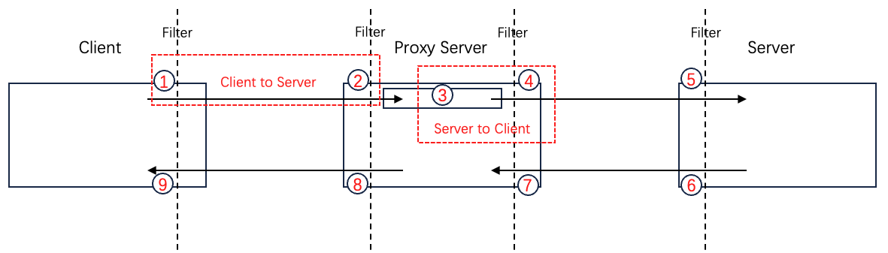

[English](../en/custom_tracing.md)

# 前言

tRPC-Cpp不对调用链插件遵循的协议标准进行限制。用户可以使用业界主流的[OpenTelemetry](https://opentelemetry.io/)、[OpenTracing](https://opentracing.io/)等标准，也可以使用自定义的标准。当然我们**推荐用户使用`OpenTelemetry`**。

由于不同标准的调用链数据格式存在很大差异，并且调用链数据一般是由框架在RPC调用过程中自动采集并上报的，与业务逻辑独立，所以tRPC-Cpp并没有对调用链插件做过多的抽象，而只提供了通过框架实现调用链信息自动采集、上报的解决方案。

这篇文档介绍tRPC-Cpp中调用链的实现原理，以及开发者如何开发一个调用链插件。

# 原理

## 常见术语介绍

在进行具体原理介绍之前，我们先介绍几个链路追踪领域常见的术语：

`Trace`：一个Trace表示一个请求在分布式系统中经过的所有服务和组件组成的链路。

`Span`：Span表示Trace中的一个独立操作或工作单元。一个Trace通常由多个Span组成，其中每个Span表示请求在一个服务或组件中的处理过程。

`ParentSpan`、`ChildSpan`：在一个Trace中，一个Span可以触发新的Span（例如发起新的RPC调用）。发起触发操作的Span和被触发的Span，它们互为对方的ParentSpan和ChildSpan。Span之间通过这种父子关系进行关联。

## 信息传递要求

要将一个请求在分布式系统中经过的点都串联起来，构成完整的调用链，需要调用的上下文信息（`TraceID`，`Span`等信息）能在各个服务间正确地进行传递。因此对于通信协议和RPC框架的能力都有一定的要求：

1. 通信协议

    * 协议需要支持传递元数据，使得调用链上下文信息可以通过元数据在不同服务间进行传递。如`trpc`协议的透传信息、`http`协议的头部。

2. RPC框架

    * 客户端需要能自动将当前的调用链上下文信息（如本次调用的`TraceID`、`SpanID`等）注入到元数据中，跟随请求一起传递到下游。
    * 服务端需要能自动从请求的元数据中取出上游的调用链信息，与服务端自身的调用链信息进行关联（例如继承`TraceID`，设置其`ParentSpanID`为上游的`SpanID`），使得“**客户端到服务端**”的调用链路串联起来。
    * 服务端在进一步调用下游时，可以将当前服务端的调用链信息传递给客户端上下文（即将服务端的`Span`作为客户端调用`Span`的`ParentSpan`）。使得“**服务端到客户端**”的调用链路串联起来。

## 解决方案

通信协议只要选择支持传递元数据的协议即可。本节主要讲解tRPC-Cpp中如何进行上下游调用链信息的串联。

### 整体的解决方案

tRPC-Cpp使用[调用链插件](../../trpc/tracing/tracing.h)来进行调用链采集和上报的公共初始化（如配置采样策略、数据上报的后端地址、数据上报的方式等）。而上下游调用链信息的串联和上报通过[拦截器](filter.md)在RPC调用的过程中自动进行，用户只需要在框架配置文件中配置上对应的插件拦截器即可。

在节点内部，调用链信息约定保存在`Context`的`FilterData`中，存储的index为插件的`PluginID`。并且约定了服务端和客户端FilterData中的[调用链数据格式](../../trpc/tracing/tracing_filter_index.h)：
```cpp
/// @brief The tracing-related data that server saves in the context for transmission
struct ServerTracingSpan {
  std::any span;  // server tracing data, eg. server span in OpenTracing or OpenTelemetry
};

/// @brief The tracing-related data that client saves in the context for transmission
struct ClientTracingSpan {
  std::any parent_span;  // the parent span, used for contextual information inheritance
  std::any span;         // client tracing data, eg. client span in OpenTracing or OpenTelemetry
};
```

### 具体的处理流程



图中各个位置执行的时机和操作说明如下：

| 位置 | 执行时机 | 执行操作 |
| ------ | ------ | ------ |
| 1 | 框架自动执行客户端拦截器前置埋点逻辑 | 1. 作为本次调用的发起点，创建一个拥有唯一TraceID、没有ParentSpan的`Span`。<br>2. 将当前的调用链上下文信息注入到请求的元数据中。<br>3. 将创建的Span存储在ClientContext的`FilterData`中。 |
| 2 | 框架自动执行服务端拦截器前置埋点逻辑 | 1. 从请求的元数据中取出上游的调用链信息，创建一个与上游拥有相同TraceID、ParentSpan为上游Span的`Span`。<br>2. 将创建的Span存储在ServerContext的`FilterData`中。 |
| 3 | 用户手动构造ClientContext | 必须调用框架的`MakeClientContext`接口，根据ServerContext构造ClientContext。该接口会自动将服务端的`Span`设置为客户端的`ClientTracingSpan.parent_span`。 |
| 4 | 框架自动执行客户端拦截器前置埋点逻辑 | 除了创建的`Span`不同外（TraceID与ClientTracingSpan.parent_span相同、ParentSpan为ClientTracingSpan.parent_span），其他操作与位置1相同。 |
| 5 | 框架自动执行服务端拦截器前置埋点逻辑 | 与位置2相同。 |
| 6 | 框架自动执行服务端拦截器后置埋点逻辑 | 从`ServerContext`取出服务端调用链信息进行上报 |
| 7 | 框架自动执行客户端拦截器后置埋点逻辑 | 从`ClientContext`取出客户端调用链信息进行上报 |
| 8 | 框架自动执行服务端拦截器后置埋点逻辑 | 与位置6相同 |
| 9 | 框架自动执行客户端拦截器后置埋点逻辑 | 与位置7相同 |

**其中位置1和位置2共同完成从客户端到服务端的链路串联，位置3和位置4共同完成从服务端到客户端的链路串联。**

# 自定义调用链插件

根据原理分析，开发者需要：

* 实现一个调用链插件：进行调用链采集和上报的公共初始化。
* 实现两个拦截器：在RPC调用过程中进行链路串联和信息上报。
* 注册调用链插件和对应的拦截器。

具体实现例子可以参考[OpenTelemetry插件的Tracing功能实现](https://github.com/trpc-ecosystem/cpp-telemetry-opentelemetry/tree/master/trpc/telemetry/opentelemetry/tracing)。

## 实现调用链插件

调用链插件需要继承[trpc::Tracing](../../trpc/tracing/tracing.h)。必须重写如下接口：

| 接口 | 说明 | 备注 |
| ------ | ------ | ------ |
| Name | 返回插件名 | 必须保证唯一，不能和其他插件名相同。 |

我们推荐在插件的`Init`函数中进行调用链采集和上报的公共初始化。例如`OpenTelemetry`中对`Exporter`、`Sampler`、`Processor`、`Provider`的设置。

## 实现拦截器

拦截器的介绍具体参考[拦截器说明文档](filter.md)。**需要注意拦截器`Name`接口返回的名字必须与插件的名字一致。**

### 实现客户端拦截器

#### 埋点选择

拦截器前置埋点逻辑的执行需要在进行协议编码之前，使得调用链数据可以注入到协议的元数据中。因此，埋点对可以选择“`CLIENT_PRE_RPC_INVOKE` + `CLIENT_POST_RPC_INVOKE`”，或者“`CLIENT_PRE_SEND_MSG` + `CLIENT_POST_RECV_MSG`”。主要区别在于调用的耗时统计不同，以及是否需要未序列化的用户数据。

#### 前置埋点处理

在拦截器的前置埋点处，需要完成以下的逻辑处理：

1. 创建Span

    首先需要从`ClientContext`的`FilterData`中获取`ClientTracingSpan`：
    ```cpp
    ClientTracingSpan* client_span = context->GetFilterData<ClientTracingSpan>(PluginID);
    ```

    可能会存在以下几种情况：

    * client_span为空指针：如果ClientContext不是调用`MakeClientContext`接口根据ServerContext构造的，则框架不会自动设置ClientTracingSpan。这种情况客户端拦截器需要**自行创建ClientTracingSpan并设置到FilterData中**。
        ```cpp
        context->SetFilterData(PluginID, ClientTracingSpan());
        client_span = context->GetFilterData<ClientTracingSpan>(PluginID);
        ```
    * client_span不为空，但client_span->parent_span为空：`MakeClientContext`自动设置了ClientTracingSpan，但由于服务端没有调用链信息（没有配置服务端拦截器），所以parent_span为空。
    * client_span和client_span->parent_span均不为空：表示有上游调用链信息需要继承。

    **如果parent_span为空，则需要创建一个拥有新的TraceID、没有ParentSpan的`Span`；若parent_span不为空，则需要创建一个TraceID与parent_span相同、ParentSpan为parent_span的`Span`。**

2. 将调用链信息注入到元信息中

    **注入方式取决于通信协议以及调用链遵循的标准。**
    
    例如使用`trpc`协议和`OpenTelemetry`标准时，需要将Trace、Span等信息转换为OpenTelemetry标准的键值对，写入到trpc请求头的透传信息中。

3. 将创建的Span存储到FilterData中

    ```cpp
    client_span->span = std::move(Span);
    ```

#### 后置埋点处理

在拦截器的后置埋点处，需要完成的逻辑比较简单，只需要从`ClientContext`取出客户端调用链信息进行上报即可。

### 实现服务端拦截器

#### 埋点选择

拦截器前置埋点逻辑需要在进行协议解码之后，使得可以从协议的元数据中提取上游的调用链信息。因此，埋点对可以选择“`SERVER_POST_RECV_MSG` + `SERVER_PRE_SEND_MSG`”，或者“`SERVER_PRE_RPC_INVOKE` + `SERVER_POST_RPC_INVOKE`”。主要区别在于调用的耗时统计不同，以及是否需要未序列化的用户数据。

#### 前置埋点处理

在拦截器的前置埋点处，需要完成以下的逻辑处理：

1. 从请求的元数据中取出上游的调用链信息

    **提取方式取决于通信协议以及调用链遵循的标准。**

    例如使用`trpc`协议和`OpenTelemetry`标准时，需要从trpc请求头的透传信息中取出调用链对应的键值对数据，然后还原成OpenTelemetry的数据结构。

    注意提取结果可能存在以下两种情况：

    * 调用链信息为空：说明上游并不是需要观察的调用链的一环，没有调用链信息需要继承。
    * 调用链信息不为空：说明上游是需要观察的调用链的一环，有调用链信息需要继承。

2. 创建Span

    **如果步骤1提取到的上游调用链信息为空，则需要创建一个拥有新的TraceID、没有ParentSpan的`Span`；若提取到的上游调用链信息不为空，则需要创建一个与上游拥有相同TraceID、ParentSpan为上游Span的`Span`。**

3. 将创建的Span存储到FilterData中

    ```cpp
    ServerTracingSpan svr_span;
    svr_span.span = std::move(Span);
    context->SetFilterData<ServerTracingSpan>(PluginID, std::move(svr_span));
    ```

#### 后置埋点处理

在拦截器的后置埋点处，需要完成的逻辑比较简单，从`ServerContext`取出服务端调用链信息进行上报即可。

## 注册插件和拦截器

插件注册的接口：
```cpp
using TracingPtr = RefPtr<Tracing>;

class TrpcPlugin {
 public:
  /// @brief Register custom tracing plugin
  bool RegisterTracing(const TracingPtr& tracing);
};
```

拦截器注册的接口：
```cpp
using MessageServerFilterPtr = std::shared_ptr<MessageServerFilter>;
using MessageClientFilterPtr = std::shared_ptr<MessageClientFilter>;

class TrpcPlugin {
 public:
  /// @brief Register custom server filter
  bool RegisterServerFilter(const MessageServerFilterPtr& filter);

  /// @brief Register custom client filter
  bool RegisterClientFilter(const MessageClientFilterPtr& filter);
};
```

举个例子进行说明。假设自定义了一个TestTracing插件，TestServerFilter、TestClientFilter两个拦截器，那么

1. 对于服务端场景，用户需要在服务启动的`TrpcApp::RegisterPlugins`函数中注册：
    ```cpp
    class HelloworldServer : public ::trpc::TrpcApp {
     public:
      ...
      int RegisterPlugins() override {
        TrpcPlugin::GetInstance()->RegisterTracing(MakeRefCounted<TestTracing>());
        TrpcPlugin::GetInstance()->RegisterServerFilter(std::make_shared<TestServerFilter>());
        TrpcPlugin::GetInstance()->RegisterClientFilter(std::make_shared<TestClientFilter>());
        return 0;
      }
    };
    ```

2. 对于纯客户端场景，需要在启动框架配置初始化后，框架其他模块启动前注册：
    ```cpp
    int main(int argc, char* argv[]) {
      ParseClientConfig(argc, argv);

      TrpcPlugin::GetInstance()->RegisterTracing(MakeRefCounted<TestTracing>());
      TrpcPlugin::GetInstance()->RegisterClientFilter(std::make_shared<TestClientFilter>());

      return ::trpc::RunInTrpcRuntime([]() { return Run(); });
    }
    ```

**注意注册的插件和拦截器只需要构造即可，框架启动时会自动调用它们的`Init`函数进行初始化。**
