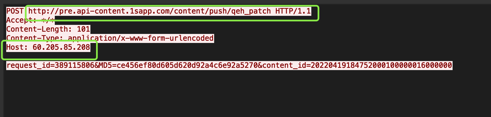

### 使用HTTP常见问题

### 配置问题

#### 启用HTTP

使用HTTP客户端和服务端时，需要设置HTTP相关配置，关键yaml配置项：

- 协议类型 `client->service->protocol: http`。

#### 启用HTTPS

HTTP相关配置上增加ssl相关配置，如下例所示：

- ssl相关配置：Line#12~15

```yaml

client:
  service:                                         #调用后端service的配置
    - name: http_client                             #service路由名称
      selector_name: direct
      target: 127.0.0.1:24756
      protocol: http                               #协议
      network: tcp                                 #网络类型
      conn_type: long                              #连接类型，长连接/短连接
    ##  新增的SSL配置项
    ssl:
      enable: true # 可选参数（默认为false ，禁用SSL）
  ciphers: HIGH:!aNULL:!kRSA:!SRP:!PSK:!CAMELLIA:!RC4:!MD5:!DSS # 必选参数
  ## 下面可选参数按需配置，这里简要列举下
  # sni_name: www.xxops.com # 可选参数
      # ca_cert_path: ./https/cert/xxops-com-chain.pem # 可选参数
      # dh_param_path: ./https/cert/server_dhparam.pem # 可选参数
      # insecure: true # 可选参数（默认为false，禁用非安全模式）
      # protocols: # 可选参数
      #   - SSLv2
      #   - SSLv3
      #   - TLSv1
      #   - TLSv1.1
      #   - TLSv1.2
...
```

#### 使用域名访问

关键配置项：

- 名字解析器：`selector_name: domain`。
- 访问目标：`target:$domain:$port`。

如下例所示：

```yaml
client:
  service:                                         #调用后端service的配置
    - name: http_client                             #service路由名称
      selector_name: domain
      target: www.baidu.com:80
      protocol: http                               #协议
      network: tcp                                 #网络类型
      conn_type: long                              #连接类型，长连接/短连接
...
```

### 用法

#### 设置URL

在tRPC-Cpp的yaml文件的配置项 `target` 和URL不相关。

- `target` 是被调方的名称→IP:Port；URL信息一般是包含主机名称和端口信息。
- 在tRPC-Cpp HttpServiceProxy中，URL解析后的结果主要用来填充HTTP 请求行和头字段，没有将其中的HOST\[:PORT\]用来建立TCP连接。
- 建立连接仍然使用target提供的信息。

实际使用时，URL按照规范填写好即可，实际目标服务IP：PORT 在 `target` 填写好，这样和调用RPC形式一致。

#### 获取HTTP响应状态码

当前没有提供接口来获HTTP响应状态码，HTTP状态码被转换成了trpc::Staus，这些错误码当前并未和HTTP响应码一一对应。

一般地，通过判断调用Status::OK()方法可以解决大部分问题。

#### 用curl命令发送PB数据给HTTP Service

命令如下：

```bash
## 其中http_rpc_hello_request.pb是PB消息序列化后的内容。
curl -T http_rpc_hello_request.pb -H "Content-Type:application/pb" 'http://127.0.0.1:24756/trpc.test.httpserver.Greeter/SayHello'

## 发送JSON数据下载http_rpc_hello_request.pb
curl -T http_rpc_hello_request.json -H "Content-Type:application/json" 'http://127.0.0.1:24756/trpc.test.httpserver.Greeter/SayHello'
```

#### 使用自签证书调试时，客户端校验证书不通过，如何处理？

关于启用HTTPS里，有 `insecure` 配置：表示是否校验对方证书合法性，默认校验对方证书合法性。

在调试场景中，使用自签证书时，可以将此参数设置成true可以跳过证书校验环节。

#### 理解配置项protocol: trpc_http

- trpc：消息主体是Protobuffer序列化后的二进制数据。
- http：HTTP Body 为Protobuffer序列化后的二进制数据（Content-Type: application/pb） 或者 json字符串 （Content-Type: application/json）。
- trpc_http： 没有限制body 类型，包解析器会根据包特征尝试trpc/http 两种协议解析器来解包。

#### 报错sendrcv failed, ret:141，如何处理？

141 主要是网络错误，先做如下检查：

1. 被调服务方连通性，接口调用成功率。
2. 请求量较大，可以将客户端的连接池数量适当调大些。
3. 检查服务端是否支持HTTP Keep-Alive，如果不支持，连接可能会被RESET，这时使用 conn_type: short 短连接方式。
4. 检查服务端是否返回Connection。

#### 使用HttpServiceProxy提供的接口出现Crash

crash堆栈如下所示：

```text
/// crash堆栈片段
...
#0 0x00000000004e4477 in std::string::swap(std::string&) ()
#1 0x0000000000ab21e3 in trpc::http::HttpServiceProxy::ConstructHttpRequestHeader(trpc::RefPtrtrpc::ClientContext const&, trpc::http::OperationType, std::string const&, trpc::HttpRequestProtocol*) ()
#2 0x0000000000ab3749 in trpc::http::HttpServiceProxy::ConstructHttpRequestContext(trpc::RefPtrtrpc::ClientContext const&, trpc::http::OperationType, trpc::EncodeType, std::string const&) ()
#3 0x0000000000ab3f08 in trpc::http::HttpServiceProxy::Post(trpc::RefPtrtrpc::ClientContext const&, std::string const&, rapidjson::GenericDocument<rapidjson::UTF8, rapidjson::MemoryPoolAllocatorrapidjson::CrtAllocator, rapidjson::CrtAllocator> const&, rapidjson::GenericDocument<rapidjson::UTF8, rapidjson::MemoryPoolAllocatorrapidjson::CrtAllocator, rapidjson::CrtAllocator>) ()
...
```

这个错误主要是因为配置文件中配置缺失，需要加上如下的配置：

```yaml
...
client:
  service:                                         #调用后端service的配置
    - name: http_client                             #service路由名称
      selector_name: direct
      target: 127.0.0.1:24756
      protocol: http                               #协议
      network: tcp                                 #网络类型
      conn_type: long                              #连接类型，长连接/短连接
...
```

#### URL Encode/Decode

框架提供相关工具支持URL Percent-Decode/Encode

```c++
// @file: trpc/util/http/util.h
// @brief 将URI中保留字符使用%编码
std::string PercentEncode(const unsigned char *target, size_t len);
// @brief 将URI中保留字符使用%编码
std::string PercentEncode(const std::string &target);
// @brief 解码URI中保留字符使用%编码后的字符
std::string PercentDecode(const std::string& s);
```

#### 通过 HTTP 调用 tRPC RPC 服务时，被调方通过 @alias 设置了一个别名如何设置 URL Path ？

方法：client_context->SetFuncName("${your-alias-name}") ，替换下参数值。

#### http请求已经成功发送但出现141网络错误

- 现象：tcpdump抓包，发现包已经发出去了，但是紧接着服务端主动断开连接
- 原因：用法不规范问题，导致服务端认为http协议出错，主动断开连接，具体是下图的两处绿框所示需要针对性地调整：
  - 
- 解决办法：
  - 调用 `client_context->SetUrl(url)`，将 `url` 设置成 `/path?query` 的形式
  - 调用 `client_context->SetHeader(key, value)`，将 `key` 设置成 `Host`，将 `value` 设置成服务域名，比如：`xx.com`

### 性能

#### curl 发送1KB+数据需要Expect: 100 Continue

- 原因：
  - curl/libcurl 在POS 数据时，当body大于1K时，会先询问下服务器是否允许发送大数据包（请求头中增加"Expect： 100 continue"）。
  - 如果允许则回复一个100 continue码，然后libcurl 继续发送请求体。
  - 如果服务端不响应100 continue，等待1s后，会继续将请求体发给服务端。
  - 当前trpc-cpp http server侧没有响应 `Expect: 100 continue`，所以curl只能等待1s后发送数据。
- 如何规避：curl 测试时，发送一个带空值的 "Expect:"
  - 参考命令：`curl -H "Expect:" -X POST -T "ddd" $url`
