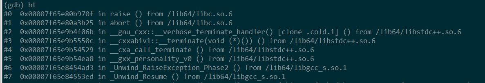
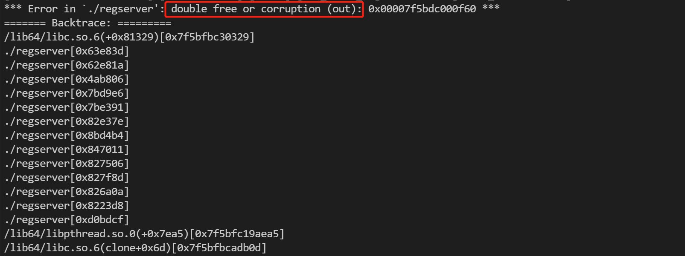
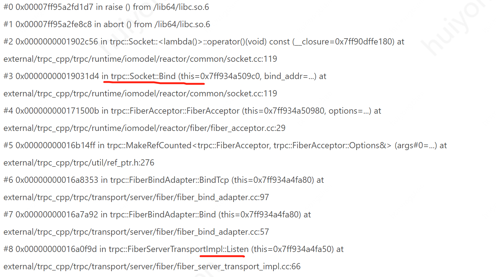
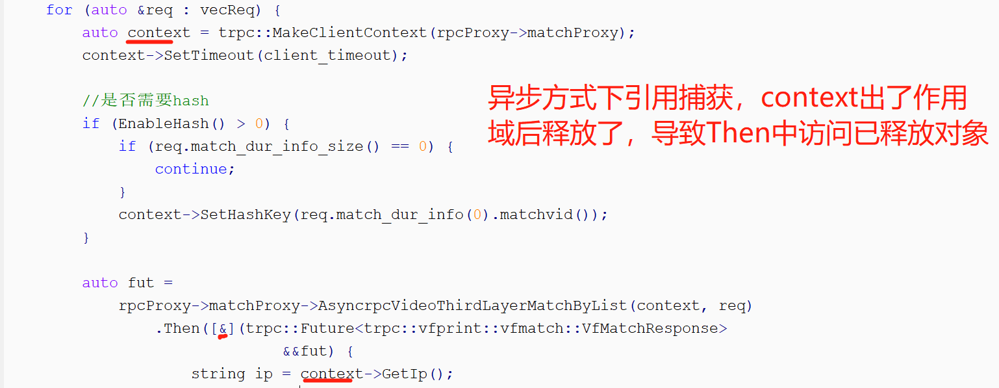

## 程序crash问题排查指南

## core文件排查步骤、技巧及建议

core问题可以使用gdb工具来分析，不了解如何使用gdb的话可以学习

- [使用GDB调试程序](https://github.com/selfboot/CS_Offer/blob/master/C%2B%2B/GDB_Debug.md)
- [GDB调试教程链接汇总](https://developer.aliyun.com/article/681075)

这边不加以展开介绍。

### 排查步骤

当程序出现core时，一般排查方法如下：

- 使用gdb获取core堆栈信息 `gdb prog core.xxx`，然后运行 `bt` 或 `bt full` 命令查看堆栈。
- 结合代码进行分析
  - 如果是core在业务代码，请检查自身的代码是否有问题。一些常见问题见下文"业务逻辑编码错误导致的core"如果是core在框架代码(不能说明框架有问题，更多情况下还是业务代码问题或接口使用不当，就像你调用c库一样)，这时可以结合tRPC框架日志来定位，同时看看是否属于下文"常见的一些core场景"中列举的场景。
  - 如果进行分析后还解决不了问题，欢迎提issue一起讨论。

说明: 在定位core问题时，建议在编译二进制程序时开启debug选项，bazel编译下：可添加"--copt=-g --strip=never"进行开启，如：bazel build target --copt=-g --strip=never。另外，可以进一步去掉编译器的O2选项，以便看到更多的堆栈信息。这样从core文件信息中我们可以清楚地看到代码跑到哪一行core了。

### 一些建议

- 关注并清理编译器告警。
  - 编译器给出的告警还是很有用的的，比如变量未初始化、非void函数实现上没有return value等，以避免不必要的错误(如访问未初始化的内存、程序逻辑不符合预期)。
- 适当使用断言或日志。
  - 可以通过在代码中添加assert断言或一些日志打印来辅助分析，以确认程序执行是否符合预期。
- 关注有修复bug的框架版本，如有涉及的bug及时做升级。
  - 随着tRPC框架的不断迭代，新版本会修复旧版本存在的bug(偶尔也会引入bug)，版本间的改动可见 [ChangeLog](https://github.com/trpc-group/trpc-cpp/blob/main/CHANGELOG.md)。升级时建议升级到最新tag【带有新特性】或此大版本下的最新tag【只在当前release分支做bug修复】。

### 常见的一些堆栈信息和core原因

#### 异常未捕获

这时堆栈如下，有"_Unwind_Resume"关键字，需要加try/catch捕获异常，如下图所示：



说明：这里try catch 注意写法，建议在最后增加catch(...) 这种来catch所有异常，否则有时无法完全捕获(因为有些异常不属于std::exception)

#### 内存double free

属于对象的生命周期管理有问题，内存被重复释放



这种问题可以结合内存分析工具检测内存读写错误检测

### 一些常见的core信号

- SIGSEGV(11)：内存段错误，属于访问非法内存，原因比较多样。
- SIGABRT(6)：终止信号，由abort函数触发，一般为程序断言(assert)失败；如果core在框架的代码中，一般是条件check失败，可以结合框架日志和代码分析原因。
- SIGILL(4)：非法指令，比较常见的原因为非法的栈操作(如栈溢出)。
- 一些可能触发的原因可见[链接](https://zhuanlan.zhihu.com/p/346722474)。

## 常见的一些core场景

### 属于使用tRPC-Cpp接口不当导致的core

#### 框架初始化和退出相关

- 端口冲突导致服务起不来(关键字"Bind")，造成core，典型堆栈如下
  
  - 这时需要check下是哪个进程占用了端口，然后看看是否kill占用端口的进程或者修改端口
- 中转模式或服务端模式下，业务主动调用了UnregisterPlugins导致core
  - 中转模式或服务端模式下，在框架退出时内部会调用UnregisterPlugins，用户不需要显式调用。另外，也不需要调用RegisterPlugins。

#### 框架配置相关

- 使用了对应的插件(或其关联的filter)，但配置文件中缺少对应的插件配置。
  - 如业务使用了北极星插件，但配置文件中未配置polaris，导致调用时出现了core(core堆栈无参考意义，故不贴出)，这时可以结合框架日志定位，典型日志(关键字Can't find ... filter)。

#### TrpcClient使用相关

- 使用多个TrpcClient的话有资源清理和退出的问题，很容易使用不当导致core，故框架提供trpc::GetTrpcClient()接口供用户直接获取全局的Client。
  - 框架使用者应直接使用trpc::GetTrpcClient()接口获取client （该接口位于trpc/trpc_client.h中）

#### Future/Promise相关

- GetValue/GetException前要先使用IsReady或IsFailed判断状态，且接口不能被多次调用。
  - 相关core信息为触发了assert失败，产生SIGABRT信号

#### Fiber相关

- 在非Fiber协程环境中使用Fiber同步原语，如FiberLatch
  - 另外，由于Fiber定时器任务跑在非fiber协程环境，故不能直接在Fiber定时器时主逻辑里面直接用FiberLatch等同步原语
  - 相关的关键字为"Check failed: IsFiberContextPresent()"
- Fiber栈溢出(Fiber栈默认大小为128K)
  - 如果Fiber协程中使用到的栈比较大(如有占大内存的栈变量、递归调用层次过深)的话，需要通过如下方式调整Fiber栈的大小。

  ```yaml
  global:                            
  threadmodel:
    fiber:
      - instance_name: fiber_instance
        concurrency_hint: 8 #一共创建多少个fiber worker线程。目前框架是读取/proc/cpuinfo,但是容器实际配额可能远低于,建议和配额核数相同。        
        ...     
        fiber_stack_size: 131072  #fiber栈大小，如果需要申请的栈资源较大，可以调整此值   
  ```

### 属于业务逻辑编码错误导致的core

#### 访问已经释放的内存(野指针)

Then中捕获的类型不对，导致访问了野指针，如下图所示：



#### 资源访问存在竞态(多线程操作)，但缺少同步

如多线程操作stl容器时未做保护

#### 程序中存在内存泄漏，导致oom

可结合内存监控及dmesg命令(如dmesg -T |tail -n 30)查看是否oom，如果属于内存泄漏问题，可以使用内存扫描工具结合代码进行分析

## 一些内存辅助分析工具

主要工具有[AddressSanitizer](https://github.com/google/sanitizers/wiki/AddressSanitizer)、[valgrind](https://valgrind.org/docs/manual/mc-manual.html)和[gperftool](https://github.com/gperftools/gperftools)，其中三者都有分析内存泄漏的功能，AddressSanitizer和valgrind还提供内存读写错误检测功能。
