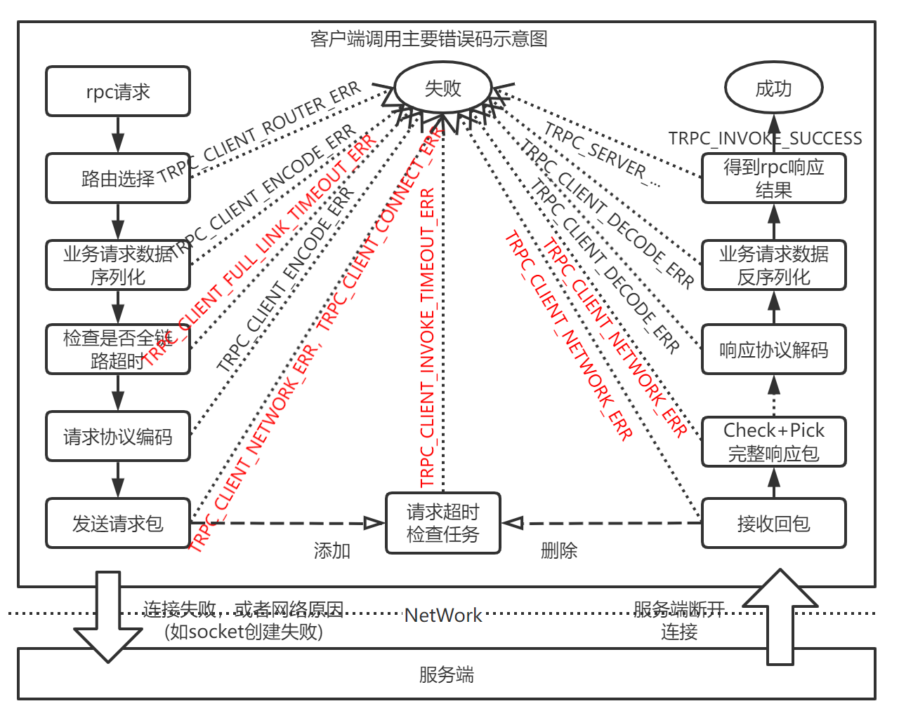

## 客户端超时/失败/长尾问题排查指南

## 客户端调用流程及主要错误码介绍



可以看到一个完整的rpc请求会经过路由选择、编码、发包、收包、解码步骤（其中还包含filter环节【图中未画出】）。

其中"检查是否全链路超时"环节为[超时控制](../timeout_control.md)功能相关逻辑，即检查此时发起的调用是否已经超时(典型场景为中转模式下：当服务端收到上游带超时时长的请求后，再串行向下游发起调用，如果处理时长已经超过上游指定的时长，则直接终止处理)，如果超时，则直接返回错误，避免无效的处理。

在"发送请求包"环节时，会在发包的同时做请求超时检测。在请求超时检测逻辑实现上Fiber模式和IO/Handle分离或合并模式稍微有些差异：Fiber模式下会向定时器中提交一个请求超时检测任务(超时时间为上层设置的timeout)，如果在超时时间内收到回包则会取消此定时任务，相反则触发超时；而IO/Handle分离或合并模式下在实现上则是通过起一个定时任务来检测请求队列中的消息是否已经超时，如果在请求超时时间内收到回包，则将队列中的请求消息删掉，相反则触发超时。

在"响应协议解码"环节：如果解码失败，客户端会将连接关闭，防止串包。故这时返回的错误码可能为TRPC_CLIENT_NETWORK_ERR（tcp连接复用模式下会返回此错误）。

较常见的错误主要是超时、网络错误和路由选择错误：

```proto
// 超时错误码
// 请求在客户端调用超时
TRPC_CLIENT_INVOKE_TIMEOUT_ERR = 101;
// 请求在客户端因全链路超时时间而超时
TRPC_CLIENT_FULL_LINK_TIMEOUT_ERR = 102;

// 网络相关错误码
// 客户端连接错误
TRPC_CLIENT_CONNECT_ERR = 111;

// 路由相关错误码
// 客户端选ip路由错误
TRPC_CLIENT_ROUTER_ERR = 131;

// 客户端网络错误
TRPC_CLIENT_NETWORK_ERR = 141;
```

而路由选择错误(TRPC_CLIENT_ROUTER_ERR = 131)跟名字服务插件实现相关，此处不展开，下面主要对超时以及网络错误问题的排查进行介绍。

## 排查步骤

### 调用超时问题

调用超时对应的错误码为101或者102，其中102为超时错误的细分情况，表示开启全链路超时时导致的超时(这时使用的请求超时时间为"上游带过来的超时")。可以按下面思路排查：

- 是否服务端未及时回包
- 是否请求超时时间设置过短
- 是否客户端代理的框架配置不合理，导致客户端性能上不去(请求堆积导致超时)
- 是否框架接口使用不当
- 其他问题

下面详细展开说明。

#### 服务端未及时回包或不回包

这种情况一般是服务端处理慢了，需要具体分析(可能是过载等原因)。这时可以结合服务端的错误日志及队列监控，确认问题后做对应处理。如果属于服务端的性能问题，需要优化的话可参考 [性能问题排查排查指南](faq/low_performance.md)。

再者可通过tcpdump工具进行抓包确认。

下面梳理一些，遇到的一些服务端未正常回包场景如下：

- redis非法请求导致服务端不回包：如redis下自行拼接command，一旦包出错，服务端无法识别，会一直hang住，不会返回任何数据给客户端，导致等待超时
- 使用udp协议时，服务端回包大小超过udp包最大body长度65507
  - 描述：由于udp协议规定的最大body长度不能超过65507，故当服务端回包超过此限制时会直接被丢弃，导致客户端收不到回包，从而出现客户端调用超时，这种场景可以通过服务端error日志确认，关键字为"Msg too long, size ="
  - 解决办法：减少udp包大小（可通过拆分回包或者压缩）或换成tcp协议

#### 请求超时时间设置过短

- 全链路超时导致留给服务端的处理时长过短
  - 超时时间太短有可能是开启了全链路超时，由于上游带过来的超时时间太短导致。这时要排查上游链路的处理时长是否过长，导致留给下游的处理时间过短。另外，如果不需要<https://iwiki.woa.com/pages/viewpage.action?pageId=119394889的话，可以通过如果配置关闭>

  ```yaml
  server:
    service:
      - name: trpc.app.server.service
        disable_request_timeout: true #默认false，默认超时时间会继承上游的设置时间，配置true则禁用，表示忽略上游服务调用我时协议传递过来的超时时间
  ```

  - 当clientcontext和serviceproxy option同时设置了timeout，这时取两者中较小的timeout作为调用超时。（这样设计的原因是考虑了全链路超时，因为这个超时时间可能是上游带过来的，而option才是用户指定的超时，故逻辑是取小）
- 出现跨区调用，导致超时
  - 当出现跨区调用时，网络传输环节的耗时会增加，从而导致超时。

#### 客户端代理配置问题

- Fiber模式下fiber worker线程数配少了
  - 以如下配置为例：

  ```yaml
  global:                            
    threadmodel:
      fiber:
        - instance_name: fiber_instance
          concurrency_hint: 8 #一共创建多少个fiber worker线程。目前框架是读取/proc/cpuinfo,但是容器实际配额可能远低于,建议和配额核数相同。        
          scheduling_group_size: 4  #每个调度组一共有多少个fiber worker线程。框架会根据系统配置用户配置生成一个比较合理的调度组，比如按照目前的配置就是有2个调度组，每个调度组有 4个 fiber worker线程
  ```

  - 表示总共创建8个fiber worker线程，每个调度组下有4个fiber线程，所以对应两个调度组(默认不同调度组间不会进行任务窃取)。遇到有使用方将scheduling_group_size(命名不太好)理解成起几组调度组，然后配成和concurrency_hint一样，这样每个调度组下只有一个worker线程，造成客户端处理不过来导致超时。可以结合top -Hp pid及队列监控进行确认。
- 客户端代理使用的线程模型未配置
  - 客户端线程模型未配置时，优先选择框架配置文件中配的线程模型(多个线程模式时选取的结果不确定)。如果配置了多个线程模型，可能需要指定线程模型以获得最佳性能。
- 连接池模式下配置的最大连接数过小
  - 在IO/Handle分离或合并模式下，由于连接池中的连接是请求独占的，当并发请求数较大时，可能出现连接池中的连接都分配完了，导致后面的请求在pending队列中长时间排队，得不到及时处理，从而导致超时。
  - 解决方式：如果协议支持连接复用，优先使用连接复用；否则可以通过调大最大连接数来解决，调整方式如下：

  ```yaml
  client: 
  service:
    - name: xxxx
      ...
      max_conn_num: 256  # 设置最大连接数为256
  ```

#### 框架接口使用不当

- IO/Handle分离或合并模式下，使用了Future同步调用。
  - 非协程模式下如果在框架线程中执行同步调用代码的话，会造成工作线程阻塞，从而导致超时，相关日志为"transport name:future_v2, sendrcv failed, ret:101"。
  - 原因：此线程模式下的同步调用方式使用future BlockingGet(阻塞等待)方式实现，如在框架线程中使用的话将造导致该wait的线程无法处理回包逻辑(默认回包处理逻辑还会回到本线程处理)，表现为服务端回包了，但是客户端却报超时。
  - 解决方式：修改成异步调用(推荐方式)或用使用自建的线程池来发起调用。

#### 其他原因

网络原因或环境问题导致丢包，可以结合tcpdump工具排查。

另外，如果使用的是udp协议，不同机器上存在丢包是正常的。

### 网络错误相关问题

调用失败的常见错误码为111(客户端连接错误)和141(客户端网络错误)，但其中141中也有包含客户端连接错误的场景，区分得并不是很严格，故这边将两种错误码放一起讨论。

此典型的原因有如下几种，可以按下面列举原因进行排查。

#### 服务端连接不上

可能为服务节点地址有问题、服务端连接数满(超过最大连接数限制)，排查方法如下：

1. 确认服务端节点地址是否正确：可从监控上或trpc框架错误日志中取出有问题的服务端节点ip:port，如果地址不正确的话需要对应分析下是否地址配置错误或者名字服务寻址有问题(导致寻址到错误的节点)
2. 确认服务端能正常连接上：可使用`telnet ip port`查看服务端能否telnet上，如果无法连上，则需要进一步分析（可能是服务异常或服务端连接数超限等原因）。如果需要调大服务端连接数上限的话，可修复服务端max_conn_num配置项：

```yaml
server: 
  service:
    - name: xxxx
      ...
      max_conn_num: 100000  # 设置最大连接数为10w
```

#### 客户端网络问题

可能的几个原因：

1. 客户端机器socket fd耗尽：这时有日志"create socket failed due to invalid socket"，这时可能得清理系统打开的文件数。或者调整fd上限，可以参考[链接](https://developer.aliyun.com/article/549151)。
2. 网络环境不通。

#### 非法请求包(如协议不匹配，超出长度限制)

- 服务端收到非法的请求包(如协议错误或者包内容错误、亦或是客户端发送的包长度超限)，从而服务端会断开连接。
  - 这种场景可结合框架日志进行确认：通常会有解码错误的相关日志打印。这时应该检查下协议是否对齐，包长度是否超出服务端配置的max_packet_size最大包限制(在trpc协议下会有"Check error, packet size:"打印)
- 客户端收到非法请求包(如协议错误或包内容错误，亦或tcp回包超过客户端最大包限制)或发送非法长度的udp包
  - 当服务端tcp回包长度超客户端配置的max_packet_size(默认为10M)，客户端会断开连接。这时会有错误日志 "Check error, packet size:xxx, MaxPacketSize:"，这时可调整最大包长度限制解决，如下：

  ```yaml
  client:
    service:                              
      - name: xxx                   #service名称
        max_packet_size: 10000000   #请求包大小限制
  ```

  - 另外，当使用udp时，如果客户端发送的udp包body大小超过65507，这时会直接返回失败。框架日志中会有"Msg too long, size ="错误。

### 客户端使用Fiber模式下的长连接去调用短连接的服务端

由于fiber下多个线程共用一个reactor进行发包，所以当服务端断开连接时，客户端可能无法及时感知到这个连接已经出现了问题，导致选择了已经被服务端关闭的连接去发包，这时会也会报141错误，解决方式是将客户端连接模式也修改为短连接。

这时在客户端代理的配置中增加"conn_type:short"即可

## 耗时不符合预期问题

有以下可能导致耗时不符合预期的情况。

### 客户端超时率比服务端超时率要高

可能的原因：

- 服务端未开启全链路超时(默认开启，可通过配置了disable_request_timeout为true进行关闭)，导致感知不到客户端的超时时间
- 客户端侧存在Future同步调用，具体原因见"调用超时问题：使用Future同步调用"
- 客户端请求时长设置过短或者网络传输时间过长导致：客户端调用流程为"客户端---network request-->服务端处理---network response-->客户端"，在网络传输时间较长情况下，可能导致服务端处理完请求后，回包来不及给到客户端，导致超时。这种场景可以结合抓包分析。

### 客户端调用时长比服务端处理时长要长不少

以IO/Handle分离线程模型为例，客户端rpc调用环节包括：1. 请求编码 -->2. 将发包任务提交到io线程--->3. io线程执行发包操作-->网络传输-->4. io线程收到回包(判断包的完整性和解码在这步进行)-->5. 将响应包交给handle线程处理；另外，其中还包括执行filter的开销等
因此，可能有如下几种原因：

- 网络传输时间长：检查是否存在跨区调用，如存在跨区调用可通过名字服务就近访问解决。
- 是否存在io线程或handle线程堵塞(即服务过载)的情况，这个可以结合队列监控查看(需要开启监控插件)。
- 是否编解码环节或有些filter执行比较耗时，这个可结合[rpcz工具](../rpcz.md)进行分析。

### 客户端请求耗时比设置的超时时间要长不少

和上述"客户端调用时长比服务端处理时长要长不少"问题类似，客户端设置的请求超时时间用于3~4步中的超时检测，整个调用环节的耗时并未统计在内。这种情况属于其他环节耗时长，排查方法同上。

### IO/Handle分离(或合并)模式下实际超时比设置的超时要长

- 问题原因：IO/Handle分离(或合并)模式下的请求超时检测机制为：定时检测（默认10ms）检测一次请求是否超时，因此如果业务设置的请求超时时长为N的话，则实际上的超时时长区间为[N,N+10ms]。
- 解决办法：如果业务使用的超时时长很短（ms级的超时），那么可以通过增加如下框架配置项提高检测超时的精度（要求框架版本>=v0.9.0）：通过增加serviceproxy下request_timeout_check_interval配置项指定更短的超时检测时长(可通过配置方式或者option指定)。

  ```yaml
  client:
    service:
      - name: xxx
        ...
        request_timeout_check_interval: 2 # 2ms检查一次超时
  ```

## 常用的一些命令和工具

### 系统工具

- netstat：查看网络连接等信息，如netstat -anpt |grep "ESTABLISHED"查看建立的tcp连接
- telnet：看某个tcp端口是否能连上 telnet ip port
- tcpdump：抓包工具，可直接查看二进制形式报文或配合wireshark软件分析报文。常用的一些命令如下：

  ```bash
  tcpdump -XvHnl  -i eth1 tcp port  端口 # 抓取某个端口的包，以二进制形式展示
  tcpdump -i eth1 host  主机ip and tcp port 端口  -s0 -w xxx.cap # 抓完整的包，可用wireshark软件查看
  ```

- pstack：可查看程序的堆栈信息，用法pstack pid。如果程序卡住了，可以用pstack命令查看卡在哪里
- top -Hp pid：可查看某进程下的各个线程cpu使用率，方便据此调整框架配置(如io/handle分离模式下的io/handle占比)
- perf top -p pid：可查看程序cpu消耗在执行哪些代码上

### 框架提供的分析工具

- 使用 [rpcz](../rpcz.md) 定位各环节的耗时。
- 观察Runtime信息上报监控，开启任意实现了 `SingleAttrReport` 的监控插件即可见，参见 [prometheus](../prometheus_metrics.md)。
