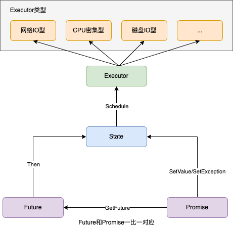

[English](../en/future_promise_guide.md)

[TOC]

# tRPC-Cpp future/promise使用指南

## 前言

future/promise是一种异步编程模型，它可以让用户摆脱传统的回调陷阱，从而使用更加优雅、清晰的方式进行异步编程。虽然C++11已经开始支持std::future/std::promise，但是后者过于简单，因此tRPC-Cpp框架提供了一套自己的future/promise实现，除了支持链式回调，还提供丰富的工具来支持并发调用和串行调用。

## 设计原理

### 设计思想

为了写出正确且高效可靠的代码，用户需要了解下面的原则，

- Future/Promise都支持move语义、但是禁止拷贝，这可以保证Promise和Future之间的一对一关系
- 由于GetValue和GetException接口实现上使用了右值移动，所以GetValue和GetException只能调用一次，禁止重复调用
- Future/Promise支持可变参数个数，Future的结果返回的是std::tuple类型，获取具体的value时需要调用std::get<N>获取第N个参数的值
- Future/Promise的错误处理使用返回Exception对象的方式，而不是抛异常的方式，如果Future调用失败了，则返回一个Exception给用户，用户使用GetException得到错误信息
- 支持注册捕获Future的回调和捕获Value的回调，因为捕获Value的回调方式无法感知到错误，故建议使用捕获Future的回调
- Future底层调度器基于例程[Continuation](https://en.wikipedia.org/wiki/Continuation)原理实现

### 结构图



### 状态转换图


## 使用指南

### 基础用法

#### 设置结果（SetValue/SetException）

通过`SetValue`设置值，如下所示，

```cpp
trpc::Promise<std::string> pr;
// 获取promise对应的future
auto fut = pr.GetFuture();

// 设置fut回调，其他操作

// 设置值到future
pr.SetValue("hello,world");
```

通过`SetException`设置异常，如下所示，

```cpp
trpc::Promise<std::string> pr;
// 获取promise对应的future
auto fut = pr.GetFuture();

// 设置fut回调，其他操作

// 设置异常到future
pr.SetException(CommonException("system error"));
```

#### 获取结果（GetValue0/GetValue/GetException）

当future对象处于就绪状态时，它的值会被设置，当future对象处于异常状态时，它的异常会被设置，用户在使用时需求根据future的状态来决定是获取对应的值还是异常。

针对单个参数的Future/Promise，获取值的时候直接使用`GetValue0`接口，如下所示，

```cpp
// 单个参数的promise对象
trpc::Promise<std::string> pr;
auto fut = pr.GetFuture();

// 设置值到future
pr.SetValue("hello,world");

// 根据future对象的状态来决定获取值还是异常
if (fut.IsReady()) {
  // 就绪状态时获取值
  auto value = fut.GetValue0();
  // 其他操作
}
```

针对多个参数的Future/Promise，获取值使用`GetValue`接口，然后再使用`std::get<N>`获取第N个参数的值，如下所示，

```cpp
// 多个参数的promise对象
trpc::Promise<std::string, int> pr;
auto fut = pr.GetFuture();

// 设置值到future
pr.SetValue("hello,world", 1);

// 根据future对象的状态来决定获取值还是异常
if (fut.IsReady()) {
  // 就绪状态时获取值，先将值提取出来
  auto res = fut.GetValue();
  // 再使用std::get<N>获取第N个参数的值
  auto str_value = std::get<0>(res);
  auto int_value = std::get<1>(res);
  // 其他操作
}
```

获取异常使用`GetException`接口，如下所示，

```cpp
// 这里以单个参数的promise对象举例，针对多个参数的promise对象，也是一样的写法
trpc::Promise<std::string> pr;
auto fut = pr.get_future();

// 设置异常到future
pr.SetException(CommonException("system error"));

// 根据future对象的状态来决定获取值还是异常
if (fut.IsFailed()) {
  // 异常状态时获取异常
  auto exception = fut.GetException();
  // 其他操作
}
```

#### 设置future回调（Then）

可以使用Future类的Then接口为Future设置回调，框架支持捕获Future的回调和捕获值的回调。

捕获Future的回调，`推荐使用`，用户可以在回调中判断请求成功或者失败，如下所示，

```cpp
fut.Then([](Future<T>&& fut) {
  // 请求成功
  if (fut.IsReady()) {
    auto res = fut.GetValue0();
    // 处理响应
  // 请求失败
  } else {
    auto exception = fut.GetException();
    // 异常处理和上报等逻辑
  }

  // 回调函数可以返回一个Future对象，也可以不返回任何东西
});
```

捕获值的回调，`不推荐使用`，只有调用成功后才会执行回调，不便于处理调用失败的场景，如下所示，

```cpp
fut.Then([](T&& val) {
  // 走到这里一定是请求成功，对响应做处理

  // 回调函数可以返回一个Future对象，也可以不返回任何东西
});
```

#### 创建就绪或者异常的Future（MakeReadyFuture/MakeExceptionFuture）

创建就绪的Future，如下所示，

```cpp
auto fut = MakeReadyFuture<std::string>("hello, world");
```

创建异常的Future，如下所示，

```cpp
auto fut = MakeExceptionFuture<std::string>(CommonException("system error"));
```

#### 阻塞等待Future就绪（BlockingGet）

BlockingGet接口会一直等待直到future就绪或者异常。

```cpp
auto res_fut = future::BlockingGet(std::move(fut));

// future就绪
if (res_fut.IsReady()) {
  // 处理结果
// future异常
} else {
  // 处理异常
}
```

### 高级用法

#### 串行任务，等待最后一个回调执行完毕（Then）

示例代码如下，

```cpp
  fut.Then([](Future<T>&& fut) {
	  auto value = fut.GetValue0();
    // 处理第一个future的结果

    // 第一个回调函数返回一个Future
    // return ...
  })
  .Then([](Future<T>&& fut) {
	  auto value = fut.GetValue0();
    // 处理第二个future的结果

    // 第二个回调函数返回一个Future
    // return ...
  })
  .Then([](Future<T>&& fut) {
	  auto value = fut.GetValue0();
    // 处理第三个future的结果

    // 第三个回调函数返回一个Future
    // return ...
  });
```

#### 串行任务，直到条件函数返回true或者Future函数返回异常（DoUntil）

这是DoUntil的第一种使用方式，用户可以指定一个条件函数和一个Future函数，有两个条件会终止Future函数的执行，

- 当这个条件函数返回真(true)的时候，终止后续Future函数的执行
- 当Future函数返回异常就绪值的时候，终止后续Future函数的执行

其他情况下，会一直串行执行后续的Future函数。

条件函数返回真(true)，终止后续Future函数的执行，如下所示，

```cpp
auto flag = std::make_shared<bool>(false);
auto counter = std::make_shared<uint32_t>(0);

// 在条件函数中，flag为true的时候终止执行后续的Future函数
DoUntil([flag]() { return *flag; },
        [flag, counter]() {
          (*counter)++;
          // 执行12次
          if (*counter == 12) {
            *flag = true;
          }
          // 每次执行都返回一个就绪Future对象，所以会同步执行12次回调，不存在异步调用
          return MakeReadyFuture<>();
        });
```

注意：这里的Future函数可能一次也不执行，如果一开始条件函数就返回真(true)。

Future函数返回异常就绪值，终止后续Future函数的执行，如下所示，

```cpp
auto flag = std::make_shared<bool>(false);
auto counter = std::make_shared<uint32_t>(false);

DoUntil([flag]() { return *flag; },
        [flag, counter]() {
          (*counter)++;
          if (*counter == 12) {
            *flag = true;
          }
          // 这里会率先触发，当Future函数执行到第7次的时候，返回异常Future对象，终止后续Future函数的执行
          if (*counter == 7) {
            return MakeExceptionFuture<>(TestWhenAllException());
          }
          return MakeReadyFuture<>();
        });
```

#### 串行任务，直到Future函数返回false的就绪值（DoUntil）

这是DoUntil的第二种使用方式，用户只需要指定一个Future函数，要求这个Future函数的返回值类型是Future<bool>，当某次Future函数返回false的就绪值时，终止后续的Future函数执行，否则持续执行下去，如下所示，

```cpp
int counter = 0;
int sum = 0;

DoUntil([&counter, &sum](){
  // 没有提供条件函数，但是当Future函数的返回就绪值等于false的时候，终止后续Future函数的执行，所以当前Future函数一共会串行执行10次
  if (counter++ == 10) return MakeReadyFuture<bool>(false);
  ++sum;
  return MakeReadyFuture<bool>(true);
});
```

#### 串行任务，直到条件函数返回false或者Future函数返回异常（DoWhile）

DoWhile是DoUntil的变种，二者唯一的区别是，当条件函数返回false的时候，DoWhile会终止后续Future函数的执行，如下所示，

```cpp
int counter = 0;
int sum = 0;
// Future函数累计串行执行10次
DoWhile([&counter]() { return counter++ < 10; },
        [&sum]() {
          ++sum;
          return MakeReadyFuture<>();
        });
```

#### 串行任务，直到Future函数返回异常的就绪值（Repeat）

相比于DoWhile，Repeat依赖Future函数本身返回异常，来终止后续Future函数的执行，如下所示，

```cpp
int counter = 0;
// Future函数累计串行执行10次
Repeat([&counter]() {
         if (++counter == 10) return MakeExceptionFuture<>(CommonException("10"));
         else return MakeReadyFuture<>();
      });
```

#### 串行任务，直到迭代器遍历完成（DoForEach）

使用DoForEach，Future函数串行执行的次数取决于迭代器的大小，实际使用时区分4种语法，

- 指定首尾Iterator，Future函数不带参数
- 指定首尾Iterator，Future函数带参数，参数为迭代器的元素取值
- 指定迭代器本身，Future函数不带参数
- 指定迭代器本身，Future函数带参数，参数为迭代器的元素取值

指定首尾Iterator，Future函数不带参数，如下所示，

```cpp
std::vector<int> c(10, 1);
int counter = 0;

DoForEach(c.begin(), c.end(), [&counter]() {
           ++counter;
           return MakeReadyFuture<>();
          });
```

指定首尾Iterator，Future函数带参数，参数为迭代器的元素取值，如下所示，

```cpp
std::vector<int> c(10, 1);
int counter = 0;

DoForEach(c.begin(), c.end(), [&counter](auto e) {
           counter -= e;
           return MakeReadyFuture<>();
          });
```

指定迭代器本身，Future函数不带参数，如下所示，

```cpp
std::vector<int> c(10, 1);
int counter = 0;

DoForEach(c, [&counter]() {
           ++counter;
           return MakeReadyFuture<>();
          });
```

指定迭代器本身，Future函数带参数，参数为迭代器的元素取值，如下所示，

```cpp
std::vector<int> c(10, 1);
int counter = 0;

DoForEach(c, [&counter](auto e) {
           counter -= e;
           return MakeReadyFuture<>();
          });
```

#### 串行任务，指定Future函数执行的总次数（DoFor）

使用DoFor，区分2种语法，

- Future函数不带参数，实际执行次数为总次数大小
- Future函数带参数，参数为总次数变量，实际执行次数取决于总参数变量的状态

Future函数不带参数，实际执行次数为总次数大小，如下所示，

```cpp
int counter = 0;
DoFor(10, [&counter]() {
       ++counter;
       return MakeReadyFuture<>();
     });
```

Future函数带参数，参数为总次数变量，实际执行次数取决于总参数变量的状态，如下所示，

```cpp
DoFor(counter, [&counter](std::size_t i) {
       --counter;
       return MakeReadyFuture<>();
     });
```

#### 并行任务，等待所有回包（WhenAll）

如果希望实现并发3个请求，然后当3个请求都完成后，再发起1个请求，可以使用`WhenAll`，有2种语法，

- 指定迭代器本身
- 逐个指定Future对象

指定迭代器本身，对应的代码如下，

```cpp
std::vector<Future<bool>> futs;
futs.emplace_back(AsyncOperation1());
futs.emplace_back(AsyncOperation2());
futs.emplace_back(AsyncOperation3());
auto fut = WhenAll(futs.begin(), futs.end()).Then([](std::vector<trpc::Future<bool>>&& vec_futs ) {
  // 判断和获取各个操作的结果
  auto& fut0 = vec_futs[0];
  auto& fut1 = vec_futs[1];
  auto& fut2 = vec_futs[2];
  // 其他操作
  return AsyncOperation4();
});
```

逐个指定Future对象，对应的代码如下，

```cpp
auto fut1 = AsyncOperation1();
auto fut2 = AsyncOperation2();
auto fut3 = AsyncOperation3();
auto fut = WhenAll(fut1, fut2, fut3).Then([](std::tuple<Future<uint32_t>, Future<uint32_t>, Future<uint32_t>>&& results) {
  // 判断和获取各个操作的结果
  auto& fut0 = std::move(std::get<0>(results));
  auto& fut1 = std::move(std::get<1>(results));
  auto& fut2 = std::move(std::get<2>(results));
  // 其他操作
  return AsyncOperation4();
});
```

#### 并行任务，等待任意一个回包（WhenAny）

如果希望实现并发发送3个请求，然后当3个请求有一个完成后（包括成功或者失败），做相应的操作，可以使用WhenAny，示例代码如下，

```cpp
std::vector<Future<bool>> futs;
futs.emplace_back(AsyncOperation1());
futs.emplace_back(AsyncOperation2());
futs.emplace_back(AsyncOperation3());
auto fut = WhenAny(vecs.begin(), vecs.end()).Then([](Future<size_t, std::tuple<bool>>&& fut) {
  if (fut.IsReady()) {
    auto res = fut.GetValue();
    // index为第几个请求成功
    auto success_index = std::get<0>(res);
    // 获取到的是std::tuple类型，还需要进一步使用std::get获取对应的元素值
    auto value = std::get<1>(res);
    ...
  }
}
```

如果需要等待其中的一个请求成功或者全部失败的时候才返回，可以使用WhenAnyWithoutException，其用法与WhenAny一致。

#### 异步读写锁

基于Future的异步读写锁，仅支持在tRPC框架的Worker线程中使用，且不支持跨线程加解锁，即非线程安全。

```cpp
// 初始化锁对象，注意锁的生命周期，以及所属的worker线程
auto lock = std::make_shared<RWLock>();
lock->WriteLock().Then([lock] (Future<>&& fut) {
  if (fut.IsFailed()) {
    // 加锁失败，可能因为加锁动作所在线程与锁对象初始化的线程不同，即跨线程对锁进行了操作
  }
  // 做一些加了写锁后的任务

  // 解锁，可根据需要判断解锁结果是否为true
  lock->WriteUnlock();
});
lock->ReadLock().Then([lock] (Future<>&& fut) {
  if (fut.IsFailed()) {
    // 加锁失败，可能因为加锁动作所在线程与锁对象初始化的线程不同，即跨线程对锁进行了操作
  }
  // 做加了读锁后的任务

  // 解锁，可根据需要判断解锁结果是否为true
  lock->ReadUnlock();
});
```

除了上述用法，还提供了可自动解锁的WithLock方法，传入读或写的锁对象，以及用户lambda。

```cpp
// 初始化锁对象，注意锁的生命周期，以及所属的worker线程
auto lock = std::make_shared<RWLock>();
WithLock(lock->ForWrite(), [lock] {
  // 做加了写锁后的任务
  return MakeReadyFuture<int>(1);
// WithLock可将用户lambda的结果返回
}).Then([] (Future<int>&& fut) {
  // 处理结果1
  // std::get<0>(fut.GetValue())
});

WithLock(lock->ForRead(), [lock] {
  // 做加了读锁后的任务
// 用户lambda没有返回值或返回void
}).Then([] (Future<>&& fut) {
  // WithLock返回Future<>
});
```

### 自定义Executor

#### 网络IO型Executor（框架默认自带）

首先，继承trpc::Executor类(位于trpc/common/future/executor.h)，实现具体的ReactorExecutor，

```cpp
class ReactorExecutor : public Executor {
 public:
  static inline Executor* ThreadLocal() {
    // 调用全局函数传入当前线程的reactor来初始化executor
    static thread_local ReactorExecutor executor(runtime::GetThreadLocalReactor());
    return &executor;
  }

 private:
  explicit ReactorExecutor(Reactor* reactor) : reactor_(reactor) { TRPC_ASSERT(reactor_); }

  /// @brief 投递任务
  void SubmitTask(Task&& task) override { reactor_->SubmitTask(std::move(task)); }

 private:
  Reactor* reactor_ = nullptr;
};
```

最后，为Future设置Then回调时，支持传入指定executor来执行此回调。

```cpp
for (int i = 0; i < reactor_num; ++i) {
  runtime::GetReactor(i)->SubmitTask([]() {
  auto exe = ReactorExecutor::ThreadLocal();
    MakeReadyFuture<>().Then(exe, []() { return MakeReadyFuture<>(); });
  });
}
```

#### CPU密集型Executor

首先，首先需要继承trpc::Executor类(位于trpc/common/future/executor.h)，实现一个具体的ThreadPoolExecutor，

```cpp
class ThreadPoolExecutor : public trpc::Executor {
 public:
  ThreadPoolExecutor() {
    // 初始化线程池配置，并启动
    trpc::ThreadPoolOption thread_pool_option;
    thread_pool_option.thread_num = 2;
    thread_pool_ = std::make_unique<trpc::MQThreadPool>(std::move(thread_pool_option));
    thread_pool_->Start();
  }

  ~ThreadPoolExecutor() override {
    thread_pool_->Stop();
    thread_pool_->Join();
  }

  /// @brief 投递任务
  void SubmitTask(Task&& task) override { thread_pool_->AddTask(std::move(task)); }

  static trpc::Executor* GetExecutor() {
    static ThreadPoolExecutor executor;
    return &executor;
  }

 private:
  std::unique_ptr<trpc::MQThreadPool> thread_pool_;
};
```

最后，使用带Executor参数的Then回调，设置需要使用的executor，

```cpp
auto executor = ThreadPoolExecutor::GetExecutor();
future.Then(executor, [](Future<T>&& fut) {
  // 请求成功
  if (fut.IsReady()) {
    auto res = fut.GetValue0();
    // 处理响应
  // 请求失败
  } else {
    auto exception = fut.GetException();
    // 打印异常，上报异常等等
  }

  // 回调函数返回一个Future
  // return ...
});
```
