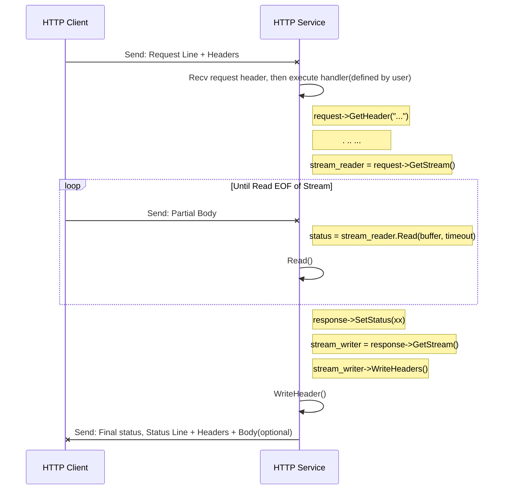
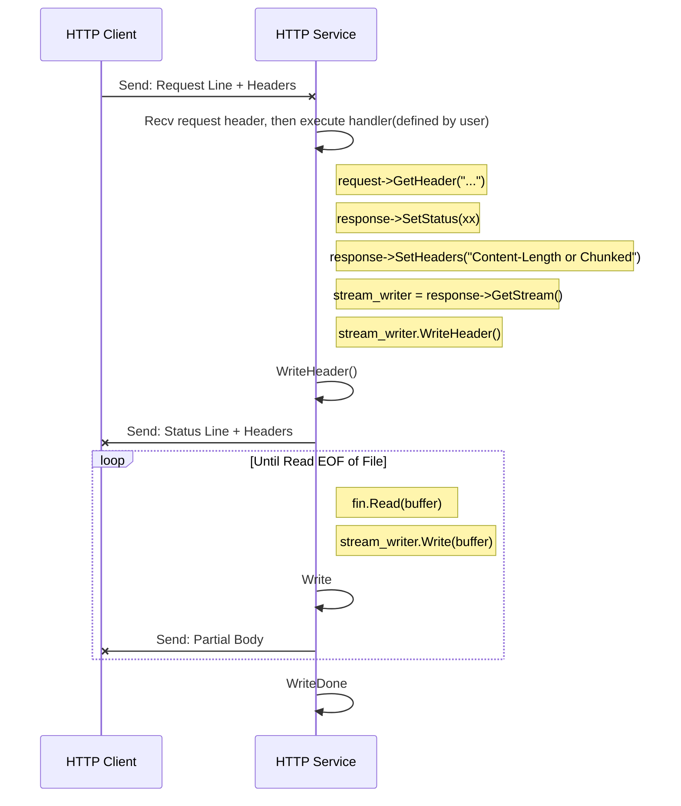

[English](../en/http_protocol_upload_download_service.md)

# 前言

主题：如何基于 tRPC-Cpp 开发 HTTP 文件上传、下载服务。

在 HTTP 服务中，部分场景需要读取或者发送大文件的场景，将文件完整读入内存压力较大且效率较低，对于大文件的上传可行性不高。
tRPC-Cpp 提供一套 HTTP 流式读取、写入数据分片的接口，可以分片接收、发送大文件。

* 对于已经知晓长度的大文件，设置 `Content-Length: $length` 后分块发送（当然也可以使用 chunked 分块发送，如果对端支持的话）。
* 对于未知长度的大文件，设置 `Transfer-Encoding: chunked` 后分块发送。

同时，支持 HTTP 同步流式编程接口和异步编程接口，不同类型的编程接口依赖不同的 `tRPC 运行时`，编程方式较大差异，也有部分限制，具体章节会注释说明。
阅读本文前，读者可以先了解下 tRPC-Cpp 的 `fiber 协程` 和 `future/promise`。

本文介绍如何基于 tRPC-Cpp （下面简称 tRPC）发 HTTP 文件上传-下载服务，开发者可以了解到如下内容：

* 如何使用同步流式接口实现文件上传-下载。
  * 运行流程。
  * 编程接口。
  * 实现上传-下载服务。
* 如何使用异步流式接口实现文件上传-下载。
  * 运行流程。
  * 编程接口。
  * 代码示例。
* FAQ。

# 如何使用同步流式接口实现文件上传-下载

HTTP 同步流式服务基于 `HttpService` 和 `SetHttpRoutes` 方法开发。
传输数据时，可以指定长度 `Content-Length: $length`，或者使用分块传输 `Transfer-Encoding: chunked` 。

提示：同步流式接口需要运行在 `fiber` 协程环境。

## 体验文件同步上传-下载服务

示例： [http_upload_download](../../examples/features/http_upload_download)

方法：进入 tRPC 代码仓库主目录，然后运行下面的命令。

```shell
sh examples/features/http_upload_download/run.sh
```

示例程序输出：

``` text
// Downlaods a file from the server:
finish downloading, read size: 10485760
name: download a file from the server, ok: 1
final result of http calling: 1

// Uploads a file to the server:
upload a file with chunked
finish uploading, write size: 10485760
name: upload a file to server, ok: 1
final result of http calling: 1

upload a file with content-length
finish uploading, write size: 10485760
name: upload a file to server, ok: 1
final result of http calling: 1
```

## 同步运行流程

先来看看服务端 HTTP 流式数据上传、下载过程，然后基于这些流程来设计自己的数据上传和下载服务。

在框架接收到用户请求后，会启动协程运行用户设置并实现的 `HttpHandler` 逻辑。

文件上传场景逻辑大致如下：

1. 读取请求头。
2. 分块读取请求消息体直至读取到 `EOF`，读取成功后并处理数据块。
3. 完成读取后，发送响应消息告知客户端处理结果。



文件下载场景逻辑大致如下：

1. 设置响应码和响应头部，按需设置 `Content-Length or Chunked` 。
2. 发送响应消息头。
3. 分块写入响应消息体，直至全部写完。



## 流式同步编程接口

### 服务端流同步读取器和流写入器

* 通过 `HttpRequest` 的 `GetStream()` 方法获得 `stream_reader`，对象类型为 `HttpReadStream`。
* 通过 `HttpResponse` 的 `GetStream()` 方法获得 `stream_writer`，对象类型为 `HttpWriteStream`。

接口列表：

| 对象类型            | 接口签名                                                                                                                | 功能                                                         | 参数                                                                             | 返回值    |
|-----------------|---------------------------------------------------------------------------------------------------------------------|------------------------------------------------------------|--------------------------------------------------------------------------------|--------|
| HttpReadStream  | Status Read(NoncontiguousBuffer&amp; item, size_t max_bytes)                                                        | 读取指定长度的内容，使用 service 配置的 timeout+now 作为作为整个读流过程的超时时间点阻塞该操作 | max_bytes，如果收完整包后的剩余内容不足指定长度，会立即返回剩余内容，并通过返回值标识 EOF                            | Status |
| HttpReadStream  | Status Read(NoncontiguousBuffer&amp; item, size_t max_bytes, const std::chrono::time_point<Clock, Dur>&amp; expiry) | 读取指定长度的内容，阻塞该操作直到指定的时间点                                    | expiry，例：trpc::ReadSteadyClock() + std::chrono::milliseconds(3)                | Status |
| HttpReadStream  | Status Read(NoncontiguousBuffer&amp; item, size_t max_bytes, const std::chrono::duration<Rep, Period>&amp; expiry)  | 读取指定长度的内容，阻塞该操作直到指定的时间间隔                                   | expiry，例：std::chrono::milliseconds(3)                                          | Status |
| HttpReadStream  | Status ReadAll(NoncontiguousBuffer&amp; item)                                                                       | 读取整包内容，使用 service 配置的 timeout 作为整个读流过程的超时时间点阻塞该操作          | -                                                                              | Status |
| HttpReadStream  | Status ReadAll(NoncontiguousBuffer&amp; item, const std::chrono::time_point<Clock, Dur>&amp; expiry)                | 读取整包内容，阻塞该操作直到指定的时间点                                       | expiry，例：trpc::ReadSteadyClock() + std::chrono::milliseconds(3)                | Status |
| HttpReadStream  | Status ReadAll(NoncontiguousBuffer&amp; item, const std::chrono::duration<Rep, Period>&amp; expiry)                 | 读取整包内容，阻塞该操作直到指定的时间间隔                                      | expiry，例：std::chrono::milliseconds(3)                                          | Status |
| HttpReadStream  | void SetDefaultDeadline(std::chrono::steady_clock::time_point default_deadline)                                     | 设置默认的超时时间点，该值会覆盖 service 配置的 timeout+now                   | -                                                                              | -      |
| HttpWriteStream | Status WriteHeader()                                                                                                | 发送响应头                                                      | 通过 Response 的 SetStatus 可设置指定响应行，默认为 200；通过 Response 的 SetHeader 可设置指定的 header | Status |
| HttpWriteStream | Status Write(NoncontiguousBuffer&amp;&amp; item)                                                                    | 发送内容                                                       | -                                                                              | Status |
| HttpWriteStream | Status WriteDone()                                                                                                  | 发送结束                                                       | -                                                                              | Status |

### 服务端流接口常用返回码

超时类型的错误，业务可以尝试重试，但是网络错误就不要再重试了，说明流读取器或者写入器所在的连接存在异常。

| 返回码                                        | 值   | 含义                           |
|--------------------------------------------|-----|------------------------------|
| kSuccStatus                                | 0   | 操作执行成功                       |
| kStreamStatusReadEof                       | -99 | 已读完所有内容                      |
| kStreamStatusServerReadTimeout             | 254 | 服务端读超时                       |
| kStreamStatusServerWriteTimeout            | 234 | 服务端写超时                       |
| kStreamStatusServerNetworkError            | 201 | 服务端网络错误（如连接断开或者空闲超时）         |
| kStreamStatusServerWriteContentLengthError | 232 | 写数据长度和设置的 Content-Length 不匹配 |

### 读相关接口的超时时间说明

读相关接口：Read，ReadAll。
这里以 Read 接口为例，tRPC 提供两种类型的具体接口形式：

* Read(item, max_bytes)，不带自定义超时时间。

  此类接口超时时间点在创建读写器后就是一个固定值（由 service 配置计算出来或者 SetDefaultDeadline 方法指定）。

  > 例如，配置 timeout 为 60000ms，记用户获得读写器的时间点为 now，那么用户后续无论怎么调用 Read(item, max_bytes)
  > ，它的超时时间点一直是now + 1min不变，可以理解为整个读流过程的超时时间。

* Read(item, max_bytes, timeout)，带自定义超时时间。

  如果用户的数据很大，比如， 10G 文件，网络情况也不确定，这种场景下建议用户使用 Read(item, max_bytes, timeout) 类的接口。

  > 这里的 timeout 参数只针对该 Read 操作，timeout 类型可以为时间间隔，如 10s 则表示该次 Read 操作从触发开始阻塞10s，也可以为具体的时间点，则表示该次
  > Read 操作阻塞到指定的时间点。

## 实现文件上传-下载服务

示例： [file_storage_handler.cc](../../examples/features/http_upload_download/server/file_storage_handler.cc)

### 实现文件上传服务

参照文件上传运行流程，数据上传过程需要经历如下几个步骤: 收到请求，读取请求头，读请求消息体数据，完成读，发送响应。

* **收到请求**

  服务收到 HTTP 请求后，框架会根据 url 启动用户预设的 handler 处理过程。

* **读取请求头**

  HttpRequest 对象提供接口来获取请求头信息： HasHeader/GetHeader，用户能够获得请求头内容信息。比如查找 `Content-Length` 或 `Transfer-Encoding`，判断对端是用长度形式还是 chunked 形式发送数据。当然，框架会自动帮用户将 chunked 形式的数据分片解码，用户拿到的是 chunked 解码后的数据分片。

* **读数据**

  Read(item, max_bytes)接口，如果服务端的回包数据没有结束，该次 Read 会一直阻塞到读出 max_bytes 长度的数据；如果服务端的回包数据已经结束，该次Read 操作读出 max_bytes 长度数据或者读出数据结尾都会立即返回。

* **完成读**

  当读出数据结尾时，Read 接口会返回 kStreamStatusReadEof 返回码，告知用户服务端数据已经全部读完。

* **发送响应**

  正常的交互流程里，用户应当根据对端的请求主动调用 HttpResponse 的 SetStatus 设置状态码（默认 200），调用 HttpWriteStream 的 WriteHeader 发送响应头。如果用户没有主动调用 WriteHeader，框架会在结束用户处理逻辑后自动调用 WriteHeader 完成响应过程（默认 200）。

* 示例代码：

  ```cpp
  // 接收来自客户端上传的文件 
  ::trpc::Status FileStorageHandler::Post(const ::trpc::ServerContextPtr& ctx, const ::trpc::http::RequestPtr& req, ::trpc::http::Response* rsp) {
    // 打开一个文件，准备保存上传的文件内容
    auto fout = std::ofstream("/to/path/upload_dst_xx", std::ios::binary);
    if (!fout.is_open()) {
      rsp->SetStatus(::trpc::http::ResponseStatus::kInternalServerError);
      return ::trpc::kSuccStatus;
    }
  
    // 获取流读取器
    auto& reader = req->GetStream();
    ::trpc::Status status;
    // 每次至多读取 1MB
    constexpr std::size_t kBufferSize{1024 * 1024};
    std::size_t nread{0};
    
    // 开始接收文件内容
    for (;;) {
      ::trpc::NoncontiguousBuffer buffer;
      // 读数据
      status = reader.Read(buffer, kBufferSize);
      if (status.OK()) {
        nread += buffer.ByteSize();
        // 将数据写入到文件
        for (const auto& block : buffer) {
          fout.write(block.data(), block.size());
        }
        continue;
      } else if (status.StreamEof()) {
        // 文件读取完毕
        break;
      }
      // 出现异常，返回异常错误码，框架会识别 RST 返回码并关闭流
      return ::trpc::kStreamRstStatus;
    }
  
    // 接收完毕后，发送响应给客户端 
    rsp->SetStatus(::trpc::http::ResponseStatus::kOk);
    auto& writer = rsp->GetStream();
    status = writer.WriteHeader();
    if (!status.OK()) {
      return ::trpc::kStreamRstStatus;
    }
    return ::trpc::kSuccStatus;
  }
  ```
  
### 实现文件下载服务

参照文件下载运行流程，数据下载过程需要经历如下几个步骤：读取请求头，设置长度形式或 chunked 形式，发送响应头，写数据，完成写。

* **收到请求**

  服务收到 HTTP 请求后，框架会根据 url 启动用户预设的 handler 处理过程。

* **读取请求头**

  HttpRequest 提供接口获取请求头部： HasHeader/GetHeader。

* **设置长度形式或chunked形式**

  调用 HttpResponse 的 SetHeader 方法设置长度形式或 chunked 形式。如果已经完整数据长度，可以采用长度形式 "Content-Length: 104857600"；如果不知道完整数据有多长，可以采用 chunked 形式 "Transfer-Encoding: chunked"。

* **发送响应头**

  正常的交互流程里，用户应当根据对端的请求主动调用 HttpResponse 的 SetStatus设置状态码（默认 200），调用 HttpWriteStream 的 WriteHeader 发送响应头。如果用户没有主动调用 WriteHeader，框架会在结束用户处理逻辑后自动调用 WriteHeader 完成响应过程（默认 200）。

* **写数据**

  通过 Write 接口，用户可以不断地向服务端发送数据分片。如果用户使用的是 chunked形式，用户也不需要对传输数据做 chunked 编码，框架会自动处理。如果用户使用的是长度形式，一旦用户发送的数据超过了设置的长度，Write 接口会报 kStreamStatusServerWriteContentLengthError 错误。

* **完成写**

  通过 WriteDone 接口，用户告知读写器数据全部发送完毕。如果用户使用的是 chunked 形式，框架会向对端发送 chunked 结束标志；如果用户使用的是长度形式，框架会检查用户已发送的数据长度和设置的长度是否一致，不一致会报 kStreamStatusServerWriteContentLengthError 错误。一旦调用 WriteDone接口后，用户不应该再尝试使用 Write 接口。

* 示例代码：
  
  ```cpp
  // 响应客户端下载请求
  ::trpc::Status FileStorageHandler::Get(const ::trpc::ServerContextPtr& ctx, const ::trpc::http::RequestPtr& req,
                                         ::trpc::http::Response* rsp) {
    // 打开待下载的文件
    auto fin = std::ifstream("/to/path/download_src_xx", std::ios::binary);
    if (!fin.is_open()) {
      rsp->SetStatus(::trpc::http::ResponseStatus::kInternalServerError);
      return ::trpc::kSuccStatus;
    }
  
    // 使用 Chunked 方式发送响应数据 
    rsp->SetHeader(::trpc::http::kHeaderTransferEncoding, ::trpc::http::kTransferEncodingChunked);
    // 获取流写入器，然后发送响应头
    auto& writer = rsp->GetStream();
    ::trpc::Status status = writer.WriteHeader();
    if (!status.OK()) {
      // 写入失败的话，返回错误吗，框架会识别 RST 返回码并关闭流
      return ::trpc::kStreamRstStatus;
    }
  
    std::size_t nwrite{0};
    ::trpc::BufferBuilder buffer_builder;
    // 开发发送响应消息体
    for (;;) {
      fin.read(buffer_builder.data(), buffer_builder.SizeAvailable());
      std::size_t n = fin.gcount();
      if (n > 0) {
        ::trpc::NoncontiguousBuffer buffer;
        buffer.Append(buffer_builder.Seal(n));
        // 写数据
        status = writer.Write(std::move(buffer));
        if (status.OK()) {
          nwrite += n;
          continue;
        }
        return ::trpc::kStreamRstStatus;
      } else if (fin.eof()) {
        // 完成数据写入
        status = writer.WriteDone();
        if (status.OK()) break;
        return ::trpc::kStreamRstStatus;
      }
      return ::trpc::kStreamRstStatus;
    }
    return ::trpc::kSuccStatus;
  }
  ```

# 如何使用异步流式接口实现文件上传-下载

HTTP 异步流式服务基于 `HttpAsyncStreamFuncHandler` 开发。
并通过 `HttpAsyncStreamService` 和 `RegisterAsyncStreamMethod` 注册路由。

```cpp
// 用户需要实现的流式方法签名：
using BidiStreamFunction = std::function<Future<>(const ServerContextPtr&, HttpServerAsyncStreamReaderWriterPtr)>;
```

传输数据时，可以指定长度 `Content-Length: $length`，或者使用分块传输 `Transfer-Encoding: chunked` 。

要求：

* 异步流式接口需要运行在 `merge` 线程模型环境。`merge` 线程模型是 tRPC 的一种 runtime，线程角色既做 `IO`，也做业务逻辑 `Handle`。
* 当前仅支持在 tRPC 内部线程调用异步流式接口，暂不支持在用户自定义的外部线程中使用（程序会 crash）。
* 采用 `future/promise` 编程。
* HTTP 消息读、写满足 HTTP 协议规范，也即对于请求和响应的写满足如下顺序：
  * 先写 start_line/status_line + headers。
  * 再写 body。

## 体验文件异步上传-下载服务

示例： [http_async_upload_download](../../examples/features/http_async_upload_download)

方法：进入 tRPC 代码仓库主目录，然后运行下面的命令。

```shell
sh examples/features/http_async_upload_download/run.sh
```

示例程序输出：

``` text
// Downlaods a file from the server:
finish downloading, read size: 10485760
name: download a file from the server, ok: 1
final result of http calling: 1

// Uploads a file to the server:
upload a file with chunked
finish uploading, write size: 10485760
name: upload a file to server, ok: 1
final result of http calling: 1
```

## 异步运行流程

文件上传和下载场景基本流程和同步流式类似。
在框架接收到用户请求后，采用异步回调方式运行用户设置并实现的 `HttpAsyncStreamFuncHandler` 逻辑。

## 异步编程接口

### 服务端流异步读取器和流写入器

| 对象类型                                 | 接口签名                                                                                                  | 功能                                                                                                                                                                                                         | 参数                       |
|--------------------------------------|-------------------------------------------------------------------------------------------------------|------------------------------------------------------------------------------------------------------------------------------------------------------------------------------------------------------------|--------------------------|
| HttpServerAsyncStreamReaderWriterPtr | const HttpRequestLine& GetRequestLine()                                                               | 获得请求起始行（一定是获取到了起始行里的 request_uri 才能分发到业务注册的方法里，因此此操作无需异步）                                                                                                                                                  | -                        |
| HttpServerAsyncStreamReaderWriterPtr | Future&lt;HttpHeader> ReadHeader(int timeout = max)                                                   | 从流里读出 header                                                                                                                                                                                               | 超时时间（ms）                 |
| HttpServerAsyncStreamReaderWriterPtr | Future&lt;NoncontiguousBuffer> ReadChunk(int timeout = max)                                           | 从流里读出 chunk，只有确认是 chunked 模式才能调这个接口，否则将会失败（从 header 判断）                                                                                                                                                    | 超时时间(ms)                 |
| HttpServerAsyncStreamReaderWriterPtr | Future&lt;NoncontiguousBuffer> ReadAtMost(uint64_t len, int timeout = max)                            | 长度模式/chunked 模式均可调用，获得最多 len 长度的数据</br>如果从网络拿到的数据 size 比 len 小，返回 size 长度数据</br>如果从网络拿到的数据 size 比 len 大，返回 len 长度的数据</br>buffer 为空代表 EOF </br>场景说明1: 用于内存受限下，每次最多读限制的长度</br>场景说明2: 在中转模式下，能及时地拿到部分数据，发送给下游 | len 字节数，timeout 超时时间（ms） |
| HttpServerAsyncStreamReaderWriterPtr | Future&lt;NoncontiguousBuffer> ReadExactly(uint64_t len, int timeout = max)                           | 长度模式/chunked 模式均可调用，获得固定 len 长度的数据，如果读到 EOF，则网络有多少数据就返回多少</br>如果读出来的 buffer 大小，小于传入的l en，那么代表读到了 EOF</br>特殊场景说明1: 请求数据按固定大小进行压缩，需要以固定大小读出，进行解压                                                             | len 字节数，timeout 超时时间（ms） |
| HttpServerAsyncStreamReaderWriterPtr | Future<> WriteStatusLine(HttpStatusLine&& rsp_line)                                                   | 写出响应状态行                                                                                                                                                                                                    | 响应状态行                    |
| HttpServerAsyncStreamReaderWriterPtr | Future<> WriteHeader(HttpHeader&& header)                                                             | 写出 header                                                                                                                                                                                                  | header                   |
| HttpServerAsyncStreamReaderWriterPtr | Future<> WriteData(NoncontiguousBuffer&& data)                                                        | 写出数据</br>将会识别 header 的信息，如果 header 里指明了 chunked，将会把数据组织成 chunked 格式再发送                                                                                                                                     | 数据                       |
| HttpServerAsyncStreamReaderWriterPtr | Future<> WriteDone()                                                                                  | 写完数据</br>如果是 chunked 模式，将会写出 chunked 终止标识                                                                                                                                                                  | -                        |
| -                                    | Future&lt;HttpRequestPtr> ReadFullRequest(HttpServerAsyncStreamReaderWriterPtr rw, int timeout = max) | 以 timeout 超时（ms），从流里读完整请求                                                                                                                                                                                  | 服务端流读写器，超时（ms）           |
| -                                    | Future<> WriteFullResponse(HttpServerAsyncStreamReaderWriterPtr rw, HttpResponse&& rsp)               | 往流里写出完整响应                                                                                                                                                                                                  | HTTP 响应                  |

## 代码示例

整体流程逻辑和同步流式服务类似，只是使用了异步接口来实现，可以参考示例 [http_server.cc](../../examples/features/http_async_upload_download/server/http_server.cc)

# FAQ

## 同步流式如何响应 `100 Continue` ?

部分客户端在发送大文件 POST/PUT 请求时，会在 Header 里携带`Expect: 100-continue`，并等待服务端返回 `100 continue`
或 `4xx/5xx 拒绝` 错误码。

框架支持业务自定义回复 `100 Continue` 状态码，在 `WriteHeader` 调用前加入以下代码即可：

```cpp
if (req->GetHeader("Expect") == "100-continue") {  // 并检查是否可上传，否则使用 `SetStatus` 设置 4xx/5xx 错误码后返回即可
  resp->SetStatus(trpc::http::HttpResponse::kContinue);
  resp->GetStream().WriteHeader();  // 建议检查返回 Status 是否正常
  // 写 100 Continue 后状态码将自动设置为默认值 (200 OK)，业务可以再次调用 SetStatus（以及 WriteHeader）发送实际状态码
}
```

## 同步流式 HttpResponse::SetContent() 无效 ?

用户可以在未使用 WriteHeader（非 1xx 状态码）或 Write 的情况下使用 SetContent() 简单回包，框架会自动在用户函数结束后以非流式场景下的方式回复响应。
