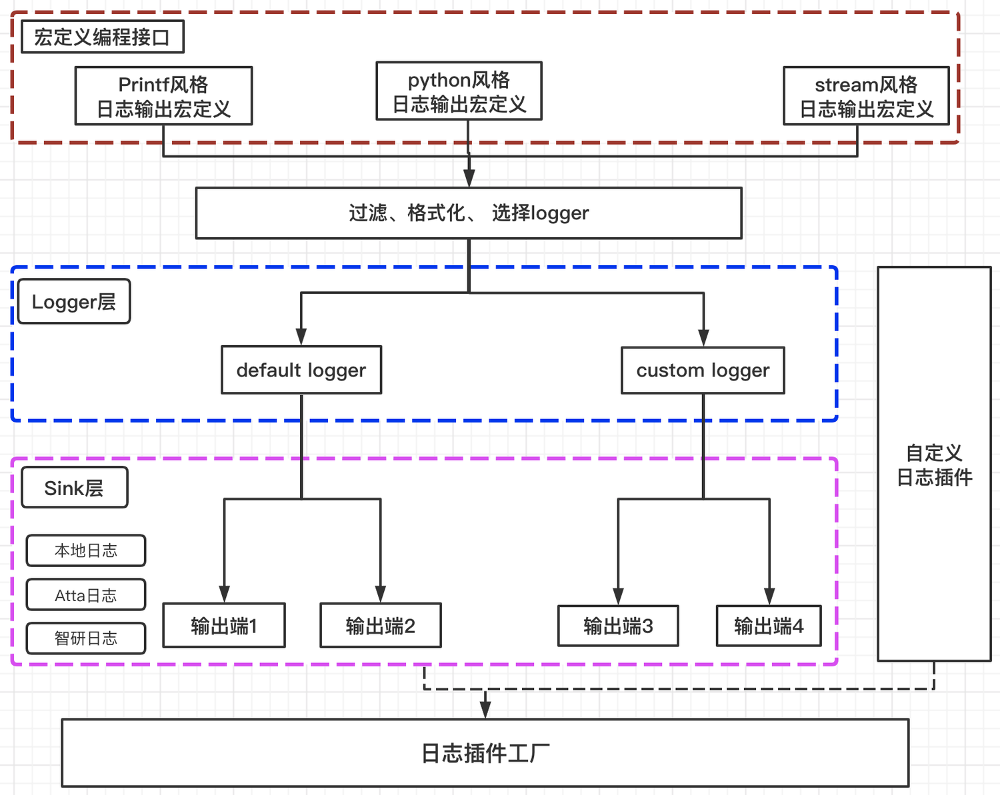

[TOC]
# 1 前言
日志是软件开发中的一个重要组成部分，好的日志是我们分析软件运行状态的一个重要信息来源。 tRPC-Cpp框架为业务提供了一套的日志打印，收集和上报的解决方案。通过本文的介绍，旨在为用户提供以下信息：

- 框架提供了哪些日志功能？
- 框架如何实现这些功能的？
- 如何使用标准日志接口？
- 日志配置该如何配？

术语：
- 实例： 等价logger，即多实例就是多logger
- flow风格： 使用TRPC_FLOW_LOG,TRPC_FLOW_LOG_EX两种日志宏的统称

# 功能介绍
## 功能概述

如图所示，tRPC-Cpp 日志模块底层是基于SpdLog实现，它包括两方面的实现：  `日志打印编程接口`  和  `与日志输出端对接` 。在实现中引入了Logger 和Sink 两个概念


Logger和Sink分别负责日志打印和于日志服务系统对接，它们都采用了插件化编程，可定制化开发 ，用户可以参考[如何开发自定义日志插件](./custom_logging.md)。Logger 和Sink 的定义如下：
- Logger用于负责实现日志打印相关的通用接口，Logger采用插件化编程，支持多Logger功能，用户可以自行选择logger来实现差异化日志打印和收集。通过Sink插件和日志后端进行对接。
- Sink又称为“日志输出端”，用于负责日志的收集上报功能，包括日志上报格式和与后端日志系统对接等。每个Logger都可以有多个Sink， 例如：Default这个默认的logger, 它可以支持同时输出到本地日志和远程CLS。Sink采用插件化编程，可灵活扩展。

框架提供了4种风格的日志打印函数：
- python 风格：最优雅，方便，推荐。[详细语法](https://fmt.dev/latest/syntax.html)
- prinrf 风格:  printf语法，类型安全。[详细语法](https://en.wikipedia.org/wiki/Printf_format_string)
- stream 风格:  兼容旧版本，框架打印日志的方式，使用较为繁琐，不推荐用户使用
- flow 风格： 它的底层沿用的是 stream风格，但可以支持传入context和指定logger。 推荐用于打印业务日志时与框架日志分开的场景。

## 日志打印接口
首先框架参考业界标准对日志打印级别按由低到高的顺序进行了如下划分：
| 级别 | 描述 |
| :--- | :---: |
| **trace** | 该级别日志的主要作用是对系统特定事件的每一步的运行状态进行精确的记录|
| **debug** | 指出细粒度信息事件对调试应用程序是非常有帮助的，主要用于开发过程中打印一些运行信息|
| **info**| 消息在粗粒度级别上突出强调应用程序的运行过程。打印一些你感兴趣的或者重要的信息，这个可以用于生产环境中输出程序运行的一些重要信息，但是不能滥用，避免打印过多的日志|
|**warn** |表明会出现潜在错误的情形，有些信息不是错误信息，但是也要给程序员一些提示 |
|**error** |指出虽然发生错误事件，但仍然不影响系统的继续运行。打印错误和异常信息，如果不想输出太多的日志，可以使用这个级别 |
| **critical**|指出每个严重的错误事件将会导致应用程序的退出。这个级别比较高了。重大错误，这种级别你可以直接停止程序了 |

为照顾不同用户的使用习惯，框架为每个级别的日志函数提供了类似于 `python` 、 `printf` 、`stream`  、 `flow`四种风格的打印日志宏，此处举例只是让用户有个大概的了解，更详细的日志宏在下文介绍。

- 推荐使用：python 风格的日志宏，因为性能方面fmt::format要比std::ostream高20%左右。

``` 
// python 风格
TRPC_FMT_DEBUG("msg:{}", "test");
// printf 风格
TRPC_PRT_DEBUG("msg: %s", "test");
// stream 风格
TRPC_LOG_DEBUG("msg:" << "test");
// flow 风格
TRPC_FLOW_LOG_EX(ctx, "custom1", "msg:" << "test"); 可指定传入ctx和logger name
```

### 2.2.1 Default 日志宏接口
- 宏接口说明：它使用了default logger, 且只有一个参数, 参数表示需要打印的日志内容。tRPC-Cpp框架日志都出于此。
- 使用场景：框架日志, 调试日志
```cpp 
  int i = 0;
  // python-like
  TRPC_FMT_TRACE("trpc-{}: {}", "cpp");                   // trpc-cpp    
  TRPC_FMT_DEBUG("print floats {:03.2f}", 1.23456);       // "print floats 001.23"
  TRPC_FMT_INFO("hello trpc-{}: {}", "cpp", ++i);         // "hello trpc-cpp: 2"
  TRPC_FMT_ERROR("{} is smaller than {}?", 1, 2);       // "1 is smaller than 2?"
  TRPC_FMT_CRITICAL("coredump msg: {}?", "oom");          // "coredump msg: oom"
 
  // printf-like
  TRPC_PRT_INFO("just like %s: %d", "printf", ++i);      // "just like printf: 3"
  ...

  // stream-like
  TRPC_LOG_INFO("stream trace: " << ++i);          // "stream trace: 1"
  ...
```
### 带Context的日志宏接口
- 宏接口说明：它有2个参数， 第一个是context， 第二个为日志内容。需要注意的是，这里的context是ClientContext和ServerContext的基类, 所以在客户端和服务端都适用。

```cpp
TRPC_LOG_TRACE_EX(context, msg);
TRPC_LOG_DEBUG_EX(context, msg);
TRPC_LOG_INFO_EX(context, msg);
TRPC_LOG_WARN_EX(context, msg);
TRPC_LOG_ERROR_EX(context, msg);
TRPC_LOG_DEBUG_EX(context, msg);

// 日志等级框架写死为info级别
TRPC_FLOW_LOG_EX(context, instance, msg)
// 举例
TRPC_FLOW_LOG_EX(ctx, "custom", "msg：" << "test") // ctx是上下文对象, custom是logger name, 输出：msg: test
```
说明：
line 8: instance指的是logger的name, 用户可通过这个宏指定不同的logger, 并且也可获得context的信息， 接口更加灵活。
line 9: 日志等级框架写死为info级别 ,用户如果想修改日志级别可以基于`TRPC_STREAM`来设置，也可自己用它来封一个日志宏，下面是TRPC_FLOW_LOG的实现
```
#define TRPC_FLOW_LOG(instance, msg) TRPC_STREAM(instance, trpc::Log::info, nullptr, msg)
#define TRPC_FLOW_LOG_EX(context, instance, msg) \
  TRPC_STREAM(instance, trpc::Log::info, context, msg)
```

### 2.2.3  指定logger的日志宏接口
- 宏接口说明： <span id="jump_setLogger"> 可以指定logger,  定制化日志输出方式。 </span>
- 使用场景：
-  把业务日志和框架日志分离
-  不同的业务日志指定不同的logger
-  业务日志输出到远程

上述场景任意一种，或者任意几种的组合都可以通过指定logger的日志宏接口实现。
``` 
  // flow风格的宏
  TRPC_FLOW_LOG(instance, msg)
  TRPC_FLOW_LOG_EX(context, instance, msg)
  // 举例
  TRPC_FLOW_LOG("custom1", "hello" << "trpc")  // hello trpc
  TRPC_FLOW_LOG_EX("server_context", "custom2", "hello" << "trpc")  // hello trpc

  // fmt风格定义宏接口
  TRPC_LOGGER_FMT_TRACE(instance, format, args...)
  TRPC_LOGGER_FMT_DEBUG(instance, format, args...) 
  TRPC_LOGGER_FMT_INFO(instance, format, args...) 
  TRPC_LOGGER_FMT_WARN(instance, format, args...) 
  TRPC_LOGGER_FMT_ERROR(instance, format, args...) 
  TRPC_LOGGER_FMT_CRITICAL(instance, format, args...)
  // 举例 
  TRPC_LOGGER_FMT_WARN("custom3", "i am not {} logger", "default");        // "i am not default logger"
```

### 带IF条件的日志宏接口
- 宏接口说明：带条件的日志宏，即当条件满足时，则输出日志，否则不输出
- 使用场景 1：日志只有满足自定义的条件才输出
``` 
	// fmt风格
  TRPC_FMT_TRACE_IF(condition, format, args...)
  TRPC_FMT_DEBUG_IF(condition, format, args...)
  TRPC_FMT_INFO_IF(condition, format, args...)
  TRPC_FMT_WARN_IF(condition, format, args...)
  TRPC_FMT_ERROR_IF(condition, format, args...)
  TRPC_FMT_CRITICAL_IF(condition, format, args...)
  // 举例
  TRPC_FMT_INFO_IF(true, "if true, print: {}", "msg");     // "if true, print: msg"
 
  // printf风格
  TRPC_PRT_TRACE_IF(condition, format, args...)
  TRPC_PRT_DEBUG_IF(condition, format, args...)
  TRPC_PRT_INFO_IF(condition, format, args...)
  TRPC_PRT_WARN_IF(condition, format, args...)
  TRPC_PRT_ERROR_IF(condition, format, args...)
  TRPC_PRT_CRITICAL_IF(condition, format, args...)
  // 举例
  TRPC_PRT_INFO_IF(true, "if true, print: %s",  "msg");   // "if true, print: msg"

  // stream风格
  TRPC_LOG_TRACE_IF(condition, msg)
  TRPC_LOG_DEBUG_IF(condition, msg)
  TRPC_LOG_INFO_IF(condition, msg)
  TRPC_LOG_WARN_IF(condition, msg)
  TRPC_LOG_ERROR_IF(condition, msg)
  TRPC_LOG_CRITICAL_IF(condition, msg)
  // 举例
  TRPC_LOG_INFO_IF(true, "if true, print: " << "msg");    // "if true, print: msg"

  // 以上所有的宏接口也可以和LOGGER/Context配合使用，例如：
  TRPC_LOGGER_FMT_INFO_IF(true, "if true, print: {}", "msg");              // "if true, print: msg"
  TRPC_LOGGER_PRT_INFO_EX(context, true, "if true, print: %s", "msg");     // "if true, print: msg"
  TRPC_LOGGER_LOG_INFO_IF_EX(context, true, "if true, print: " << "msg");  // "if true, print: msg"
```
- 使用场景 2：用户希望输出日志但又不希望输出过多导致性能下降。
这种场景下可使用 条件宏算子
- TRPC_EVERY_N(c) ：设置本条日志每触发c次至多输出打印1次，第一次必定触发。
- TRPC_WITHIN_N(ms)：设置为本条日志在设定的ms毫秒内若存在多次触发，则至多只输出1次，第一次必定触发。使用示例如下
``` 
TRPC_FMT_INFO_IF(TRPC_EVERY_N(1000), "condition every 1000");          # 每1000次调用打印一次日志
TRPC_FMT_INFO_IF(TRPC_WITHIN_N(1000), "condition within 1000 ms");     # 每1000ms时间内若触发一次以上调用，则打印至多一次日志
```

## 多logger支持
tRPC-Cpp支持同时存在多个logger，每个logger设置不同的日志级别，打印格式，上报输出后端，业务可以为不同的业务场景设置不同的logger。比如

- 不同的业务模块使用不同的日志文件存储
- 不同的事件，基于事件的关注度不同，采用不同的日志级别收集日志

多Logger功能大大增加了日志使用的灵活性。

## 多sink支持
对于同一个logger，框架也提供了日志同时输出到多个日志输出后端（简称 “sink”）的能力。 因为sink也是以插件的方式注册到框架的，所以用户可选本地，远程（比如 CLS，智研日志等），或者一个都不选。目前框架支持4种输出端（Sink）：
- 本地滚动文件（LocalFileSink）：配置名字为 `local_file`
- 本地控制台输出（StdoutSink）：配置名字为 `stdout`
  <span id="jump_sink"> 上述sink分属2种不同的类型： </span>
- DefaultSink：
    - 上述 LocalFileSink、StdoutSink 即是。
    - 配置写在 sinks 字段下面。
    - 要求返回一个 spdsink。
    - 归属于一个实例的所有 DefaultSink，由于都挂接在 DefaultLog 内置的spdlogger中，于是接收的消息是一样的
- RawSink
    - 上述 CLSLogSink 即是。
    - 配置写在 raw_sinks下面。
    -  要求实现一个 log 接口，额外接收 context 参数，由 DefaultLog 同步调用，其线程安全性也需要其自己保证。
    - 其行为完全由其自己定义，目前 CLSLogSink 会在内部新建一个 spdlogger 和一个 spdsink，然后根据 context 决定如何输出。

这里需要强调的是：日志的打印设置是以Sink粒度来配置的。用户需要为每个输出端做配置，比如：同一份日志即需要保存在本地日志文件，又要输出到cls， 那就必须要分别配置local_file和cls_log这两个sink。

# 日志配置
## 配置结构
首先我们来看看日志配置的总体结构。 由于日志模块对于logger和sink的实现都是采用插件的方式来实现的，所以日志配置都必须要放到“plugins”区域内。
```yaml
plugins:
  log:
    default:
      - name: default # 默认logger名
      	...
        sinks:  # DefaultSink类型插件
        local_file:  # 本地日志的sink
            ...
        raw_sinks: # RawSink类型插件
          cls_log: # cls日志的sink
      - name: custom1  # 自定义logger名字
        ...
        sinks:
          local_file:
            ...
        raw_sinks:
          cls_log:
```
说明：
- 上面的配置体现了多logger和多sink功能。“default”，“custom1”表示logger的名称。每个logger的配置是一个sink的数组。
- line 4: defaul表示框架默认logger
- line 6: sinks表示配置中放的是DefaultSink类型的插件， 比如local_file
- line 9: raw_sink表示配置中放的是RawtSink类型的插件， 比如cls_log

## logger配置
logger的配置通常是方便其管理的sink直接继承, 因此sink中有些字段可以不做配置，比如format，这样可以简化配置。先介绍下它的参数配置，设计如下。
|配置项 | 类型 |  是否必填 | 默认值 |配置解释|
| :--- | :---: | :---: | :---: | :---: |
| name | string  | 可选 | 空 | logger名 |
| min_level | int  | 可选 | 2 |  设置的最小日志级别, 只有日志级别大于它时，日志才会输出 |
| format | string  | 可选 | 空 | [%Y-%m-%d %H:%M:%S.%e] [thread %t] [%l] [%@] %v |
| mode | int  | 可选 | 2 |  可选：1 同步，2 异步 3 极速  |

说明：
format： 参考 [格式说明](https://github.com/gabime/spdlog/wiki/3.-Custom-formatting)
mode:
- 异步：打印日志时，把日志存入一个线程安全的缓存队列后直接返回。内部有独立线程 消费此队列，输出到各个输出端。如果队列满，则输出阻塞，如果队列空，则消费阻塞。**推荐使用方式**。
- 同步：打印日志时，直接遍历各个输出端并等待完成, 阻塞方式;

- 极速： 和异步模式基本相同，唯一区别在于输出从不阻塞，一旦队列满，则直接丢弃最旧的日志，然后存入当前日志并返回

``` 
plugins:
  log:
    default:
      - name: default
        min_level: 1 # 0-trace, 1-debug, 2-info, 3-warn, 4-error, 5-critical
        format: "[%Y-%m-%d %H:%M:%S.%e] [thread %t] [%l] [%@] [%!] %v"
        mode: 2 # 1-同步, 2-异步, 3-极速
        sinks:
        ...
```

## sink配置
### 使用本地日志
#### 本地文件日志
当sink设置为“local_file”时，代表日志打本地日志文件。先介绍下它的配置项如下。
|配置项 | 类型 |  是否必填 | 默认值 |配置解释|
| :--- | :---: | :---: | :---: | :---: |
| format | string  | 可选 | 空 |  日志输出格式，不填则默认继承logger的 |
| eol | bool  | 可选 | true |  格式化输出日志时是否换行  |
| filename | string  | 必填 | 空 | 本地日志文件名，默认为当前路径，可带路径  |
| roll_type | string  | 可选 | by_size | 设置日志分割方式，默认为by_size, 可选by_day-按天分割， by_hour-按小时分割|
| reserve_count | int  | 可选 | 10 | 滚动日志保留的文件个数  |
| roll_size | int  | 可选 | 100  x 1024 x 1024 |  by_size类型才设置此变量, 表示一个滚动文件的大小 |
| rotation_hour | int  | 可选 | 0 | by_day类型才设置此变量，表示按天切割的时刻，具体是时刻通过rotation_hour:rotation_minute指定|
| rotation_minute | int  | 可选 | 0 |   |
| remove_timout_file_switch | bool  | 可选 | false | by_hour类型才设置此变量，按天分割模式下, 删除过时文件的标识 |
| hour_interval | int  | 可选 | 1 | by_hour类型才设置此变量， 表示小时分割的间隔，单位为小时|

本地日志文件输出支持三种输出模式：
- 按大小：by_size
- 按天：by_day
- 按小时：by_hour

下面分别介绍如何配置
##### 按大小输出模式
```yaml
plugins:
  log:
    default:
      - name: custom # 可以默认的default,可以使用其他的logger名
        format: "[%Y-%m-%d %H:%M:%S.%e] [thread %t] [%l] [%@] %v"
        sinks:
          local_file:  # 本地日志的sink
            roll_type: by_size                                  # 输出本地日志模式
            eol: true                                           # 每次输出是否自动换行。默认换行
            filename: /usr/local/trpc/bin/log_by_size.log       # 日志文件名，包含路径（相对或绝对路径), 默认为trpc.log
            roll_size: 10000                                    # 输出单个文件大小,默认100M
            reserve_count: 5                                    # 输出本地日志滚动文件个数,默认9个
``` 
##### 按天输出模式
```yaml
plugins:
  log:
    default:
      - name: custom # 可以默认的default,可以使用其他的logger名
        format: "[%Y-%m-%d %H:%M:%S.%e] [thread %t] [%l] [%@] %v"
        sinks:
		  local_file:  # 本地日志的sink
            roll_type: by_day                                  # 按天输出本地日志模式
            eol: true                                          # 每次输出是否自动换行。默认换行
            filename: /usr/local/trpc/bin/log_by_day.log       # 日志文件名，包含路径（相对或绝对路径), 默认为trpc.log
            reserve_count: 5                                   # 输出本地日志滚动文件个数,默认9个
            rotation_hour: 0                                  # 表示按天切割的时刻，具体是时刻通过rotation_hour:rotation_minute指定
            rotation_minute: 0
            remove_timout_file_switch: false                   # 按天分割模式下,删除过时文件的标识, 默认不删除
```

#####  按小时输出模式
```yaml
plugins:
  log:
    default:
      - name: custom # 可以默认的default,可以使用其他的logger名
        format: "[%Y-%m-%d %H:%M:%S.%e] [thread %t] [%l] [%@] %v"
        sinks:
		    local_file:  # 本地日志的sink
            roll_type: by_hour                                   # 按小时输出本地日志模式
            eol: true                                            # 每次输出是否自动换行。默认换行
            filename: /usr/local/trpc/bin/log_by_hour.log        # 日志文件名，包含路径（相对或绝对路径), 默认为trpc.log
            reserve_count: 5                                     # 输出本地日志滚动文件个数,默认9个
            hour_interval: 1                                     # 表示小时分割的间隔，单位为小时，默认间隔是一小时
``` 

#### 本地控制台输出
当sink设置为"stdout"时，代表日志打本地控制台输出。先介绍下它的[参数配置](https://git.woa.com/trpc-cpp/trpc-cpp/blob/master/trpc/common/config/stdout_sink_conf.h)，设计如下。
|配置项 | 类型 |  是否必填 | 默认值 |配置解释|
| :--- | :---: | :---: | :---: | :---: |
| format | string  | 可选 | 空 |  日志输出格式，不填则默认继承logger的 |
| eol | bool  | 可选 | true |  格式化输出日志时是否换行  |
| stderr_level | int  | 可选 | 4 |  该级别及以上的日志输出到标准错误输出（stderr）  |

```yaml
plugins:
  log:
    default:
      - name: custom # 可以默认的default,可以使用其他的logger名
        format: "[%Y-%m-%d %H:%M:%S.%e] [thread %t] [%l] [%@] %v"
        sinks:
          stdout:  # 本地控制台的sink
            eol: true                    # 每次输出是否自动换行。默认换行
            stderr_level: 4              # 输出到stderr的最低等级，默认为4（ERROR）
``` 

# 经典场景使用说明
## 场景1： 业务日志与框架日志分离，不同的业务日志需定制化输出
步骤：
- 选择宏接口：选择 `指定logger的日志宏`中的任意一种来打印日志
- 添加配置：完成logger，sink的配置。其中logger配置可以指定format, mode, sink配置可以选择本地，远程。

## 场景6：纯客户端模式下如何把初始化日志插件并把日志输出到文件中
纯客户端：
用户在纯客户端的场景下需要把日志输出到文件，需要自己在代码中调用接口完成插件的初始化。 这里也分为两种方式：
- 初始化全部的插件: 
```
trpc::TrpcPlugin::GetInstance()->RegisterPlugins();
```
- 只需要初始化日志插件
```
trpc::TrpcPlugin::GetInstance()->InitLogging();
```
说明：服务端在服务启动的时候框架会帮完成日志插件的初始化，所以用户不用管这块。

## 场景7：单测或者客户端没有配置日志插件，如何把trpc的log日志输出到终端？
如果不写配置，或者日志模块还未初始化，那么日志将输出到控制台：`level < error` 将会输出到 std::cout，否则 std::cerr。
为了避免过多的日志输出（如trace、debug等），默认情况下，只有 `level >= info` 的日志才会输出。为了支持不同用户的需求，用户可以定义宏`TRPC_NOLOG_LEVEL`改变默认行为，这个宏需要传递给框架的日志模块。
例如，你需要指定为 debug，有如下两种方式可以试下
-  1 执行bazel test时加上 下面这个选项
   > --copt=-DTRPC_NOLOG_LEVEL=1
-  2 “在写在配置文件 .bazelrc 中，这样就不用每次手动指定了：
   0-trace, 1-debug, 2-info, 3-warn, 4-error, 5-critical
   > build --copt="-DTRPC_NOLOG_LEVEL=1"

## 场景8：context没有在业务方法之间透传，如何在打印日志时获取到context？
框架支持自动把context设置到线程的私有变量中（根据业务配置线程环境的不同，fiber环境设置到fiberLocal变量中，普通线程环境设置到threadLocal变量中），并提供了SetLocalServerContext()和GetLocalServerContext()两个方法供业务手动设置或取用context，使用示例如下：
```
#include "trpc/server/server_context.h"
...

::trpc::Status GreeterServiceImpl::SayHello(::trpc::ServerContextPtr context,
                                            const ::trpc::test::helloworld::HelloRequest* request,
                                            ::trpc::test::helloworld::HelloReply* reply) {
  // 如果采用future分离模式或者当前处于业务手动起的新线程/fiber里，需要先设置一次context	
  trpc::SetLocalServerContext(context);
  // 如果采用fiber或者future合并模式，框架已经设置好，无需手动设置context，可以直接取用
  
  // 不透传context并进入到其他业务方法
  ExecBusiness();
  return ::trpc::kSuccStatus;
}

void ExecBusiness() {
  // 取用context
  trpc::ServerContextPtr ctx = trpc::GetLocalServerContext();
  TRPC_FMT_INFO("remote address: {}:{}", ctx->GetIp(), ctx->GetPort());
}
```
