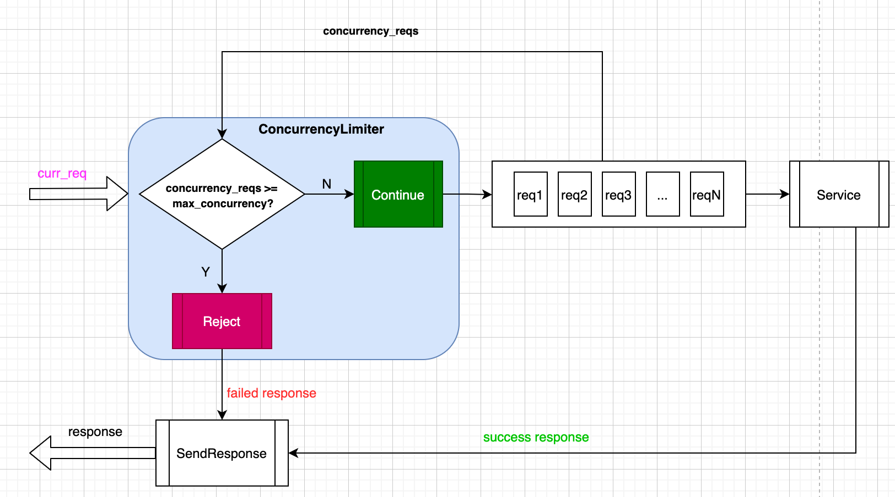

[English](../en/overload_control_concurrency_limiter.md)

# 前言

tRPC-Cpp框架应用于高并发的场景中，需要进行过载保护 ，以防业务程序出现不可预期的错误；虽然框架已经实现基于服务和方法的流控插件进行限流，但是该插件是运行在请求入队之后，不能及早进行过载保护； 本文主要介绍了一种基于并发请求量的过载保护插件，该插件运行在请求入队之前，实现策略简单易懂。

# 原理

## 基于并发请求的过载保护原理图


图中核心点就是`ConcurrencyLimiter` ，它的主要作用是获取框架当前的并发请求数（`concurrency_reqs`）与用户配置的最大并发数（`max_concurrency`）进行比较来判断是否拒绝当前接收的新请求（`curr_req`），逻辑很简单。

## 实现代码

  框架的过载保护实现方式是基于[过滤器](./filter.md)，为了保证尽可能早进行限流保护；该过滤器会埋点在请求入队前，具体埋点实现如下：

  ```cpp
  std::vector<FilterPoint> ConcurrencyLimiterServerFilter::GetFilterPoint() {
    return {
        FilterPoint::SERVER_PRE_SCHED_RECV_MSG,
        // ...
    };
  }
  ```

  源码参考：[concurrency_limiter_server_filter](../../trpc/overload_control/concurrency_limiter/concurrency_limiter_server_filter.cc)

# 使用示例

基于并发请求量的过载保护过滤器，**当前只能应用于服务端，客户端暂时不支持**，用户使用无需修改任何代码，只需开启编译和增加配置即可，非常方便。

## 编译选项

编译选项：在`.bazelrc` 文件中加入下面一行

```sh
build --define trpc_include_overload_control=true
```

## 配置文件

并发请求过滤器配置，详细配置参考：[concurrency_overload_ctrl.yaml](../../trpc/overload_control/concurrency_limiter/concurrency_overload_ctrl.yaml)

```yaml
#Server configuration
server:
  app: test #Business name, such as: COS, CDB.
  server: helloworld #Module name of the business
  admin_port: 21111 # Admin port
  admin_ip: 0.0.0.0 # Admin ip
  service: #Business service, can have multiple.
    - name: trpc.test.helloworld.Greeter #Service name, needs to be filled in according to the format, the first field is default to trpc, the second and third fields are the app and server configurations above, and the fourth field is the user-defined service_name.
      network: tcp #Network listening type: for example: TCP, UDP.
      ip: 0.0.0.0 #Listen ip
      port: 10001 #Listen port
      protocol: trpc #Service application layer protocol, for example: trpc, http.
      accept_thread_num: 1 #Number of threads for binding ports.
      filter:
        - concurrency_limiter

#Plugin configuration.
plugins:
#  metrics:
#    prometheus:
      # ...
  overload_control:
    concurrency_limiter:
      max_concurrency: 10 # Maximum concurrency. It is configured small for unit testing purposes, but users can configure it to be larger.
      is_report: true # Whether to report
```

配置关键点如下：

- concurrency_limiter：并发请求过载保护器的名称
- max_concurrency：为用户配置的最大并发请求数，当当前并发请求大于等于该值的时候，会拦截请求
- is_report：是否上报监控数据到监控插件，**注意，该配置必须与监控插件一起使用(例如配置：plugins->metrics->prometheus，则会上报到 prometheus 上)，如果没有配置监控插件，该选项无意义**，被监控数据有：
  `max_concurrency`: 上报配置的最大并发请求数，用于检查配置是否和程序运行的一致
  `current_concurrency`: 当前并发请求数
  `/{callee_name}/{method}`: 监控名称格式，由被调服务(callee_name)和方法名(method)组成，例如：`/trpc.test.helloworld.Greeter/SayHello`。

# FAQ

## Q1：按照配置配置后，并发过载保护器为什么依旧不生效？

根据并发过载保护过滤器的实现原理，是根据当前并发请求与最大并发请求进行比较，其中当前并发请求数是根据服务端上下文的构造函数和析构函数进行增减的，如下（参考：[server_context](../../trpc/server/server_context.cc)）：

```cpp
ServerContext::ServerContext() { FrameStats::GetInstance()->GetServerStats().AddReqConcurrency(); }

ServerContext::~ServerContext() {
  // ...
  auto& server_stats = FrameStats::GetInstance()->GetServerStats();

  server_stats.SubReqConcurrency();
  // ...
}
```

每个请求会对应一个 `ServerContext`，在其构造函数中执行`AddReqConcurrency`，在析构函数中执行`SubReqConcurrency`，所以用户在使用过程中不能暂存 `ServerContext`，否则会导致析构函数不执行，并发请求只增不减，过载保护失败。
