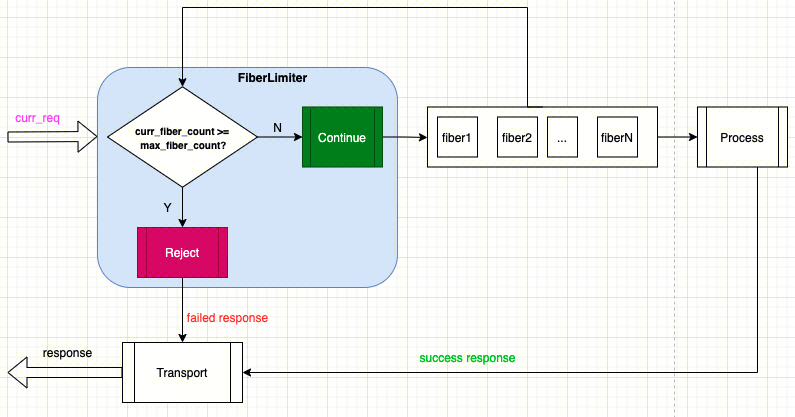

[English](../en/overload_control_fiber_limiter.md)

# 前言

tRPC-Cpp 框架在 `Fiber(M:N) 线程模型`（参考：[Fiber 用户指南](./fiber_user_guide.md)）下，当在高并发场景出现资源耗尽时，会导致程序假死，所以需要在 Fiber 数量达到一定值后需要进行限制，防止程序假死；本文主要介绍基于 Fiber 并发数的过载保护插件。

# 原理

## 基于 Fiber 并发数的过载保护原理图


图中核心点就是 `FiberLimiter` ，它的主要作用是获取框架当前的并发的 Fiber 个数（`curr_fiber_count`）与用户配置的最大的 Fiber 并发数（ `max_fiber_count` ）进行比较，判断是否拒绝处理当前请求（`curr_req`）。

## 实现代码

当前 `FiberLimiter` 支持**客户端和服务端**，由于框架的过载保护实现方式是基于[过滤器](./filter.md)，为了保证尽可能早进行限流保护；该过滤器会埋点在请求入队前，具体埋点实现如下：

```cpp
 // 客户端
 std::vector<FilterPoint> FiberLimiterClientFilter::GetFilterPoint() {
   return {
       FilterPoint::CLIENT_PRE_SEND_MSG,
       ...
   };
 }
 
 // 服务端
 std::vector<FilterPoint> FiberLimiterServerFilter::GetFilterPoint() {
   return {
       FilterPoint::SERVER_PRE_SCHED_RECV_MSG,
       ...
   };
 }
```

源码参考：[fiber_limiter](../../trpc/overload_control/fiber_limiter/)

# 使用示例

基于 Fiber 并发数的过载保护过滤器支持客户端和服务端，必须用于 Fiber 的线程模型下，用户使用无需修改任何代码，只需修改配置即可，非常方便。

## 编译选项

编译选项：在`.bazelrc` 文件中加入下面一行

```sh
build --define trpc_include_overload_control=true
```

## 配置文件

Fiber 并发数过滤器配置如下（详细配置参考：[fibers_overload_ctrl.yaml](../../trpc/overload_control/fiber_limiter/fibers_overload_ctrl.yaml)）：

```yaml
#Global configuration (required)
global:
  local_ip: 0.0.0.0 #Local IP, used for: not affecting the normal operation of the framework, used to obtain the local IP from the framework configuration.
  coroutine: #Coroutine configuration.
    enable: true #false: means not using coroutine; true: means using coroutine.
  threadmodel:
    fiber:
      - instance_name: fiber_instance
        concurrency_hint: 1
        scheduling_group_size: 1
        reactor_num_per_scheduling_group: 1

#Server configuration
server:
  app: test #Business name
  server: route #Module name of the business
  admin_port: 18888 # Admin port
  admin_ip: 0.0.0.0 #Admin ip
  service: #Business service, can have multiple.
    - name: trpc.test.route.Forward #Service name, needs to be filled in according to the format, the first field is default to trpc, the second and third fields are the app and server configurations above, and the fourth field is the user-defined service_name.
      network: tcp  #Network listening type: for example: TCP, UDP.
      ip: 0.0.0.0 #Listen ip
      port: 11112 #Listen port
      protocol: trpc #Service application layer protocol, for example: trpc, http.
      accept_thread_num: 1 #Number of threads for binding ports.
      filter:
        - fiber_limiter # Name of filter for this service

#Client configuration.
client:
  service:
    - name: trpc.test.helloworld.Greeter
      target: 127.0.0.1:32345
      protocol: trpc #Service application layer protocol, for example: trpc, http.
      network: tcp #Network listening type: for example: TCP, UDP.
      selector_name: direct #Name service used for route selection, "direct" for direct connection.
      filter:
        - fiber_limiter # Name of filter for this client

#Plugin configuration.
plugins: 
#  metrics:
#    prometheus:
      # ...
  overload_control:
    fiber_limiter:
      max_fiber_count: 20 # Maximum number of fibers. Here, for unit testing purposes, it is set relatively small. In normal business scenarios, this value should be much larger than 20.
      is_report: true # Whether to report overload information.
  # ...
```

配置关键点如下：

- fiber_limiter：Fiber 并发数过载保护的名称
- max_fiber_count：为用户配置的最大并发请求数，当当前并发请求大于等于该值的时候，会拦截请求
- is_report：是否上报监控数据到监控插件，**注意，该配置必须与监控插件一起使用(例如配置：plugins->metrics->prometheus，则会上报到 prometheus 上)，如果没有配置监控插件，该选项无意义**，被监控数据有：
  - `max_fiber_count`: 上报用户配置的最大 Fiber 并发数，属于固定值，用于检查配置的最大请求并发数是否在程序中生效
  - `fibers_count`: 上报当前系统的 Fiber 并发个数
  - `/{callee_name}/{method}`: 上报 RPC 方法监控名称格式，属于固定值，由被调服务(callee_name)和方法名(method)组成，例如：`/trpc.test.helloworld.Greeter/SayHello`，**仅在服务端限流有效**。
  - `/{ip}/{port}`: 上报被调服务的 ip 和 port 组成的监控项，例如：`/127.0.0.1/22345`，**仅在客户端限流有效**，对于客户端，当下游的服务存在多个节点时；则无法通过被调服务 RPC 区分不同节点的监控信息，所以这里只能选择 ip 和 port 组成的名称做监控项。
  - `Pass`：单个请求的通过状态，0：拦截；1：通过
  - `Limited`：单个请求的拦截状态，1：拦截；0：通过。与上面的 `Pass` 监控属性是相反的

# FAQ

## 配置Fiber过载保护过滤器，为什么没有生效？

检查一下是否采用了 Fiber 的线程模型

## 基于并发请求的过载保护器与基于 Fiber 并发数的过载保护器的差异？

tRPC-Cpp 框架中的 Fiber 调度组属于全局配置，所以在中转场景下，无论做客户端还是做服务端去获取 Fiber 并发数是一样的，所以可以进行限流；但是基于并发请求的过滤器，当前并发请求是按照接收到的请求进行计算的，若作为客户端去访问后端节点采用该值是不合理的，所以 Fiber 并发数过载保护器支持服务端和客户端，请求并发过载保护器只应用于服务端

## 当并发请求数小于 Fiber 最大并行数时，为什么也会被限制？

并发请求数和当前 Fiber 并行数不等价，因为有的请求可能采用多个 Fiber 来处理
