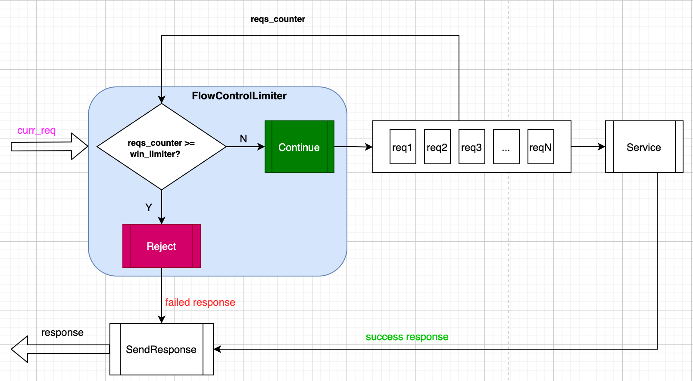
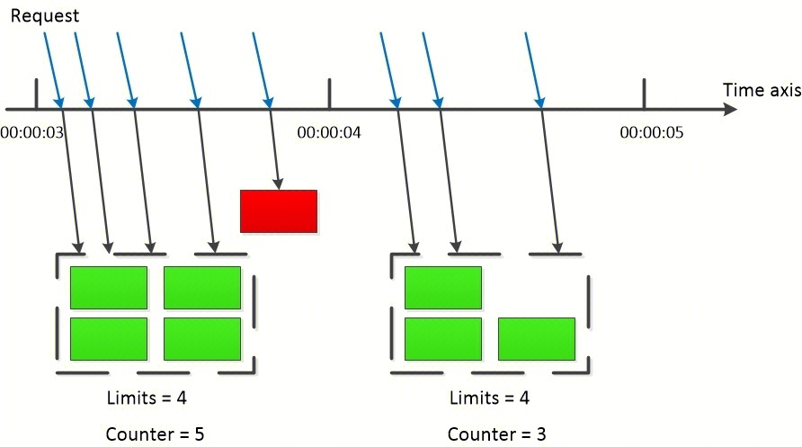
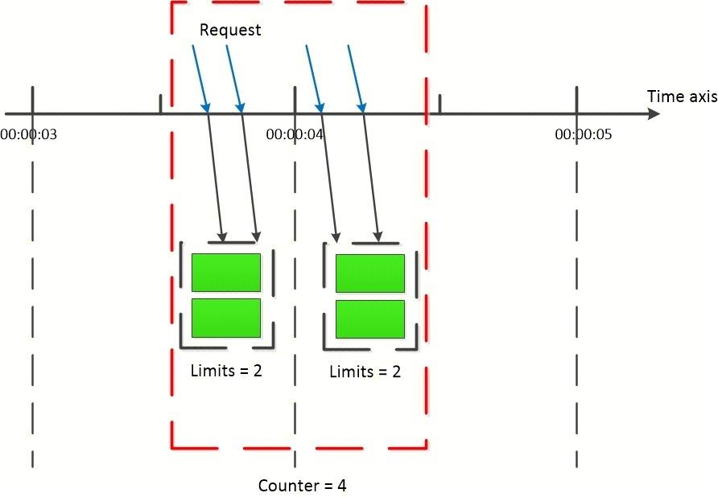
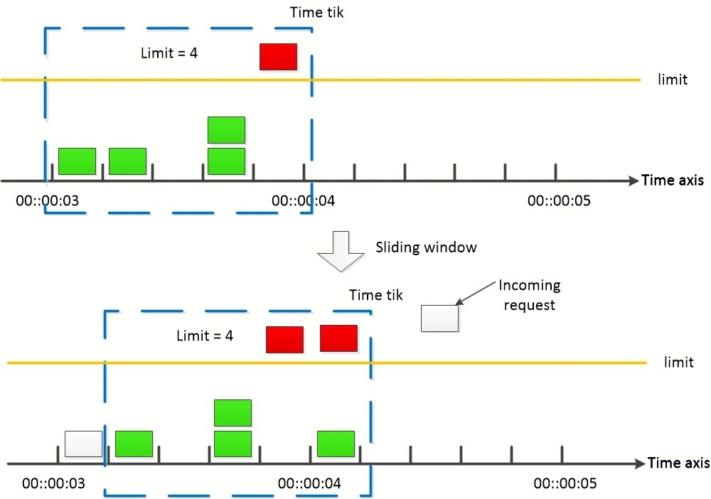

[English](../en/overload_control_flow_limiter.md)

# 前言

单个节点对请求的承载能力是有限的，为了保证服务的高可用性，我们必须对请求数做一些限制；流量控制需求就是在这个背景下产生的。当前 tRPC-Cpp 框架支持对服务（service）及函数（function）两个维度的流量控制配置，考察维度为 QPS（每秒最大限制数）。

- 分别使用了两种流量控制算法：
  - 固定窗口（计数法），对应的流量控制控制器：`seconds`(即固定窗口)，也称为 `default`
  - 滑动窗口，对应的流量控制控制器：`smooth`（滑动窗口）
- 限流触发条件

  首先判断服务流量限制，当服务流量限制超过后，返回流控错误；然后判断接口流量限制，超过限制则返回流控错误

*注意：关于流量控制的算法原理比较复杂，最后专门用一小节讲解。*

# 原理

## 基于流量控制的过载保护原理图


图中核心点就是`FlowControlLimiter` ，它的主要作用是通过流量控制算法计算当前的 QPS，也即 1s 时间中的请求数（`reqs_counter`）与窗口中配置的最大请求数（`win_limit`）进行比较来判断是否拒绝当前接收的新请求（`curr_req`），逻辑很简单。

## 实现代码

框架的过载保护实现方式是基于[过滤器](./filter.md)，为了保证尽可能早进行限流保护；该过滤器会埋点在请求入队前，具体埋点实现如下：

```cpp
std::vector<FilterPoint> FlowControlServerFilter::GetFilterPoint() {
  return {
      FilterPoint::SERVER_PRE_SCHED_RECV_MSG,
      // ...
  };
}
```

源码参考：[flow_control_server_filter](../../trpc/overload_control/flow_control/flow_controller_server_filter.cc)

# 使用示例

基于流量控制的过载保护过滤器，**当前只能应用于服务端，客户端暂时不支持**，用户使用无需修改任何代码，只需开启编译和增加配置即可，非常方便。

## 编译选项

编译选项：在`.bazelrc` 文件中加入下面一行

```sh
build --define trpc_include_overload_control=true
```

## 配置文件

服务端流量控制配置如下（详细配置参考：[flow_test.yaml](../../trpc/overload_control/flow_control/flow_test.yaml)）：

```yaml
#Server configuration
server:
  app: test #Business name, such as: COS, CDB.
  server: helloworld #Module name of the business
  admin_port: 21111 # Admin port
  admin_ip: 0.0.0.0 # Admin ip
  service: #Business service, can have multiple.
    - name: trpc.test.helloworld.Greeter #Service name, needs to be filled in according to the format, the first field is default to trpc, the second and third fields are the app and server configurations above, and the fourth field is the user-defined service_name.
      network: tcp #Network listening type: for example: TCP, UDP.
      ip: 0.0.0.0 #Listen ip
      port: 10001 #Listen port
      protocol: trpc #Service application layer protocol, for example: trpc, http.
      accept_thread_num: 1 #Number of threads for binding ports.
      filter:
        - flow_control

#Plugin configuration.
plugins:
#  metrics:
#    prometheus:
      # ...
  overload_control:
    flow_control:
      - service_name: trpc.test.helloworld.Greeter #service name.
        is_report: true # Whether to report monitoring data.
        service_limiter: default(100000) # Service-level flow control limiter, standard format: name (maximum limit per second), empty for no limit.
        func_limiter: #Interface-level flow control.
          - name: SayHello ##Method name
            limiter: seconds(50000) #Interface-level flow control limiter, standard format: name (maximum limit per second), empty for no limit.
          - name: Route #Method name
            limiter: smooth(80000) #Interface-level flow control limiter, standard format: name (maximum limit per second), empty for no limit.
```

配置关键点如下：

- flow_control：流量控制过载保护器的名称
- service_name：流量控制对应的服务名称
- service_limiter：指定服务名 `service_name` 下的服务级流控算法；这里配置 `default(100000)` 介绍如下：
  - `default`（等同 `seconds`）：表示此处选择了固定窗口流量控制算法
  - `100000`：表示每秒最大的请求数，也即最大 QPS 是 100000
- func_limiter：指定服务名 `service_name` 下的接口级流控策略；每个服务可以存在多个接口，每个接口可以选择不同的流量控制算法，介绍如下：
  - `name`：接口名称，如：`SayHello` 和 `Route`
  - `limiter`：指定接口流控算法，例如：`Route` 配置了滑动窗口（smooth）算法，最大 QPS 是 80000
- is_report：是否上报监控数据到监控插件，**注意，该配置必须与监控插件一起使用(例如配置：plugins->metrics->prometheus，则会上报到 prometheus 上)，如果没有配置监控插件，该选项无意义**，不同流量控制算法监控数据分别如下：
  - seconds：
    - `SecondsLimiter`：流控算法名称，用于检查配置和程序中执行的流量控制算法是否一致
    - `/{callee_name}/{method}`：监控名称格式，由被调服务(callee_name)和方法名(method)组成，例如：`/trpc.test.helloworld.Greeter/SayHello`
    - `current_qps`：当前并发 QPS 值
    - `max_qps`: 配置的最大 QPS，用于检查配置和程序中执行的流量控制最大 QPS 是否一致
    - `window_size`：采样窗口个数，用户可不关注
    - `Pass`：单个请求的通过状态，0：拦截；1：通过
    - `Limited`：单个请求的拦截状态，1：拦截；0：通过。与上面的 `Pass` 监控属性是相反的
  - smooth：
    - `SmoothLimiter`：流控算法名称，用于检查配置和程序中执行的流量控制算法是否一致
    - `/{callee_name}/{method}`: 监控名称格式，由被调服务(callee_name)和方法名(method)组成，例如：`/trpc.test.helloworld.Greeter/SayHello`
    - `active_sum`：所有命中的时间片中的请求总和，表示除去当前请求后此刻的 QPS 值，若超过最大 QPS，下面的 `hit_num` 则为 0
    - `hit_num`：当前命中时间片增加一个请求后的的 QPS 值
    - `max_qps`：配置的最大 QPS，用于检查配置和程序中执行的流量控制最大 QPS 是否一致
    - `window_size`：采样窗口个数，用户可不关注
    - `Pass`：单个请求的通过状态，0：拦截；1：通过
    - `Limited`：单个请求的拦截状态，1：拦截；0：通过。与上面的 `Pass` 监控属性是相反的

## 代码方式采用流量控制

除了通过配置流量控制之外，还可以直接通过代码实现流量控制功能（**注意服务流量控制和接口流量控制的代码区别**）。业务使用者注册服务级和接口级流量控制器方式如下：

```cpp
class HelloWorldServer : public ::trpc::TrpcApp {
 public:
  // ...
  int RegisterPlugins() { 
    
    // ...

    // 注册服务级流量控制器
    trpc::FlowControllerPtr service_controller(new trpc::SmoothLimter(200000, true, 100));
    trpc::FlowControllerFactory::GetInstance()->Register( "trpc.test.helloworld.Greeter", service_controller); 

    // 注册接口级流量控制器
    trpc::FlowControllerPtr say_hello_controller(new trpc::SecondsLimiter(10000, true, 100)); 
    trpc::FlowControllerFactory::GetInstance()->Register( "/trpc.test.helloworld.Greeter/SayHello", say_hello_controller); 
    return 0;
  }

};
```

流量控制器的注册逻辑必须在 `trpc::TrpcApp` 注册接口中 `RegisterPlugins` 中执行，其中：

- `trpc::SmoothLimter` 类的详细介绍参考：[SmoothLimter](../../trpc/overload_control/flow_control/smooth_limiter.h)
- `trpc::SecondsLimiter` 类的详细介绍参考：[SecondsLimiter](../../trpc/overload_control/flow_control/seconds_limiter.h)

# 流量控制算法原理

下面分别就固定窗口流量控制实现算法和滑动窗口流量控制实现算法做一个简单说明。

## 固定窗口流量控制算法

固定窗口法又称为固定窗口计数器法，其在时间线性维度上将时间划分为固定大小的窗口，同时限定每个时间窗口内允许通过的请求数上限为设定的阈值。每一时刻都处于一个固定的时间窗口内，而当前时间窗口每接收一个新的请求，时间窗口内的计数器就会原子的自增；同时每一个新的请求到达时都会判断当前时间窗口内通过的请求个数总和与阈值的大小，若计数器超过了限制阈值，则会拒绝剩余的请求。注意随着时间的流逝，每当时间窗口变换时窗口内的计数器都会重置为 0。



固定窗口法是原理最简单的流量控制算法，同时其实现也最为简单，一般设定一个全局的 counter 记录当前时间窗口内允许的请求，同时对新进入的请求进行判断；同时每当时间到达新的时间窗口点时就对 counter 进行重置。具体措施为：

- 将时间划分为多个窗口
- 在每个窗口内每有一次请求就将计数器加一
- 如果计数器超过了限制数量，则拒绝当前时间窗口内剩余请求。当时间到达下一个窗口时，计数器重置
  
  但同时，固定时间窗口法也由于其固定窗口的位置导致**边界问题**。即在窗口的边界位置易发生实际通过请求数高于限制阈值的情况。两个时间窗口内允许的请求数量都满足小于阈值，但由于两个窗口内请求都在边界位置，故对于两个窗口边界位置组成的窗口处，其窗口大小依然满足设定的1s，但该窗口内允许通过的请求数却是阈值的两倍。

## 滑动窗口流量控制算法

为了解决以上所描述的固定窗口算法的不足，人们研究出了滑动窗口计数器法。即将原本固定的窗口改为随时间而**滑动**的窗口，这样在每一个滑动窗口内都满足 `counter <= limit`，且窗口与窗口之间由于**滑动**算法，相互有重叠，保证了不会出现**边界效应**。滑动窗口法的具体措施为为：

- 将时间划分为多个区间
- 在每个时间区间内，将时间分片，滑动窗口每次根据时间规则滑动一个分片
- 在每个窗口内每有一次请求就将计数器加一
- 每次判断最新滑动窗口内的总计数与阈值的大小选择是否接受服务，超出阈值的服务都将被拒绝
- 每次滑动窗口移动时，移出滑动窗口的分片内计数都将被抛弃，划入时间分片内的计数都将置零
  
  滑动窗口法即固定窗口法的升级版。其通过将窗口再进行细分，且按照时间**滑动**，提升了精度，避免了**边界效应**；但同时也由此提升了计算的性能消耗。
