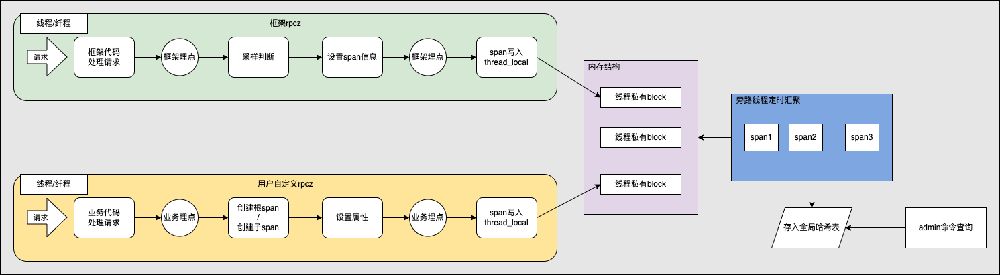
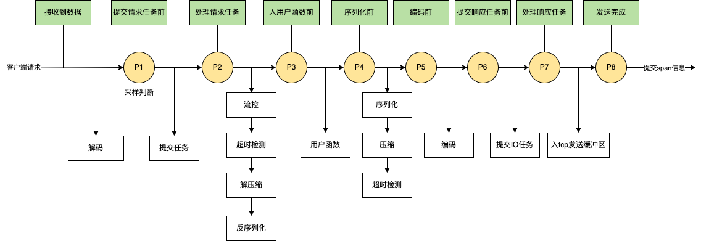
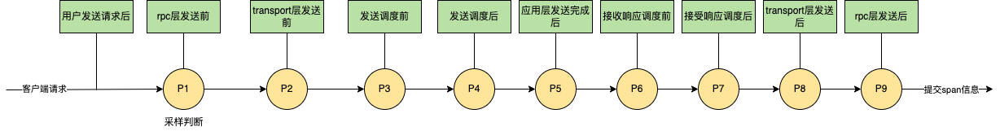
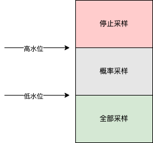

[English](../en/rpcz.md)

# tRPC-Cpp rpcz使用指南

## 前言

当用户在定位一个性能问题/耗时问题时，时常需要在框架或者用户代码逻辑中增加很多日志，效率低。rpcz作为一个调试工具，它可以提供一个请求经过服务端或者客户端不同采样点处的详细信息，方便用户快速地定位问题。

## 设计思路

### 基本概念

#### Span

span是一种信息载体，记录一次rpc请求过程中的基本信息，比如请求来源，包大小，在不同埋点处的时间信息，用户自定义的属性等，最终向用户展示的信息来源于span。

#### 框架rpcz

框架rpcz主要用于分析框架自身在处理rpc请求过程中的关键路径，进一步细分为三种场景，

- 纯服务端处理接收的请求和发送的响应
- 纯客户端处理发送的请求和接收的响应
- 作为中转服务时处理的请求+发送的响应

#### 用户自定义rpcz

用户自定义rpcz主要用于分析业务代码在处理rpcz请求过程中的关键路径，只记录业务逻辑层的各个自定义采样点的信息，跟框架解耦。

### 整体方案



如上图所示，针对框架rpcz，基于filter机制实现，在第一个框架埋点处判断是否需要对当前请求进行采样，在后续多个框架埋点处设置span信息，并在最后一个框架埋点处将span信息存储到线程私有的变量中；针对用户自定义rpcz，绕开了filter机制，在业务代码中，由用户自定义埋点，在业务埋点处创建根span对象以及子span对象，并且设置对应的属性，在最后一个业务埋点处将根span对象写入线程私有的变量中。后续由固定的旁路线程去汇聚线程私有的span信息，写入全局的哈希表中，方便业务通过admin命令进行查询。

### 埋点设计

用户自定义rpcz的埋点设计跟框架rpcz不同，与此同时，针对框架rpcz，纯服务端，纯客户端和中转场景的埋点设计也不同，下文会分开讨论。

#### 纯服务端

纯服务端是框架rpcz的一种细分场景，其埋点设计如下图所示，



上图中的埋点P1到P8的含义如下表，

| 图中标识 | 埋点名称 |         动作        |       说明       |
|---------|--------|---------------------|-----------------|
| P1 | SERVER_PRE_SCHED_RECV_MSG | 采样判断，设置基本信息 | 接收到请求并执行完解码后的第一个埋点, 并且在入接收队列前 |
| P2 | SERVER_POST_SCHED_RECV_MSG | 设置时间信息 | 出调度队列后, 开始处理请求前 |
| P3 | SERVER_PRE_RPC_INVOKE | 设置时间信息 | 解压缩和反序列化之后, 调用用户实现的业务函数之前 |
| P4 | SERVER_POST_RPC_INVOKE | 设置时间信息 | 在调用用户实现的业务函数完成之后 |
| P5 | SERVER_PRE_SEND_MSG | 设置时间信息 | 序列化和压缩之后的埋点 |
| P6 | SERVER_PRE_SCHED_SEND_MSG | 设置时间信息 | 把响应放入发送调度队列之前，并且在编码之后 |
| P7 | SERVER_POST_SCHED_SEND_MSG | 设置时间信息 | 把响应从发送调度队列取出之后 |
| P8 | SERVER_POST_IO_SEND_MSG | 设置时间信息，span信息写入线程私有变量 | 调用writev把回包写入内核后 |

#### 纯客户端

纯客户端也是框架rpcz的一种细分场景，其埋点设计如下图所示，



上图中的埋点P1到P9的含义如下表，

| 图中标识 | 埋点名称 |         动作        |       说明       |
|---------|--------|---------------------|-----------------|
| P1 | CLIENT_PRE_RPC_INVOKE | 采样判断，设置基本信息 | 客户端rpc层调用的第一个埋点 |
| P2 | CLIENT_PRE_SEND_MSG | 设置时间信息和ip/port信息 | transport层rpc调用的埋点 |
| P3 | CLIENT_PRE_SCHED_SEND_MSG | 设置时间信息和请求大小 | 编码后，入发送队列前的埋点 |
| P4 | CLIENT_POST_SCHED_SEND_MSG | 设置时间信息 | 出发送队列后 |
| P5 | CLIENT_POST_IO_SEND_MSG | 设置时间信息 | 调用writev把请求写入内核后 |
| P6 | CLIENT_PRE_SCHED_RECV_MSG | 设置时间信息 | 收到响应解码之后，进入接收队列前 |
| P7 | CLIENT_POST_SCHED_RECV_MSG | 设置时间信息 | 出接收队列后 |
| P8 | CLIENT_POST_RECV_MSG | 设置时间信息 | 完成transport层调用后的埋点 |
| P9 | CLIENT_POST_RPC_INVOKE | 设置时间信息，span信息写入线程私有变量 | 完成rpc层调用后的埋点 |


#### 中转

中转也是框架rpcz的一种细分场景，其埋点设计在纯服务端的埋点设计中嵌入了客户端的埋点设计。

#### 用户自定义

跟框架filter机制完全解耦，具体埋点的地方由用户在业务逻辑层自己控制。相比于框架rpcz，这里的埋点是个虚拟的概念，没有固定的宏名称，业务在需要的地方随时可以打点。

### 采样设计

为了控制span占用内存的大小，首先通过高低水位采样来控制采样的速率。值得注意的是，这里的高低水位采样对用户自定义rpcz不生效。



如上图所示，高低水位采样有三个核心参数，

- lower_water_level：低水位
- high_water_level：高水位
- sample_rate：采样率

在1秒钟的时间窗口内，当采样数小于lower_water_level时，则百分之百采样；当采样数大于等于lower_water_level时，则按照概率进行采样，每sample_rate个请求采样一次；当采样数大于high_water_level时，停止采样。

### 内存回收

为了控制span占用内存的大小，框架还通过过期时长来控制span在内存中存储的时间，关键参数只有一个，

- cache_expire_interval：span在内存中缓存的时长

当一个span在内存中存储的时长超过cache_expire_interval，则会被删除，回收对应的内存空间。

### 对外接口

#### 框架rpcz

框架rpcz场景下，绝大部分功能都内置在框架filter机制中，对用户透明。不过用户仍然可以设置自定义的采样逻辑，绕过框架默认的高低水位采样，同时使用TRPC_RPCZ_PRINT来打印日志。

```cpp
/// @brief 提供给用户设置的采样函数, 用户可自行控制采样逻辑
/// @param sample_function 设置的采样函数
/// @note  适用于纯服务端或中转情况下的采样
void SetServerSampleFunction(const CustomerServerRpczSampleFunction& sample_function);

/// @brief 提供给用户设置的采样函数, 用户可自行控制采样逻辑
/// @param sample_function 设置的采样函数
/// @note  适用于客户端的采样
void SetClientSampleFunction(const CustomerClientRpczSampleFunction& sample_function);
```

```cpp
// 用户可以使用TRPC_RPCZ_PRINT把日志信息存入到span中，用于统计某一部分业务逻辑的耗时，便于定位问题
#define TRPC_RPCZ_PRINT(context, formats, args...)                                    \
  do {                                                                                \
    trpc::rpcz::RpczPrint(context, __FILE__, __LINE__, fmt::format(formats, ##args)); \
  } while (0)
```

#### 用户自定义rpcz

相比于框架rpcz，用户自定义rpcz有更加丰富的对外接口，让用户自行控制什么时机创建span，什么时机打点，什么时机提交span。

```cpp
/// @brief 面向kSpanTypeUser类型的span对象，提供给用户创建根span对象，不带上下文
/// @param viewer_name 根span对象的名称，用于对外展示
/// @return 创建失败返回nullptr，成功返回根span对象的指针
/// @note 由于没有地方存放根span对象，所以用户在使用过程中需要自行传递根span对象
///       用户可以操作根span对象，但是不能主动释放根span对象，后者由框架负责统一释放
Span* CreateUserRpczSpan(const std::string& viewer_name);

/// @brief 面向kSpanTypeUser类型的span对象，提供给用户创建根span对象，带上下文
/// @param viewer_name 根span对象的名称，用于对外展示
/// @param context 上下文信息，用于保存根span对象的指针
/// @return 创建失败返回nullptr，成功返回根span对象的指针
/// @note 用户可以通过GetUserRpczSpan接口获取到根span对象
///       用户可以操作根span对象，但是不能主动释放根span对象，后者由框架负责统一释放
Span* CreateUserRpczSpan(const std::string& viewer_name, trpc::ServerContextPtr& context);

/// @brief 面向kSpanTypeUser类型的span对象，从上下文中提取根span对象
/// @param context 上下文信息
/// @return 如果不存在则返回nullptr，否则返回根span对象的指针
Span* GetUserRpczSpan(const trpc::ServerContextPtr& context);

/// @brief 面向kSpanTypeUser类型的span对象，将根span对象提交给框架
/// @note 提供给用户使用的接口，只能面向根span对象调用该接口，调用该接口之后，用户不能再操作根span对象
///       正常来说，这个接口应该设计成Span类型的成员函数，但是为了避免Span和RpczCollector的bazel循环依赖
///       这里单独拆成一个独立接口给到用户
void SubmitUserRpczSpan(Span* root_span_ptr);
```

```cpp
class Span : public LinkNode<Span> {
  /// @brief 面向kSpanTypeUser类型的span对象，往当前Span对象添加业务K-V信息，不带时间属性
  /// @note 提供给用户使用的接口
  void AddAttribute(std::string key, std::string value) {
    viewer_attributes_[std::move(key)] = std::move(value);
  }

  /// @brief 面向kSpanTypeUser类型的span对象，结束span对象
  /// @note 提供给用户使用的接口，用户面向子span对象调用该接口
  ///       用户面向根span对象调用SubmitUserRpczSpan接口即可
  void End();

  /// @brief 面向kSpanTypeUser类型的span对象，往当前Span对象添加子span对象
  ///        并且将新生成的子span对象返回给用户
  /// @return 创建失败返回nullptr，否则返回子span对象的指针
  /// @note 提供给用户使用的接口，子span对象由框架负责释放
  Span* CreateSubSpan(const std::string& viewer_name);

  /// @brief 面向kSpanTypeUser类型的span对象，将信息格式化输出
  std::string UserSpanToString();
};
```

## 使用指南

### 编译

#### bazel编译选项

```bash
bazel build --define trpc_include_rpcz=true
```

#### cmake编译选项

```bash
cmake .. -DTRPC_BUILD_WITH_RPCZ=ON
```

### 配置

#### 全局配置

```yaml
global:
  rpcz:
    lower_water_level: 500     # 低水位，对框架rpcz生效，对用户自定义rpcz不生效
    high_water_level: 1000     # 高水位，对框架rpcz生效，对用户自定义rpcz不生效
    sample_rate: 50            # 采样率，对框架rpcz生效，对用户自定义rpcz不生效
    cache_expire_interval: 10  # span信息存储时长，10秒级别的分辨率
    collect_interval_ms: 500   # 定时收集TLS时间间隔
    remove_interval_ms: 5000   # 定时删除TLS时间间隔
    print_spans_num: 10        # 打印span概要信息的条数
```

#### filter配置

```yaml
# 服务端配置，纯服务端和中转场景需要开启
server:
  # 服务端级别filter，所有服务端service共享
  filter:
    - rpcz
  service:
    - name: server_service
      # service级别的filter
      filter:
        - rpcz

# 客户端配置，纯客户端和中转场景需要开启
client:
  # 客户端级别filter，所有客户端service共享
  filter:
    - rpcz
  service:
    - name: client_service
      # service级别的filter
      filter:
        - rpcz
```

值得注意的是，用户自定义rpcz场景下，无须配置filter。

#### admin配置

```yaml
#服务端配置
server:
  admin_port: 21111  # 端口号用户自行修改，这里只是举例
  admin_ip: 0.0.0.0  # ip用户自行修改，这里只是举例
```

### 设置自定义采样函数

自定义采样函数只对框架rpcz生效，对用户自定义rpcz不生效。

#### 设置服务端自定义采样函数

纯服务端和中转场景下，可以设置服务端自定义采样函数。

```cpp
// 头文件
#include "trpc/rpcz/trpc_rpcz.h"

// 业务初始化
int xxxServer::Initialize() {
  // 设置自定义rpcz采样函数
  auto rpcz_sample_func = [](const trpc::ServerContextPtr& ctx) {
    const auto req_trans_info = context->GetPbReqTransInfo();
    auto itr_1 = req_trans_info.find("key1");
    if (itr_1 != req_trans_info.end()) {
      return true;
    }
    return false;
  };

  trpc::rpcz::SetServerSampleFunction(rpcz_sample_func);
  // 其它初始化逻辑
}
```

#### 设置客户端自定义采样函数

纯客户端场景下，可以设置客户端自定义采样函数，其他场景不需要设置。

```cpp
// 头文件
#include "trpc/rpcz/trpc_rpcz.h"

// 业务初始化
int xxx() {
  // 设置自定义rpcz采样函数
  auto rpcz_sample_func = [](const trpc::ClientContextPtr& ctx) { return true; };
  trpc::rpcz::SetClientSampleFunction(rpcz_sample_func);
  // 其它初始化逻辑
}
```

### 使用TRPC_RPCZ_PRINT打印日志

```cpp
// 头文件
#include "trpc/rpcz/trpc_rpcz.h"

int Test(const trpc::ServerContextPtr& context) {
 TRPC_RPCZ_PRINT(context, "start invoke A")
 A();
 TRPC_RPCZ_PRINT(context, "start invoke B")
 B();
 TRPC_RPCZ_PRINT(context, "end invoke B")
}
```

### 使用自定义rpcz

```cpp
#include "trpc/rpcz/trpc_rpcz.h"

// 这里是业务的rpc回调接口实现，里面实现了业务逻辑，可以在里面调用自定义rpcz
::trpc::Status BobServiceImpl::SayHello(::trpc::ServerContextPtr context, HelloRequest* request, HelloReply* reply) {
  // 自行创建根span对象。这里是不带ServerContext创建，此时需要用户自行保存和控制span对象的传递
  auto* root_span_ptr = trpc::rpcz::CreateUserRpczSpan("root_span");
  // 自行创建根span对象。这里是带ServerContext创建，此时用户可以通过GetUserRpczSpan接口拿到根span对象
  // auto* root_span_ptr = trpc::rpcz::CreateUserRpczSpan("root_span", context);

  // 往根span对象里添加用户自定义的属性，可以不添加，也可以添加多个
  root_span_ptr->AddAttribute("name", "root");
  root_span_ptr->AddAttribute("city", "shenzhen");

  // 其他业务处理逻辑...

  // 创建一个子span对象
  auto* son_span_a_ptr = root_span_ptr->CreateSubSpan("son_span_a");
  // 同理，可以往子span对象里添加用户自定义的属性，可以不添加，也可以添加多个
  son_span_a_ptr->AddAttribute("name", "son_a");

  // 其他业务处理逻辑...

  // 继续创建子span对象的子span对象
  auto* grandson_span_a_ptr = son_span_a_ptr->CreateSubSpan("grandson_span_a");
  // 同理，可以往子span对象里添加用户自定义的属性，可以不添加，也可以添加多个
  grandson_span_a_ptr->AddAttribute("name", "grandson_a");

  // 其他业务处理逻辑...

  // 用户务必主动调用End接口来结束当前子span对象的处理
  grandson_span_a_ptr->End();

  // 用户务必主动调用End接口来结束当前子span对象的处理
  son_span_a_ptr->End();

  // 继续创建一个子span对象
  auto* son_span_b_ptr = root_span_ptr->CreateSubSpan("son_span_b");

  // 同理，可以往子span对象里添加用户自定义的属性，可以不添加，也可以添加多个
  son_span_b_ptr->AddAttribute("name", "son_b");

  // 其他业务处理逻辑...

  // 用户务必主动调用End接口来结束当前子span对象的处理
  son_span_b_ptr->End();

  // 其他业务处理逻辑...

  // 将根span对象整个提交给框架存储，方便后续用户通过admin接口查询到该span信息
  trpc::rpcz::SubmitUserRpczSpan(root_span_ptr);

  // 业务逻辑处理完成
  return trpc::kSuccStatus;
}
```

### admin查询

#### 查询概要信息

```bash
curl http://127.0.0.1:21111/cmds/rpcz
```

其中127.0.0.1是配置中的admin_ip，21111是配置中的admin_port。查询得到的输出如下，

```bash
2023-09-05 16:04:45:159729   cost=190322(us) span_type=U span_id=11  request=0 response=0 [ok]
2023-09-05 16:04:45:159701   cost=190400(us) span_type=S span_id=10 trpc.test.helloworld.Greeter/SayHello request=109 response=33
2023-09-05 16:04:44:968186   cost=190341(us) span_type=U span_id=9  request=0 response=0 [ok]
2023-09-05 16:04:44:968151   cost=190434(us) span_type=S span_id=8 trpc.test.helloworld.Greeter/SayHello request=105 response=31 [ok]
```

各个部分的含义如下表所示，

| 名称 | 举例 | 含义 |
|-----|------|-----|
| 时间| 2023-09-05 16:04:45:159729 | 经过第一个埋点的具体时刻信息，精确到微秒 |
| 总耗时 | cost=190322(us) | 一个rpc请求的的全部耗时 |
| span类型 | span_type=U | 可选为（S/C/U); S表示服务端或者中转模式下的采样； C表示客户端的采样；U表示用户自定义的采样 |
| span id | span_id=11 | 每个rpcz采样数据的唯一表示，通过它查询具体的某个span详细信息 |
| 服务接口名 | trpc.test.helloworld.Greeter/SayHello | 对端的服务名+接口名，用户自定义rpcz场景下为空 |
| 请求大小 | request=109 | 请求包大小，单位字节，用户自定义rpcz场景下为0 |
| 响应大小 | response=33 | 响应包大小，单位字节，用户自定义rpcz场景下为0 |
| 返回码 | [ok] | 根据框架返回码判断请求是否成功, ok表示请求成功，failed表示失败，用户自定义场景下肯定为[ok] |

#### 查询某个span信息

```bash
curl http://127.0.0.1:21111/cmds/rpcz?span_id=11
```

##### 框架rpcz

针对框架rpcz，以中转场景为例，查询得到的输出如下，

```bash
2023-09-05 17:04:10:695773   Received request(119) from trpc..(9.218.34.103:43376) protocal=trpc span_id=0
2023-09-05 17:04:10:695957   184(us) enter recv queue
2023-09-05 17:04:10:695992   35(us) leave recv queue
2023-09-05 17:04:10:696009   17(us) enter customer func
2023-09-05 17:04:10:696038   ------------------------start----------------------------->
2023-09-05 17:04:10:696038   29(us) start send request(146) to trpc.test.helloworld.Greeter(9.218.35.124:10001) protocal=trpc span_id=0
2023-09-05 17:04:10:696049   11(us) start transport invoke
2023-09-05 17:04:10:696063   14(us) enter send queue
2023-09-05 17:04:10:696081   18(us) leave send queue
2023-09-05 17:04:10:696245   164(us) io send done
2023-09-05 17:04:10:886674   190429(us) enter recv queue
2023-09-05 17:04:10:886706   32(us) leave recv func
2023-09-05 17:04:10:886709   3(us) finish transport invoke
2023-09-05 17:04:10:886717   8(us) finish rpc invoke
2023-09-05 17:04:10:886717   0(us)Received response(31) from trpc.test.helloworld.Greeter(9.218.35.124:10001)
2023-09-05 17:04:10:886717   <------------------------end-------------------------------
2023-09-05 17:04:10:886725   8(us) leave customer func
2023-09-05 17:04:10:886730   5(us) start encode
2023-09-05 17:04:10:886736   6(us) enter send queue
2023-09-05 17:04:10:886750   14(us) leave send queue
2023-09-05 17:04:10:886765   15(us) io send done
2023-09-05 17:04:10:886765   Send response(48) to trpc..(9.218.34.103:43376)
```

其中，

- Received request，这一行表示服务端接收到请求数据
- enter recv queue，这一行表示提交请求任务前，主要是解码操作的耗时
- leave recv queue，这一行表示请求任务出队列，主要是请求任务在队列里排队的耗时
- enter customer func，这一行表示请求进入用户函数之前，主要是流控，超时检测，解压缩和反序列化等操作的耗时
- start send request，这一行表示业务代码开始发送rpc请求之前，主要是业务逻辑在rpc请求之前的耗时
- start transport invoke，这一行表示请求在transport层调用开始之前，主要是请求在rpc层处理的耗时，比如说寻址耗时
- enter send queue，这一行表示准备将请求插入发送队列之前，主要编码的耗时
- leave send queue，这一行表示请求出发送队列，主要是请求任务在发送队列排队的耗时
- io send done，这一行表示请求写入内核，主要是用户态排队和writev的耗时
- enter recv queue，这一行表示收到下游响应，主要是下游处理的耗时加上网络传输耗时
- leave recv func，这一行表示响应出接收队列，主要是响应在接收队列排队的耗时
- finish transport invoke，这一行表示响应回到transport层，主要是回调触发的耗时
- finish rpc invoke，这一行表示响应回到rpc层，主要是响应在transport层的耗时
- leave customer func，这一行表示完成业务回调，主要是业务逻辑在下游rpc调用之后的剩余耗时
- start encode，这一行表示客户端响应开始编码前，主要是编码前的准备耗时
- enter send queue，这一行表示客户端响应在序列化进入发送队列之前，主要是客户端响应编码的耗时
- leave send queue，这一行表示客户端响应出发送队列，主要是客户端响应在发送队列排队的耗时
- io send done，这一行表示客户端响应发送到内核，主要是用户态排队和writev的耗时


##### 用户自定义rpcz

针对用户自定义rpcz，查询得到的输出如下，是格式化的json字符串，

```json
[
  {
    "args" :
    {
      "city" : "shenzhen",
      "name" : "root"
    },
    "name" : "root_span",
    "ph" : "B",
    "pid" : 0,
    "tid" : 19081,
    "ts" : 1693813531703780
  },
  {
    "args" :
    {
      "city" : "shenzhen",
      "name" : "root"
    },
    "name" : "root_span",
    "ph" : "E",
    "pid" : 0,
    "tid" : 19081,
    "ts" : 1693813531894114
  },
  {
    "args" :
    {
      "name" : "son_a"
    },
    "name" : "son_span_a",
    "ph" : "B",
    "pid" : 0,
    "tid" : 19081,
    "ts" : 1693813531753846
  },
  {
    "args" :
    {
      "name" : "son_a"
    },
    "name" : "son_span_a",
    "ph" : "E",
    "pid" : 0,
    "tid" : 19081,
    "ts" : 1693813531823976
  },
  {
    "args" :
    {
      "name" : "grandson_a"
    },
    "name" : "grandson_span_a",
    "ph" : "B",
    "pid" : 0,
    "tid" : 19081,
    "ts" : 1693813531793910
  },
  {
    "args" :
    {
      "name" : "grandson_a"
    },
    "name" : "grandson_span_a",
    "ph" : "E",
    "pid" : 0,
    "tid" : 19081,
    "ts" : 1693813531823976
  },
  {
    "args" :
    {
      "name" : "son_b"
    },
    "name" : "son_span_b",
    "ph" : "B",
    "pid" : 0,
    "tid" : 19081,
    "ts" : 1693813531823989
  },
  {
    "args" :
    {
      "name" : "son_b"
    },
    "name" : "son_span_b",
    "ph" : "E",
    "pid" : 0,
    "tid" : 19081,
    "ts" : 1693813531844052
  }
]
```

用户无须理解json字段的含义，将获取到的json字符串写入一个文件中，再上传到 https://ui.perfetto.dev/ 网站，即可得到可视化的span信息，如下图所示，


