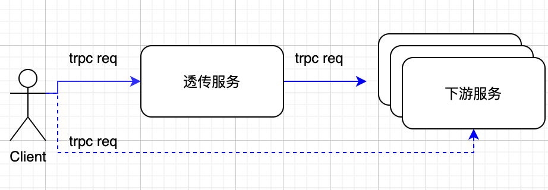

[English](../en/transparent_service.md)

[TOC]

# 前言

在某些特殊场景中，如接入层服务，用户期望可以透传业务数据给下游，避免数据的序列化导致的性能损耗。请求处理流程如下：

从上图可以看出，客户端请求（`trpc req`）通过透传服务后，没有发生任何改变就转发到下游服务（实线所示）；该流程与直接访问下游的效果是一样的（虚线所示）。对于客户端而言，透传服务是完全无感知的。
**目前只支持trpc协议的透明转发**。

# 原理

为了提升透出服务的性能，设计原理如下：

- 透传服务接收到请求二进制数据时，只会解析协议头部，用于获取校验信息； body 数据（也即业务数据）不解析，直接存储其二进制格式
- 透传服务发生请求到下游的时候，只会编码协议头部；body 数据用之前暂存的二进制，也就无需进行编码
- 下游回复通过透传服务回到上游客户端过程和请求是一样的；所以整个流程请求和回复中 body 数据的序列化和反序列化各减少一次，也就提升了性能

# 实现

由于透传服务无需依赖 Protobuf 文件的，也就不能生成桩代码；所以用户需要自己定义透传服务，由于支持同步和异步，下面分两部分介绍

## 透明传输中转服务同步代码

这里以 [transparent_service](../../examples/features/trpc_transparent/proxy/transparent_service.cc)为例讲解部分核心逻辑

```c++
TransparentServiceImpl::TransparentServiceImpl() {
  // register transparent service method handler
  // method name must be ::trpc::kTransparentRpcName
  AddRpcServiceMethod(new ::trpc::RpcServiceMethod(
      ::trpc::kTransparentRpcName, ::trpc::MethodType::UNARY,
      new ::trpc::ForwardRpcMethodHandler(std::bind(&TransparentServiceImpl::Forward, this, std::placeholders::_1,
                                                    std::placeholders::_2, std::placeholders::_3))));

  proxy_ptr_ =
      ::trpc::GetTrpcClient()->GetProxy<::trpc::RpcServiceProxy>("trpc.test.helloworld.Greeter");
}

::trpc::Status TransparentServiceImpl::Forward(::trpc::ServerContextPtr context, ::trpc::NoncontiguousBuffer&& request,
                                               ::trpc::NoncontiguousBuffer& response) {
  TRPC_FMT_INFO("remote addr: {}:{}", context->GetIp(), context->GetPort());

  if (::trpc::IsRunningInFiberWorker()) {
    return FiberForward(context, std::move(request), response);
  }

  return FutureForward(context, std::move(request), response);
}

::trpc::Status TransparentServiceImpl::FiberForward(::trpc::ServerContextPtr context,
                                                    ::trpc::NoncontiguousBuffer&& request,
                                                    ::trpc::NoncontiguousBuffer& response) {
  ::trpc::ClientContextPtr client_context = ::trpc::MakeTransparentClientContext(context, proxy_ptr_);
  client_context->SetTimeout(3000);

  ::trpc::Status status = proxy_ptr_->UnaryInvoke(client_context, request, &response);

  if (!status.OK()) {
    TRPC_FMT_ERROR("ret code: {}, func codec: {}, error msg: {}", status.GetFrameworkRetCode(),
                   status.GetFuncRetCode(), status.ErrorMessage());
  } else {
    TRPC_FMT_INFO("response size: {}", response.ByteSize());
  }

  return status;
}
```

上述给出透明转发的中转服务重要部分，需要注意的部分如下：

- 注册服务方法的函数名称；由于透明转发无法生成桩代码，对应的函数名称也就没有，为了解决此问题，框架定义 **::trpc::kTransparentRpcName**(第7行)来表明透明转发的默认函数名称。因为函数名与函数处理的方法属于哈希映射关系，当函数名称指定了，对应的函数方法也就是唯一的；这也就**要求一个服务里面只能有一个透明转发的函数**，例如：`TransparentService` 里面只能有一个`Forward` 方法来处理透明转发，如果再加一个透明转发的方法，则在注册的时候就会让 **::trpc::kTransparentRpcName** 映射到新的方法上，从而找不到 `Forward` 方法。
- 客户端和服务端上下文转换；在透明传输的中转服务中，客户端的上下文必须通过**MakeTransparentClientContext**来生成
- 客户端`ServiceProxy`的设置；由于透明转发无法生成桩代码，也就不能生成自己的`ServiceProxy`，所以只能用框架的**trpc::RpcServiceProxy**。

## 透明传输中转服务异步代码

上节通过`FiberForward`介绍了同步代码编写，下面通过 `FutureForward`介绍一部代码编写，代码如下：

```c++
::trpc::Status TransparentServiceImpl::FutureForward(::trpc::ServerContextPtr context,
                                                     ::trpc::NoncontiguousBuffer&& request,
                                                     ::trpc::NoncontiguousBuffer& response) {
  context->SetResponse(false);

  ::trpc::ClientContextPtr client_context = ::trpc::MakeTransparentClientContext(context, proxy_ptr_);
  client_context->SetTimeout(3000);

  proxy_ptr_->AsyncUnaryInvoke<::trpc::NoncontiguousBuffer, ::trpc::NoncontiguousBuffer>(client_context, request)
      .Then([context, this](::trpc::Future<::trpc::NoncontiguousBuffer>&& fut) mutable {
        trpc::Status status;
        trpc::NoncontiguousBuffer reply;

        if (fut.IsFailed()) {
          status.SetErrorMessage(fut.GetException().what());
          status.SetFuncRetCode(-1);
          TRPC_FMT_ERROR("error msg: {}", fut.GetException().what());

          std::string str(fut.GetException().what());
          reply = trpc::CreateBufferSlow(str.c_str());
        } else {
          reply = fut.GetValue0();

          TRPC_FMT_INFO("response size: {}", reply.ByteSize());
        }

        context->SendTransparentResponse(status, std::move(reply));
        return trpc::MakeReadyFuture<>();
      });

  return trpc::kSuccStatus;
}
```

异步接口采用了[Future](../../trpc/common/future/future.h) 的方式，当执行`AsyncUnaryInvoke`接口后，就会直接退出`FutureForward`函数栈；而`Then`中的回调函数会被框架调度到其他线程执行，达到异步的效果；所以使用异步接口需要注意以下几点：

- 在`Then`不能引用捕获`FutureForward`的栈变量，否则就会出现 coredump
- 由于`FutureForward`会先返回，而回复是`Then`中异步获取到的；所以需要设置**context->SetResponse(false)**，**false** 表示框架不立即返回回复
- 异步获取到回复后需要返回给上游，必须通过**context->SendTransparentResponse(status, std::move(reply))** 完成
