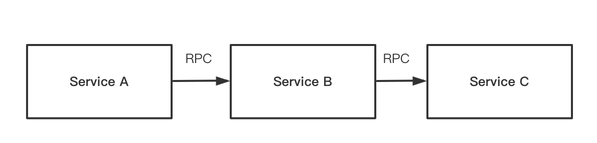
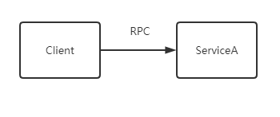
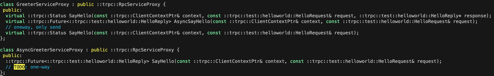

[English](../en/trpc_protocol_client.md)

# 前言

本文档主要介绍如何使用 tRPC-Cpp 框架调用一个`tRPC协议`的服务。

## tRPC协议

tRPC协议基于 ProtoBuf 实现，具备支持流式传输、连接复用、全链路超时、信息透传的能力。具体介绍可参考 [trpc 协议设计](https://github.com/trpc-group/trpc/blob/main/docs/cn/trpc_protocol_design.md)

## 使用场景

**调用 tRPC 服务**指使用 tRPC-Cpp 框架的客户端模块发起一次 RPC 调用，使用场景分为中转调用和纯客户端调用

- 中转调用，即是使用 tRPC-Cpp 框架构建的`Service B`在收到`Service A`发来的 RPC 请求后需要访问`Service C`等下游服务；这里`Service B`不仅会接收上游请求也会调用下游服务，其中**访问下游服务**的方式为中转调用。
  
- 纯客户端访问
  纯客户端调用场景指使用 tRPC-Cpp 框架构建一个 Client 应用；该应用只调用下游服务，本身不接收和处理请求，这是和中转服调用的本质区别。
  

## 接口形式

框架支持根据 ProtoBuf 生成桩代码，参考：[编译生成桩代码](./trpc_protocol_service.md#编译生成桩代码)；对于客户端而言，生成的代码如下：

可以看出生成了两种类`GreeterServiceProxy`和`AsyncGreeterServiceProxy`，其中`AsyncGreeterServiceProxy` 只有存在异步接口，而且该异步接口和`GreeterServiceProxy::AsyncSayHello`完全等价；而`GreeterServiceProxy`包含三种接口：

- 同步调用，`SayHello` 接口，参数列表要求有请求（request）和回复（response），代码流程上，每个请求必须同步等待回复到达，才会继续执行后续逻辑，多在协程模式下使用。
- 异步调用，`AsyncSayHello` 接口（等价`AsyncGreeterServiceProxy::SayHello`），参数列表无回复（response），代码流程上，每个请求发送后就直接执行后续逻辑，无需等待回复；当收到下游回复会通过[Promise](../../trpc/common/future/future.h)触发[Future](../../trpc/common/future/future.h)的回调来处理回复数据，整个过程属于异步。
- 单向调用，`SayHello` 接口，与同步接口一样，只是参数列表无回复（response），表示只发送请求即可，无需回复，下游也不会返回回复。

从生成的接口可知，tRPC-Cpp 框架对外提供的 RPC 接口有三种，用户可以根据业务场景选择对应的接口使用，无需关注底层的实现细节，非常方便。

# 调用下游 tRPC 协议服务

本节会以接口形式依次讲解不同场景下，采用基于框架的客户端访问下游 tRPC 服务的方式。

## 同步接口

调用同步编程接口并不意味着调用下游服务采用同步阻塞方式，只是代码流程上符合同步编程范式，框架底层是否阻塞取决于用户选择的线程模型。当用户使用[fiber线程模型](../zh/fiber_user_guide.md)时可以同时获得同步编程的简洁性和异步 io 的高性能，所以`fiber线程模型`也是 tRPC-Cpp 框架推荐的使用方式；**当使用非fiber线程模型，同步接口会在框架底层被阻塞，严重影响性能，如非必要禁止使用**，所以对于同步接口只介绍`fiber线程模型`下的使用方式。由于框架实现协程特性是采用`fiber线程模型`，所以下文中的协程和`fiber线程模型`是可认为是等价。
同步编程接口在`中转调用场景`和`纯客户端调用场景`下的使用存在一定差异，下面分开描述。

### 中转服务同步调用

标准的实现方式是使用 IDL(例如：ProtoBuf) 生成一个服务代理类 `xxxServiceProxy`，其中 *xxx* 表示在 IDL 中定义的服务名称，例如：上节图中的 `GreeterServiceProxy`。

- 中转服务同步调用方式，以[forward_service](../../examples/features/fiber_forward/proxy/forward_service.cc)为例，伪代码如下：
  
  ```cpp
  ForwardServiceImpl::ForwardServiceImpl() {
    greeter_proxy_ =
        ::trpc::GetTrpcClient()->GetProxy<::trpc::test::helloworld::GreeterServiceProxy>("trpc.test.helloworld.Greeter");
  }
  
  ::trpc::Status ForwardServiceImpl::Route(::trpc::ServerContextPtr context,
                                           const ::trpc::test::helloworld::HelloRequest* request,
                                           ::trpc::test::helloworld::HelloReply* reply) {
    TRPC_FMT_INFO("Forward request:{}, req id:{}", request->msg(), context->GetRequestId());
  
    auto client_context = ::trpc::MakeClientContext(context, greeter_proxy_);
  
    ::trpc::test::helloworld::HelloRequest route_request;
    route_request.set_msg(request->msg());
  
    ::trpc::test::helloworld::HelloReply route_reply;
  
    // block current fiber, not block current fiber worker thread
    ::trpc::Status status = greeter_proxy_->SayHello(client_context, route_request, &route_reply);
  
    TRPC_FMT_INFO("Forward status:{}, route_reply:{}", status.ToString(), route_reply.msg());
  
    reply->set_msg(route_reply.msg());
  
    return status;
  }
  ```

  对于中转服务而言，需要注意以下几点：

  - 服务代理类采用智能指针方式使用，可以通过`::trpc::GetTrpcClient()->GetProxy`模板接口获取对应的智能指针，模板参数是桩代码生成的服务代理类；接口参数是服务代理类的名称，该名称是服务端代理类对象的唯一索引，方便用户快速获取到；也充当被调名称，可能用于服务发现，所以通常要求该名称和配置文件中的`client->service->name`一致
  - 构建上下文必须通过 `MakeClientContext` 接口
  - 通过服务代理对象同步调用下游 `greeter_proxy_->SayHello`
  - 中转服务不仅会提供服务也会作为客户端访问下游，所以必须要求有配置文件

- 使用fiber线程模型配置

  在代码级别可以无需关心线程模型细节，但是在配置文件中配置`fiber线程模型`，以[trpc_cpp_fiber.yaml](../../examples/features/fiber_forward/proxy/trpc_cpp_fiber.yaml)为例，关键配置如下（详细的框架配置参考：[framework_config_full](./framework_config_full.md)）：
  
  ```yaml
  global:
    threadmodel:
      fiber:                            # Use Fiber(m:n coroutine) threadmodel
        - instance_name: fiber_instance # Need to be unique if you config mutiple fiber threadmodel instances
          # Fiber worker thread num
          # If not specified, will use number of cores on the machine.
          # In a Numa architecture, the workers will be automatically grouped (8-15 cores per group),
          # while in Uma architecture, they will not be grouped.
          concurrency_hint: 8
  server:
    app: test
    server: forword
      # ...
    service:
      - name: trpc.test.forword.Forward
        protocol: trpc
        network: tcp
        # ...
  
  client:
    service:
      - name: trpc.test.helloworld.Greeter
        target: 0.0.0.0:12345
        protocol: trpc
        timeout: 1000
        network: tcp
        # ...
  ```
  
  从上面配置可以看出，配置`fiber线程模型`需要注意以下几点：
  
  - fiber: 表示采用 fiber 线程模型，属于必选配置。配置在`global->threadmodel`下表示线程模型全局共享，方便`server`和`client`下所有的`service`使用。
  - instance_name: 表示线程模型实例名称，属于必选配置，不要求必须是`fiber_instance`。框架目前**只允许配置一个 fiber 线程模型实例**，所以这里的`instance_name`也只能有一个。
  - concurrency_hint：表示 fiber 的工作线程数，属于可选配置；如果不配置该字段，框架会根据当前系统的核数来设置 fiber 的工作线程数

### 纯客户端同步调用

纯客户端调用场景指使用 tRPC-Cpp 框架构建一个 Client 应用，它只调用下游服务，而不响应请求。Client 并不嵌合在框架中，所以`runtime`（包含线程模型、插件等组件）的初始化工作需要在 RPC 调用发起前由用户自行完成。

- 纯客户端调用方式，以[fiber_client](../../examples/helloworld/test/fiber_client.cc)为例

  ```cpp
  int DoRpcCall(const std::shared_ptr<::trpc::test::helloworld::GreeterServiceProxy>& proxy) {
    ::trpc::ClientContextPtr client_ctx = ::trpc::MakeClientContext(proxy);
    ::trpc::test::helloworld::HelloRequest req;
    req.set_msg("fiber");
    ::trpc::test::helloworld::HelloReply rsp;
    ::trpc::Status status = proxy->SayHello(client_ctx, req, &rsp);
    if (!status.OK()) {
      std::cerr << "get rpc error: " << status.ErrorMessage() << std::endl;
      return -1;
    }
    std::cout << "get rsp msg: " << rsp.msg() << std::endl;
    return 0;
  }
  
  int Run() {
    auto proxy = ::trpc::GetTrpcClient()->GetProxy<::trpc::test::helloworld::GreeterServiceProxy>(FLAGS_service_name);
  
    return DoRpcCall(proxy);
  }

  int main(int argc, char* argv[]) {
  ParseClientConfig(argc, argv);

  // If the business code is running in trpc pure client mode,
  // the business code needs to be running in the `RunInTrpcRuntime` function
  return ::trpc::RunInTrpcRuntime([]() { return Run(); });
  }
  ```
  
  相比中转服务中的同步调用，有以下不同：
  - ::trpc::RunInTrpcRuntime：初始化框架的`runtime`（包含线程模型、插件等组件），属于必须调用。
  - 构建上下文必须通过 `MakeClientContext` 接口，但是参数列表与中转服务中不同，没有服务端上下文，属于同名重载函数

- 纯客户端配置文件
  由于本身不提供服务，所以无`server`配置，但是同样要配置线程模型，其他配置基本和中转服务配置一样，参考：[trpc_cpp_fiber.yaml](../../examples/helloworld/test/conf/trpc_cpp_fiber.yaml)

### 并发同步调用

很多场景下，业务可能会同时调用多个同步接口，无论在中转还是纯客户端，并发同步调用的方式都一样，这里以中转服务并发同步调用为例介绍

- fiber 并发同步调用代码，以[forward_service](../../examples/features/fiber_forward/proxy/forward_service.cc)为例

  ```cpp
  ::trpc::Status ForwardServiceImpl::ParallelRoute(::trpc::ServerContextPtr context,
                                                   const ::trpc::test::helloworld::HelloRequest* request,
                                                   ::trpc::test::helloworld::HelloReply* reply) {
  
    // send two requests in parallel to helloworldserver
  
    int exe_count = 2;
    ::trpc::FiberLatch l(exe_count);
  
    std::vector<::trpc::test::helloworld::HelloReply> vec_final_reply;
    vec_final_reply.resize(exe_count);
  
    int i = 0;
    while (i < exe_count) {
      bool ret = ::trpc::StartFiberDetached([this, &l, &context, &request, i, &vec_final_reply] {
  
        trpc::test::helloworld::HelloRequest request;
        std::string msg = request->msg();
        // ...
  
        auto client_context = ::trpc::MakeClientContext(context, greeter_proxy_);
        ::trpc::Status status = greeter_proxy_->SayHello(client_context, request, &vec_final_reply[i]);
  
        // ...
        // when reduced to 0, the FiberLatch `Wait` operation will be notified
        l.CountDown();
      });
  
      // ...
    
      i += 1;
    }
  
    // wait for two requests to return
    // block current fiber, not block current fiber worker thread
    l.Wait();
  
    // ...
  
    return ::trpc::kSuccStatus;
  }
  ```

  对于多个同步调用需要使用[StartFiberDetached](../../trpc/coroutine/fiber.h)接口，该接口会创建一个协程来处理传入的回调函数，上面代码中的回调匿名函数会调用同步接口`SayHello`，所以多次调用`StartFiberDetached`会起多个协程，而这些协程会并发执行，所以多个同步接口也会并发执行；而要等到所有的协程执行完成需要使用`trpc::FiberLatch`，该类和 c++ 中的 `std::latch`语义一样，都是用于线程同步的；这里`l.Wait()`操作就是等待所有的协程执行，因为每个协程执行完后都会调用`l.CountDown()`，当所有协程执行完成，`l`也就变成0，`l.Wait()`就会停止阻塞。
  由于并发调用同步接口，对于单次调用在配置上无差异，所以就不继续介绍配置

## 异步接口

异步编程接口使用`Future/Promise`语义，相关的介绍可以参看[future介绍](./future_promise_guide.md)。客户端的异步 API 有两种形式，如 `Greeter` 服务生成的桩代码异步接口为`GreeterServiceProxy::AsyncSayHello`和`AsyncGreeterServiceProxy::SayHello`，二者等价，用户任选其中一个即可。对于异步接口而言，框架内置的线程模型都支持，由于在同步接口中介绍了 `fiber线程模型`；所以这里就只介绍`非fiber线程模型`

### 中转服务调用异步接口

- 中转服务异步调用方式，以[forward_service](../../examples/features/future_forward/proxy/forward_service.cc)为例

  ```cpp
  ForwardServiceImpl::ForwardServiceImpl() {
    greeter_proxy_ =
        ::trpc::GetTrpcClient()->GetProxy<::trpc::test::helloworld::GreeterServiceProxy>("trpc.test.helloworld.Greeter");
  }
  
  ::trpc::Status ForwardServiceImpl::Route(::trpc::ServerContextPtr context,
                                           const ::trpc::test::helloworld::HelloRequest* request,
                                           ::trpc::test::helloworld::HelloReply* reply) {
    TRPC_FMT_INFO("Forward request:{}, req id:{}", request->msg(), context->GetRequestId());
  
    // use asynchronous response mode
    context->SetResponse(false);
  
    auto client_context = ::trpc::MakeClientContext(context, greeter_proxy_);
  
    // ...
  
    ::trpc::test::helloworld::HelloReply route_reply;
  
    greeter_proxy_->AsyncSayHello(client_context, route_request)
        .Then([context](::trpc::Future<::trpc::test::helloworld::HelloReply>&& fut) {
          ::trpc::Status status;
          ::trpc::test::helloworld::HelloReply reply;
  
          if (fut.IsReady()) {
            std::string msg = fut.GetValue0().msg();
            reply.set_msg(msg);
            TRPC_FMT_INFO("Invoke success, route_reply:{}", msg);
          } else {
            auto exception = fut.GetException();
            status.SetErrorMessage(exception.what());
            status.SetFrameworkRetCode(exception.GetExceptionCode());
            TRPC_FMT_ERROR("Invoke failed, reason:{}", exception.what());
            reply.set_msg(exception.what());
          }
  
          context->SendUnaryResponse(status, reply);
          return ::trpc::MakeReadyFuture<>();
        });
  
    return ::trpc::kSuccStatus;
  }
  ```

  中转服务异步调用流程需要注意点如下：

  - 设置异步回包`context->SetResponse(false)`，这里的**false**，表示异步回包，也即是调用`AsyncSayHello`后不会等待回复到达，而是直接退出`Route`函数栈，若框架检查到下游回复到达，会通过`Then`的回调处理来处理。
  - 其他的和中转服务中同步调用一致

- 非fiber线程模型配置，以[trpc_cpp_future.yaml](../../examples/features/future_forward/proxy/trpc_cpp_future.yaml)

  ```yaml
  global:
  threadmodel:
    default:
      - instance_name: default_instance
        io_handle_type: separate
        io_thread_num: 2
        handle_thread_num: 2
  server:
    app: test
    server: forword
    # ...
    service:
      - name: trpc.test.forword.Forward
        protocol: trpc
        network: tcp
        ip: 0.0.0.0
        port: 12346
  
  client:
    service:
      - name: trpc.test.helloworld.Greeter
        target: 0.0.0.0:12345
        protocol: trpc
        timeout: 1000
        network: tcp
        conn_type: long
        is_conn_complex: true
        selector_name: direct
  ```

  从配置上与[trpc_cpp_fiber.yaml](../../examples/features/fiber_forward/proxy/trpc_cpp_fiber.yaml)唯一的区别就是线程模型，这里的线程模型类型是`default`，其配置介绍如下：

  - instance_name：线程模型实例名称，与 fiber 线程模型语义一样，但是可以配置多个
  - io_handle_type：表示实例类型，目前有两种：`separate`和`merge`
    `separate`：表示 io 处理和业务处理在不同的线程中，适合 cpu 密集型业务
    `merge`：表示 io 处理和业务处理线程共用，适合 io 密集型业务
  - io_thread_num：表示 io 处理线程个数
  - handle_thread_num：表示业务处理线程个数，仅在`separate`下有效
  - 根据经验，在`separate`模式下，需要满足以下两种条件：io_thread_num + handle_thread_num < 核数*2；io_thread_num:handle_thread_num=1:3

### 纯客户端调用异步接口

纯客户端异步调用接口和同步一样，要求初始化`runtime`

- 纯客户端调用方式，以[client](../../examples/features/future_forward/client/client.cc)为例

  ```cpp
  
  void DoRoute(const std::shared_ptr<::trpc::test::route::ForwardServiceProxy>& prx) {
    ::trpc::test::helloworld::HelloRequest request;
    request.set_msg("future");
  
    auto context = ::trpc::MakeClientContext(prx);
    context->SetTimeout(1000);
  
    if (!FLAGS_sync_call) {
      ::trpc::Latch latch(1);
      prx->AsyncRoute(context, request).Then([&latch](::trpc::Future<::trpc::test::helloworld::HelloReply>&& rsp_fut) {
        // ...
        auto reply = rsp_fut.GetValue0();
  
        latch.count_down();
        return ::trpc::MakeReadyFuture<>();
      });
      latch.wait();
    } 
    // ...
  }
  
  int Run() {
    ::trpc::ServiceProxyOption option;
  
    option.name = FLAGS_target;
    // ...
  
    auto prx = ::trpc::GetTrpcClient()->GetProxy<::trpc::test::route::ForwardServiceProxy>(FLAGS_target, option);
  
    //...
    
    DoRoute(prx);
  
    // ...
    return 0;
  }
  
  int main(int argc, char* argv[]) {
    ParseClientConfig(argc, argv);
  
    // If the business code is running in trpc pure client mode,
    // the business code needs to be running in the `RunInTrpcRuntime` function
    return ::trpc::RunInTrpcRuntime([]() { return Run(); });
  }
  ```

  相比中转服务中异步调用，有以下不同：
  - ::trpc::RunInTrpcRuntime：初始化框架的`runtime`（包含线程模型、插件等组件），属于必须调用。
  - 构建上下文必须通过 `MakeClientContext` 接口，但是参数列表与中转服务中不同，没有服务端上下文，属于同名重载函数
  - 需要等待异步调用结束，通过`::trpc::Latch`的方式实现；从代码可以看出`::trpc::Latch latch(1)`初始值为1，然后`AsyncRoute`的`Then`的回调会捕获`latch`；当调用完`AsyncRoute`后会执行`latch.wait()`等待，只有`latch`值为0，该等待才会结束；而只有回调被执行到`latch.count_down()`后`latch`的指才会为0；所以保证回调被执行完成可使用`latch`

### 并发异步调用

与并发同步调用类似，框架也支持并发异步调用

- 异步并发同步调用代码，以[forward_service](../../examples/features/future_forward/proxy/forward_service.cc)为例

  ```cpp
  ::trpc::Status ForwardServiceImpl::ParallelRoute(::trpc::ServerContextPtr context,
                                                   const ::trpc::test::helloworld::HelloRequest* request,
                                                   ::trpc::test::helloworld::HelloReply* reply) {
    // ...
    // use asynchronous response mode
    context->SetResponse(false);
    // ...
    int exec_count = 2;
    std::vector<::trpc::Future<::trpc::test::helloworld::HelloReply>> results;
    results.reserve(exec_count);

    for (int i = 0; i < exec_count; i++) {
      std::string msg = request->msg();
      msg += ", index";
      msg += std::to_string(i);
  
      trpc::test::helloworld::HelloRequest request;
      request.set_msg(msg);
  
      auto client_context = ::trpc::MakeClientContext(context, greeter_proxy_);
      results.emplace_back(greeter_proxy_->AsyncSayHello(client_context, request));
    }
  
    ::trpc::WhenAll(results.begin(), results.end())
        .Then([context](std::vector<trpc::Future<trpc::test::helloworld::HelloReply>>&& futs) {
          trpc::Status status;
          trpc::test::helloworld::HelloReply reply;
          std::string rsp = "parallel result:";
          int i = 0;
          for (auto&& fut : futs) {
            // ...
            auto msg = fut.GetValue0().msg();
            i++;
          }
          // ...
          context->SendUnaryResponse(status, reply);
          return trpc::MakeReadyFuture<>();
        });

      return trpc::kSuccStatus;
  }
  ```

  通过`results.emplace_back(greeter_proxy_->AsyncSayHello(client_context, request))`存储每次异步调用接口返回的`Future`值，然后通过`::trpc::WhenAll`可以等待每次异步调用的回复值执行完成

## 单向调用接口

框架提供了单向调用接口，方便只发送请求不接收应答的场景使用。接口的形式于同步接口类似，只是参数少了应答数据指针。单向调用无论在协程模型还是非协程模型下均支持。

# 特殊场景及注意事项

## 连接复用与连接池

- 连接复用
  多个请求共用一个连接，可以节省连接建立开销具备性能优势，但是要求传输协议具有唯一标识能够将请求和应答匹配。目前支持连接复用的协议有trpc，用户在使用时无需特别设置，框架会根据协议优先选用连接复用模式。**fiber协程模式使用连接复用模式时不要设置最大连接数，系统默认设置为1，能满足绝大部分场景需求**。
- 连接池
  可支持所有协议，每当请求发送前会向池中取得一个连接，如果没有可用连接并且 alive 状态的连接数小于最大值则创建一个连接。当连接收到应答后将连接放入池中共后续请求使用，若发生异常则关闭连接。为了提升性能可以增加最大连接数限制，系统默认64，但是不要无限制的增加。

## tcp/udp

框架同时支持tcp和udp传输协议，用户通过配置可以决定使用的协议类型

```yaml
  service:
    - name: trpc.test.forword.Forward
      # ...
      network: tcp
      # ...
```

## 长/短连接

```yaml
  service:
    - name: trpc.test.forword.Forward
      # ...
      conn_type: long # short
      # ...
```

协程模型下同时支持两种，非协程线程模型目前只支持长连接。

## backup-request

有时为了保证可用性，需要同时访问两路服务，哪个先返回就取哪个。tRPC-Cpp框架的做法是当用户设置了使用`backup-request`后会根据设置同时选取指定数量的节点 ip（通常为2个），当第一个请求在`delay`时间内没有返回应答则向剩余的其他节点同时发送相同请求，然后取最早返回的一个。更多的介绍可以参考：[backup-request](./backup-request.md).

## 支持请求传入 ProtoBuf 序列化后的非连续 Buffer

目前有业务需要允许请求可以传入 ProtoBuf 序列化过的非连续 Buffer，此场景多见于需要复用某一个请求体，且需要多次调整请求体内容:为了避免请求体的重启拷贝，可以先将需要修改的 ProtoBuf 请求序列化并保存之后，再发起下游调用。
注意：目前要求下游必须是trpc、http协议。目前有这样的扩展能力，处于性能考虑其他协议有需要时再支持。
可以结合如下示例：

```c++

trpc::Status ForwardServiceImpl::SayHelloUseNoncontiguousBufferReq(
    trpc::ServerContextPtr context, const trpc::test::helloworld::HelloRequest* request,
    trpc::test::helloworld::HelloReply* reply) {

  int exe_count = 10;

  // fiber latch for synchronous
  trpc::FiberLatch l(exe_count);

  // Save results from downstream
  std::vector<trpc::test::helloworld::HelloReply> vec_final_reply;
  vec_final_reply.resize(exe_count);

  // Serialize the protobuf request into a non-contiguous buffer by the framework's `pb_serialization`.
  trpc::serialization::SerializationPtr pb_serialization =
      trpc::serialization::SerializationFactory::GetInstance()->Get(trpc::EncodeType::PB);

  // An array of serialized trpc::NoncontiguousBuffer.
  std::vector<trpc::NoncontiguousBuffer> vec_req_buffer;
  vec_req_buffer.resize(exe_count);

  // ProtoBuf data that needs to be reused.
  trpc::test::helloworld::HelloRequest reuse_request;

  for (size_t i = 0; i < exe_count; i++) {
    // Full request
    reuse_request.set_msg(" modify as you like,i:" + std::to_string(i));

    // Call the ProtoBuf serialization tool to serialize.
    trpc::NoncontiguousBuffer req_buffer;
    bool encode_ret = pb_serialization->Serialize(
        trpc::serialization::kPbMessage,
        reinterpret_cast<void*>(const_cast<trpc::test::helloworld::HelloRequest*>(&reuse_request)),
        &req_buffer);
    if (TRPC_UNLIKELY(!encode_ret)) {
      // Error
      context->SetStatus(trpc::Status(
          trpc::codec::GetDefaultClientRetCode(trpc::codec::ClientRetCode::ENCODE_ERROR),
          "encode failed."));
      return trpc::Status(-1, "");
    }
    // Save req_buffer
    vec_req_buffer[i] = std::move(req_buffer);
  }

  int i = 0;
  while (i < exe_count) {
    trpc::StartFiberDetached([this, &l, &context, i, &vec_req_buffer, &vec_final_reply] {
      auto client_context = trpc::MakeClientContext(context, route_proxy_);
      // Set func name
      client_context->SetFuncName("/trpc.test.helloworld.Greeter/SayHello");

      // Directly invoke `PbSerializedReqUnaryInvoke` with the request type as a serialized trpc::NoncontiguousBuffer and the response type as a ProtoBuf.
      trpc::Status status =
          route_proxy_->PbSerializedReqUnaryInvoke<trpc::test::helloworld::HelloReply>(
              client_context, vec_req_buffer[i], &vec_final_reply[i]);

      // Sub `FiberLatch`，the `Wait` operation will be awakened when it is reduced to 0.
      l.CountDown();
    });
    i += 1;
  }

  // Synchronously wait for awakening, which will only block the current fiber without affecting the current thread.
  l.Wait();

  // ...  omit some code

  return trpc::kSuccStatus;
}
```

简单描述一下伪代码流程：

- 通过注释描述，用户会将请求类型的 Protobuf 序列化后存储在 `vec_req_buffer`
- 通过`StartFiberDetached`创建 fiber 执行并行访问下游逻辑，并等待结果
- 因为不是使用框架的桩代码，所以需要通过`client_context->SetFuncName("/trpc.test.helloworld.Greeter/SayHello");`设置下游函数名称，可以自己查看桩代码中的函数名
- 采用`RpcServiceProxy::PbSerializedReqUnaryInvoke`访问下游；其请求参数类型要求是`trpc::NoncontiguousBuffer`，例如：`vec_req_buffer[i]`；响应参数要求是 Protobuf 结构，例如：`trpc::test::helloworld::HelloReply`
- 剩下的就是等待并回包逻辑，这里就不在赘述。
