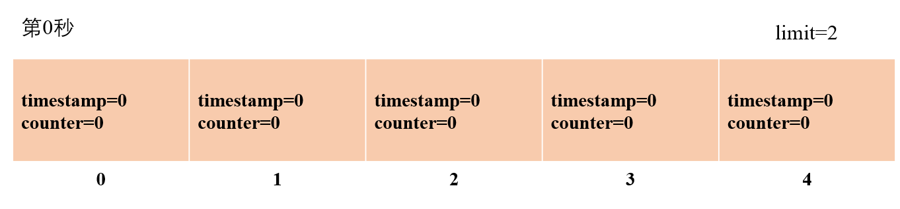
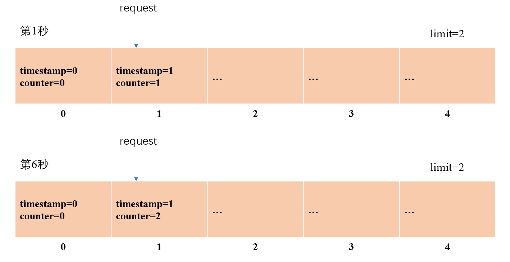
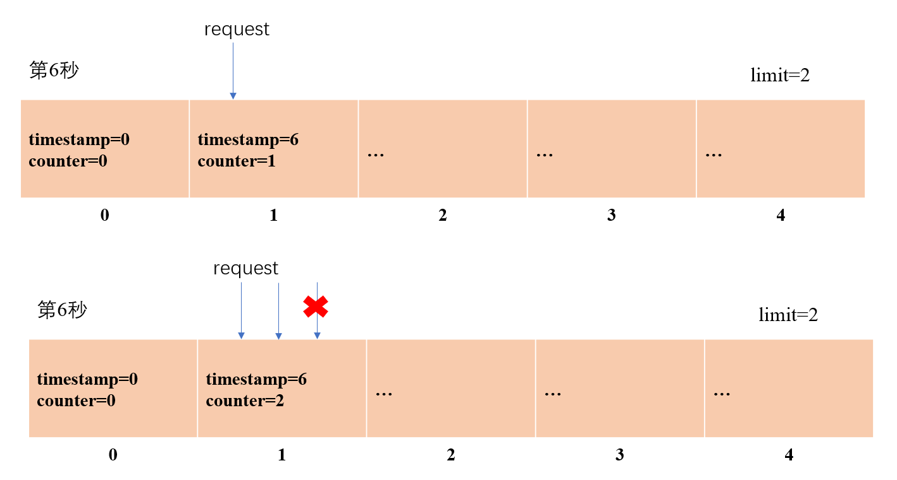

# 过载保护插件-固定时间窗口

## 测试流程

**1.编译并启动服务端**

在.bazelrc中打开编译选项 trpc_include_overload_control=true

```bash
#build --copt=-g --strip=never
build --jobs 16
#test --cache_test_results=no --test_output=errors
build --define trpc_include_overload_control=true
```

直接执行./test_seconds_limiter.sh

```bash
. build.sh
bazel build //examples/helloworld/...
./bazel-bin/examples/helloworld/helloworld_svr --config=./examples/helloworld/conf/trpc_cpp_fiber.yaml
```

其中，服务端的配置文件路径为examples/helloworld/conf/trpc_cpp_fiber.yaml

该配置文件在server配置中添加了seconds_limiter作为filter：

```yaml
#Server configuration
server:
  app: test #Business name, such as: COS, CDB.
  server: helloworld #Module name of the business
  admin_port: 21111 # Admin port
  admin_ip: 0.0.0.0 # Admin ip
  service: #Business service, can have multiple.
    - name: trpc.test.helloworld.Greeter #Service name, needs to be filled in according to the format, the first field is default to trpc, the second and third fields are the app and server configurations above, and the fourth field is the user-defined service_name.
      network: tcp #Network listening type: for example: TCP, UDP.
      ip: 0.0.0.0 #Listen ip
      port: 12345 #Listen port
      protocol: trpc #Service application layer protocol, for example: trpc, http.
      accept_thread_num: 1 #Number of threads for binding ports.
      filter:
        - seconds_limiter
```

插件中seconds_limiter配置如下：

```yaml
  overload_control:
    seconds_limiter:
      - service_name: trpc.test.helloworld.Greeter #service name.
        is_report: true # Whether to report monitoring data.
        service_limiter: default(20) #Service-level flow control limiter, standard format: name (maximum limit per second), empty for no limit.
        window_size: 10
        func_limiter: # Interface-level flow control.
          - name: SayHello # Method name
            limiter: seconds(10) # Interface-level flow control limiter, standard format: name (maximum limit per second), empty for no limit.
            window_size: 10
```

在Service级别的限流中，service_limiter: default(20)表示配置limiter为default方式，限制每秒20次请求，窗口大小window_size为10

在Interface级别的限流中，为SayHello方法配置seconds方式，每秒10次请求的limiter，窗口大小window_size为10

在我的代码实现中，default方式和seconds方式一样，都是指使用固定时间窗口方式进行流量控制

**2.启动客户端**

另起一个终端执行下面的命令：

```bash
./bazel-bin/examples/helloworld/test/fiber_client --client_config=./examples/helloworld/test/conf/trpc_cpp_fiber.yaml
```

在客户端代码examples/helloworld/test/fiber_client.cc中，我修改了Run()函数，执行DoRpcCall()向服务端发送请求30次

```cpp
int Run() {
  auto proxy = ::trpc::GetTrpcClient()->GetProxy<::trpc::test::helloworld::GreeterServiceProxy>(FLAGS_service_name);
  for(int i = 1; i <= 30; i++){
    DoRpcCall(proxy, i);
  }
  return 0;
}
```

可以看到只有前10个请求得到了应答

```bash
root@rabbit:/trpc-cpp# ./bazel-bin/examples/helloworld/test/fiber_client --client_config=./examples/helloworld/test/conf/trpc_cpp_fiber.yaml
FLAGS_service_name:trpc.test.helloworld.Greeter
FLAGS_client_config:./examples/helloworld/test/conf/trpc_cpp_fiber.yaml
default -> sinks -> stdout not found!
1 get rsp msg: Hello, fiber,idx=1
2 get rsp msg: Hello, fiber,idx=2
3 get rsp msg: Hello, fiber,idx=3
4 get rsp msg: Hello, fiber,idx=4
5 get rsp msg: Hello, fiber,idx=5
6 get rsp msg: Hello, fiber,idx=6
7 get rsp msg: Hello, fiber,idx=7
8 get rsp msg: Hello, fiber,idx=8
9 get rsp msg: Hello, fiber,idx=9
10 get rsp msg: Hello, fiber,idx=10
11 get rpc error: rejected by server flow overload control
12 get rpc error: rejected by server flow overload control
13 get rpc error: rejected by server flow overload control
14 get rpc error: rejected by server flow overload control
15 get rpc error: rejected by server flow overload control
16 get rpc error: rejected by server flow overload control
17 get rpc error: rejected by server flow overload control
18 get rpc error: rejected by server flow overload control
19 get rpc error: rejected by server flow overload control
20 get rpc error: rejected by server flow overload control
21 get rpc error: rejected by server flow overload control
22 get rpc error: rejected by server flow overload control
23 get rpc error: rejected by server flow overload control
24 get rpc error: rejected by server flow overload control
25 get rpc error: rejected by server flow overload control
26 get rpc error: rejected by server flow overload control
27 get rpc error: rejected by server flow overload control
28 get rpc error: rejected by server flow overload control
29 get rpc error: rejected by server flow overload control
30 get rpc error: rejected by server flow overload control
```

## 单元测试

我的代码实现在trpc/overload_control/seconds_limiter下，单元测试可以使用如下命令：

```bash
bazel test //trpc/overload_control/seconds_limiter:seconds_overload_controller_test
bazel test //trpc/overload_control/seconds_limiter:seconds_limiter_server_filter_test
bazel test //trpc/overload_control/seconds_limiter:seconds_limiter_generator_test
bazel test //trpc/overload_control/seconds_limiter:seconds_limiter_conf_test
```

## 固定窗口过载保护插件的实现

设计了一个`SecondsOverloadController`作为过载保护插件，它继承于抽象类`ServerOverloadController`

```cpp
class SecondsOverloadController : public ServerOverloadController {
 public:
  using SecondsLimiterPtr = std::shared_ptr<SecondsLimiter>;
  
  SecondsOverloadController(std::string name, int64_t limit, bool is_report = false,
                            int32_t window_size = DefaultSecondsWindowSize);

  std::string Name() { return name_; };

  bool Init() { return true; };

  bool BeforeSchedule(const ServerContextPtr& context) override;

  bool AfterSchedule(const ServerContextPtr& context) override;

  void Stop() override;

  void Destroy() override;

 private:
  std::string name_;
  SecondsLimiterPtr seconds_limiter_;
};
```

其中，用于判断是否拦截请求的逻辑，我直接调用了`SecondsLimiter`的`CheckLimit()`函数，这段代码写得很好，出于降低冗余的考虑，我复用了这段代码

```cpp
bool SecondsOverloadController::BeforeSchedule(const ServerContextPtr& context) {
  return seconds_limiter_->CheckLimit(context);
}
```

在`SecondsLimiter`中，具体的固定窗口算法设计如下：

初始化window_size个时间窗口，一个时间窗口表示1秒，第n秒对应的窗口编号（bucket）为n%window_size。每个窗口中存储一个时间戳，精度为秒，和一个计数器counter，表示在这个时间窗口内通过的请求个数。当请求到来时，算法需要判断对应的时间窗口内的时间戳和当前的时间戳是否一致，若不一致则更新时间戳，然后更新计数器并判断是否超出设定的limit值。

假设时间窗口大小window_size=5,每秒最多允许的请求数量limit=2。



在第1秒时收到了一个请求，因此重置编号1的窗口对应的时间戳为1，计数器为1



在第6秒时又收到了一个请求，此时编号1的窗口内存储的时间戳仍旧为1，代表第6秒还没有其他的线程更新过这个时间窗口的内容。因此应该重置时间戳为6，重置计数器为0并执行+1操作

更新后的时间戳为6，计数器为1



之后又收到了两次请求，其中第一次请求将计数器+1为2，第二次请求到来时，计数器的值+1>limit，因此被拒绝。

代码实现如下：

```cpp
bool SecondsLimiter::CheckLimit(const ServerContextPtr& context) {
  // lock version
  auto nows = trpc::time::GetMilliSeconds() / 1000;
  size_t bucket = nows % window_size_;
  int64_t bucket_access_time = counters_[bucket].access_timestamp.load(std::memory_order_relaxed);

  if (bucket_access_time != static_cast<int64_t>(nows)) {
    // reset counter
    std::unique_lock<std::mutex> locker(mutex_);
    bucket_access_time = counters_[bucket].access_timestamp.load(std::memory_order_acquire);
    if (bucket_access_time != static_cast<int64_t>(nows)) {
      counters_[bucket].counter.fetch_and(0, std::memory_order_relaxed);
      counters_[bucket].access_timestamp.store(nows, std::memory_order_release);
    }
  }
  int64_t result = counters_[bucket].counter.fetch_add(1, std::memory_order_relaxed);
  bool ret = result + 1 > limit_;
  if (is_report_) {
    OverloadInfo infos;
    infos.attr_name = "SecondsLimiter";
    infos.report_name = context->GetFuncName();
    infos.tags["current_qps"] = result + 1;
    infos.tags["max_qps"] = limit_;
    infos.tags["window_size"] = window_size_;
    infos.tags[kOverloadctrlPass] = (ret ? 0 : 1);
    infos.tags[kOverloadctrlLimited] = (ret ? 1 : 0);
    Report::GetInstance()->ReportOverloadInfo(infos);
  }
  return ret;
}
```

在这段代码中，`bucket_access_time` 被读取了两次，目的是为了确保线程安全，并且在并发情况下正确更新计数器。

- 第一次读取 `bucket_access_time`：

```cpp
int64_t bucket_access_time = counters_[bucket].access_timestamp.load(std::memory_order_relaxed);
```

这里使用了 `std::memory_order_relaxed` 来读取 `bucket_access_time`，是为了**快速**判断当前的 `bucket` 是否已经在这一秒被访问过。由于此读取不涉及复杂的同步操作，它的开销非常低。如果读取的值已经是当前的秒数，则可以跳过后面的重置步骤，从而提高性能。

- 第二次读取 `bucket_access_time`：

```cpp
bucket_access_time = counters_[bucket].access_timestamp.load(std::memory_order_acquire);
```

第二次读取是在获取了互斥锁后进行的，使用了 `std::memory_order_acquire` 内存序。这个操作确保了读取的值是最新的，并且在锁定的上下文中是安全的。在多线程环境下，可能存在以下情况：在第一次读取之后，其他线程已经更新了 `bucket_access_time`，因此在进入锁保护的临界区后，需要再次读取该值，以确保它反映了最新的状态。如果此时 `bucket_access_time` 已经更新到当前的秒数`nows`，则不需要重置计数器。否则，重置计数器为0，并将counters_[bucket].access_timestamp更新为当前的秒数

后面的更新计数器操作中，使用了`fetch_add()` ，出于并发安全考虑，它返回的是add操作执行前的值

```cpp
int64_t result = counters_[bucket].counter.fetch_add(1, std::memory_order_relaxed);
bool ret = result + 1 > limit_;
```

- `fetch_add()` 是一个原子操作，在并发环境下，即使多个线程同时对同一个变量执行 `fetch_add()` ，每个线程都能获取到唯一的、不同的返回值。

所以将读取到的计数器值+1并与阈值limit进行比较，返回比较结果。

**在我的代码实现中，因为`BeforeSchedule()`函数是通过调用`SecondsLimiter`的`CheckLimit()`函数实现，所以`BeforeSchedule()`和对应的`AfterSchedule()`的返回值与基类`ServerOverloadController`相反，拦截为true,不拦截为false**

## filter的执行逻辑

1.注册filter到框架

在examples/helloworld/helloworld_server.cc中重载 `trpc::TrpcApp::RegisterPlugins()` 接口，注册写好的filter到框架中

```cpp
int RegisterPlugins() {
    // register server-side filter
    auto server_filter = std::make_shared<trpc::overload_control::SecondsLimiterServerFilter>();
    trpc::TrpcPlugin::GetInstance()->RegisterServerFilter(server_filter);
    return 0;
  }
```

2.解析配置文件

在filter执行`Init()`初始化时，服务端的yaml配置文件被 trpc/overload_control/seconds_limiter/seconds_limiter_conf.h中的函数 `LoadSecondsLimiterConf()`转换为`SecondsLimiterConf`，里面存储`service_name`，`limiter`，`window_size`等信息，并会被传递给trpc/overload_control/seconds_limiter/seconds_limiter_generator.h中的`RegisterSecondsOverloadController()`函数

```cpp
void LoadSecondsLimiterConf(std::vector<SecondsLimiterConf>& seconds_limiter_confs) {
  YAML::Node seconds_limiter_nodes;
  SecondsLimiterConf seconds_limiter_conf;
  if (ConfigHelper::GetInstance()->GetConfig({"plugins", kOverloadCtrConfField, kSecondsLimiterName},
                                             seconds_limiter_nodes)) {
    for (const auto& node : seconds_limiter_nodes) {
      auto seconds_limiter_conf = node.as<SecondsLimiterConf>();
      seconds_limiter_confs.emplace_back(std::move(seconds_limiter_conf));
    }
  }
}
```

3.注册`SecondsOverloadController`

`RegisterSecondsOverloadController()`函数拿到配置信息以后，根据配置信息为每一个service和func创建对应的执行限流操作的`SecondsOverloadController`，并将其注册到`SecondsOverloadControllerFactory`中

```cpp
  if (!flow_conf.service_limiter.empty()) {
    SecondsOverloadControllerPtr service_controller = CreateSecondsOverloadController(
        flow_conf.service_name, flow_conf.service_limiter, flow_conf.is_report, flow_conf.window_size);
    if (service_controller) {
      SecondsOverloadControllerFactory::GetInstance()->Register(service_controller);
    } else {
      TRPC_FMT_ERROR("create service flow control fail||service_name: {}, |service_limiter: {}", flow_conf.service_name,
                     flow_conf.service_limiter);
    }
  }
```

4.当客户端请求到来时，框架将执行所有注册到框架的 filter 所实现的 `operator()`函数 。这里 `operator()`函数是框架 filter 基类中的一个纯虚函数，具体的filter继承基类后都需要重写这个函数，然后利用接口参数中的 `context` 获取所需信息来实现具体功能。

5.在我的`SecondsLimiterServerFilter`中，当请求到埋点处时，会根据请求的service和func的名称从`SecondsOverloadControllerFactory`工厂中取对应的`SecondsOverloadController`进行调用，判断是否要拒绝该请求。

```cpp
void SecondsLimiterServerFilter::OnRequest(FilterStatus& status, const ServerContextPtr& context) {
  if (TRPC_UNLIKELY(!context->GetStatus().OK())) {
    // If it is already a dirty request, it will not be processed further to ensure that the first error code is
    // not overwritten.
    return;
  }
  // ServiceImpl flow controller
  auto service_controller = SecondsOverloadControllerFactory::GetInstance()->Get(context->GetCalleeName());
  // func flow controller
  auto func_controller = SecondsOverloadControllerFactory::GetInstance()->Get(context->GetFuncName());
  if (!service_controller && !func_controller) {
    return;
  }

  // flow control strategy
  if (service_controller && service_controller->BeforeSchedule(context)) {
    context->SetStatus(Status(TrpcRetCode::TRPC_SERVER_OVERLOAD_ERR, 0, "rejected by server flow overload control"));
    TRPC_FMT_ERROR_EVERY_SECOND("rejected by server flow overload , service name: {}", context->GetCalleeName());
    status = FilterStatus::REJECT;
    return;
  }
  if (func_controller && func_controller->BeforeSchedule(context)) {
    context->SetStatus(Status(TrpcRetCode::TRPC_SERVER_OVERLOAD_ERR, 0, "rejected by server flow overload control"));
    status = FilterStatus::REJECT;
    TRPC_FMT_ERROR_EVERY_SECOND("rejected by server flow overload , service name: {}, func name: {}",context->GetCalleeName(), context->GetFuncName());
    return;
  }
}
```
